# 📘 **Reactive Compliance Pipeline — Asynchronous Chain-of-Responsibility Engine (Spring Boot)**

This repository implements a **fully asynchronous**, **executor-isolated**, **bounded-queue-driven**, **callback-orchestrated** **Chain of Responsibility Pipeline** designed for high-throughput compliance workflows such as:

- KYC validation

- Identity authentication

- Amount verification

- Payment processing


The system demonstrates how modern systems enforce **backpressure**, **stage isolation**, **asynchronous fan-in/out**, and **safe handoff between pipeline stages** without blocking threads or creating global locks.

---

# 🧠 **1. Architectural Overview**

The pipeline uses a **4-stage handler sequence**:

```
Auth → KYC → Amount → Pay → Stop
```

Each handler:

1. Owns its **private bounded queue** (`LinkedBlockingDeque(5)`)

2. Executes tasks on a **dedicated thread pool**

3. Implements **non-blocking async processing** via `CompletableFuture`

4. Signals the orchestrator using **callback-based stage progression**

5. Applies **backpressure** when its queue is full

6. Updates the global state store


The end result is a **reactive chain-of-responsibility engine** where control moves forward without any synchronous blocking.

---

# 🏛️ **2. High-Level System Diagram (Mermaid UML)**

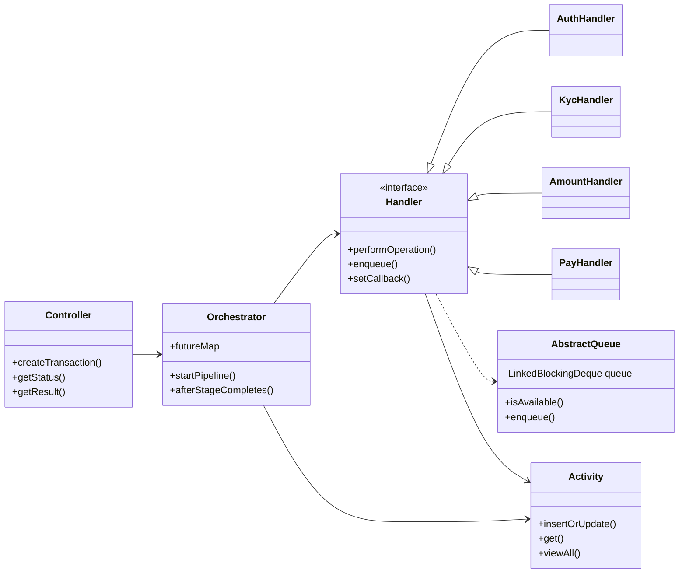

---

# ⚙️ **3. Execution Flow Diagram (End-to-End)**

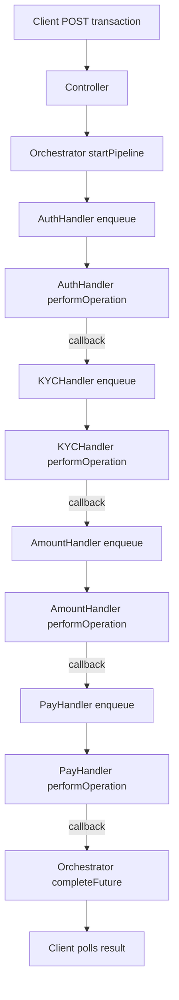

---

# 🎯 **4. Core Techniques (Explained with Diagrams)**

Below are the key engineering principles used.

---

## **4.1 Handler Abstraction (Interface-Based)**

Each handler implements a uniform contract:

- process asynchronously

- accept items via a queue

- expose callback hooks

- maintain isolation


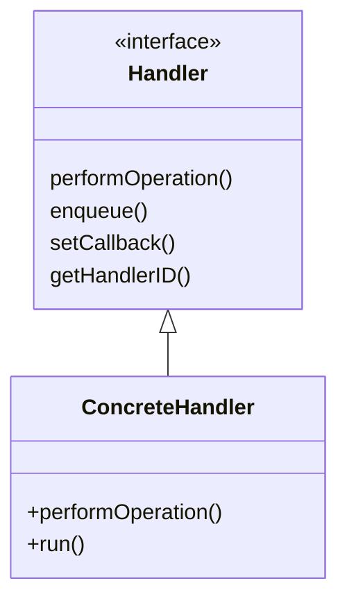

---

## **4.2 Callback-Driven Stage Progression**

Each handler signals when it completes:

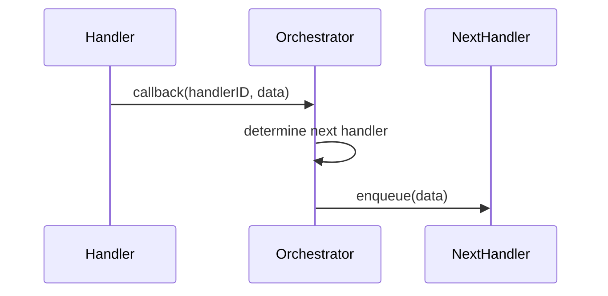

This avoids blocking, polling, and tight coupling.

---

## **4.3 Executor Isolation**

Each handler runs on its own thread pool.

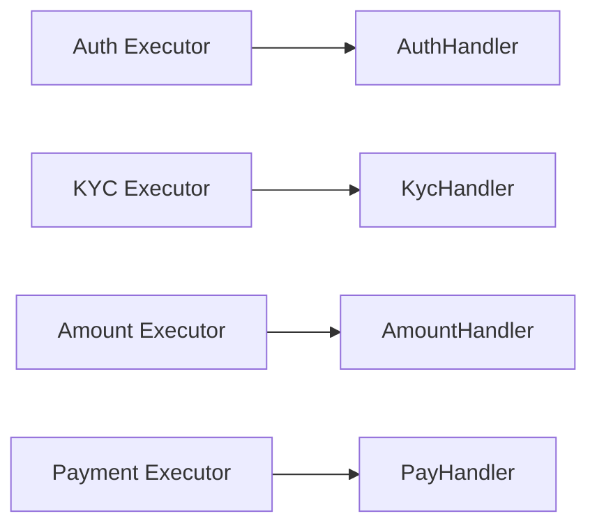

Benefits:

- No handler can starve another

- Guarantees concurrency fairness

- Enables independent tuning


---

## **4.4 Bounded Queues & Backpressure**

Each handler owns:

```
LinkedBlockingDeque<Data>(5)
```

When full → `BACKPRESSURE_FAILURE`

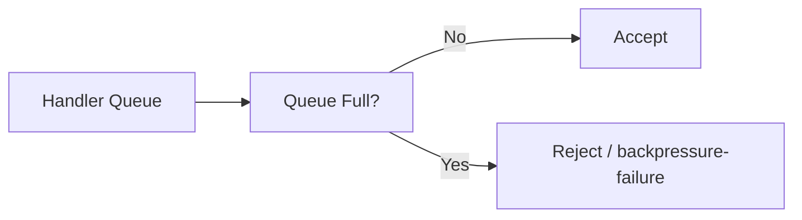

---

## **4.5 Asynchronous Data Transfer (CompletableFuture)**

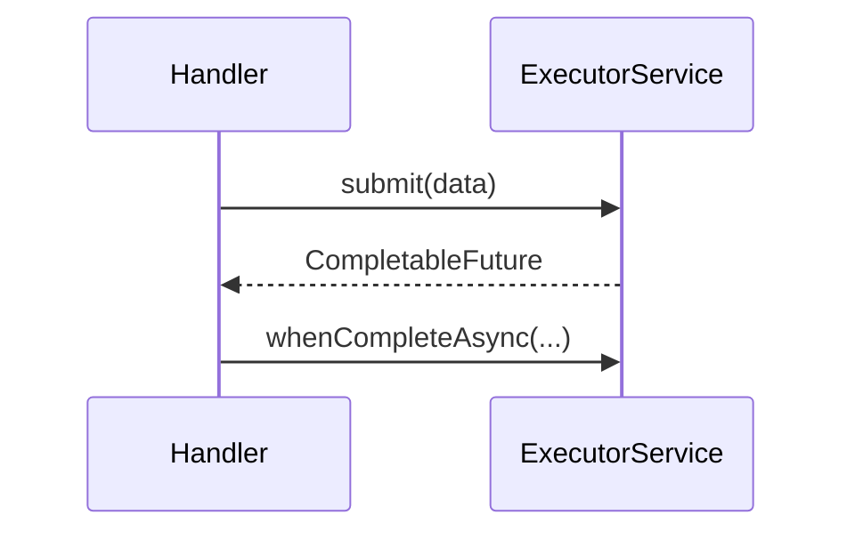

This keeps all processing non-blocking and event-driven.

---

# 🗂️ **5. Folder Structure (Explained Class-by-Class)**

```
reactivepipe/
│
├── api/
│   └── Controller.java        # REST endpoints for triggering, polling pipeline
│
├── config/
│   ├── ExecutorConfig.java    # Thread pools for each handler
│   └── HandlerConfig.java     # Handler map + next handler mapping
│
├── core/
│   ├── AuthHandler.java       # Stage 1 - Authentication
│   ├── KycHandler.java        # Stage 2 - KYC validation
│   ├── AmountHandler.java     # Stage 3 - Amount verification
│   └── PayHandler.java        # Stage 4 - Payment execution
│
├── data/
│   ├── Data.java              # Pipeline payload
│   ├── QueueStatus.java       # Enum of stage statuses
│   └── StateData.java         # State update object
│
├── database/
│   ├── Activity.java          # In-memory state and logs
│   └── Database.java          # Placeholder for real persistence
│
├── dto/
│   ├── Request.java           # Incoming API data
│   └── Response.java          # API response with status URLs
│
├── model/
│   ├── AbstractQueue.java     # Bounded queue + utility
│   ├── Handler.java           # Handler interface
│   └── Piping.java            # Pipeline progression contract
│
└── service/
    └── Orchestrator.java      # Central pipeline manager
```

---

# 🧩 **6. Detailed Class Behavior**

---

## **6.1 Controller (API Layer)**

- Creates transaction

- Returns URLs for status + result

- Delegates to orchestrator

- Stateless and lightweight


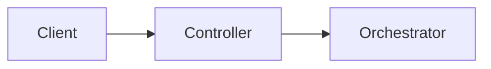

---

## **6.2 Orchestrator (Pipeline Brain)**

- Injects handler map + next map

- Stores `CompletableFuture` per transaction

- Moves the pipeline forward

- Completes future on final stage


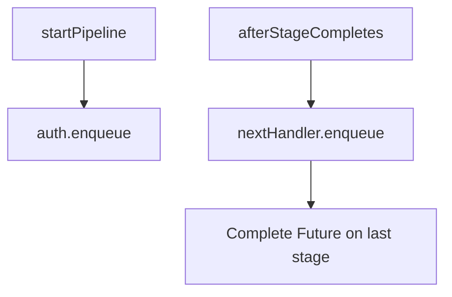

---

## **6.3 AbstractQueue (Bounded Queue)**

- Max 5 items

- Prevents overload

- Enables natural backpressure

- Shared by all handlers


---

## **6.4 Handler Classes**

All handlers follow the same template:

- Dedicated queue

- Dedicated executor

- Background thread consuming queue

- Async operation (`CompletableFuture`)

- Callback to next stage


### Example flow inside a handler:

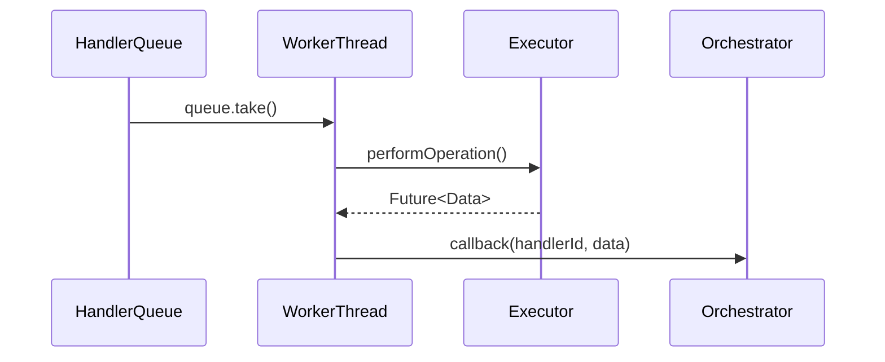

---

# 🔍 **7. Backpressure Failure Path Diagram**

If queue is full:

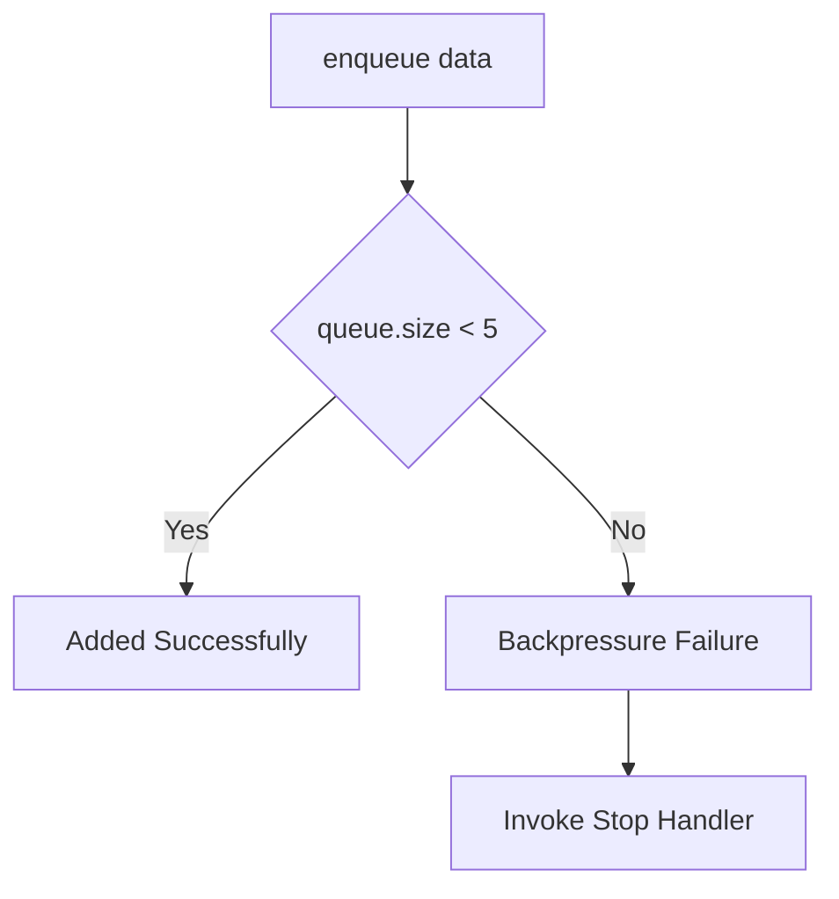

---

# 🔄 **8. Full Pipeline Control Diagram**

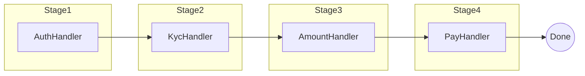

---

# 📚 **9. Key Concepts and Why They Matter**

## ✔ Handler Abstraction

Decouples logic, enables pluggable pipeline stages.

## ✔ Callback-Based Flow

No polling or waiting—event-driven stage transitions.

## ✔ Executor Isolation

Fault in one handler cannot affect another.

## ✔ Bounded Queues

Natural backpressure and overload prevention.

## ✔ Atomic State Updates

Every stage updates a global store for UI tracking.

## ✔ CompletableFuture

Non-blocking async pipeline with natural composition points.

---

# 📝 **10. Summary**

This repository demonstrates a **production-quality, asynchronous Chain-of-Responsibility pipeline** engineered using:

- Structured handler abstraction

- Isolated executor pools

- Backpressure-aware bounded queues

- Event-driven callbacks

- Non-blocking concurrency primitives

- Clean orchestration logic


The design mirrors **real compliance and transaction processing pipelines** used in modern fintech, payments, and regulatory systems.

You now have a **fully documented**, **architecturally clear**, and **portfolio-ready** design component.
