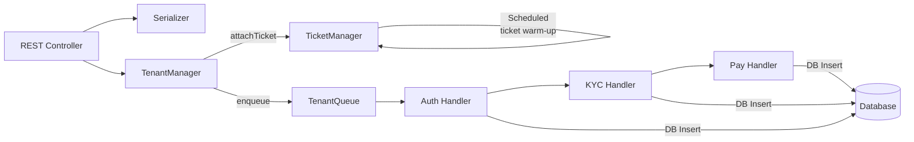
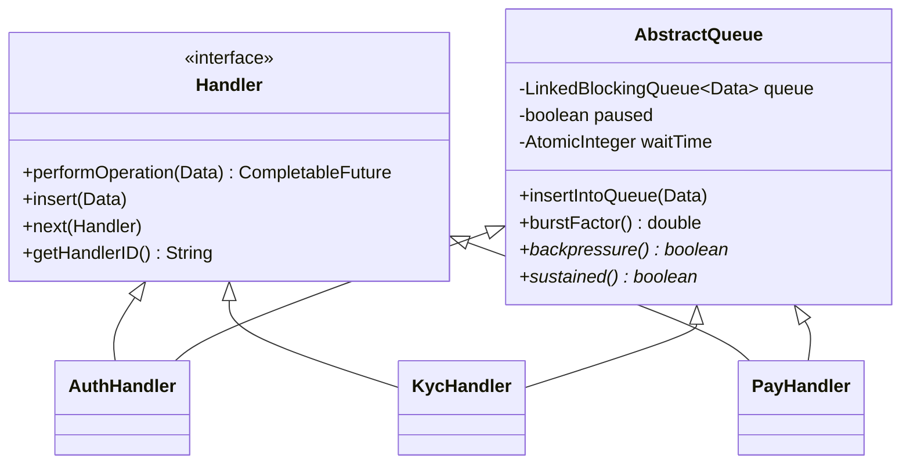
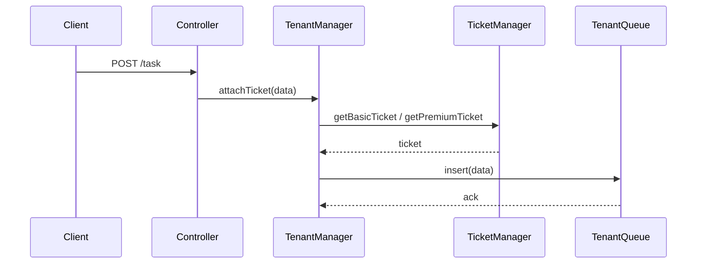
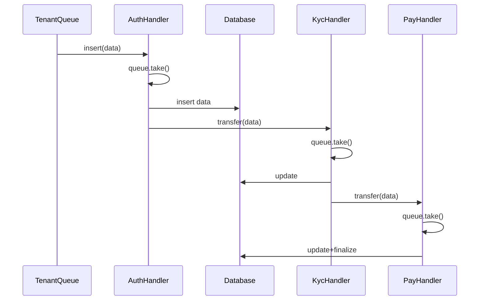
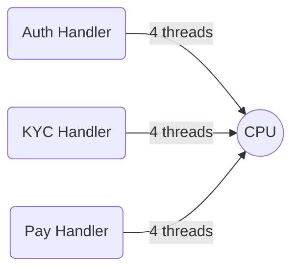
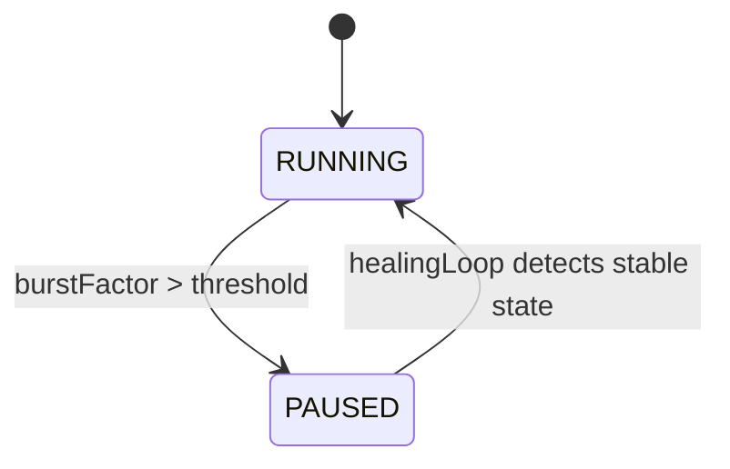
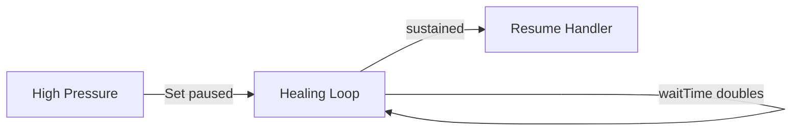
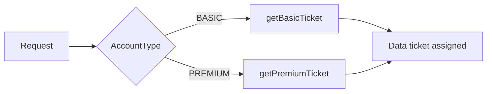
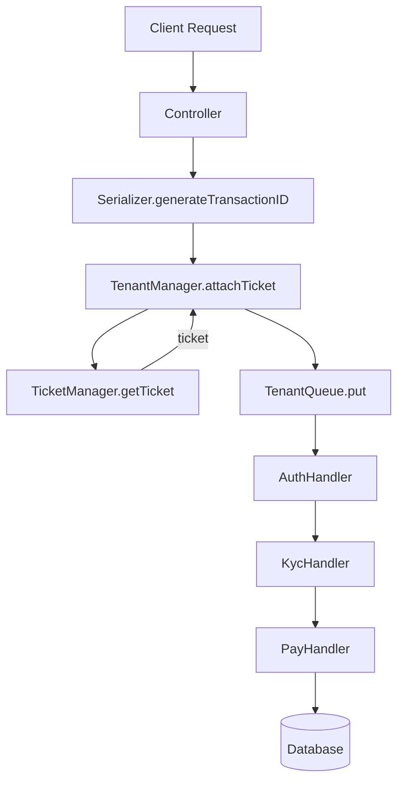
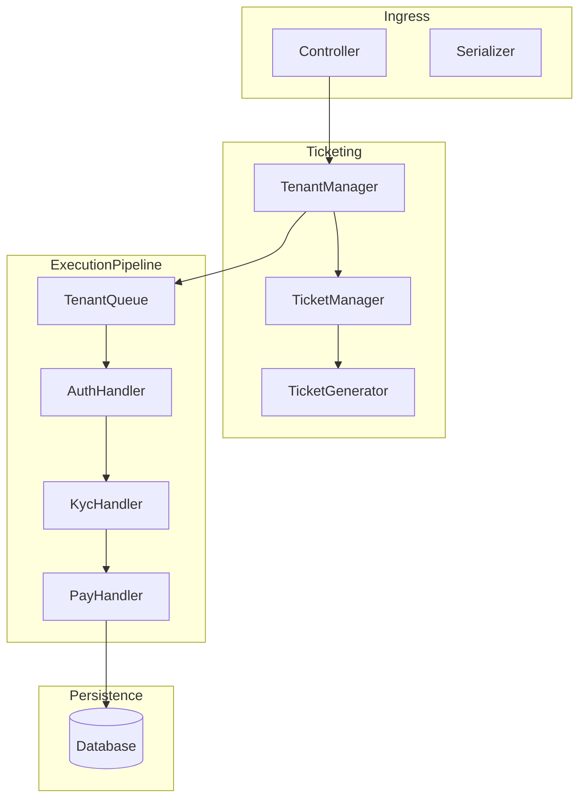

# **Reactive Ticket-Based Pipeline With Backpressure & Healing - Phase B**

A concurrency-driven, multi-stage processing pipeline implementing **Chain of Responsibility**, **bounded-queue backpressure**, **executor isolation**, **ticket-based admission control**, and **self-healing control loops**.

This system simulates real-world reactive gateways that must handle:

- High-throughput request ingestion

- Per-tier ticket quotas (BASIC vs PREMIUM)

- Controlled backpressure at each processing stage

- Async multi-handler progression

- Queue saturation detection

- Automatic handler pausing + exponential backoff healing

- Stage-by-stage logs and database persistence


The design mirrors production-grade patterns found in distributed ingestion pipelines, fraud systems, and payment gateways.

---

# **High-Level Architecture**

Requests move through the following major components:

1. **Controller** ingests incoming API calls

2. **TicketManager** issues tier-specific tickets (premium > basic)

3. **TenantManager** attaches tickets asynchronously and pushes tasks into TenantQueue

4. **TenantQueue** acts as staging for handler chains

5. **Handlers (Auth → KYC → Pay)** process data using executor-isolated, bounded queue stages

6. **AbstractQueue** powers the bounded queue + backpressure + healing logic

7. **Database** stores processing results

8. **Schedulers** maintain ticket replenishment


The architecture is a hybrid of **reactive async pipelines** and **Chain of Responsibility**.

---

# **Mermaid Architecture Diagram**



---

# **Folder Structure (Annotated)**

```
ticketing.pipeline_reactive/
│
├── api/
│   └── Controller.java
│       → REST interface for request ingestion, status lookup
│
├── business/
│   ├── queues/
│   │   └── TenantManager.java
│   │       → Async ticket attachment & dispatch to handler chain
│   ├── tickets/
│   │   ├── TicketGenerator.java
│   │   │    → Atomic ticket number generator
│   │   └── TicketManager.java
│   │        → Maintains ticket queues + scheduled replenishment
│
├── config/
│   ├── ExecutorConfig.java
│   │    → Executor pools for each handler
│   ├── HandlerConfig.java
│   │    → Handler bean factory
│   └── QueueConfig.java
│        → Ticket queues (basic/premium)
│
├── core/
│   ├── AuthHandler.java
│   ├── KycHandler.java
│   └── PayHandler.java
│       → Handler implementations, healing loops, backpressure rules
│
├── data/
│   ├── Data.java
│   └── enums/
│       ├── AccountType.java
│       └── HandlerType.java
│
├── database/
│   └── Database.java
│       → In-memory DB for results
│
├── exception/
│   └── NoTicketException.java
│
├── inputs/
│   └── Request.java
│
├── model/
│   ├── AbstractQueue.java
│   │    → Core bounded queue + backpressure + healing primitive
│   └── Handler.java
│        → Chain of Responsibility interface
│
├── service/
│   └── TenantQueue.java
│       → Queue used between ticket assignment and handler chain
│
└── utils/
    └── Serializer.java
        → Transaction ID generator
```

---

# **Class Diagrams (Core Abstractions)**

### **Handler Abstraction**



---

# **Control Flow Overview**

## **1. Request Entry**



---

## **2. Handler Pipeline Execution**



---

# **Key Techniques Explained**

## **1. Chain of Responsibility Pipeline**

Each handler is a node in a linear pipeline.

```
Auth → KYC → Pay
```

Each node implements:

- **performOperation**

- **next handler reference**

- **bounded queue isolation**

- **async executor-driven stage execution**


This eliminates shared state between stages and prevents cross-handler blocking.

---

## **2. Executor Isolation**

Every handler receives its own executor:

- `authExecutor(4 threads)`

- `kycExecutor(4 threads)`

- `payExecutor(4 threads)`


This prevents cross-stage thread starvation.

### Visualization



---

## **3. Bounded Queue + Backpressure**

Each handler extends **AbstractQueue**.

Key features:

- Fixed queue size (40)

- `burstFactor()` = queueSize / maxSize

- When `burstFactor()` crosses threshold → **paused = true**

- Incoming inserts still block/slow → forcing upstream to stabilize


### Backpressure State Machine



---

## **4. Healing Loop**

Runs in parallel with handler processing.

Process:

- When the handler is paused, healing loop sleeps with exponential backoff

- If sustained low saturation for a window → resume operations


### Diagram



---

## **5. Ticket-Based Admission Control**

Two distinct ticket pools:

- **Basic** queue (small capacity)

- **Premium** queue (larger capacity)


Daily effect:

- Premium pipeline gets higher fairness and stability

- Basic traffic is throttled earlier during saturation


### Flow Diagram



---

## **6. Async Supplier + CompletableFuture Chain**

Inside `TenantManager.attachTicket()`:

```java
CompletableFuture.supplyAsync(() -> data)
    .thenApplyAsync(x -> assignTicket(x), ticketExecutor)
    .whenComplete(...)
```

Benefits:

- Non-blocking

- CPU work isolated

- Clean pipeline between stages

- Clear failure propagation


---

# **Block Diagram: Complete Request Lifecycle**



---

# **Per-Class Purpose (Detailed)**

### **Controller**

- Handles incoming REST calls

- Serializes request → Data object

- Sends to TenantManager

- Exposes `/status/{id}` & `/all`


### **TenantManager**

- Wraps `attachTicket()` in async futures

- Pushes data to TenantQueue

- Runs its own thread to feed handler chain

- Root of the CoR pipeline (`auth → kyc → pay`)


### **TenantQueue**

- Staging queue between ticket assignment and handler processing

- Uses blocking `take()` to smooth bursts


### **TicketManager**

- Manages BASIC and PREMIUM ticket pools

- Schedules periodic top-ups

- Applies max-cap detection

- Acts as fairness regulator


### **AbstractQueue**

- Core backpressure abstraction

- Provides:

    - bounded queue

    - paused-state mechanism

    - burst factor computation

    - exponential healing loops


### **Handlers**

- AuthHandler

- KycHandler

- PayHandler
    Each handler:

- Inserts logs

- Mutates state

- Writes to DB

- Passes to next handler

- Runs healing loop

- Applies backpressure


### **Database**

- Simple in-memory HashMap store

- Demonstrates persistence in reactive chains


---

# **Control-Flow Summary**

1. Request enters the system

2. TenantManager asynchronously assigns ticket

3. Data is placed in tenant queue

4. Auth → KYC → Pay handler pipeline processes the task

5. Each handler obeys:

    - bounded queue constraints

    - executor-isolated concurrency

    - healing & backpressure

6. Result stored in DB

7. User queries status


---

# **Complete System Block Diagram**



---

# **Summary**

This project showcases a **production-adjacent reactive design**:

- **Chain of Responsibility** pipeline for sequential validation

- **Executor-Isolated Handler Stages** to avoid shared contention

- **Bounded Queues + Backpressure** to regulate throughput

- **Healing Loops** for adaptive recovery

- **Async Data Movement via CompletableFuture**

- **Tier-Based Ticket Scheduling** for fairness

- **Traceable multi-stage logs & state mutation**

