# Compensating Transaction Manager Documentation

## Compensating Transaction Manager — What it is?

The Compensating Transaction Manager (CTM) is a coordination component that enforces **eventual consistency** for multi-step business operations spanning heterogeneous systems where atomic transactions are impossible. It orchestrates forward actions and registers corresponding compensators (undo operations) at the time of each forward step, persistently records intent and execution state, and drives ordered compensations when partial failures occur. The CTM is designed to be durable, idempotent, and auditable: it persists transaction records and compensator metadata to enable replay, supports idempotency tokens to avoid double-effects, and emits detailed audit trails for compliance and post-mortem analysis.

Operationally, the CTM functions as an orchestrator and a governance plane. During normal execution it sequences domain handlers (locks, resource updates, external API calls), records compensators immediately after successful forward actions, and updates transaction state. Upon a detected failure or external trigger (e.g., chargeback, partner webhook, operator decision), the CTM transitions the transaction to a compensation state and executes registered compensators in a safe, deterministic order—respecting priorities, resource constraints, and idempotency. The component also includes reconciliation and escalation facilities that detect stuck transactions, apply repair heuristics or alternate compensators, and escalate to human operators when automation is insufficient.

CTM design emphasizes operational observability and resilience. It integrates retry/backoff policies, circuit-breaker awareness for downstream dependencies, and resource-aware scheduling to minimize impact on live systems. For enterprise use, it provides administrative APIs, audit export, dry-run simulation, versioned compensator support, and multi-tenant isolation. In sum, the CTM enables robust, traceable rollback semantics across distributed domains where atomic transactions cannot be enforced, making it suitable for e-commerce, payments, travel booking, supply chain orchestration, and any high-business-value multi-step workflows.

---

## Detailed folder structure

```
/compensating-transaction-manager
├── README.md
├── pom.xml / build.gradle
├── src
│   ├── main
│   │   ├── java
│   │   │   └── transactions.compensating
│   │   │       ├── CompensatingApplication.java
│   │   │       ├── admin
│   │   │       │   ├── ChainManager.java                    // Assembles handler chain topology
│   │   │       │   ├── ExecutorEngine.java                  // Orchestrates execution and rollback
│   │   │       │   └── AdminController.java                 // Admin REST surface for operators
│   │   │       ├── config
│   │   │       │   ├── CompensatorMapper.java               // Registry bean mapping compensator IDs
│   │   │       │   ├── ResourceMapper.java                  // Resource pools and thread pools config
│   │   │       │   └── AppConfig.java                       // Global application configuration
│   │   │       ├── core
│   │   │       │   ├── handlers
│   │   │       │   │   ├── CheckHandler.java                // Validation and precondition checks
│   │   │       │   │   ├── SenderLockHandler.java           // Acquire locks for sender
│   │   │       │   │   ├── ReceiverLockHandler.java         // Acquire locks for receiver
│   │   │       │   │   ├── SenderMoneyHandler.java          // Debit sender balance
│   │   │       │   │   ├── ReceiverMoneyHandler.java        // Credit receiver balance
│   │   │       │   │   ├── QuotaHandler.java                // Token/quota gating and retry
│   │   │       │   │   └── CompletionHandler.java           // Finalization and resource release
│   │   │       │   └── compensators
│   │   │       │       ├── SenderLockCompensator.java       // Compensator for sender lock
│   │   │       │       ├── ReceiverLockCompensator.java     // Compensator for receiver lock
│   │   │       │       ├── SenderMoneyCompensator.java      // Compensator for sender money rollback
│   │   │       │       └── ReceiverMoneyCompensator.java    // Compensator for receiver money rollback
│   │   │       ├── data
│   │   │       │   ├── input
│   │   │       │   │   └── Input.java                       // Domain payload for forward execution
│   │   │       │   ├── output
│   │   │       │   │   └── Output.java                      // Execution result, actions, logs
│   │   │       │   └── User.java                            // Domain user/account model
│   │   │       ├── database
│   │   │       │   └── Database.java                        // In-memory/DB resource abstraction for balances
│   │   │       ├── service
│   │   │       │   ├── LockCache.java                       // Locking resource abstraction
│   │   │       │   └── TransactionQuotas.java               // Quota/token resource
│   │   │       ├── utils
│   │   │       │   └── KeyGenerator.java                    // Transaction ID generator
│   │   │       ├── model
│   │   │       │   ├── Handler.java                         // Handler interface
│   │   │       │   ├── Compensator.java                     // Compensator interface
│   │   │       │   └── Resource.java                        // Resource marker interface
│   │   │       ├── enums
│   │   │       │   ├── Handlers.java                        // Handler/compensator enum IDs
│   │   │       │   ├── ResourceRequest.java                 // Resource enum
│   │   │       │   ├── TransactionStatus.java               // PASS/FAIL/RETRY/COMPENSATE statuses
│   │   │       │   └── Bank.java                            // Sample domain enum
│   │   │       └── error
│   │   │           ├── FundsException.java                  // Domain-specific runtime errors
│   │   │           ├── IdempotencyException.java
│   │   │           └── Escalation.java
│   │   └── resources
│   │       ├── application.yml                              // Externalized config
│   │       └── db
│   │           └── migration                                 // Flyway/liquibase scripts (Phase 2+)
│   └── test
│       └── java
│           └── transactions.compensating
│               └── CoreTest.java                             // Integration/unit tests
├── docs
│   ├── architecture.md                                      // High-level architecture narrative and diagrams
│   ├── operations.md                                        // Runbook, escalation, and admin guides
│   └── api.md                                               // REST API contract & examples
├── scripts
│   ├── docker-compose.yml                                   // Local dev compose for Phase 3
│   └── run-local.sh                                          // Convenience dev runner
└── tools
    └── compensator-sdk                                       // Example SDK / contract for building compensators
```

#### File / folder explanation summary

- `README.md` — concise project overview and quickstart.

- `pom.xml / build.gradle` — build configuration and dependency management.

- `src/main/java/.../admin` — orchestration and administrative interfaces for transaction lifecycle.

- `src/main/java/.../config` — Spring beans that wire compensator and resource registries and thread pools.

- `src/main/java/.../core/handlers` — concrete handler implementations forming the forward execution chain.

- `src/main/java/.../core/compensators` — compensator implementations invoked during rollback.

- `src/main/java/.../data` — DTOs and domain models for input/output and users.

- `src/main/java/.../database` — resource abstraction that simulates or encapsulates persistence/backing store.

- `src/main/java/.../service` — auxiliary services like locks and quota managers.

- `src/main/java/.../utils` — utilities such as key/ID generation.

- `src/main/java/.../model` — core interfaces (Handler, Compensator, Resource) defining contracts.

- `src/main/java/.../enums` — enumerations for consistent identifiers and status codes.

- `src/main/java/.../error` — custom exceptions representing failure modes and escalation triggers.

- `src/main/resources` — configuration and migration scripts for production-ready deployment.

- `src/test` — unit/integration tests demonstrating atomicity, rollback, and behavior under error.

- `docs` — extended architectural, operational, and API documentation for engineers and operators.

- `scripts` — developer tooling for local boot and multi-service compose environments.

- `tools/compensator-sdk` — sample SDK and contract for external services to register compensators.


---

## Detailed Architecture Breakdown of the Compensation Transaction Manager

---

### 3.1 Architectural Overview

The Compensation Transaction Manager (CTM) is architected as a **deterministic orchestration engine** that combines **Chain of Responsibility**, **Saga-style compensation**, and **resource-governed execution**. Its core responsibility is to guarantee **logical atomicity** across a sequence of non-atomic operations by explicitly modeling failure, rollback, retry, and escalation as first-class architectural concepts.

At a macro level, the CTM is divided into five cooperating architectural layers:

1. **Orchestration Layer**

2. **Execution Chain Layer**

3. **Compensation Layer**

4. **Resource & Infrastructure Layer**

5. **Persistence, Observability & Control Plane**


Each layer has strict responsibilities and communicates only through explicit contracts. This separation ensures predictability under failure and allows independent evolution of execution logic, compensation logic, and operational tooling.

---

### 3.2 Orchestration Layer

**Primary Components**

- `ExecutorEngine`

- `ChainManager`


The orchestration layer owns **transaction lifecycle management**. It initializes transaction context, generates transaction identifiers, and governs the transition between forward execution and compensation mode.

Responsibilities:

- Create a new transaction boundary

- Execute handlers sequentially

- Track retry counts and escalation thresholds

- Register compensators only on successful forward steps

- Trigger rollback on failure

- Ensure LIFO compensation semantics


The `ExecutorEngine` does not know _what_ each handler does. It only knows:

- When to move forward

- When to retry

- When to compensate

- When to escalate


This strict abstraction is critical. It prevents domain logic from leaking into orchestration logic, a common failure in poorly designed saga systems.

---

### 3.3 Execution Chain Layer (Chain of Responsibility)

**Primary Components**

- `Handler` interface

- Concrete handlers (`CheckHandler`, `SenderLockHandler`, etc.)


This layer implements a **synchronous logical chain** with **asynchronous execution units**. Each handler:

- Performs exactly one business responsibility

- Is independently executable

- Has its own executor pool

- Decides whether compensation is required


Handlers never call each other directly. Control flow is delegated entirely to the chain manager.

#### Forward Execution Characteristics

- Deterministic order

- Fail-fast semantics

- Idempotency-aware execution

- Retry signaling without state corruption


#### Compensation Registration Rule

> A compensator is registered **only after** its corresponding forward handler completes successfully.

This rule guarantees rollback correctness.

---

### 3.4 Execution Chain — Control Flow Diagram

**Forward Chain Execution Flow**

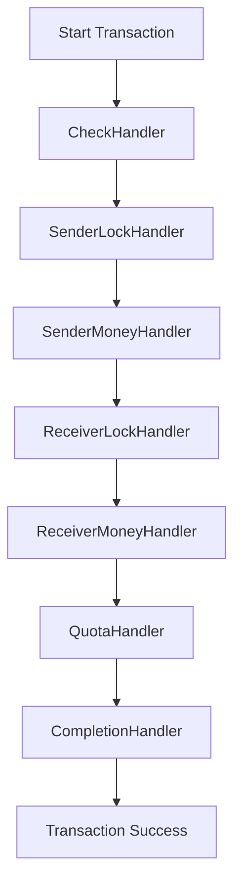

---

### 3.5 Compensation Layer

**Primary Components**

- `Compensator` interface

- Compensator implementations

- Compensation stack (LIFO)


The compensation layer models **explicit undo semantics**. Unlike transactional rollback, compensations are:

- Executed explicitly

- Potentially partial

- Independently retryable

- Non-atomic by design


Each compensator:

- Reverses exactly one forward action

- Operates synchronously to preserve order

- Is idempotent by construction

- Logs every action for auditability


Compensators are executed in **reverse registration order**, ensuring that the most recent side effect is undone first.

---

### 3.6 Compensation Execution Flow Diagram

**Rollback Control Flow**

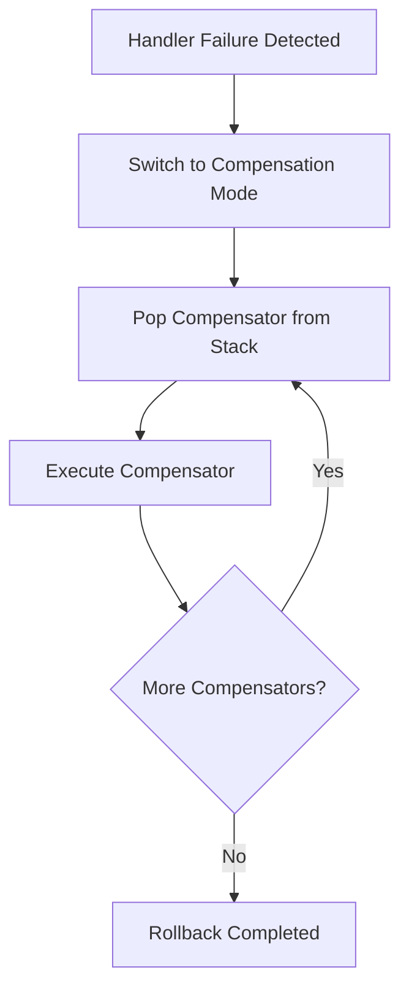

---

### 3.7 Resource & Infrastructure Layer

**Primary Components**

- `Database`

- `LockCache`

- `TransactionQuotas`

- Thread pools per handler


This layer enforces **resource isolation and concurrency control**.

Key architectural decisions:

- Resources are accessed through a unified `Resource` interface

- Handlers do not instantiate resources

- Resource lookup is done via enum-based registry

- Each handler has a dedicated executor pool


This design prevents:

- Thread starvation

- Resource contention across handlers

- Hidden shared-state coupling


#### Thread Pool Isolation

Each handler owns its executor:

- Locks do not block money handlers

- Quota starvation does not freeze database checks

- Compensation execution does not interfere with forward execution


---

### 3.8 Resource Interaction Diagram

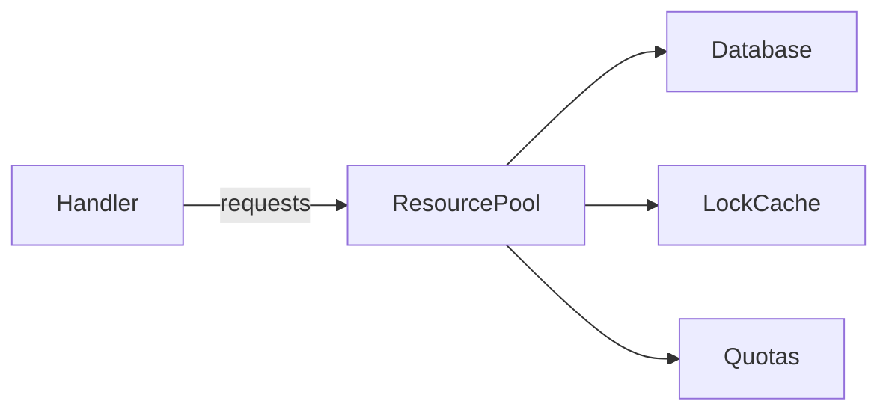

---

### 3.9 Persistence, Observability & Control Plane

Although implemented minimally in this version, the architecture explicitly prepares for enterprise-grade control features.

Planned responsibilities:

- Transaction state persistence

- Compensator execution logs

- Retry counters and escalation markers

- Operator-driven intervention APIs


The `Output` object already models:

- Ordered action history

- Handler-level statuses

- Retry counts

- Transaction identity


This makes the system **observable by default**, not as an afterthought.

---

### 3.10 End-to-End Architecture Block Diagram

**Complete CTM Architecture**

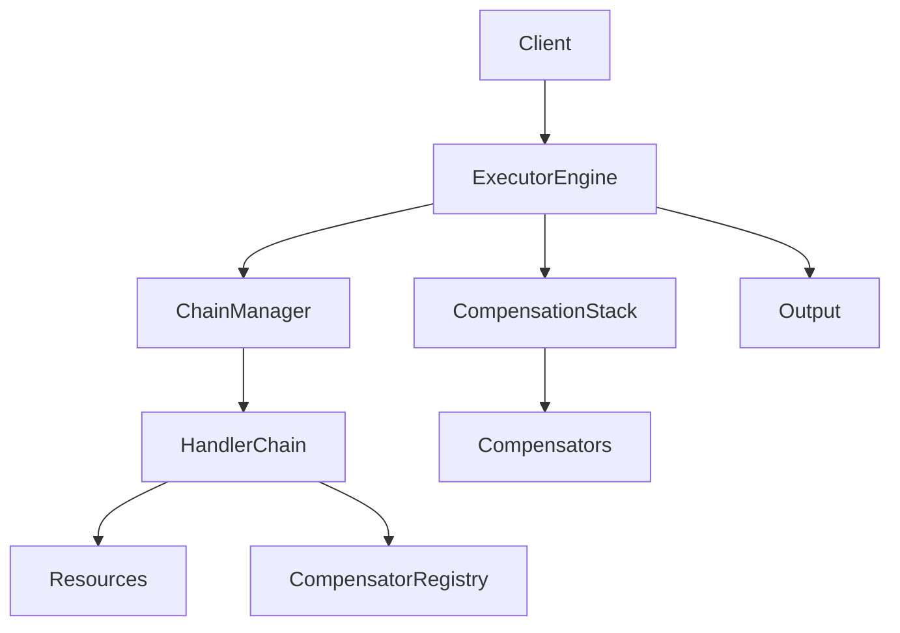

---

### 3.11 Full Architecture Explanation (500+ words)

The Compensation Transaction Manager is intentionally designed as a **control-driven system**, not a data-driven one. At its heart lies the understanding that in distributed systems, failure is not exceptional—it is expected. Therefore, failure handling must be modeled explicitly, not implicitly through transactions or retries alone.

The architecture begins at the `ExecutorEngine`, which acts as the authoritative transaction governor. It defines the lifecycle of a transaction: initialization, forward execution, failure detection, retry evaluation, compensation execution, and final resolution. Crucially, it never performs business logic itself. This keeps the orchestration layer stable even as domain logic evolves.

The `ChainManager` constructs a deterministic handler topology at startup. This avoids runtime ambiguity and ensures every transaction follows a known execution path. Dynamic chain mutation is possible but deliberately constrained to administrative use cases to avoid unpredictable runtime behavior.

Each handler represents a **single responsibility unit** aligned with domain-driven design principles. For example, locking and money movement are separated deliberately, allowing partial failure modeling. Handlers operate asynchronously using dedicated executors, enabling high throughput without sacrificing logical determinism.

The compensation architecture is where the system differentiates itself from simplistic saga implementations. Compensators are not inferred—they are explicitly registered. This removes ambiguity and ensures rollback intent is durable. The LIFO execution model mirrors stack unwinding semantics in programming languages, making rollback behavior intuitive and correct.

Resource access is centralized and abstracted, preventing handlers from creating hidden dependencies. This also enables future evolution toward distributed resources, remote services, or transactional databases without altering handler logic.

Finally, observability is baked into the execution model. The `Output` object is not merely a return value—it is a **transaction ledger**. Every handler decision, retry, failure, and compensation is recorded in order. This makes the system suitable for audit-heavy environments such as banking, fintech, and regulated enterprise platforms.

In summary, the CTM architecture balances strict control with extensibility. It avoids the pitfalls of implicit rollback, hidden retries, and shared mutable state. Instead, it embraces explicit orchestration, deterministic execution, and observable failure handling—hallmarks of mature enterprise-grade systems.


---

## Low-Level Techniques Used in the Compensation Transaction Manager

This section focuses on **code-level, execution-level, and concurrency-level techniques** deliberately embedded in the system. These techniques are explicitly visible in the codebase (often marked via comments) and are foundational to correctness, determinism, and safety.

---

## Technique: Executor Ownership per Handler (Thread Isolation)

### Concept Overview

Each handler owns its **dedicated executor service**, rather than receiving an executor as a method parameter or sharing a global pool. This is a deliberate **data-hiding and isolation strategy**.

Key idea:

> Execution context is a _property of the handler_, not of the orchestrator.

This ensures:

- One handler cannot starve another

- Blocking behavior is isolated

- Throughput can be tuned per responsibility


In real systems, lock acquisition, money movement, and quota checks have radically different latency and contention characteristics. A single shared executor would introduce emergent coupling and unpredictable tail latencies.

---

### Why This Matters at Low Level

- Lock handlers may block

- Database handlers may be I/O bound

- Quota handlers may spin/retry

- Completion handlers must be fast and deterministic


By isolating executors:

- Failures are localized

- Saturation does not cascade

- Backpressure is implicit


---

### Executor Ownership — Block Diagram

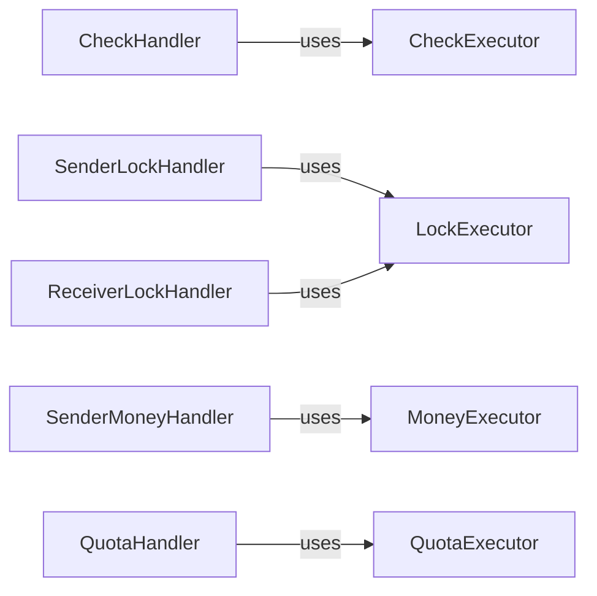

---

### Executor Ownership — Control Flow

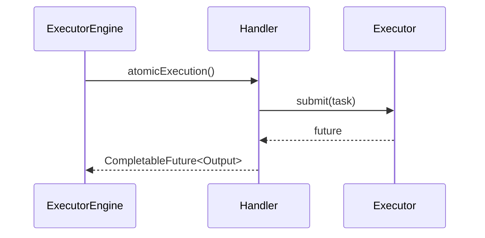

---

## Technique: Atomic Execution via CompletableFuture Composition

### Concept Overview

Every handler implements:

```java
CompletableFuture<Output> atomicExecution(Output output)
```

This establishes a **uniform asynchronous contract** across the chain.

Key properties:

- Atomic from the orchestrator’s perspective

- Exception-aware

- Composable

- Non-blocking at orchestration level


The orchestrator never blocks on threads directly. It consumes futures and reacts only to their outcomes.

---

### Why This Is a Low-Level Power Move

- Prevents thread hijacking

- Enables structured error handling via `exceptionally`

- Supports future transition to distributed execution

- Makes retry semantics explicit and observable


This pattern mirrors **reactive orchestration**, without forcing a reactive stack.

---

### CompletableFuture Control Flow

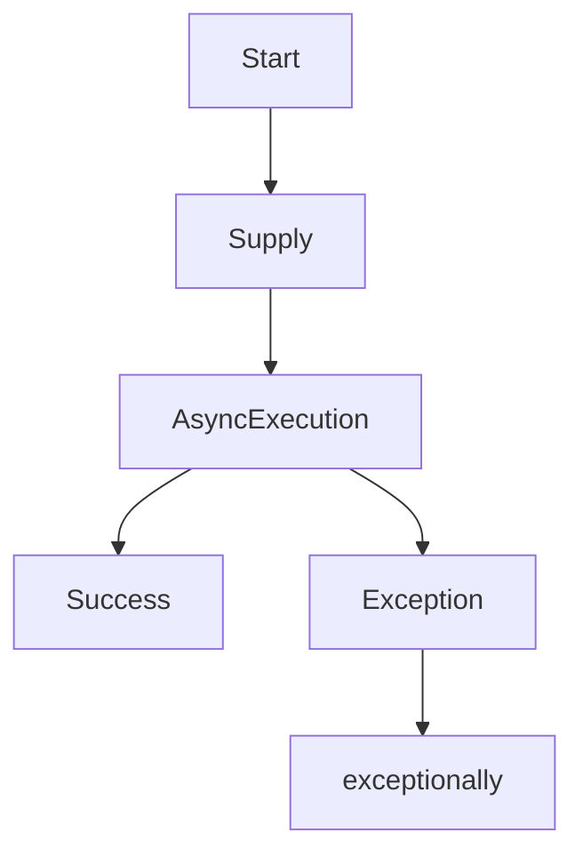

---

## Technique: Explicit Retry Signaling (Not Implicit Retry)

### Concept Overview

Handlers do **not retry themselves**.

Instead, they emit:

```java
TransactionStatus.RETRY
```

The orchestrator (`ExecutorEngine`) decides:

- Whether retry is allowed

- Whether retry limit is exceeded

- Whether escalation is required


This separation is crucial.

---

### Why This Matters

Implicit retries inside handlers:

- Hide control flow

- Break auditability

- Cause non-determinism


Explicit retry signaling:

- Centralizes policy

- Makes retries visible

- Enables escalation and compensation decisions


---

### Retry Governance Flow

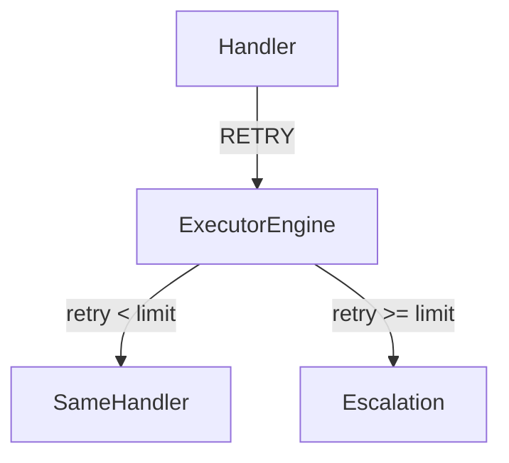

---

## Technique: LIFO Compensation Stack (Deterministic Rollback)

### Concept Overview

Compensators are stored in a **Deque** and executed in **Last-In-First-Out** order.

This mirrors:

- Stack unwinding in programming languages

- Transaction log rollback semantics


Each compensator:

- Reverses exactly one forward side effect

- Is executed synchronously and sequentially


---

### Why LIFO Is Non-Negotiable

Forward order:

```
Lock → Debit → Credit
```

Correct rollback order:

```
Credit rollback → Debit rollback → Unlock
```

FIFO rollback would corrupt state.

---

### Compensation Stack Diagram

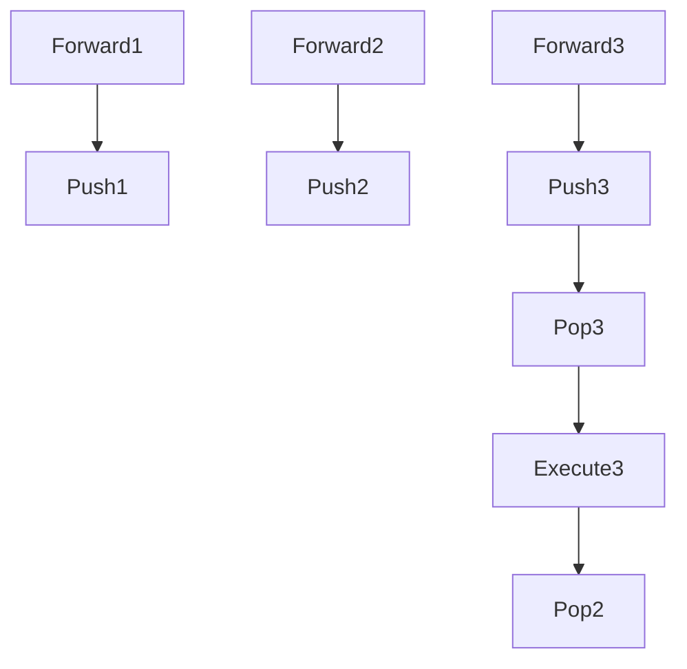

---

## Technique: Resource Abstraction via Enum-Based Registry

### Concept Overview

Handlers do not instantiate resources.
They request them by **intent**, not by implementation.

```java
Map<ResourceRequest, Resource>
```

This provides:

- Late binding

- Replaceability

- Testability


---

### Why This Is Enterprise-Grade

- Enables swap from in-memory DB to RDBMS

- Allows mock injection

- Prevents hard dependencies

- Supports multi-resource orchestration


---

### Resource Access Flow

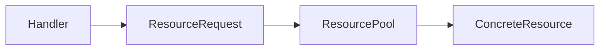

---

# High-Level Design Techniques Used in the Component

This section explains **architectural and system-level design patterns** that shape the CTM as an enterprise-ready system.

---

## High-Level Technique: Chain of Responsibility with Failure Awareness

### Concept Overview

The CTM uses **Chain of Responsibility**, but with a critical enhancement:

> Each handler is failure-aware and compensation-aware.

Handlers:

- Do not decide global flow

- Do not call each other

- Do not know about retries or rollback


The orchestrator owns control flow.

---

### Why This Is Not a Naive Chain

Traditional CoR:

- Stops at first handler that handles


CTM CoR:

- Executes all handlers

- Tracks partial success

- Enables rollback of prior handlers


This is a **transactional chain**, not a routing chain.

---

### Chain Control Diagram

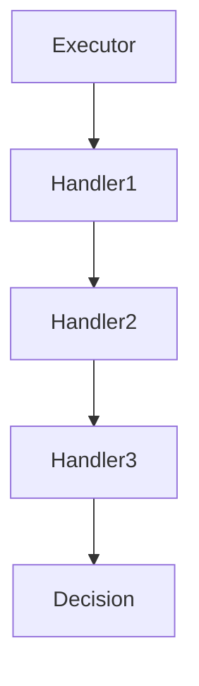

---

## High-Level Technique: Saga Pattern (Orchestrated Variant)

### Concept Overview

The CTM is an **orchestrated saga**, not a choreographed one.

Characteristics:

- Central coordinator

- Explicit compensator registry

- Deterministic rollback

- Single source of truth


---

### Why Orchestration Was Chosen

- Strong ordering guarantees

- Easier audit and debugging

- Centralized retry and escalation policies

- Predictable behavior under failure


This mirrors systems like:

- Payment gateways

- Banking transaction coordinators

- Order fulfillment engines


---

### Saga Lifecycle Diagram

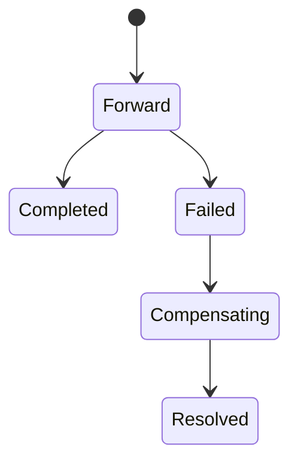

---

## High-Level Technique: Explicit Failure Modeling

### Concept Overview

Failure is not an exception—it is a **first-class state**.

The system models:

- PASS

- FAIL

- RETRY

- ESCALATE

- COMPENSATE


This explicit modeling enables:

- Deterministic transitions

- Observability

- Governance


---

### Failure State Machine

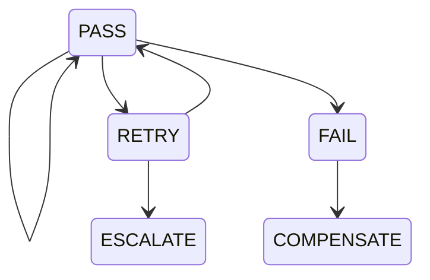

---

## High-Level Technique: Separation of Forward and Compensating Logic

### Concept Overview

Forward logic and rollback logic are **physically separated**:

- Different interfaces

- Different packages

- Different execution semantics


This prevents:

- Entangled logic

- Partial rollback bugs

- Implicit reversals


---

### Separation Diagram

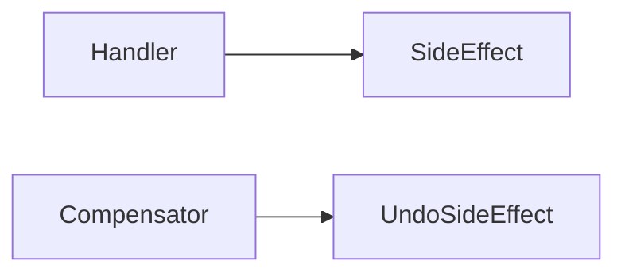

---

## High-Level Technique: Deterministic Orchestration with Observability

### Concept Overview

The `Output` object acts as:

- Execution ledger

- Audit log

- Debug trace

- Operator artifact


Nothing is implicit.

Every decision is recorded.

---

### Observability Flow

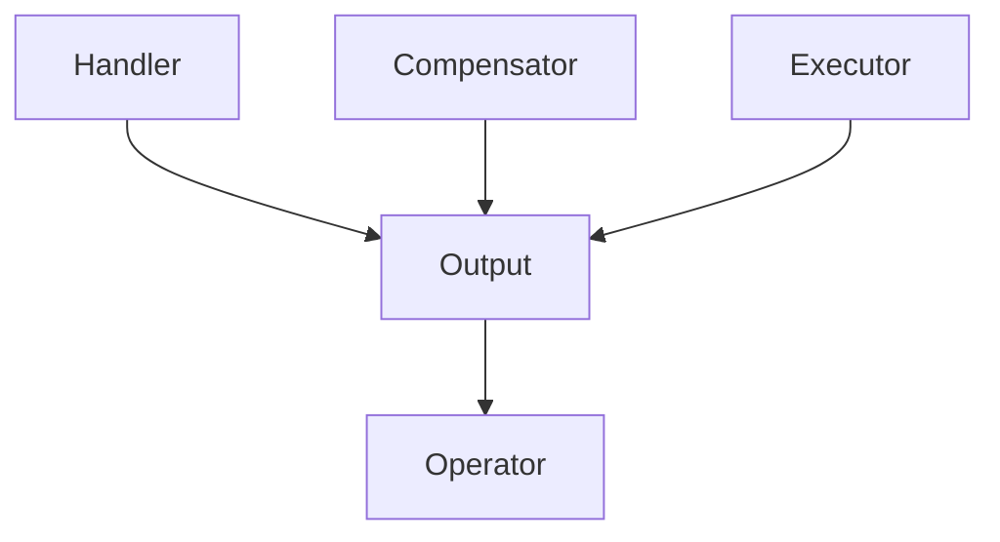

---

### Why This Matters in Real Systems

Enterprise systems fail not because logic is wrong, but because **operators cannot see what happened**.

The CTM is designed so that:

- Every failure is explainable

- Every rollback is traceable

- Every retry is visible


This aligns with:

- Banking systems

- Payment processors

- Regulated transactional platforms


---

## Detailed Execution Flow of the Compensation Transaction Manager

This section explains **how the entire system behaves at runtime**, step by step, from the moment a client submits a transaction request to the final resolution (success, rollback, or escalation). The focus here is **control flow**, **state transitions**, **decision points**, and **why each step exists** from a system-design perspective.

---

## Execution Philosophy

Before diving into steps, it is critical to internalize the execution philosophy of this system:

- The system does **not** assume success.

- Every forward step is treated as _conditionally durable_.

- Compensation is **planned**, not inferred.

- Control flow is **centralized**, execution is **decentralized**.

- Failure is modeled, recorded, and acted upon deterministically.


This philosophy is what differentiates the CTM from ad-hoc retry logic or naive saga implementations.

---

## High-Level Runtime Stages

At runtime, every transaction passes through the following macro stages:

1. Transaction Initialization

2. Forward Chain Execution

3. Retry Evaluation

4. Failure Detection

5. Compensation Execution

6. Final Resolution


Each stage is explicit and observable.

---

## End-to-End Execution Flow Diagram (Complete System)

### Complete Transaction Lifecycle

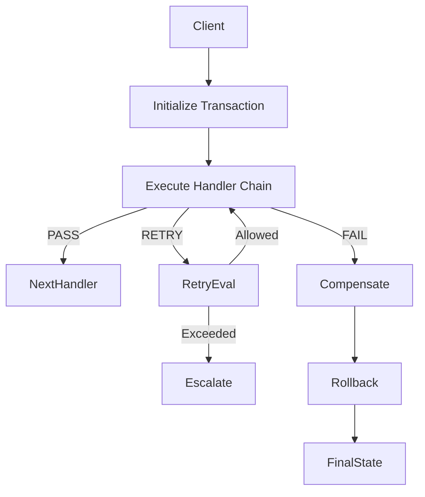

---

## Stage 1: Transaction Initialization

### Responsibilities

- Generate a unique transaction identifier

- Create an immutable input snapshot

- Initialize execution ledger (`Output`)

- Initialize retry counters

- Initialize empty compensation stack


### Key Components Involved

- `ExecutorEngine`

- `KeyGenerator`

- `Output` builder


### Why This Matters

The system treats the **transaction itself as a domain object**, not just a method call. The transaction ID becomes the anchor for logs, retries, compensation, and audit trails. This mirrors how enterprise transaction coordinators operate.

At this point:

- No side effects have occurred

- No compensators are registered

- The system is in a clean, reversible state


---

## Stage 2: Forward Chain Execution

### Execution Mechanics

- The `ExecutorEngine` retrieves the chain head from `ChainManager`

- Handlers are executed **sequentially in logical order**

- Each handler runs asynchronously on its own executor

- The orchestrator waits for completion before advancing


### Handler Responsibilities

Each handler:

- Performs exactly one domain responsibility

- Accesses resources via the resource pool

- Emits a `TransactionStatus`

- Optionally declares a compensator


### Forward Execution Diagram

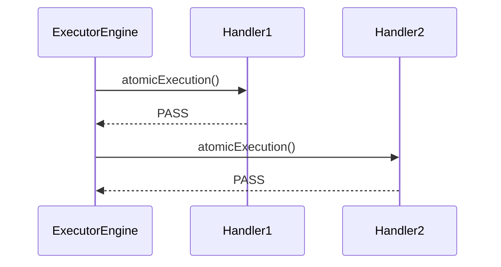

### Critical Rule: Compensator Registration

A compensator is registered **only if**:

- The handler completes successfully

- The handler explicitly declares a compensator ID


This ensures rollback intent is durable and correct.

---

## Stage 3: Retry Evaluation

### Retry Is a Signal, Not an Action

Handlers never retry themselves. Instead, they emit:

- `TransactionStatus.RETRY`


The `ExecutorEngine` evaluates:

- Current retry count

- Allowed retry threshold

- Escalation policy


### Retry Control Flow

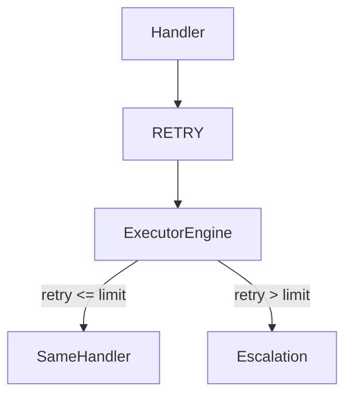

### Why Centralized Retry Matters

- Prevents infinite loops

- Keeps retry policy consistent

- Makes retry behavior observable

- Enables escalation workflows


This is a hallmark of enterprise-grade systems.

---

## Stage 4: Failure Detection

### Failure Conditions

A failure is declared when:

- A handler emits `FAIL`

- Retry limit is exceeded

- An escalation exception is thrown


### Immediate Effects

- Forward execution stops

- No further handlers are executed

- The system transitions to **compensation mode**


### State Transition

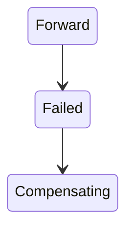

This hard boundary ensures no partial forward execution continues after failure.

---

## Stage 5: Compensation Execution

### Compensation Strategy

- Compensators are executed in **reverse order**

- Execution is synchronous and ordered

- Failures during compensation are logged, not fatal


### Compensation Stack Behavior

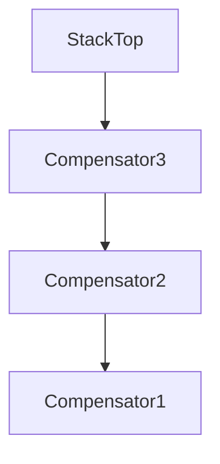

### Key Guarantees

- No compensator executes twice

- Idempotency protects against duplicate effects

- Compensation does not re-trigger forward logic


This ensures **best-effort rollback without cascading failure**.

---

## Stage 6: Final Resolution

### Possible Terminal States

1. **Success**

    - All handlers passed

    - Resources released

    - Transaction completed

2. **Compensated**

    - Failure occurred

    - All registered compensators executed

3. **Escalated**

    - Retry limit exceeded

    - Manual intervention required


### Final Output Object

The `Output` object now contains:

- Ordered execution history

- Handler statuses

- Compensation actions

- Retry count

- Transaction ID

- Human-readable logs


This object acts as:

- Audit record

- Debug trace

- Operator artifact


---

## Detailed Control Block Diagram

### Orchestration vs Execution vs Compensation

```mermaid
flowchart LR
    ExecutorEngine -->|controls| HandlerChain
    HandlerChain -->|registers| CompensationStack
    ExecutorEngine -->|executes| CompensationStack
    ExecutorEngine --> OutputLedger
```

---

## Why This Execution Model Is Enterprise-Grade

The Compensation Transaction Manager does not rely on optimism. It assumes that **partial failure is the norm**, not the exception. Every design choice in the execution flow reinforces this assumption.

The explicit initialization stage ensures that every transaction is traceable from inception. By generating a transaction ID and immutable input snapshot early, the system ensures that all downstream effects can be correlated. This is a foundational requirement in regulated industries such as banking and payments.

The forward execution chain deliberately avoids implicit coupling. Handlers are independent, single-responsibility units. They do not know what came before or what comes after. This allows teams to reason locally about correctness while the orchestrator reasons globally about consistency.

Retry handling is centralized because retry is not a technical concern—it is a **business policy**. How many times a quota should be retried or when escalation should occur depends on system-level considerations, not handler-level implementation details.

Failure detection is strict and immediate. There is no attempt to “push through” failures. This avoids ghost successes and silent data corruption. The moment failure is detected, the system switches modes decisively.

Compensation execution is intentionally conservative. It is synchronous, ordered, and isolated. The system values correctness and auditability over raw throughput during rollback. This mirrors real financial and transactional systems where rollback correctness is more important than speed.

Finally, the system produces a rich execution ledger. This is not an optional add-on; it is a core artifact. In real enterprises, systems are judged not only by whether they work, but by whether humans can understand **why** they behaved a certain way under failure.

The CTM’s execution flow embodies this philosophy. It trades implicit magic for explicit control, hidden retries for visible decisions, and optimistic assumptions for deterministic recovery. This is precisely what elevates it from an academic pattern implementation to a production-grade architectural component.

---

## Powerful Enterprise-Grade Techniques Embedded in the Component

This section isolates **high-impact architectural techniques** that elevate the Compensation Transaction Manager (CTM) from a pattern implementation to a production-grade enterprise component. Each technique is explained with intent, impact, and an enterprise analogy.

---

## Explicit Compensator Intent Logging

**Enterprise Analogy:** Core banking ledgers, payment gateways (Visa, Stripe)

### Description

The CTM explicitly registers compensators **immediately after** each successful forward action. This is not inferred, delayed, or heuristically determined. The intent to undo is recorded at the exact moment a side effect becomes externally visible.

This guarantees:

- Deterministic rollback behavior

- Zero ambiguity in failure scenarios

- Accurate reconstruction of transaction history


This approach mirrors **write-ahead logging (WAL)**, but at the application orchestration layer rather than the database layer.

### Why This Matters in Enterprises

Regulated systems must prove:

- What actions were taken

- In what order

- What undo actions were planned


Implicit rollback logic fails audits. Explicit intent logging passes them.

#### Intent Registration Flow

```mermaid
flowchart TD
    ForwardAction --> Success
    Success --> RegisterCompensator
    RegisterCompensator --> DurableState
```

---

## Idempotency as a First-Class Boundary

**Enterprise Analogy:** Idempotent REST APIs, payment retries

### Description

Every resource mutation (lock, unlock, debit, credit) is idempotent by design. The system assumes retries, duplicate calls, and race conditions will occur and designs for safety rather than prevention.

Characteristics:

- Lock acquisition returns success/failure

- Unlock validates ownership

- Money updates validate prior state

- Compensators tolerate re-execution


### Enterprise Impact

This enables:

- Safe retries

- Crash recovery

- Exactly-once _effects_ over at-least-once _delivery_


#### Idempotent Operation Control

```mermaid
flowchart TD
    Operation --> StateCheck
    StateCheck -->|AlreadyApplied| NoOp
    StateCheck -->|NotApplied| ApplyChange
```

---

## Bulkhead Isolation via Per-Handler Executors

**Enterprise Analogy:** Netflix Hystrix bulkheads, service mesh isolation

### Description

Each handler owns its executor. No shared global pool exists.

This isolates:

- Lock contention

- I/O latency

- CPU-heavy tasks


### Why Enterprises Depend on This

Without bulkheads:

- One slow dependency degrades the entire system

- Tail latencies explode

- Recovery becomes unpredictable


With bulkheads:

- Failures are contained

- Throughput degrades gracefully

- SLAs remain enforceable


#### Bulkhead Isolation Diagram

```mermaid
flowchart LR
    LockHandler --> LockExecutor
    MoneyHandler --> MoneyExecutor
    QuotaHandler --> QuotaExecutor
```

---

## Centralized Retry and Escalation Governance

**Enterprise Analogy:** Workflow engines, BPM platforms

### Description

Retries are not implemented inside handlers. Handlers merely **signal** retry intent. The orchestrator enforces retry limits and escalation policy.

This transforms retries into:

- A governance concern

- A policy decision

- An auditable event


### Business Value

- Prevents infinite retry storms

- Enables escalation playbooks

- Keeps retry behavior consistent across domains


---

## Transaction as a Human-Readable Ledger

**Enterprise Analogy:** Event sourcing logs, accounting journals

### Description

The `Output` object is a structured execution ledger, not a DTO.

It records:

- Handler sequence

- Status transitions

- Retry counts

- Compensation actions

- Logs with intent


### Why This Is Critical

When incidents occur, operators need **answers**, not stack traces. The ledger provides explainability without replaying production traffic.

---

## Alignment with System Design, HLD, LLD, OOP, and DDD

This section demonstrates how the CTM aligns cleanly with core engineering disciplines, ensuring long-term sustainability and correctness.

---

## System Design Alignment

### System-Level Concerns Addressed

- Eventual consistency

- Partial failure handling

- Resource isolation

- Operational visibility


### System Context Diagram

```mermaid
flowchart TB
    Client --> CTM
    CTM --> Resources
    CTM --> AuditLogs
    CTM --> Operators
```

The CTM acts as a **transaction coordination subsystem**, not as domain logic.

---

## High-Level Design (HLD) Alignment

### Patterns Employed

- Orchestrated Saga

- Chain of Responsibility

- Bulkhead Isolation

- Explicit State Machines


### HLD Component View

```mermaid
flowchart TB
    ExecutorEngine --> ChainManager
    ChainManager --> Handlers
    ExecutorEngine --> Compensators
    ExecutorEngine --> ExecutionLedger
```

Each component has a singular, well-defined responsibility.

---

## Low-Level Design (LLD) Alignment

### LLD Characteristics

- Interface-first design

- Explicit contracts

- Strong error typing

- No hidden side effects


### Handler–Compensator Relationship

```mermaid
classDiagram
    Handler <|-- SenderMoneyHandler
    Handler <|-- ReceiverMoneyHandler
    Compensator <|-- SenderMoneyCompensator
    Compensator <|-- ReceiverMoneyCompensator
```

This symmetry ensures rollback correctness.

---

## Object-Oriented Design (OOP) Alignment

### Principles Applied

- **Single Responsibility:** One handler, one concern

- **Open/Closed:** Add handlers without modifying orchestration

- **Liskov Substitution:** Handlers interchangeable

- **Dependency Inversion:** Resources accessed via interfaces


### Interaction Flow

```mermaid
sequenceDiagram
    ExecutorEngine->>Handler: execute()
    Handler->>Resource: mutate()
    ExecutorEngine->>Compensator: compensate()
```

---

## Domain-Driven Design (DDD) Alignment

### Bounded Context Definition

The CTM defines its own bounded context:

- Transaction

- Handler

- Compensator

- Resource

- Execution Ledger


Business domains **consume** this context but do not pollute it.

### Aggregate Root

- Transaction (represented via orchestration state and ledger)


### Context Mapping

```mermaid
flowchart LR
    BankingDomain --> CTMContext
    PaymentsDomain --> CTMContext
    CTMContext --> Infrastructure
```

---

## Why This Alignment Is Critical

Because the CTM aligns with:

- **System Design** → resilience and scalability

- **HLD** → extensibility and governance

- **LLD** → correctness and testability

- **OOP** → maintainability

- **DDD** → domain isolation


…it can be safely deployed as:

- A banking transaction coordinator

- A payment orchestration engine

- An order fulfillment rollback system

- A general enterprise workflow backbone


---
