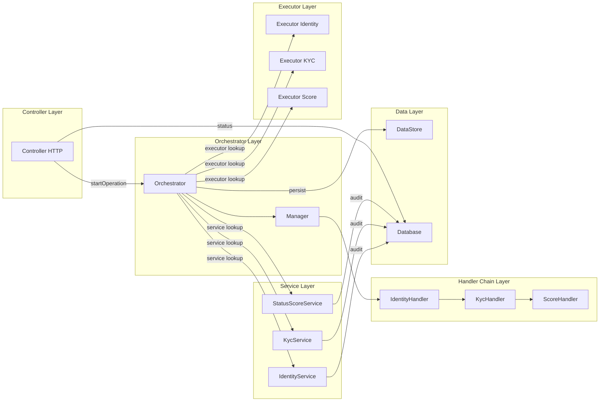
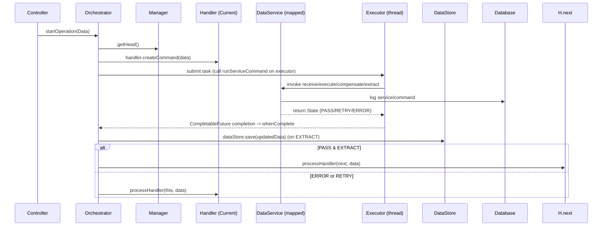
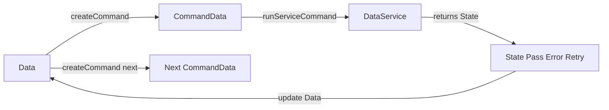
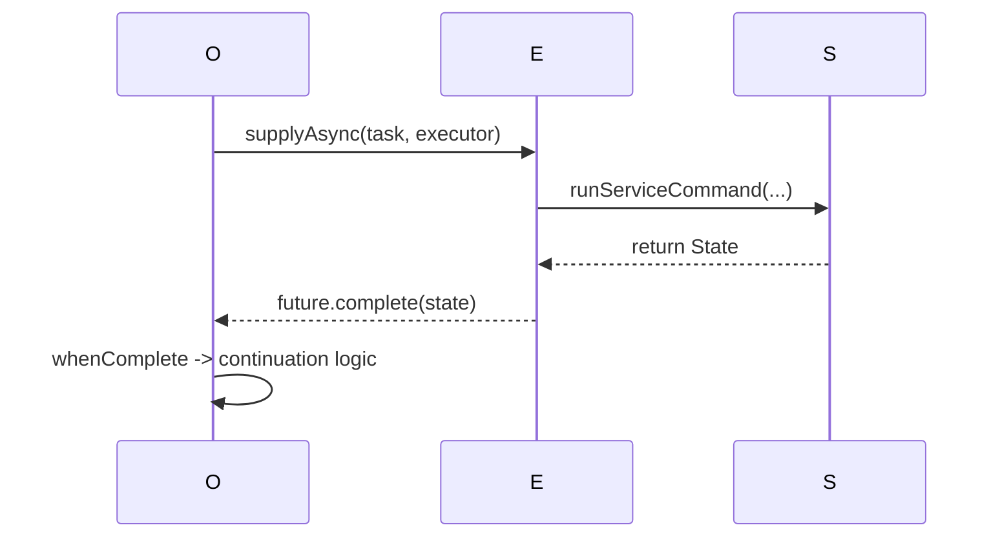
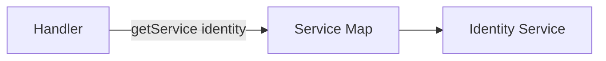
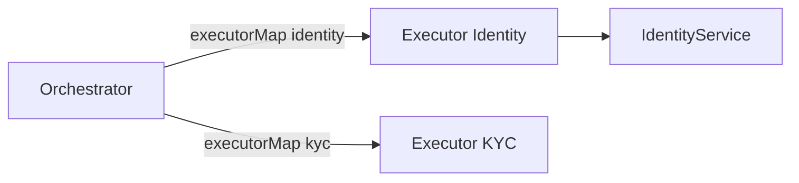
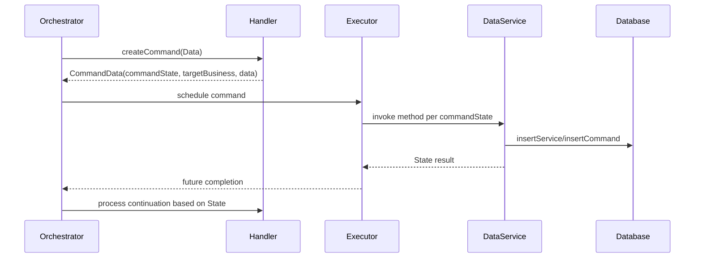
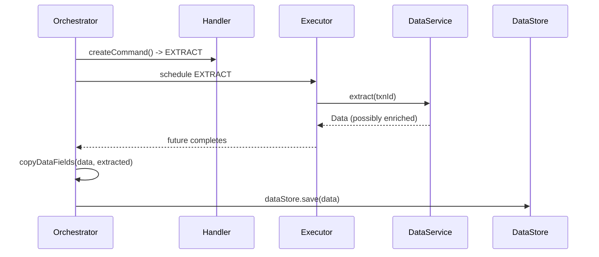
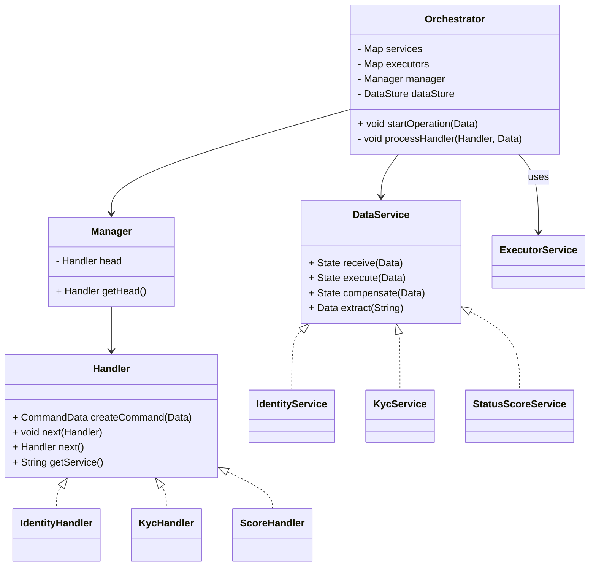

# Distributed SAGA Orchestrator — README

---

## Quick overview

This repository implements a compact, hands-on SAGA orchestrator demonstrating durable orchestration ideas in a single-process Spring Boot app. It models multi-step business transactions as chains of _handlers_ (Chain of Responsibility), issues _commands_ (Command pattern) with explicit _command states_, and drives business-side service stubs asynchronously via `CompletableFuture`. The goal is pedagogy: show how orchestration, compensation, idempotency, async execution, and simple operational concerns (retries, manual remediation) are implemented and instrumented in a developer-friendly codebase.

Key teaching points:

- Command + State + Chain-of-Responsibility (CoR) composition.

- Asynchronous step execution using `CompletableFuture` and custom `ExecutorService` pools.

- Local enum-driven states for deterministic control flow.

- Service mapping (logical name → `DataService` implementation).

- Dynamic routing of executor thread pools to business handlers.

- Minimal persistence simulation (in-memory `DataStore`, `Database` components) and audit traces.


---

## High-level features

- Declarative chain construction (`Manager`) that wires handlers into a CoR.

- Handler-level command generation (`createCommand`) that advances command state for the handler.

- Asynchronous execution of service operations (`receive`, `execute`, `extract`, `compensate`) via executor pools.

- Out-of-band data extraction (EXTRACT) where handler changes are loaded back into orchestrator context.

- Operator-visible audit via `Database` and `DataStore`.

- Simple error handling: `RETRY`, `ERROR`, `PASS` states flow back into the orchestrator logic.

- Manual observation and control via HTTP endpoints: start saga, query status, fetch stored data.


---

## Folder structure (one-liners)

```
/src/main/java/distributed/saga/
├─ api/Controller.java               # REST HTTP endpoints for start/status/inspect saga
├─ business/                         # Business service implementations (stubs)
│  ├─ IdentityService.java           # Identity domain logic (receive/execute/compensate/extract)
│  ├─ KycService.java                # KYC domain logic
│  └─ StatusScoreService.java        # Risk scoring domain logic
├─ config/
│  ├─ ExecutorConfig.java            # Creates ExecutorService pools (identity, kyc, score)
│  └─ ServiceConfig.java             # Maps logical service keys to DataService beans
├─ core/
│  ├─ IdentityHandler.java           # Handler implementing CoR for identity component
│  ├─ KycHandler.java                # Handler for KYC
│  └─ ScoreHandler.java              # Handler for scoring
├─ data/
│  ├─ Data.java                      # Saga payload / context model
│  ├─ CommandData.java               # Command DTO created by handlers
│  ├─ CommandState.java              # Command state enum (RECEIVE, EXECUTE, EXTRACT, COMPENSATE)
│  └─ State.java                     # Result state enum (PASS, ERROR, RETRY)
├─ database/
│  ├─ Database.java                  # Minimal audit/command logging view (service/command)
│  └─ DataStore.java                 # Concurrent map for persisted saga Data objects
├─ model/
│  ├─ DataService.java               # Interface for business services
│  └─ Handler.java                   # Handler interface for CoR nodes
├─ service/
│  ├─ Manager.java                   # Builds the handler chain (CoR head)
│  └─ Orchestrator.java              # Core orchestration engine
└─ utils/
   └─ Serializer.java                # ID/token generators and small helpers
```

---

## Architectural components — responsibilities (detailed)

- **Controller**: HTTP surface. Accepts `Request`, generates `transactionID`, constructs `Data` and calls `Orchestrator.startOperation()`. Exposes status and stored data endpoints.

- **Orchestrator**: The engine. Traverses the handler chain, requests commands from handlers, schedules service calls asynchronously on per-service executors, applies continuation logic based on result enums, triggers compensations or extract flows, and persists snapshot to `DataStore`.

- **Manager**: Chain builder — wires `IdentityHandler → KycHandler → ScoreHandler`. Returns head of chain for orchestrator traversal.

- **Handler (core.*)**: Implements the CoR node contract. `createCommand(Data)` returns the next `CommandData` for the handler, based on internal `prevCommandState` and `Data.state`. The handler also exposes the logical `service` key used for service lookup.

- **DataService (business.*)**: Domain-specific service stub implementations. Each implements `receive`, `execute`, `compensate`, and `extract`. They simulate latency, failure modes, generate tokens/ids, and write audit entries via `Database`.

- **ExecutorConfig**: Provides a small pool per logical service (identity/kyc/score). The orchestrator schedules asynchronous work onto these pools dynamically based on handler service key.

- **DataStore**: Thread-safe in-memory store representing persisted saga state (for demo purposes).

- **Database**: Small audit map storing the currently active service and command for a given transaction; used by `/saga/status/{id}` to show progress.

- **Serializer**: Helper for token generation, transaction IDs, and simple business functions (risk evaluation).


---

## Class-level diagram (code-like block)

```
Interface: distributed.saga.model.Handler
  + CommandData createCommand(Data data)
  + void next(Handler next)
  + Handler next()
  + String getService()

Class: distributed.saga.core.IdentityHandler implements Handler
  - CommandState prevCommandState
  + createCommand(Data data) : CommandData
  + next() / next(Handler)
  + getService() -> "identity"

Class: distributed.saga.service.Orchestrator
  - Map<String, DataService> services
  - Map<String, ExecutorService> executors
  - Manager manager
  - DataStore dataStore
  + void startOperation(Data initial)
  - void processHandler(Handler handler, Data data)
  - State runServiceCommand(DataService ds, CommandState cs, Data data)

Interface: distributed.saga.model.DataService
  + State receive(Data data)
  + State execute(Data data)
  + State compensate(Data data)
  + Data extract(String id)

Class: distributed.saga.business.IdentityService implements DataService
  - Map<String, Data> database (local stub)
  + receive/execute/compensate/extract implementations
```

---

## Block diagram — component relations (Mermaid)



---

## Control flow — overall sequence (Mermaid sequence diagram)



---

## Techniques used — explanations + control flow diagrams

### 1) Command + State + CoR technique

**What it is (concise):**

- _Command_ = `CommandData` — encapsulates `CommandState` + target service + payload (`Data`).

- _State_ = enums `CommandState` (RECEIVE, EXECUTE, EXTRACT, COMPENSATE) and `State` (PASS, ERROR, RETRY). These drive deterministic flows.

- _CoR_ = `Handler` chain (`IdentityHandler`, `KycHandler`, `ScoreHandler`) that produces the next `CommandData` for that logical service.


**How it maps to code:**

- Each `Handler` keeps `prevCommandState` and returns the next `CommandData` based on `Data.state` and previous progress.

- Orchestrator asks `handler.createCommand(data)` and schedules the resulting command.

- The `CommandState` value drives which method on `DataService` will be invoked (`receive`, `execute`, `extract`, or `compensate`).


**Mermaid block (Command + State control flow):**



### 2) Asynchronous calling with CompletableFuture

**What it is (concise):**

- The orchestrator schedules service calls asynchronously using `CompletableFuture.supplyAsync(..., executor)` so each business step executes on a dedicated `ExecutorService`. This avoids blocking orchestrator threads and allows concurrent handling of many sagas.


**How it maps to code:**

- `Orchestrator.processHandler` builds a `CompletableFuture` that calls `runServiceCommand(ds, cs, data)` on the configured executor.

- `whenComplete` callback inspects the result or exception and triggers continuation logic (next handler / compensation / retry).


**Sequence (Mermaid):**



**Notes on semantics:**

- Exceptions inside the worker thread propagate to `whenComplete` via `ex`. Orchestrator handles them by setting `Data.state = ERROR` and re-invoking handler logic.

- `CompletableFuture` provides a simple future/promises abstraction: non-blocking, composable, and integrates with executor pools.


### 3) Global and local enums — deterministic control

**Why enums:**

- Enums (`CommandState`, `State`) centralize the protocol that handlers and services follow. They ensure the orchestrator and handlers are aligned about what each phase means.


**Usage mapping:**

- `CommandState.RECEIVE` → DataService.receive()

- `CommandState.EXECUTE` → DataService.execute()

- `CommandState.EXTRACT` → DataService.extract()

- `CommandState.COMPENSATE` → DataService.compensate()


### 4) Service mapping (logical name → DataService)

**What:**

- A `Map<String, DataService>` bean (wired by `ServiceConfig`) decouples handler logical names from implementations. This allows test-time substitution and simple service discovery in this demo.


**Mermaid snippet:**



### 5) Dynamic routing of executor thread pools

**What it achieves:**

- Different services may have different performance shapes. `ExecutorConfig` provides a dedicated `ExecutorService` per logical service. The orchestrator routes a handler’s command execution to the executor selected by service key.


**How it maps to code:**

- `executors.get(handler.getService())` yields the right pool.

- `CompletableFuture.supplyAsync(..., exec)` runs the service call on that pool.


**Mermaid:**



---

## Sequence diagrams for unique techniques (detailed)

### A. CoR-driven Command generation sequence



### B. EXTRACT flow (state update + data merging)



---

## Operational notes and design rationale

- **In-memory stores (`DataStore`, `Database`)** are intentionally minimal: they demonstrate the concept without operational complexity. In real deployments, replace with durable store (Postgres, Cassandra).

- **Executors per service** demonstrate how to isolate scheduling pressure across services. This maps to per-service thread pools, or to containerized autoscaling in distributed deployments.

- **Idempotency and fencing** are lightly simulated via service-level maps. Real systems must use persisted idempotency tokens or unique constraints.

- **Error handling**: `State.RETRY` is a deliberate explicit outcome. Currently the orchestrator simply re-invokes handler logic immediately; in a production design this would be backed by backoff/retry, a retry budget, and an intent/outbox pattern.

- **Compensation**: `COMPENSATE` flows are generated by handlers when `Data.state == ERROR`. The framework executes compensation steps in the same CoR via the same command generation logic (handlers switch to COMPENSATE). This demonstrates a simple compensating strategy.

- **Observability**: `Database.insertService` and `insertCommand` provide ephemeral audit traces visible via `/saga/status/{id}`. In production, use structured logs and metrics exporters.


---

## How to extend & productionize (recommendations)

1. **Persistence**: Replace `DataStore` and `Database` with a persistent intent store (Postgres + outbox pattern). Persist saga state, history, and outbox records in a single transactional operation.

2. **Outbox + Relay**: Implement outbox rows and a relay to publish commands to Kafka; workers consume and emit events. Orchestrator should subscribe to events to progress the saga.

3. **Idempotency**: Persist idempotency keys and use DB unique constraints to fence duplicate operations.

4. **Retry & Backoff**: Implement exponential backoff with jitter for `RETRY`. A retry budget per saga or per step prevents infinite retries.

5. **Circuit breakers & Heath**: Add per-service circuit breakers and a healing probe to avoid thrashing.

6. **Operator UI**: Build a simple UI for manual compensation, inspection, and remediation (uses audit trails stored durably).

7. **Metrics & Tracing**: Integrate Micrometer + Prometheus and OpenTelemetry to capture latency, retry counts, and end-to-end traces.


---

## Example control flow summary (short)

1. Client calls `POST /saga/task` → `Controller` builds `Data` and calls `Orchestrator.startOperation()`.

2. `Orchestrator` obtains `Handler head` from `Manager`, asks handler for `CommandData`.

3. `Orchestrator` schedules command execution on the `ExecutorService` mapped to the handler’s service key.

4. `DataService` executes the step (simulate latency/failure), writes audit to `Database`, and returns `State`.

5. `CompletableFuture.whenComplete` receives result and `Orchestrator` either:

    - advances to the next command in the same handler (RECEIVE → EXECUTE → EXTRACT),

    - calls compensate logic (ERROR → COMPENSATE), or

    - moves to next handler after EXTRACT / PASS.

6. `DataStore.save()` persists the context at EXTRACT points.


---

## Mermaid class diagram (compact)



---

## Example requests and responses (HTTP)

**Start saga**

```http
POST /saga/task
Content-Type: application/json

{ "user": "Alice", "aadhar": "123456", "age": 28 }
```

Response:

```json
{
  "transactionID": "task1",
  "link": "http://localhost:8000/status/task1"
}
```

**Check status**

```
GET /saga/status/task1
```

Response (Output DTO):

```json
{
  "transactionID": "task1",
  "currentService": "identity",
  "currentCommand": "RECEIVE"
}
```

**Retrieve stored data**

```
GET /saga/task/task1
```

Response: serialized `Data` object saved into `DataStore`.

---

## Summary & closing

This implementation is intentionally compact and educational. It demonstrates the orchestration core required for SAGA-style distributed transaction coordination:

- use **Command + State + CoR** to model step progression,

- schedule asynchronous work via `CompletableFuture` and per-service `ExecutorService` pools,

- implement explicit **RETRY / ERROR / COMPENSATE / EXTRACT** transitions driven by enums,

- map logical handler keys to real service implementations via a service map,

- provide minimal audit and storage to make flows observable and reproducible.


Next steps (recommended): add persistent intent store and outbox, move service calls to independent worker processes (Kafka consumers), add idempotency tokens persisted in DB, and build a reconciliation service to detect outbox/event mismatches. These incremental changes convert the learning prototype into a production-grade orchestration platform.

---
