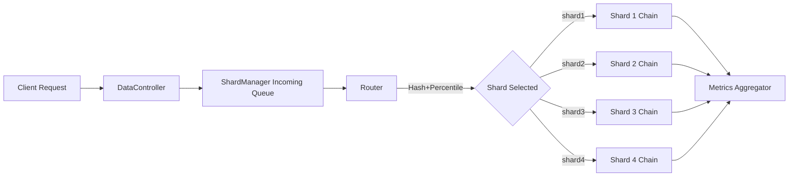
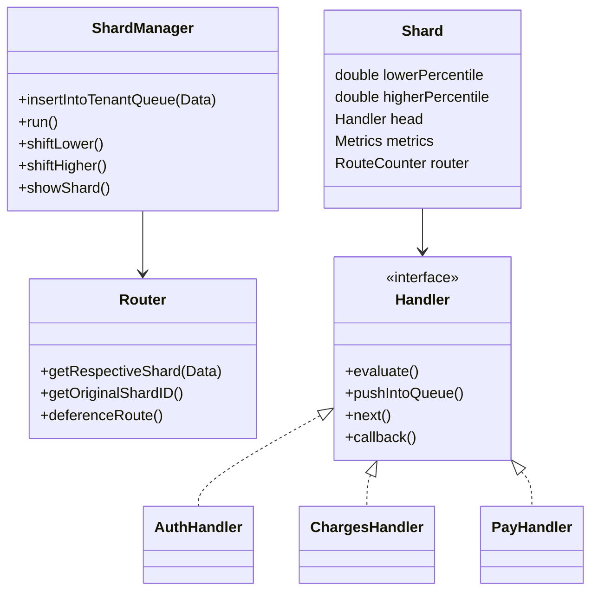
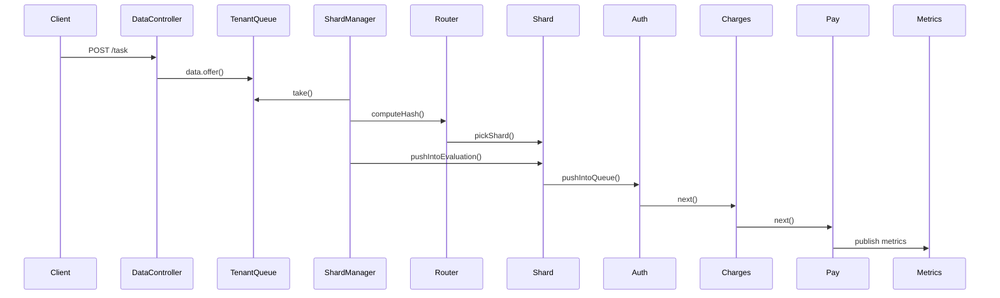
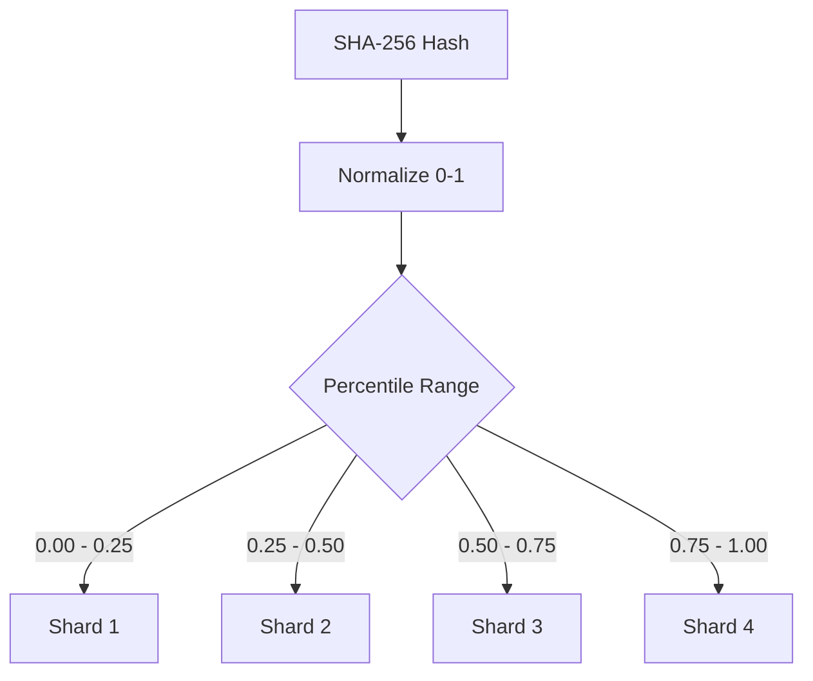
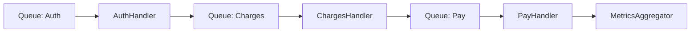
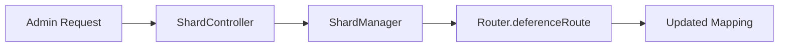

# *Sharded Routing Fabric*

_A comprehensive architectural walkthrough, design rationale, diagrams, abstractions, and control-flow specification._

---

# **1. Overview**

This system implements a **Deterministic Sharded Routing Fabric** where incoming tasks are routed to specific shard-local processing pipelines based on a **percentile-based hash range**. Each shard operates an independent **Chain of Responsibility** pipeline (Auth → Charges → Pay), backed by non-blocking queues, thread pools, and asynchronous execution. The routing layer ensures stable placement, predictable throughput, and distribution fairness.

This document provides a complete technical reference:

- Detailed folder structure with per-class purpose

- Mermaid class and block diagrams

- Routing flow, shard selection logic, and processing lifecycle

- Techniques used: deterministic routing, shard manager threading, parallel handler chains

- Explanations of abstractions, design principles, components, observability, and system interactions


---

# **2. Architecture Summary**

### **Core Concepts**

|Concept|Explanation|
|---|---|
|**Deterministic Hashing**|Each transaction ID is hashed via SHA-256 and normalized to a percentile (0–1).|
|**Percentile-Based Routing**|Hash value is compared to shard percentile boundaries to choose the shard.|
|**Shard Manager**|Threaded coordinator that polls incoming tasks and routes them to shard-local chains.|
|**Handler Chains**|Each shard has a pipeline: Auth → Charges → Pay, implemented using Chain of Responsibility.|
|**Metrics Aggregation**|Each handler publishes metrics (load, time, hash distribution).|
|**Re-routing**|Tasks can be manually redirected to another shard via administrative APIs.|

---

# **3. High-Level Block Diagram**



---

# **4. Folder Structure with One-Line Descriptions**

```
fabric/
 ├─ sharding/
 │   ├─ api/
 │   │   ├─ DataController.java        // Accepts tasks; pushes to ShardManager queue
 │   │   └─ ShardController.java       // Admin operations: routing tweaks, metrics
 │   │
 │   ├─ config/
 │   │   ├─ ChainConfig.java           // Builds handler chains per shard
 │   │   ├─ RouteConfig.java           // Maps shardID -> Shard beans
 │   │   └─ ShardConfig.java           // Defines shard percentile boundaries
 │   │
 │   ├─ core/
 │   │   ├─ AuthHandler.java           // Handler 1: Authentication logic
 │   │   ├─ ChargesHandler.java        // Handler 2: Charge calculation
 │   │   ├─ PayHandler.java            // Handler 3: Payment execution
 │   │   └─ Shard.java                 // Shard abstraction (range + metrics + chain)
 │   │
 │   ├─ data/
 │   │   ├─ Data.java                  // Payload object for processing
 │   │   ├─ MetricData.java            // Metrics DTO
 │   │   ├─ Metrics.java               // Aggregated metrics storage
 │   │   ├─ RouteCounter.java          // Tracks hash distribution per shard
 │   │   └─ Table.java                 // Shard metrics view model
 │   │
 │   ├─ model/
 │   │   ├─ AbstractQueue.java         // Bounded queue used by handlers
 │   │   └─ Handler.java               // Chain-of-responsibility contract
 │   │
 │   ├─ router/
 │   │   └─ Router.java                // Hashing + percentile routing + manual dereference
 │   │
 │   ├─ service/
 │   │   ├─ MetricsAggregator.java     // Consumes metric events from handlers
 │   │   └─ ShardManager.java          // Core orchestrator/dispatcher thread
 │   │
 │   ├─ utils/
 │   │   └─ ShaHasher.java             // SHA-256 hashing + normalization
 │   │
 │   └─ ShardingApplication.java        // Spring Boot entry point
```

---

# **5. Core Design Techniques Explained**

## **5.1 Deterministic Percentile-Based Routing**

The transaction ID is hashed via SHA-256 → converted to a long → normalized to a percentile:

```java
double normalized = hasher.hashToLong(id) / (Long.MAX_VALUE + 0.0d);
```

Shard selection is range-based:

|Shard|Range|
|---|---|
|shard1|0.00 → 0.25|
|shard2|0.25 → 0.50|
|shard3|0.50 → 0.75|
|shard4|0.75 → 1.00|

**Advantages**:

- Consistent and predictable routing

- Low computational overhead

- Zero external state required

- Easy rebalancing by adjusting ranges


---

## **5.2 Shard Manager Thread**

The `ShardManager` runs a dedicated thread:

```java
public void run() {
    while(true) {
        Data data = tenantQueue.take();
        Shard shard = getRespectiveShard(data);
        shard.pushIntoEvaluation(data);
    }
}
```

### **What this achieves**

- Decouples API thread from routing logic

- Provides natural batching from queue behavior

- Isolates routing behavior for modification


---

## **5.3 Handler Chain (Chain of Responsibility)**

### Flow inside a shard:

```
AuthHandler → ChargesHandler → PayHandler → Metrics
```

### Characteristics:

- Each handler has its own queue

- Each handler processes using an async executor

- Next handler is triggered via pushIntoQueue

- Each is independently observable


---

# **6. Class-Level Mermaid UML Diagram**



---

# **7. Control Flow — Full Processing Lifecycle**



---

# **8. Unique Routing Technique Diagram**

### **Deterministic Routing With Range Mapping**



---

# **9. Component Deep Dive**

## **9.1 Router**

### Responsibilities:

- Hash transaction IDs

- Normalize

- Select shard by ranges

- Store manual re-routings in `deferencedMap`


### Why this matters:

It is the heart of the deterministic placement system.

---

## **9.2 Shard Object**

Each shard bundles:

- Its percentile boundaries

- Its handler chain

- Its metrics

- Its routing counters


This allows each shard to behave like an autonomous logical service.

---

## **9.3 Handler Pipelines**

Each handler:

- Runs in its own thread

- Consumes tasks from its queue

- Produces metrics

- Passes data to next


The pipeline delivers:

- Isolation

- Low contention

- Predictability


---

# **10. Diagram: Handler Pipeline Structure**



---

# **11. Administrative Re-Routing**

### Users can:

- Change shard lower or upper percentile

- Manually override routing for specific transaction IDs




---

# **12. Summary**

This deterministic sharded routing system demonstrates a scalable architectural pattern that exploits:

- **Stable hash-based distribution**

- **Isolation through shard-local pipelines**

- **Asynchronous non-blocking processing**

- **Chain of Responsibility for functional decomposition**

- **Dynamic re-routing for operational control**

- **Decoupled metric aggregation for observability**


It is designed for systems where **fairness, performance isolation, controlled concurrency, and predictable latency** are required. The discipline of deterministic placement ensures repeatability, while the handler chain ensures modular processing.

This documentation can serve as a foundation for extending the system into:

- Weighted rendezvous hashing

- Cross-shard joins

- Hot key spillover

- Dynamic shard migrations

- Kafka-backed distributed sharding
