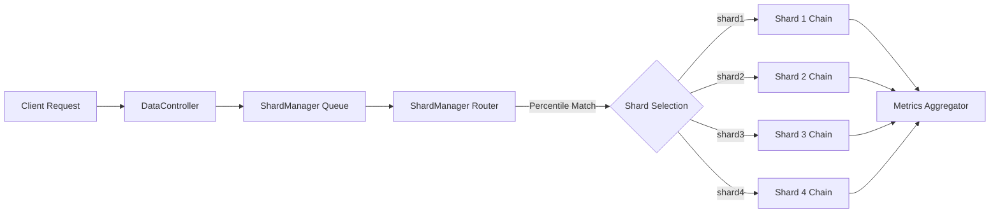
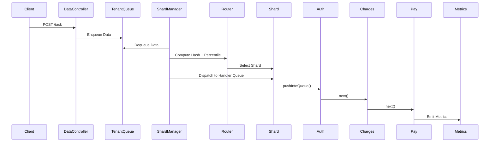

# **Sharded Routing Fabric — Deterministic, Scalable Request Routing**

A modular, extensible **Sharded Routing Fabric** designed to demonstrate deterministic, hash-based request placement across multiple shard-local processing pipelines. Each shard operates an independent **Chain of Responsibility** pipeline (Auth → Charges → Pay), backed by asynchronous execution, bounded queues, and metric aggregation.

This repository provides a clean, generalizable skeleton suitable for:

* distributed systems learning
* scalable request routing
* multi-tenant isolation patterns
* sharded processing pipelines
* operational experimentation (heat visualization, dynamic routing, metrics)

---

## **✨ Key Features**

### **Deterministic Percentile-Based Routing**

Each task is routed to a shard using:

1. SHA-256 hash of transaction ID
2. Normalized percentile value (0 → 1)
3. Range-based shard selection

This ensures:

* stable, predictable placement
* even distribution
* easy shard expansion / rebalancing

---

### **Shard-Local Handler Pipelines (Chain of Responsibility)**

Each shard runs a fully independent processing chain:

```
AuthHandler → ChargesHandler → PayHandler
```

Every handler:

* has a dedicated bounded queue
* runs in its own processing thread
* executes asynchronously
* pushes data to the next handler
* produces load/time metrics

---

### **Asynchronous Shard Manager**

The **ShardManager** is the orchestrator:

* consumes incoming tasks
* computes hash → shard mapping
* dispatches work to shard chains
* supports dynamic routing adjustments

---

### **Metrics Aggregation**

Metrics collected:

* **LOAD** (processed amounts)
* **TIME** (handler-level processing time)
* **HASH** (distribution visualization)

This allows you to track:

* per-shard load
* shard activity
* hash distribution fairness

---

### **Dynamic Routing Controls**

Admin APIs allow:

* rebalancing shard boundaries
* forcing manual reroutes for specific tasks
* introspecting shard metrics

---

## **📁 Folder Structure**

```
fabric/
 ├─ sharding/
 │   ├─ api/                     # REST controllers (Data submission + Admin)
 │   ├─ config/                  # Spring configs (chains, routing, shards)
 │   ├─ core/                    # Shard + Handler implementations
 │   ├─ data/                    # Data models, metrics, counters
 │   ├─ model/                   # Handler abstraction + queue base class
 │   ├─ router/                  # Percentile-based routing logic
 │   ├─ service/                 # Shard manager + metrics aggregator
 │   ├─ utils/                   # SHA-256 hashing utilities
 │   └─ ShardingApplication.java # Application entry point
```

---

## **🧩 High-Level Architecture**



---

## **🛠 Control Flow (End-to-End)**



---

## **🧠 Core Techniques Used**

### **1. Deterministic Routing**

Mapping request → shard using:

* SHA-256 hashing
* percentile normalization
* configurable shard boundaries

Ensures **consistent placement** and **fair distribution**.

---

### **2. Chain of Responsibility**

Every shard uses a micro-pipeline:

* handlers are linked dynamically
* each handler owns its queue & executor
* each processing step is isolated

---

### **3. Asynchronous Orchestration**

ShardManager runs continuously:

* pulls tasks from global queue
* computes routing
* pushes to shard-local queues

---

### **4. Observability**

Each handler publishes:

* load metrics
* time metrics
* hash distribution metrics

Stored in:

```
Shard.metrics
Shard.router.routes
```

---

## **⚙️ Running the Application**

Requires:

* Java 17+
* Maven
* Spring Boot

Start with:

```bash
mvn spring-boot:run
```

API Endpoints:

| Endpoint                        | Method | Description              |
| ------------------------------- | ------ | ------------------------ |
| `/shard-fabric/task`            | POST   | Submit a single task     |
| `/shard-fabric/multiple-task`   | POST   | Submit a batch of tasks  |
| `/shard/route/lower`            | POST   | Update shard lower bound |
| `/shard/route/higher`           | POST   | Update shard upper bound |
| `/shard/reroute/{task}/{shard}` | PUT    | Force manual reroute     |
| `/shard/get/{shardID}`          | GET    | View shard metrics       |
| `/shard/getAll`                 | GET    | List all shards          |

---

## **📊 Shard Introspection**

Each shard displays:

* boundaries
* load
* activity (processing time accumulation)
* hash distribution heatmap

Example:

```
{
  "lowerBoundary": 0.25,
  "upperBoundary": 0.50,
  "load": 13455.0,
  "activeTime": 11890,
  "channels": {
     0.3124: 5,
     0.3388: 7
  }
}
```

---

## **📦 Extending This Project**

This skeleton is intentionally **extensible**, allowing future enhancements:

### Possible extensions:

* Weighted Rendezvous Hashing
* Hot-key spillover workers
* Shard migration coordinator
* Consistent hashing ring
* Kafka-backed distributed routing
* Per-tenant quotas
* Dynamic autoscaling

---

# **📘 Summary**

This repository offers a **clean, production-minded template** for building scalable, deterministic routing systems with shard-local pipelines. The design balances simplicity with correctness and lays groundwork for advanced patterns like sharded microservices, distributed routing fabrics, and multi-tenant fairness algorithms.

It is ideal for:

* system design practice
* learning sharding architectures
* studying pipeline concurrency models
* building distributed primitives
