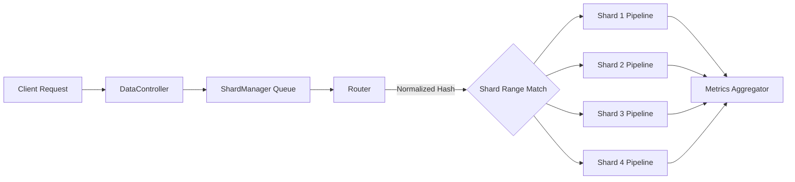
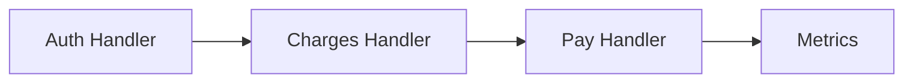
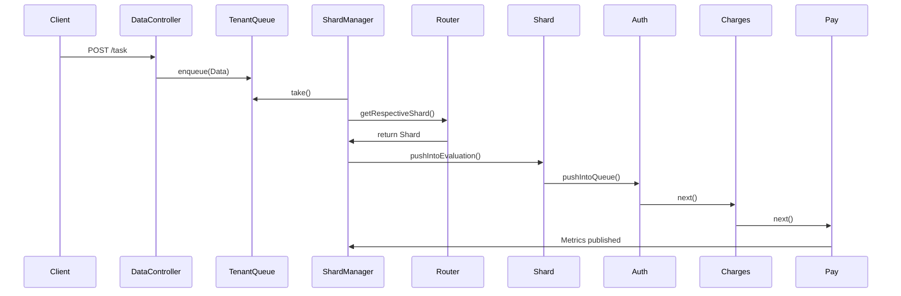

# **Sharded Routing Fabric**

A modular, extensible, and production-inspired **Sharded Routing Fabric** designed to demonstrate deterministic routing, shard-local execution pipelines, and scalable distributed processing patterns.
This repository contains the **base skeleton** (the common core) along with phase-wise incremental implementations that progressively introduce advanced features like hot-key mitigation, spillover routing, coordinated shard migration, Kafka-backed event pipelines, and distributed shard managers.

---

# **📌 What Is a Sharded Routing Fabric?**

A **Sharded Routing Fabric** is a routing architecture where incoming tasks or requests are deterministically placed onto one of many **shards** (independent processing units). Each shard owns:

* A percentile range
* Its own handler pipeline (Chain-Of-Responsibility)
* Metrics and routing counters
* Independent concurrency via local queues/executors

This enables:

* Predictable routing
* Reduced contention
* Horizontal scalability
* Per-shard specialization
* Operational isolation

---

# **🧠 Core Idea of This Repository**

This repository provides a skeleton implementation demonstrating:

### **1. Deterministic Percentile-Based Routing**

Every request is hashed → normalized [0,1] → routed into a deterministic percentile bucket.

### **2. Shard-Local Handler Chains**

Each shard runs:

```
Auth → Charges → Pay
```

Using async execution + non-blocking queues.

### **3. Threaded Shard Manager**

A dedicated manager thread continuously:

1. Polls inbound tasks
2. Selects correct shard
3. Pushes tasks to that shard’s pipeline

### **4. Extensible Shard Definitions**

Shard boundaries can be:

* Adjusted
* Reconfigured
* Extended to new shards

### **5. Clear Separation of Concerns**

* **API Layer** → ingestion + admin ops
* **Routing Layer** → hashing + mapping
* **Shard Layer** → independent pipeline
* **Metrics Layer** → aggregation + monitoring

---

# **📂 Repository Structure**

```text
sharded-routing-fabric/
│
├── skeleton/                     # Base implementation (Phase A foundation)
│   ├── api/                      # Inbound API controllers
│   ├── config/                   # Shard/Chain/Router configuration
│   ├── core/                     # Shard + Handler pipeline implementations
│   ├── data/                     # DTOs, metrics, route counters
│   ├── model/                    # Abstract queue + handler interface
│   ├── router/                   # Deterministic hash-based routing engine
│   ├── service/                  # ShardManager + MetricsAggregator
│   ├── utils/                    # Hashers and additional helpers
│   └── ShardingApplication.java  # Spring Boot Entry
│
├── phaseA/                       # Phase 1: Deterministic Routing + Shard Chains
├── phaseB/                       # Phase 2: Hot-key mitigation + Spillover + Joins
├── phaseC/                       # Phase 3: Distributed Routing, Kafka, Migrations
└── README.md
```

---

# **📜 Sharded Routing Fabric — Conceptual Diagram**



---

# **🔧 Key Architectural Features**

## **Deterministic Routing**

Implemented via SHA-256 hashing:

```java
normalized = hashToLong(id) / Long.MAX_VALUE;
```

Mapped to shard ranges:

| Shard  | Range       |
| ------ | ----------- |
| shard1 | 0.00 → 0.25 |
| shard2 | 0.25 → 0.50 |
| shard3 | 0.50 → 0.75 |
| shard4 | 0.75 → 1.00 |

This ensures stable, predictable distribution without shared state.

---

## **Shard Manager**

A continuously running thread:

* polls task queue
* computes shard
* forwards data to shard pipeline

This pattern:

* avoids API blocking
* allows batching via queue backpressure
* decouples routing from core app threads

---

## **Sharded Handler Chains**

Each shard’s execution flow:



Every handler:

* owns its own queue
* runs in its own thread
* executes async internal logic

---

## **Manual Rerouting**

Admin can override routing for specific transactions:

* Useful for debugging
* Useful for controlled failover
* Useful for shard warm-up

---

# **📘 Phase-wise Implementations**

Below is a table linking each phase folder—each representing a progressively advanced version of the Sharded Routing Fabric.

| Phase       | Folder Link | Description                       | Key Additions                                                                         |
| ----------- | ----------- | --------------------------------- | ------------------------------------------------------------------------------------- |
| **Phase A** | `/phaseA`   | Base deterministic routing fabric | Percentile routing, sharded CoR pipelines, shard manager                              |

---

# **📘 Detailed Breakdown of the Skeleton (Common Base)**

## **1. API Layer**

### `DataController`

* Accepts single/multiple tasks
* Converts into `Data` objects
* Enqueues into `ShardManager`

### `ShardController`

* Allows percentile updates
* Allows manual rerouting
* Exposes shard metrics

---

## **2. Routing Layer**

### `Router`

Responsible for:

* SHA-256 hashing
* Normalization
* Selecting correct shard via percentile boundaries
* Supporting custom reroute overrides (deferenced routing)

---

## **3. Shard Layer**

### `Shard`

Bundles:

* Percentile boundaries
* Handler chain head
* Local metrics and distribution counters

---

## **4. Handler Layer**

Each handler inherits from `AbstractQueue`, providing:

* queue
* active element counter
* controlled throughput

Handlers:

* `AuthHandler`
* `ChargesHandler`
* `PayHandler`

Each implements:

* async evaluate logic
* metrics emission
* next pointer to form the chain

---

## **5. Metrics Layer**

### MetricsAggregator

Consumes metrics published by handlers via injected `BiConsumer`.

Each metric includes:

* load
* time
* hash distribution

---

# **📊 Control Flow (Detailed)**



---

# **🎯 Goal of This Repository**

This implementation is designed as a **learning and demonstration framework** for:

* Scalable sharded architectures
* Deterministic routing strategies
* Chain of Responsibility pipeline engineering
* Load isolation through shard segmentation
* Practical observability design
* Reroute + rebalance fundamentals
* Foundation to build advanced phases: distributed shards, Kafka routing, etc.

---

# **🏁 Summary**

This repository presents a **complete, extensible, and production-inspired skeleton** for a Sharded Routing Fabric system. The deterministic routing model, parallel shard-local pipelines, and clear separation of responsibilities make this design ideal for:

* High-performance multi-tenant platforms
* Stateful workloads needing affinity
* Distributed request processing
* Systems that require horizontal scalability models
