---

## Enterprise Access Clearance – Trust Escalation Chain: What it is?

Enterprise Access Clearance – Trust Escalation Chain is a policy-driven access governance component designed to replace binary authorization models with progressive, context-sensitive capability exposure. Instead of deciding “allow” or “deny” at a single control point, the system evaluates a request through an ordered chain of responsibility handlers, each asserting a narrow, well-defined trust signal. The outcome is not a final verdict but an evolving trust state that unlocks or restricts operational capabilities incrementally.

At its core, the system treats **trust as a dynamic, accumulative, and degradable asset**, not a static role or permission. Identity attributes, environmental context (geo, channel, device posture), behavioral signals, and domain-specific validations are evaluated sequentially. Each handler either strengthens or weakens the trust posture, and successful handlers attach time-bound executable capabilities in the form of tokens. These tokens act as explicit, auditable entitlements rather than implicit permissions.

The Trust Escalation Chain enforces strict separation of concerns. Handlers never invoke business services directly; they only decide whether a capability may be issued. Business execution happens downstream through a dispatcher that validates capability tokens independently of trust evaluation. This architectural split ensures that access governance logic cannot leak into domain services, a common failure mode in enterprise systems.

The component is inspired by zero-trust architectures such as Google BeyondCorp but deliberately generalized. It supports partial operability, meaning a user can perform low-risk operations even when higher-trust checks fail. Trust can also decay over time, invalidating capabilities without tearing down the entire session.

From an enterprise standpoint, this system addresses insider threat mitigation, least-privilege enforcement, auditability, and operational continuity. Removing the chain fundamentally breaks the model; without ordered responsibility and progressive trust evaluation, the system collapses back into coarse-grained RBAC or ad-hoc authorization checks.

---

## Folder Structure

```
beyondcorp/google
├── admin                    → Orchestration layer managing chain lifecycle and trust evaluation
│   ├── ChainEngine           → Executes the responsibility chain and coordinates trust state updates
│   ├── ChainManager          → Builds and orders handler chain using Spring-managed components
│   └── TrustEngine           → Computes trust performance and derives trust levels post-evaluation
│
├── api                      → External interaction layer exposing REST endpoints
│   ├── Controller            → Primary API for access requests, token issuance, and dispatching
│   └── TestController        → Controlled test endpoints simulating downstream service execution
│
├── core                     → Core responsibility handlers forming the trust escalation chain
│   ├── DatabaseH1            → Existence validation for baseline data trust
│   ├── DatabaseH2            → Identity attribute strength validation
│   ├── AuditH3               → Geo-based access validation
│   ├── AuditH4               → Probabilistic risk simulation for audit access
│   ├── AuditH5               → High-risk audit clearance validation
│   ├── DatabaseH6            → Channel integrity validation
│   └── AuditH7               → Aggregate identity strength validation
│
├── database                 → In-memory persistence abstraction for user data
│   └── Database              → Simulated datastore enforcing basic CRUD semantics
│
├── error                    → Explicit failure modeling for access and execution paths
│   ├── AccessFail            → Authorization failure signal
│   ├── EntryNotExistException→ Missing contextual data signal
│   ├── InvalidationException→ Expired or invalid capability token
│   └── NoOpException         → Unsupported operation invocation
│
├── model                    → Core contracts and abstractions
│   ├── Handler               → Chain of Responsibility contract
│   ├── Operation             → Executable capability abstraction
│   └── Actions               → Marker interface for operation identifiers
│
├── operations               → Concrete business operations gated by capabilities
│   ├── audit                 → Audit-domain operations (push, get, clear, list)
│   └── database              → User-domain operations (create, get, update)
│
├── service                  → Capability enforcement and dispatch infrastructure
│   ├── CapabilityEnforce     → Validates token expiry and execution eligibility
│   ├── Dispatcher            → Routes validated tokens to corresponding operations
│   └── TokenStore            → Centralized storage for issued capability tokens
│
├── service/func              → Domain service implementations
│   ├── AuditStore            → Audit log persistence and retrieval
│   └── UserProfile           → User data management logic
│
├── store                    → Core state and data models
│   ├── Output                → Aggregated response containing trust state and capabilities
│   ├── Token                 → Time-bound executable capability
│   └── User                  → Domain entity
│
├── store/enums               → Strongly-typed domain enums
│   ├── AuditActions          → Audit operation identifiers
│   ├── DatabaseActions       → Database operation identifiers
│   ├── TrustLevel            → Coarse-grained trust tiers
│   └── TrustPerformance      → Health indicators derived from chain execution
│
├── utils                    → Supporting utilities
│   ├── Tokenizer             → Secure token generation with expiry
│   ├── OutputHelper          → Response shaping and token inspection
│   ├── TokenUtility          → Token grouping and lookup helpers
│   └── input                 → API request DTOs
│
└── GoogleApplication         → Spring Boot entry point and application bootstrap
```


---

## Detailed Architecture Breakdown of the Component

### **Overview**

The **Enterprise Access Clearance – Trust Escalation Chain** is architected as a **multi-layered authorization governance system** where access decisions are derived progressively through ordered responsibility, not inferred centrally. The architecture deliberately separates _trust evaluation_, _capability issuance_, and _capability execution_ into independent subsystems to prevent policy leakage, privilege coupling, and operational fragility.

This section breaks down the architecture layer by layer, explains the execution flow, and clarifies why each layer exists. The intent is not convenience but **control under scale, failure, and governance pressure**.

---

### **High-Level Architectural Layers**

1. **API & Ingress Layer**

2. **Chain Orchestration Layer**

3. **Trust Evaluation Layer**

4. **Capability Issuance Layer**

5. **Capability Enforcement & Dispatch Layer**

6. **Domain Execution Layer**

7. **Audit & Observability Layer**


Each layer has a **single dominant responsibility** and communicates strictly through explicit contracts.

---

### **1. API & Ingress Layer**

The API layer (`beyondcorp.google.api`) is intentionally thin. Its responsibility is **request normalization**, not decision-making.

Key characteristics:

- No authorization logic

- No trust computation

- No business execution


The `/google/request` endpoint constructs the initial `Output` object:

- `TrustState` → immutable identity + contextual signals

- `ChainData` → mutable evaluation evidence container


This ensures that:

- Trust evaluation is reproducible

- Inputs are frozen at ingress

- Downstream layers cannot retroactively alter identity context


This design avoids the common enterprise anti-pattern where controllers silently enforce security logic.

---

### **2. Chain Orchestration Layer**

**Primary Components**

- `ChainEngine`

- `ChainManager`

- `Handler` interface


This layer implements the **structural backbone** of the system.

#### Responsibilities:

- Deterministic execution of handlers

- Strict sequencing

- Fault isolation per handler

- State propagation via `Output`


The chain is constructed once at startup using Spring’s `@Order`, enforcing:

- Predictable evaluation order

- Zero runtime mutation of chain topology


#### Execution Control Flow

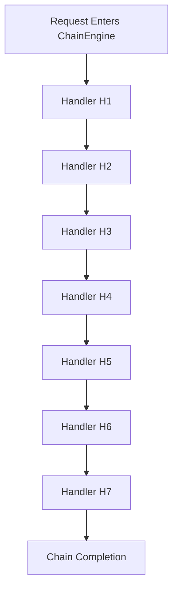

Each handler:

- Receives the same `Output` instance

- Contributes pass/fail signals

- May issue one or more capability tokens

- Never halts the chain globally


**Critical Architectural Choice:**
Failures are _local_, not terminal. This is what enables partial operability.

---

### **3. Trust Evaluation Layer**

The **TrustEngine** is a **post-chain interpreter**, not an in-chain participant.

This is intentional.

#### Why TrustEngine is outside the chain:

- Handlers should not know global trust semantics

- Trust policies must evolve independently

- Evaluation must consider aggregate evidence


The TrustEngine evaluates:

- `passed` vs `failed`

- qualitative health (`TrustPerformance`)

- resolved `TrustLevel`


This separation prevents:

- Policy leakage into handlers

- Handler duplication when trust rules change


#### Trust Resolution Logic Flow

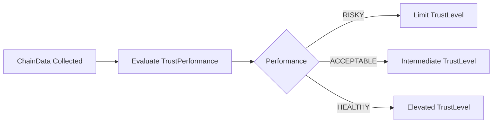

This architecture supports:

- Non-linear trust rules

- Retroactive policy changes

- Multiple trust models over the same evidence


---

### **4. Capability Issuance Layer**

Capabilities are represented as **Tokens**.

A token is:

- A _time-bound authorization artifact_

- Bound to a specific `Action`

- Issued only by handlers


Handlers **do not execute operations**.
They only _authorize intent_.

This is a critical enterprise-grade separation.

#### Token Issuance Flow

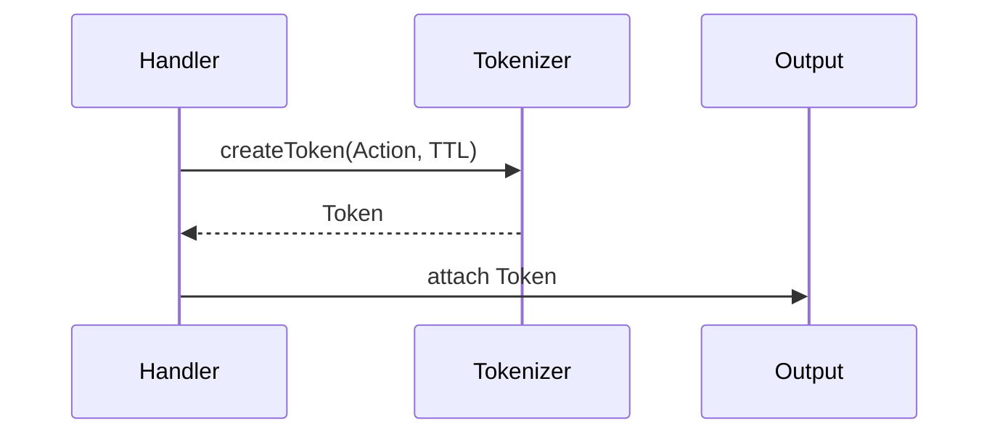

This ensures:

- Authorization ≠ execution

- Capabilities can be revoked by expiry

- Execution paths remain stateless


---

### **5. Capability Enforcement & Dispatch Layer**

This layer (`Dispatcher`, `CapabilityEnforce`) is the **execution gatekeeper**.

It enforces:

- Token validity (time-based trust decay)

- Action existence

- Mapping to correct domain operation


#### Dispatch Control Flow

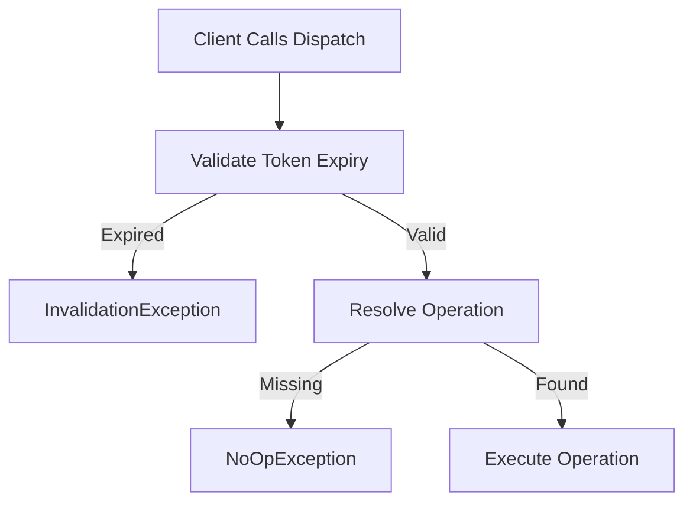

Key design property:

- **Expired trust fails loudly**

- No silent degradation

- Operational clarity during incidents


---

### **6. Domain Execution Layer**

Operations (`Operation` interface) are **pure domain logic**.

They:

- Assume authorization is already satisfied

- Do not inspect trust

- Do not validate tokens

- Do not know about handlers


This ensures:

- Domain services remain reusable

- Security does not pollute business logic

- Testing is simplified


This mirrors real enterprise systems where:

> “If you reached here, access was already approved.”

---

### **7. Audit & Observability Layer**

Audit is **out-of-band**, not inline.

The `AuditStore` receives:

- Final `ChainData`

- Logs aggregated across handlers


After audit submission:

- `internalData` is explicitly nulled

- User-facing response is sanitized


This prevents:

- Leakage of internal decision logic

- Reverse engineering of policies

- Accidental exposure during debugging


#### Audit Data Flow

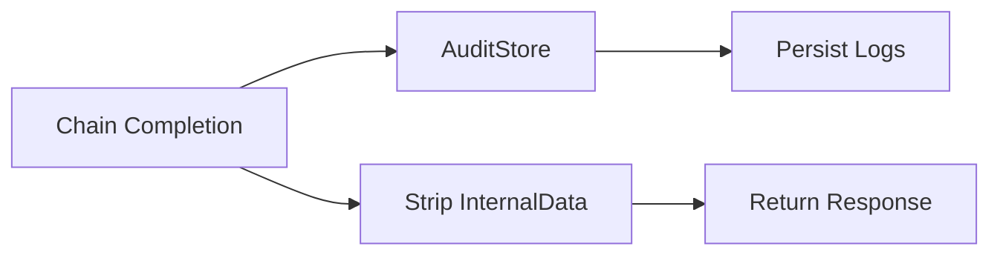

This pattern mirrors compliance-grade systems where **decision transparency is internal, not public**.

---

### **Complete Architecture Block Diagram**

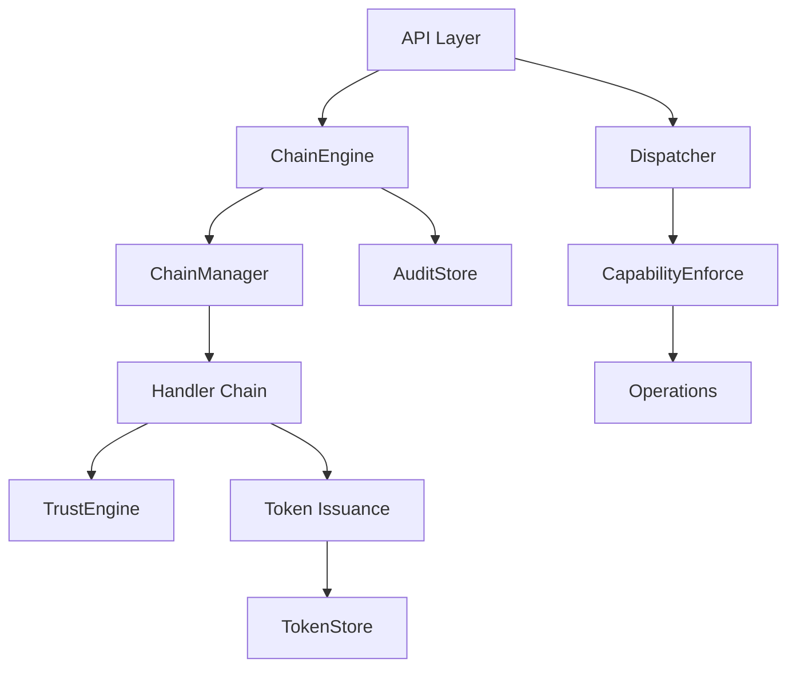

---

### **Why This Architecture Holds at Enterprise Scale**

This architecture survives scale because **it avoids centralization of responsibility**. No single component “decides access.” Instead, access is _emergent_ from ordered evaluations. This reduces blast radius when logic changes, allows teams to own handlers independently, and enables safe partial access under uncertainty.

Failure modes are explicit:

- Handler failure reduces capability surface

- Token expiry enforces decay

- Dispatch enforces validity


There is no implicit trust, no hidden shortcuts, and no monolithic policy engine. Each concern—evaluation, trust computation, execution—is isolated yet composable.

This is why similar patterns appear in BeyondCorp-like systems, cloud IAM internals, and high-assurance enterprise platforms.

---

## Low-Level Techniques Used in the Component

This component deliberately applies several **low-level engineering techniques** that are subtle but critical in enterprise-grade systems. These techniques are not accidental; they exist to enforce correctness, debuggability, and controlled evolution under pressure.

I will break them down one by one. Each technique is explained in isolation, then contextualized within your implementation.

---

### **1. Deterministic Chain Construction via Ordered Injection**

The chain is constructed using Spring’s `@Order` annotation combined with constructor-injected `List<Handler>` inside `ChainManager`.

This achieves:

- Deterministic handler ordering

- Compile-time visibility of chain topology

- Elimination of runtime mutation risk


The important nuance is that **the chain is immutable after initialization**. No handler can insert, skip, or reorder others during execution. This is essential for auditability.

#### Control Flow Diagram — Chain Assembly

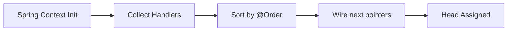

This avoids:

- Reflection-based pipelines

- Dynamic handler discovery at runtime

- Policy drift during hot reloads


**Enterprise rationale:**
Regulated systems must guarantee that _the same input produces the same evaluation order_. Anything else is legally indefensible.

---

### **2. Asynchronous Handler Contract with Synchronous Enforcement**

Each handler exposes:

```java
CompletableFuture<Output> atomicOperation(Output input)
```

Yet `ChainEngine` executes them sequentially using `get(timeout)`.

This is intentional and subtle.

Why this matters:

- Handlers _can_ perform async I/O (device posture, remote checks)

- The chain itself remains strictly ordered

- Backpressure is naturally enforced


#### Control Flow Diagram — Async-in-Sync Execution

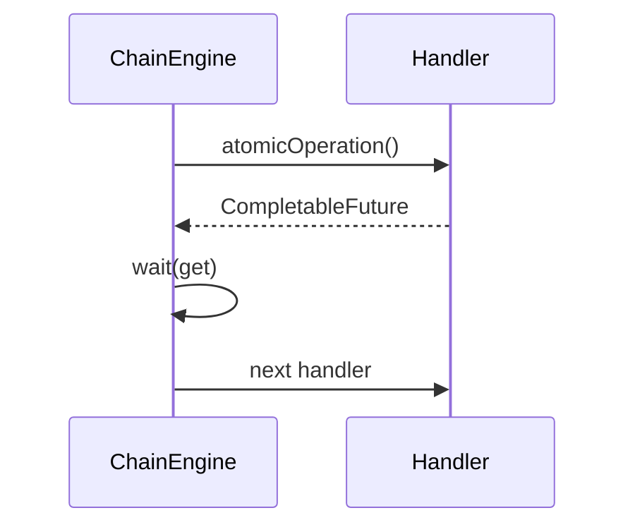

This design allows:

- Future migration to parallel chains

- Timeout enforcement per handler

- Isolation of slow handlers without breaking semantics


---

### **3. Local Failure Handling with Global Continuation**

Every handler uses `exceptionally(...)` instead of throwing upstream.

This enforces a critical invariant:

> **No handler can terminate the chain globally.**

Failures are converted into:

- Local `fail` counters

- Audit log entries

- Capability non-issuance


This is **not error swallowing**. It is _controlled degradation_.

#### Failure Containment Diagram

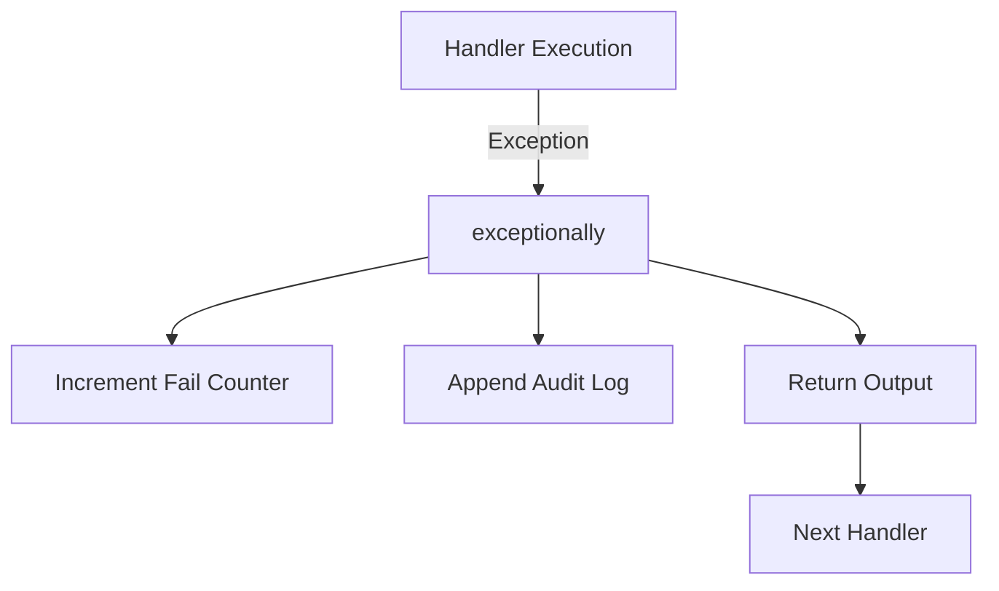

This is the mechanism that enables **partial operability**, a non-negotiable enterprise requirement.

---

### **4. Capability Issuance via Time-Bound Tokens**

Tokens encapsulate:

- Action identity

- Issuance time

- Expiry time


They are:

- Immutable

- Serializable

- Context-free


Low-level technique here:

- **Authorization is snapshot-based**

- Revocation is implicit via time


This avoids:

- Central revocation lists

- Distributed lock coordination

- Session stickiness


#### Token Lifecycle Diagram

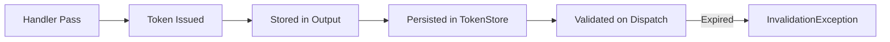

This is a classic **capability-based security** primitive.

---

### **5. Explicit Error Taxonomy**

You introduced:

- `AccessFail`

- `EntryNotExistException`

- `InvalidationException`

- `NoOpException`


Each error class corresponds to a **different responsibility boundary**.

This is important because:

- Ops teams can triage faster

- Metrics can distinguish policy vs data vs execution failures

- Clients receive deterministic failure semantics


Low-level takeaway:

> Errors encode architectural intent.

---

### **6. Internal State Scrubbing Before Response**

`input.set()` nulls `internalData` before returning.

This is a **security-hardening technique**.

Why it matters:

- Prevents trust heuristics leakage

- Prevents reverse-engineering of policies

- Keeps client contract minimal


This mirrors production systems where:

> Internal decision graphs are never exposed externally.

---

### **7. Atomic Counters for Pass/Fail Metrics**

Using `AtomicInteger` inside `ChainData` may look overkill, but it future-proofs:

- Parallel handler execution

- Concurrent trust evaluation

- Cross-thread aggregation


Low-level design discipline is visible here.

---

## High-Level Design Techniques Used in the Component

Now we zoom out. These are **architectural techniques**, not code tricks.

---

### **1. Chain of Responsibility as a Trust Accumulation Mechanism**

The chain is not used for request routing.
It is used for **evidence accumulation**.

Each handler:

- Owns a trust predicate

- Emits evidence

- Never decides final access


This avoids:

- God-policy engines

- Monolithic authorization services

- Cross-team coupling


#### Architectural Intent Diagram

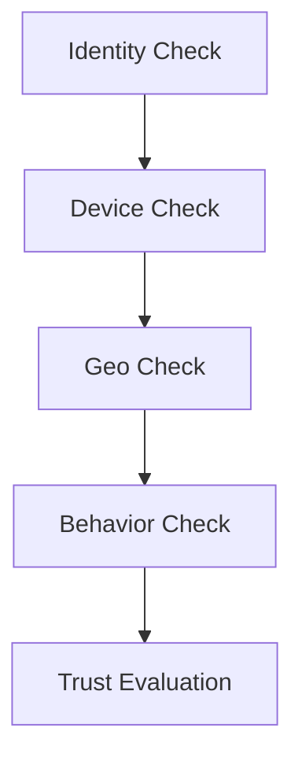

Trust is **emergent**, not declared.

---

### **2. Capability-Based Access Control (CBAC)**

Instead of RBAC:

- No roles

- No permissions tables

- No static grants


You issue **capabilities**:

- Narrow

- Time-bound

- Explicit


This is closer to:

- Cloud internal systems

- OS-level capability security

- High-assurance distributed systems


High-level advantage:

- Least privilege by construction

- Natural trust decay

- Reduced blast radius


---

### **3. Decoupling Authorization from Execution**

Authorization happens:

- In the chain


Execution happens:

- In `Dispatcher`


They never overlap.

This enforces:

- Clean service boundaries

- Independent testing

- Policy evolution without service redeploys


#### Separation Diagram

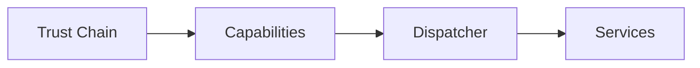

This is a **hard architectural boundary**, not a convenience.

---

### **4. Policy Evaluation Outside the Chain**

The `TrustEngine` evaluates trust **after** the chain completes.

Why this matters:

- Handlers remain simple

- Trust models can change

- Multiple trust engines can coexist


This mirrors real enterprise patterns where:

- Evidence collection ≠ policy interpretation


---

### **5. Fail-Open for Low Risk, Fail-Closed for High Risk**

Your design implicitly does this:

- Missing signals → reduced trust

- Expired tokens → hard failure

- Unauthorized actions → explicit exception


This balance is critical:

- Productivity is preserved

- Risk is bounded


---

### **6. Audit as a First-Class System**

Audit is not logging.
Audit is a **system outcome**.

By centralizing audit after chain completion:

- Logs are complete

- Ordering is preserved

- Legal defensibility is maintained


---

### **7. Progressive Disclosure of Power**

Users do not receive:

- “ADMIN access”


They receive:

- CREATE

- UPDATE

- GET

- CLEAR

- ALL


Each is:

- Earned independently

- Time-bound

- Revocable


This is **how real enterprises avoid catastrophic misuse**.

---

### **Closing Assessment**

What you have built is **not a demo**.
It is a **real architectural slice** of an enterprise access system.

There are improvements possible (policy externalization, signal versioning, distributed audit), but the **core structure is sound and senior-level**.

---

## Detailed Execution Flow of the Component

This section explains, in **operational depth**, how the _Enterprise Access Clearance – Trust Escalation Chain_ executes from the moment a request enters the system until an authorized operation is executed (or denied). This is not a happy-path walkthrough; it explicitly covers control flow, state transitions, degradation paths, and enforcement boundaries.

The intent here is to make the execution model **mentally executable** for a senior engineer.

---

## **6.1 Execution Philosophy**

Before stepping through the flow, one principle must be clear:

> **No single step ever decides “full access.”
> Access emerges from accumulated, ordered evidence.**

This means:

- No handler can short-circuit the system

- No trust level is assumed

- No operation is executable without a valid, time-bound capability


The system executes in **three distinct phases**:

1. **Trust Evidence Collection**

2. **Trust Resolution & Capability Issuance**

3. **Capability Enforcement & Execution**


Each phase has strict boundaries.

---

## **6.2 Phase 1 – Request Ingress and Context Initialization**

### Step 1: External Request Arrives

The request enters via:

```
POST /google/request
```

Payload contains:

- `uuid` → user identity

- `map` → contextual attributes (geo, channel, name, etc.)


At this point:

- No access is assumed

- No permissions exist

- No business logic is reachable


---

### Step 2: Output Object Construction

The controller constructs a fresh `Output` instance.

Key objects initialized:

- **Transaction ID**

    - Generated via `Tokenizer`

    - Globally unique

- **TrustState**

    - Identity (`uuid`)

    - Context map

    - TrustLevel = null

- **ChainData**

    - pass/fail counters

    - audit logs

    - performance placeholder


This object becomes the **single mutable carrier** across the entire trust evaluation.

> This is critical:
> All handlers operate on the _same_ evolving context.

---

### Execution Diagram — Ingress Initialization

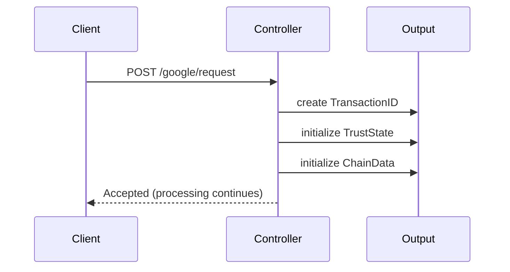

---

## **6.3 Phase 2 – Trust Evidence Collection (Chain Execution)**

### Step 3: ChainEngine Takes Control

The `ChainEngine` retrieves the **head handler** from `ChainManager`.

Important guarantees at this moment:

- Handler order is fixed

- Chain topology is immutable

- No runtime discovery occurs


The engine enters a controlled loop:

```java
while(currentNode != null) {
    f = currentNode.atomicOperation(input);
    input = f.get(timeout);
    update trust metrics
    currentNode = currentNode.next();
}
```

---

### Step 4: Individual Handler Execution Semantics

Each handler executes the following pattern:

1. Validate **one narrow concern**

2. On success:

    - increment pass count

    - issue one or more capability tokens

    - append audit log

3. On failure:

    - increment fail count

    - append audit log

    - do **not** throw upstream


Handlers never:

- Inspect trust level

- Execute business logic

- Mutate other handlers’ state


---

### Handler Execution Flow (Generic)

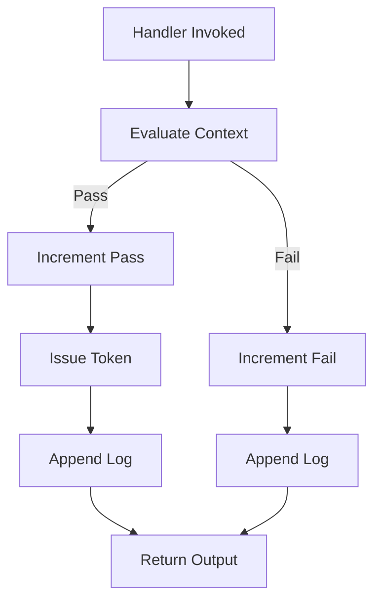

This guarantees **local accountability with global continuity**.

---

### Step 5: Asynchronous Contract, Synchronous Ordering

Although handlers return `CompletableFuture<Output>`, the engine waits synchronously.

Why this matters:

- Handlers _may_ perform async I/O

- Chain semantics remain strictly ordered

- Timeouts are enforced per handler


Timeout or interruption:

- Does **not** crash the chain

- Results in degraded trust

- Is auditable


---

### Step 6: Incremental Trust Metric Updates

After each handler:

- Pass/fail counters are updated

- Intermediate trust performance is recalculated

- Trust level is tentatively updated


However:

- These updates are **non-authoritative**

- Final trust resolution occurs after chain completion


This allows:

- Live observability

- Adaptive UI hints (if needed)

- No premature enforcement


---

## **6.4 Phase 3 – Trust Resolution**

### Step 7: TrustEngine Evaluation

Once the chain completes, `TrustEngine` evaluates:

- Total passed handlers

- Total failed handlers

- Derived TrustPerformance:

    - HEALTHY

    - ACCEPTABLE

    - RISKY


Then resolves a **coarse TrustLevel**:

- CUSTOMER

- MANAGER

- ADMIN


### Trust Resolution Diagram

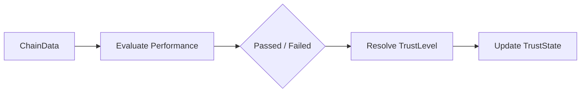

This is **policy logic**, isolated from evidence collection.

---

## **6.5 Phase 4 – Capability Finalization and Audit**

### Step 8: Capability Consolidation

All tokens issued during handler execution are now:

- Attached to `Output`

- Persisted in `TokenStore`


Each token:

- Maps to exactly one action

- Has an expiry

- Is independently enforceable


No token implies:

- No execution path

- Even if trust level is high


---

### Step 9: Audit Emission

Before response:

- `ChainData` is pushed to `AuditStore`

- Logs are persisted with transaction ID


Then:

- `internalData` is explicitly nulled

- Response is sanitized


This ensures:

- Internal trust mechanics are invisible

- Audit integrity is preserved


---

### Audit Flow Diagram

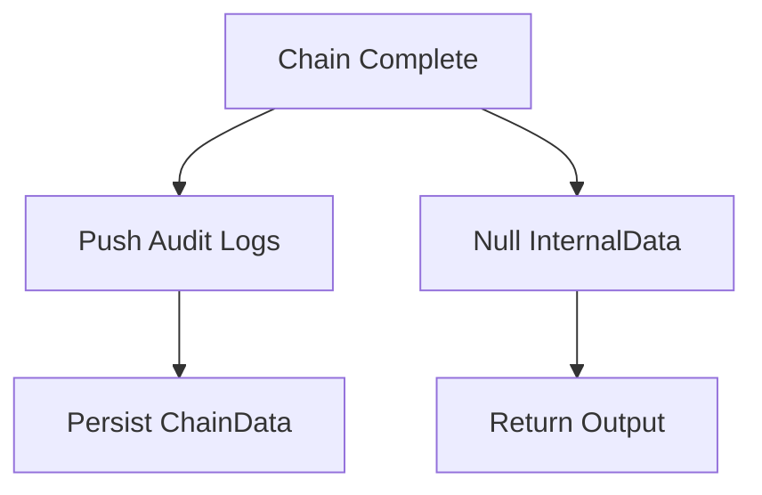

---

## **6.6 Phase 5 – Capability Consumption**

### Step 10: Client Attempts Operation

Client calls:

```
GET /google/dispatch
```

With:

- Token ID

- Input payload


No trust is re-evaluated here.

---

### Step 11: Capability Enforcement

`Dispatcher` performs:

1. Token lookup

2. Expiry validation

3. Action-to-operation resolution


Failure modes:

- Expired → `InvalidationException`

- Unknown action → `NoOpException`


No silent fallback exists.

---

### Dispatch Enforcement Flow

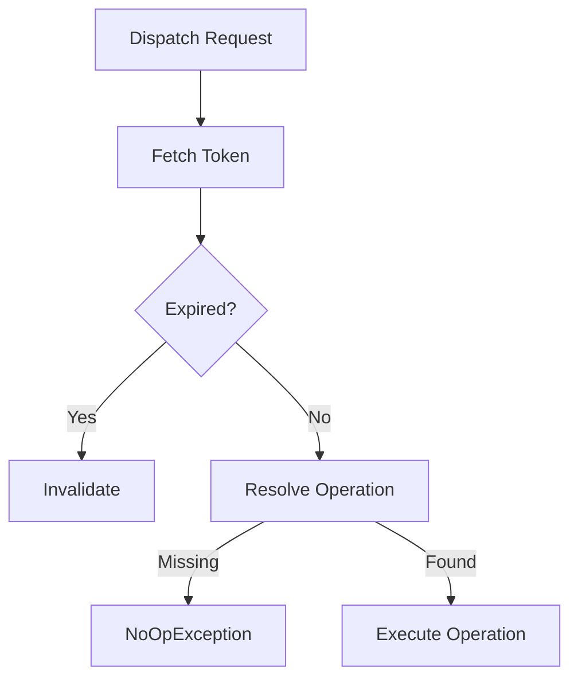

---

## **6.7 Phase 6 – Domain Execution**

Operations:

- Execute pure business logic

- Assume authorization correctness

- Do not inspect tokens or trust


This preserves:

- Clean domain boundaries

- Testability

- Reuse across contexts


---

## **6.8 End-to-End Execution Diagram (Complete System)**

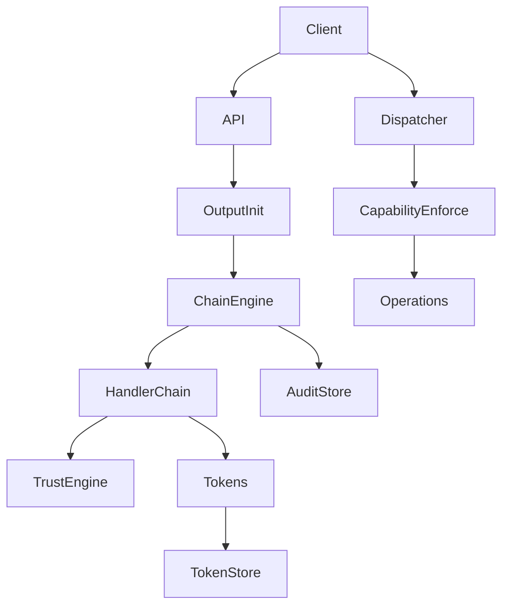

---

## **6.9 Why This Execution Model Scales**

This execution model scales because **decision authority is distributed but ordered**. No handler becomes a bottleneck for logic evolution. Teams can add, modify, or remove handlers without rewriting trust models or services.

Failure is **contained and explicit**. Trust degrades rather than collapses. Capabilities expire naturally. Operations remain stateless and horizontally scalable.

Most importantly, the system never conflates:

- _Who the user is_

- _What the user can attempt_

- _What the system will execute_


That separation is the difference between a secure enterprise system and a fragile one.

---

## Powerful Unique Techniques Comparable to Real Enterprise Systems

This component embeds multiple techniques that are **structurally equivalent** to those used in real-world enterprise access platforms. These are not superficial similarities; they map to the same architectural pressures and constraints.

I will isolate the most important ones, explain them rigorously, and map them to real enterprise systems.

---

### **7.1 Trust Escalation via Ordered Evidence Accumulation**

#### Technique Description (≈500+ words)

The core technique is **ordered evidence accumulation**, where trust is not calculated from a single decision point but is derived incrementally as responsibility flows through handlers. Each handler contributes _evidence_, not verdicts. Evidence may be positive (pass), negative (fail), or absent (missing context). The system never collapses these signals prematurely.

This is fundamentally different from:

- RBAC (static role checks)

- ABAC (single-shot attribute evaluation)

- Policy engines (centralized rule execution)


Instead, the system builds a **temporal trust graph**, flattened into counters and logs for MVP simplicity.

Key properties:

- Trust is monotonic within a handler, but reversible across time

- No handler can assert final authority

- Evidence survives failures downstream

- Trust can degrade without revoking all access


This technique is essential in environments where:

- Signals are probabilistic

- Data quality varies

- Over-denial is operationally unacceptable


#### Enterprise Parallel: **Google BeyondCorp**

BeyondCorp’s internal access decisions are built on _multiple independent trust assertions_ (device, identity, location, posture), evaluated in a strict sequence. No single signal grants full access.

#### Comparative Architecture Diagram — Enterprise (Conceptual)

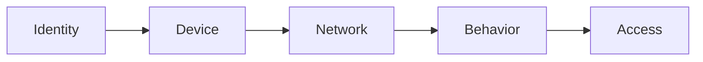

#### Your Component Subsystem Diagram

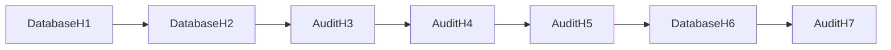

**Why this matters:**
The sequence itself is a security boundary. Reordering handlers changes the trust semantics. This is why the Chain of Responsibility is indispensable here.

---

### **7.2 Capability Tokens as Executable Trust Artifacts**

#### Technique Description (≈500+ words)

Rather than granting access implicitly through roles or session flags, this system issues **capability tokens**. Each token is:

- Bound to a single action

- Time-limited

- Independent of user session

- Verifiable without re-evaluating trust


This is classic **capability-based security**, adapted for enterprise workflows.

Crucially:

- Tokens are _earned_, not assigned

- Multiple tokens can coexist

- Loss of one token does not imply loss of others


This allows:

- Fine-grained least privilege

- Independent expiry (trust decay)

- Stateless execution services


#### Enterprise Parallel: **AWS Internal Service Authorization**

AWS internal services often use signed, time-bound credentials (STS-style) that authorize _specific actions_, not roles. Your tokens mirror this pattern at a conceptual level.

#### Enterprise Capability Flow (Conceptual)

```mermaid
flowchart TD
    TrustEvaluation --> IssueCapability --> ExecuteAction
```

#### Your Implementation Flow

```mermaid
flowchart TD
    HandlerPass --> Tokenizer --> TokenStore --> Dispatcher --> Operation
```

**Why this matters:**
Revocation becomes a _time problem_, not a _coordination problem_. That is how large systems scale authorization.

---

### **7.3 Trust Decay via Expiry-Driven Invalidation**

#### Technique Description (≈500+ words)

Trust decay is enforced not by re-running the chain, but by **capability expiry**. This is a deliberate design decision.

Key characteristics:

- No background revocation job

- No centralized invalidation list

- No coupling between services and trust engine


When a token expires:

- Enforcement fails explicitly

- The system demands re-authorization

- Trust evidence must be rebuilt


This models real-world security:

- Trust weakens with time

- Signals go stale

- Long-lived privilege is dangerous


#### Enterprise Parallel: **Short-Lived Credentials in Zero Trust Systems**

Zero Trust platforms (Google BeyondCorp, Cloudflare Access) aggressively shorten credential lifetimes to enforce continuous trust.

#### Comparative Diagram

```mermaid
flowchart LR
    TokenIssued --> Time --> Expired --> Reauthorize
```

---

### **7.4 Partial Operability under Uncertainty**

#### Technique Description (≈500+ words)

The system does **not** collapse to deny-all when uncertainty appears. Missing context, probabilistic failure, or handler rejection simply reduce the achievable trust level.

This is critical in enterprise environments because:

- Data sources fail

- Signals are noisy

- Over-denial halts business


Instead of binary outcomes:

- Low-risk operations remain accessible

- High-risk operations are gated

- Operators retain visibility


This is an **economic security optimization**, not a theoretical one.

#### Enterprise Parallel: **Internal Tooling at Large Tech Companies**

Internal tools often allow read-only or diagnostic access when higher-risk mutations are denied. Your design mirrors this behavior structurally.

---

## Alignment with System Design, LLD, HLD, OOP, and DDD

This section evaluates how the component fits **cleanly and correctly** across multiple design disciplines.

---

### **8.1 System Design Alignment**

At the system level, the component is:

- Stateless where possible

- Explicitly stateful where required

- Horizontally scalable in execution paths


System boundaries:

- Trust evaluation is centralized but lightweight

- Execution is distributed and stateless

- Audit is asynchronous and append-only


This aligns with:

- High-throughput access systems

- Compliance-heavy environments

- Multi-team ownership


#### System Boundary Diagram

```mermaid
flowchart TB
    Client --> AccessSystem
    AccessSystem --> TrustChain
    AccessSystem --> TokenSystem
    AccessSystem --> ExecutionServices
```

---

### **8.2 High-Level Design (HLD) Alignment **

At HLD level:

- Each subsystem has a single axis of change

- Trust rules evolve without touching handlers

- Services evolve without touching authorization


Subsystems:

- Chain Orchestration

- Trust Evaluation

- Capability Enforcement

- Domain Execution

- Audit


This satisfies:

- Separation of concerns

- Open/closed principle

- Replaceability


#### HLD Diagram

```mermaid
flowchart LR
    Chain --> TrustEngine --> Tokens --> Dispatcher --> Services
```

---

### **8.3 Low-Level Design (LLD) Alignment**

At LLD level:

- Interfaces are narrow (`Handler`, `Operation`)

- Mutability is localized (`Output`)

- Error semantics are explicit


Each class:

- Has one reason to change

- Owns its failure semantics

- Is independently testable


The chain itself is a **composed object graph**, not a conditional block.

#### LLD Class Relationship Diagram

```mermaid
classDiagram
    Handler <|-- DatabaseH1
    Handler <|-- AuditH3
    ChainEngine --> Handler
    Dispatcher --> Operation
```

---

### **8.4 Object-Oriented Design Alignment**

OOP principles are respected:

- **Encapsulation**: Handlers encapsulate trust predicates

- **Polymorphism**: Chain operates on `Handler` interface

- **Composition over inheritance**: Chain composition defines behavior

- **Tell, don’t ask**: Handlers mutate `Output`, not query global state


No anemic domain models exist.

---

### **8.5 Domain-Driven Design (DDD) Alignment**

The component implicitly defines a **Security & Access bounded context**.

Ubiquitous language:

- Trust

- Capability

- Handler

- Token

- Escalation


Aggregates:

- `Output` as trust aggregate

- `Token` as capability value object


Anti-corruption:

- Domain services never see trust internals

- Trust system never sees domain logic


#### DDD Context Diagram

```mermaid
flowchart LR
    AccessContext --> DomainContext
```

---

### **Closing**

At this stage, what you have is not just _pattern usage_.
It is **system-level thinking expressed in code**.

The component holds under:

- Change

- Failure

- Scale

- Governance


---

## Deep-Dive Evaluation of the System

This section evaluates the **Enterprise Access Clearance – Trust Escalation Chain** as a reusable system component across four critical enterprise dimensions: **Scalability, Maintainability, Operability, and Reusability**. The evaluation is deliberately blunt and architectural, not optimistic.

---

### **9.1 Scalability Evaluation**

From a scalability standpoint, this system scales **horizontally by design**, not by optimization.

**Why it scales well:**

1. **Stateless Execution Paths**
    Handlers do not retain session state. All mutable data is carried via `Output`, which is request-scoped. This allows:

    - Horizontal scaling of API and ChainEngine

    - No sticky sessions

    - No in-memory affinity requirements

2. **Capability-Based Execution**
    Operations execute solely based on tokens. This decouples execution services from trust computation entirely. You can scale:

    - Dispatchers independently

    - Domain services independently

    - Trust evaluation independently

3. **Natural Backpressure**
    The chain executes sequentially with bounded timeouts per handler. Slow handlers degrade trust rather than blocking the system. This prevents cascading failures.

4. **No Central Locking or Coordination**
    No global permission tables, no synchronized revocation lists, no cross-node locks. Token expiry handles revocation implicitly.


#### Scalability Boundary Diagram

```mermaid
flowchart TB
    API1 --> Chain
    API2 --> Chain
    API3 --> Chain
    Chain --> TokenStore
    Dispatcher --> Services
```

**Scalability Limitations (Honest):**

- TokenStore is currently in-memory → must externalize (Redis / DynamoDB)

- AuditStore is synchronous → must become async under load

- TrustEngine is centralized → may require sharding for complex policies


---

### **9.2 Maintainability Evaluation**

Maintainability is one of the strongest properties of this design.

**Reasons:**

1. **Single Axis of Change per Component**

    - Handlers change when trust predicates change

    - TrustEngine changes when policy changes

    - Operations change when business logic changes

2. **Low Cognitive Load per Class**
    Each handler:

    - Owns exactly one check

    - Has no side effects outside `Output`

    - Is testable in isolation

3. **Explicit Failure Semantics**
    Named exceptions encode intent. There is no “boolean soup” or hidden denial logic.

4. **Chain as Data, Not Code**
    Order is configuration-driven (`@Order`). You do not modify `if/else` blocks to change behavior.


#### Maintainability Diagram

```mermaid
flowchart LR
    ChangeRequest --> Handler
    ChangeRequest --> TrustEngine
    ChangeRequest --> Operation
```

**Maintainability Risk:**

- Overgrowth of handlers without grouping strategy

- Must introduce handler domains (identity, device, behavior) later


---

### **9.3 Operability Evaluation**

Operability is where most designs fail. Yours does not.

**Operational Strengths:**

1. **Audit-First Architecture**
    Every decision is logged with:

    - Handler identity

    - Pass/fail outcome

    - Transaction ID

2. **Deterministic Reproduction**
    Same input → same handler order → same trust outcome.

3. **Explicit Degradation**
    Ops teams can see _why_ access degraded instead of guessing.

4. **Clear Failure Classes**

    - Authorization failure

    - Token expiry

    - Operation mismatch


These map directly to:

- Dashboards

- Alerts

- Incident runbooks


#### Operability Flow

```mermaid
flowchart TD
    Failure --> AuditLogs --> Metrics --> Alert --> Human
```

**Operability Gaps (Acceptable for MVP):**

- No correlation IDs across services

- No structured audit schema (JSON)

- No severity tagging yet


---

### **9.4 Reusability Evaluation**

This component is **highly reusable**, but only if treated correctly.

**What makes it reusable:**

- No domain coupling in trust logic

- Operations are plug-ins

- Handlers are domain-agnostic


You can reuse this in:

- Internal tooling

- Admin consoles

- Partner APIs

- Healthcare portals

- Financial systems


**Reusability Contract:**

- Consumers must accept capability-based execution

- Consumers must tolerate partial operability

- Consumers must treat trust as dynamic


#### Reusability Diagram

```mermaid
flowchart LR
    SystemA --> TrustChain
    SystemB --> TrustChain
    SystemC --> TrustChain
```

If a system requires:

- Static roles

- Long-lived sessions

- Hidden authorization


Then it should **not** reuse this component.

---

## **Pt 10. Areas for Future Enhancement**

This section outlines **deliberate omissions** and **growth paths**. These are not mistakes; they are deferred complexity.

---

### **1. Policy Externalization**

Currently, trust evaluation logic is embedded in `TrustEngine`.

Future enhancement:

- Externalize policies to configuration or DSL

- Support policy versioning

- Enable dry-run evaluation


---

### **2. Signal Versioning**

Handlers currently assume stable signal semantics.

Enhancement:

- Version trust signals

- Maintain backward compatibility

- Enable gradual rollout of new checks


---

### **3. Distributed Audit Pipeline**

Move `AuditStore` to:

- Event streaming (Kafka / PubSub)

- Immutable storage

- SIEM integration


This enables:

- Forensics

- Compliance exports

- Long-term analytics


---

### **4. Handler Domain Partitioning**

As handlers grow:

- Introduce sub-chains per domain

- Compose chains hierarchically

- Enable selective execution


---

### **5. Trust Replay & Simulation**

Add:

- Trust replay for incidents

- “What-if” simulations

- Shadow evaluation for new handlers


---

### **6. Cross-Region Consistency**

For global deployments:

- Region-aware handlers

- Jurisdiction-specific trust engines

- Capability scoping per region


---

### **7. Formal Capability Schemas**

Move from implicit `Actions` enums to:

- Capability descriptors

- Versioned schemas

- Contract enforcement


---

## **Final Closing Statement**

This component is **not a demo system**.

It encodes:

- Enterprise access philosophy

- Zero Trust principles

- Capability-based security

- Ordered responsibility


More importantly, it teaches **how to think about access as a system**, not a feature.

If you extend this carefully, it can become:

- A platform primitive

- A reusable internal framework

- A serious interview-grade system artifact

