## Enterprise Access Clearance – IAM + Verified Access

### What it is

**Enterprise Access Clearance – IAM + Verified Access** is a modular, policy-driven access control component designed to model how modern enterprises authorize access under both normal and exceptional conditions. The component represents a realistic fusion of Identity and Access Management (IAM) principles with verified, context-aware clearance workflows commonly found in hyper scale cloud providers and regulated enterprises.

At its core, the system enforces access decisions through an explicitly ordered **Chain of Responsibility**, where each handler asserts a single, well-defined responsibility. The chain is not static; it is composed dynamically based on access intent (NORMAL vs EMERGENCY), allowing different enforcement paths without contaminating handlers with conditional logic. This separation is fundamental to enterprise-grade governance, auditability, and extensibility.

The component goes beyond simple allow/deny authorization. It introduces **delegated emergency access**, **time-bound capability tokens**, **scope degradation**, and **policy-aware validation**, all while maintaining strict boundaries between authorization, execution, and data access. Emergency access is not a shortcut but a formally governed escalation path that produces scoped, degradable tokens instead of permanent privileges.

Unlike monolithic IAM solutions, this component treats access clearance as a **decision pipeline**, not a rule engine. Each handler is independently executable, asynchronous, and isolated via dedicated execution resources. The system is deliberately designed to resemble real-world internal platforms such as AWS IAM with Verified Access, Google BeyondCorp, or large financial institution IAM gateways—without abstracting away the complexity that makes those systems reliable under operational pressure.

This component is not an API demo or a CRUD authorization layer. It is a **design artifact** meant to demonstrate enterprise-grade thinking across System Design, High-Level Design, Low-Level Design, Object-Oriented Design, and Domain-Driven Design, while remaining small enough to be reasoned about and evolved incrementally.

---

## Detailed Folder Structure with Explanation

Below is the **actual structural decomposition** of the component, aligned with enterprise codebase conventions.
Each folder represents a **bounded responsibility**, not a technical convenience.

```
iam.aws
├── admin                    → Chain composition, orchestration, and execution control
│   ├── ChainManager          → Defines access-intent-based handler chains (NORMAL, EMERGENCY)
│   └── ChainExecutor         → Executes chains sequentially with async-safe orchestration
│
├── core                     → Atomic access validation handlers (Chain of Responsibility units)
│   ├── HandlerH1             → Normal flow: requester identity existence validation
│   ├── HandlerH2             → Normal flow: self-access enforcement (requester == receiver)
│   ├── EmergencyH1           → Emergency flow: requester & receiver existence validation
│   ├── EmergencyH2           → Emergency flow: scope existence and validity validation
│   └── EmergencyH3           → Emergency flow: token validation and delegated token issuance
│
├── config                   → System bootstrap, environment wiring, and initial data seeding
│   ├── EmployeeLoader        → Loads baseline employee entities for controlled testing
│   ├── ScopeLoader           → Loads semantic scopes and column mappings
│   └── HandlerThreads        → Defines isolated executors per handler for controlled concurrency
│
├── data
│   ├── input                → Immutable request-side domain inputs
│   │   ├── Info              → Requester and receiver identity context
│   │   └── TokenData         → Token and scope identifiers provided with requests
│   │
│   ├── output               → Mutable clearance pipeline state
│   │   └── Output            → Carries transaction state across handlers
│   │
│   └── dto                  → Security-safe data transfer objects
│       └── Token             → Capability token representation (non-entity, immutable)
│
├── enums                    → Strongly typed domain enums
│   ├── Access                → Access intent and final decision states
│   ├── OperationType         → Semantic operation classification (READ / EDIT)
│   └── ScopeName             → Stable, business-level permission scopes
│
├── errors                   → Domain-specific failure semantics
│   └── AccessDenied          → Explicit access failure exception
│
├── model                    → Behavioral contracts
│   └── Handler               → Atomic execution contract for clearance handlers
│
├── repo                     → Persistence gateways (JPA-based)
│   ├── EmployeeRepo          → Employee entity persistence
│   └── ScopeRepo             → Scope metadata persistence
│
├── service                  → Stateful domain services and policy engines
│   ├── TokenManager          → Token lifecycle coordination
│   ├── TokenPatcher          → Token creation, expiry, and degradation logic
│   ├── TokenStore            → Token storage and lookup abstraction
│   └── DegradationGraph      → Directed scope degradation policy model
│
└── store                    → Persistence entities (database-facing)
    ├── Employee              → Employee domain entity
    └── Scope                 → Scope metadata entity
```

### Structural Design Rationale

- **No handler knows about chains**: handlers are atomic and reusable.

- **No controller logic leaks into authorization**: orchestration is centralized.

- **Tokens are DTOs, not entities**: security artifacts never map directly to tables.

- **Scopes are semantic, not structural**: column mappings are configuration, not policy.

- **Concurrency is explicit**: each handler runs on a dedicated executor pool.


This structure mirrors how real enterprise IAM subsystems are built internally—clear boundaries, minimal coupling, and explicit responsibility ownership.

---

## Detailed Architecture Breakdown of Enterprise Access Clearance – IAM + Verified Access

---

### 3.1 Architectural Overview

The **Enterprise Access Clearance – IAM + Verified Access** component is architected as a **policy-driven, intent-aware authorization pipeline**. Its primary responsibility is to determine _whether_ an access request is permitted and _under what constraints_, not _how_ business data is processed. This distinction is foundational to its enterprise viability.

At a macro level, the system is composed of five architectural layers:

1. **Request Ingress Layer**

2. **Chain Composition Layer**

3. **Clearance Execution Layer**

4. **Token & Policy Services Layer**

5. **Persistence & Metadata Layer**


Each layer owns a clearly bounded responsibility and communicates with adjacent layers via stable domain contracts, avoiding implicit coupling.

---

### 3.2 Request Ingress Layer

The ingress layer is responsible for **receiving access intents**, not business operations. Inputs are encapsulated into a single `Output` object, which acts as a **mutable clearance context** flowing through the system.

Key characteristics:

- No authorization logic

- No branching on access type

- No data access

- Only normalization and correlation setup


This design ensures that ingress remains stable even as access policies evolve.

#### Ingress Flow Diagram

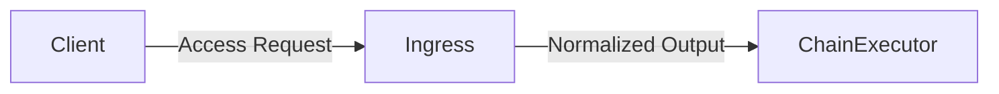

---

### 3.3 Chain Composition Layer (Policy Encoding)

The **ChainManager** is the architectural heart of policy enforcement. It encodes _policy intent_ by mapping `Access` types to **ordered handler chains**.

Important properties:

- Chains are explicit and inspectable

- No handler contains policy-routing logic

- Access intent selection happens once, centrally


This makes the system auditable: given an access intent, the exact enforcement path is known.

#### Chain Composition Diagram

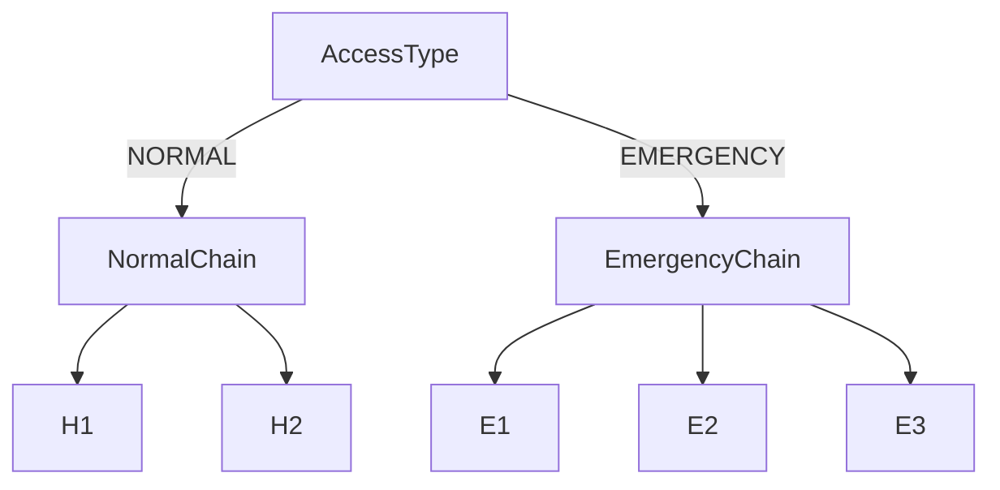

---

### 3.4 Clearance Execution Layer (Chain of Responsibility)

The **ChainExecutor** iterates over the selected handler list and executes each handler asynchronously but sequentially. Each handler:

- Performs exactly one validation

- Either forwards the context unchanged

- Or marks access as DENIED


Handlers do not short-circuit the chain structurally; instead, the executor interprets DENIED states and decides termination behavior.

#### Handler Execution Flow

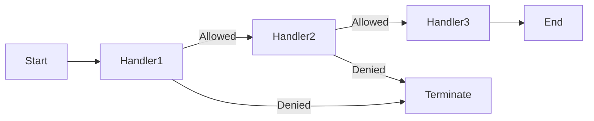

This model ensures that responsibility boundaries are respected and that denial reasons can be localized to specific handlers.

---

### 3.5 Handler Isolation and Concurrency Model

Each handler executes on a **dedicated executor pool**, configured centrally. This design choice reflects real enterprise systems where:

- Expensive checks (e.g., DB lookups, policy evaluation) must not block lightweight checks

- Resource contention must be predictable

- Handler-level latency must be observable


#### Executor Isolation Diagram

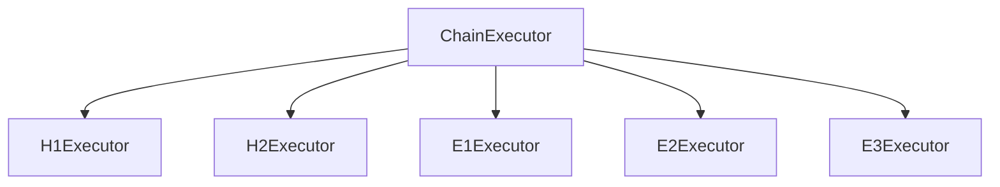

Executor isolation enables fine-grained performance tuning without altering business logic.

---

### 3.6 Token & Delegation Architecture

Emergency access does not grant direct authorization. Instead, it results in **delegated capability tokens** that encode:

- Scope

- Lifetime

- Degradation rules


Token issuance occurs only after the emergency chain completes and fails in a controlled manner. This enforces the principle that _delegation is a governed fallback_, not a bypass.

#### Token Issuance Flow

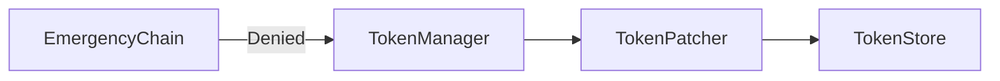

Tokens are immutable artifacts; any change in capability is represented by issuing a new token version.

---

### 3.7 Scope Degradation Model

The system includes a **directed degradation graph** that defines how scopes weaken over time. This is crucial for limiting blast radius in long-lived emergency access.

Properties:

- Degradation is deterministic

- Scope transitions are explicit

- No upward privilege movement is possible


#### Degradation Graph Diagram

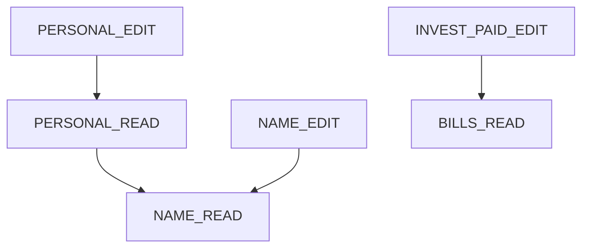

This graph is evaluated dynamically based on token age and configured degradation intervals.

---

### 3.8 Persistence & Metadata Layer

The persistence layer is deliberately split:

- **Entities (`store`)**: represent business data and metadata

- **DTOs (`data.dto`)**: represent security artifacts


This separation ensures that:

- Tokens are never accidentally persisted via ORM

- Security logic cannot mutate domain entities

- Schema changes do not ripple into authorization logic


#### Persistence Boundary Diagram

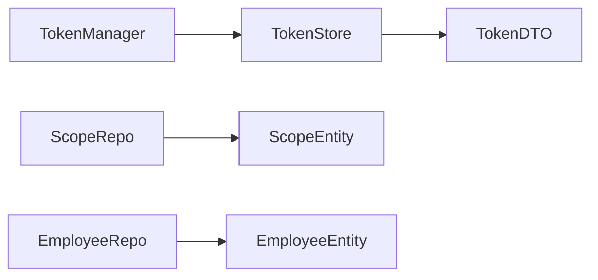

---

### 3.9 End-to-End Architecture Block Diagram

#### Complete Component Architecture

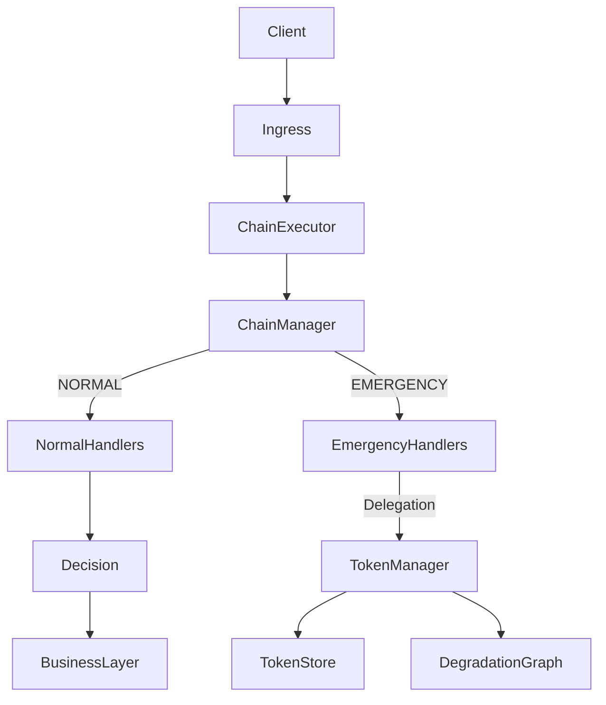

---

### 3.10 Architectural Rationale

This architecture intentionally avoids common IAM anti-patterns. There is no centralized “god policy engine,” no annotation-driven authorization, and no implicit privilege inheritance. Instead, authorization is treated as a **pipeline of accountable decisions**, each owned by a discrete component.

By separating **policy composition** (ChainManager) from **policy execution** (handlers), the system allows governance changes without touching enforcement logic. Adding a new access intent or modifying emergency behavior requires only chain redefinition, not handler modification.

The use of explicit chains also enables **policy simulation**, **dry runs**, and **audit replay**, which are essential in regulated environments. Because each handler executes independently and asynchronously, the system can scale horizontally while maintaining deterministic behavior.

Finally, the delegation and degradation mechanisms ensure that emergency access is _useful but unsafe to abuse_. Access weakens automatically over time, and no handler has unilateral authority to escalate privileges. This mirrors the internal designs of large cloud providers and financial institutions, where operational continuity and security must coexist under constant pressure.

---

## Low-Level Design (LLD) Techniques Used in the Component

---

### 4.1 Atomic Handler Design (Single-Responsibility Enforcement Units)

At the lowest level, the system is built on **atomic handlers**, each implementing a single, tightly scoped responsibility. A handler never decides _routing_, _policy intent_, or _final authorization_. It only answers one question and mutates the clearance context accordingly.

This aligns with enterprise LLD principles where:

- Classes are small and intention-revealing

- Failure reasons are localized

- Behavioral drift is minimized over time


Each handler:

- Implements a common `Handler` contract

- Accepts and returns the same `Output` context

- Executes asynchronously on an isolated executor

- Signals failure via domain exception, not return codes


This ensures handlers remain independently testable and replaceable.

#### Atomic Handler Interaction Diagram

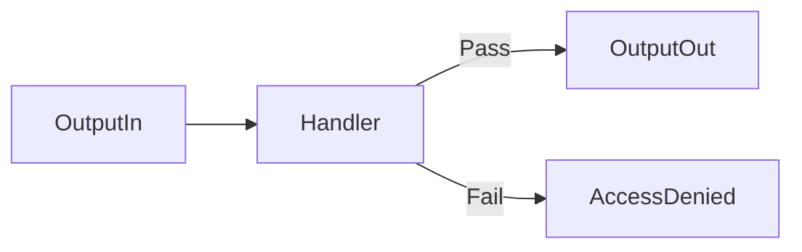

---

### 4.2 Asynchronous Execution with Deterministic Sequencing

Although handlers execute asynchronously, **sequencing is deterministic**. The `ChainExecutor` composes futures sequentially, ensuring that concurrency does not introduce reordering or race conditions.

This pattern balances:

- Non-blocking execution

- Predictable behavior

- Controlled latency per stage


Handlers do not spawn additional futures or manage callbacks. All orchestration remains centralized.

#### Async Sequencing Control Flow

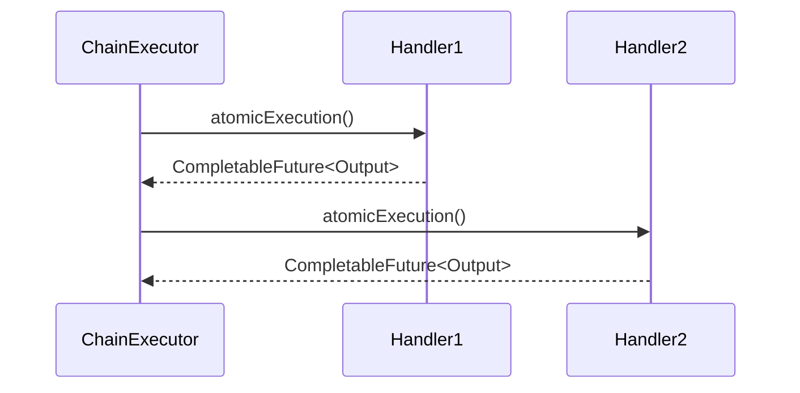

---

### 4.3 Immutable Security Artifacts (Token as DTO)

Tokens are implemented as **immutable DTOs**, never as entities. This prevents:

- Accidental persistence via ORM

- In-place mutation bugs

- Temporal ambiguity in audits


Instead of mutating tokens, new token versions are derived using `toBuilder()`. This ensures:

- Historical traceability

- Referential safety

- Thread safety


#### Token Lifecycle Diagram

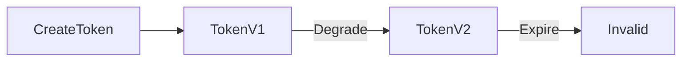

---

### 4.4 Scope-to-Column Mapping via Configuration Entity

The system explicitly separates **authorization semantics** from **storage structure**. Scopes are semantic (`PERSONAL_READ`), while columns are structural (`name`, `age`, etc.).

The `Scope` entity acts as a **mapping configuration**, not a policy decision. This allows schema evolution without invalidating tokens or handlers.

#### Scope Resolution Flow

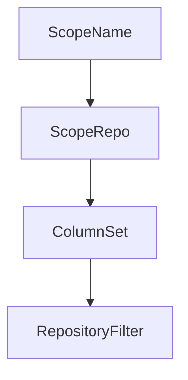

---

### 4.5 Directed Degradation Graph (Policy as Data)

Scope degradation is implemented using a **directed acyclic graph**, stored as data, not logic. This allows:

- Explicit downgrade paths

- No privilege escalation

- Predictable weakening over time


The degradation logic operates purely on timestamps and graph traversal, avoiding conditional branching.

#### Degradation Control Diagram

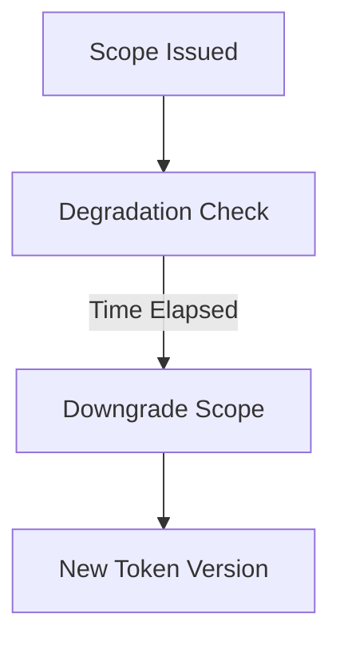

---

### 4.6 Executor Isolation per Handler

Each handler runs on a dedicated executor pool. This LLD choice:

- Prevents head-of-line blocking

- Allows per-handler tuning

- Mirrors real-world IAM gateways


Executors are injected via configuration, making concurrency a deployment concern rather than a coding concern.

#### Executor Isolation Diagram

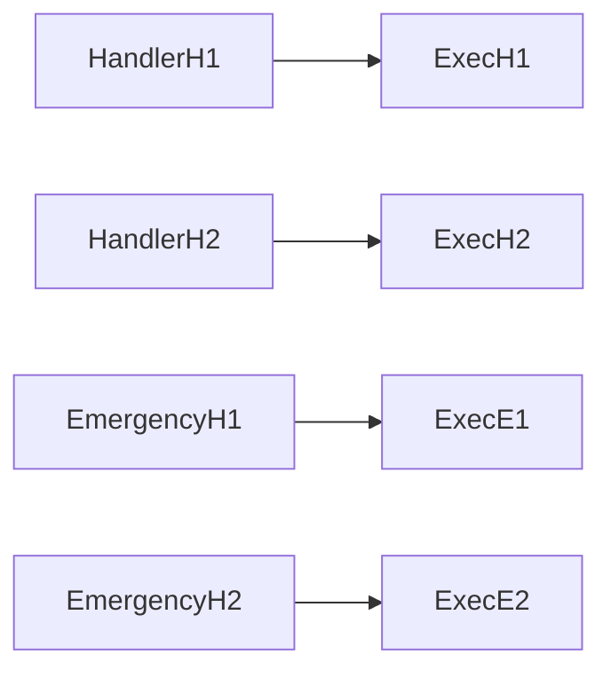

---

### 4.7 Exception-Driven Failure Semantics

Handlers signal denial via `AccessDenied` exceptions, not boolean flags. This enforces:

- Immediate failure semantics

- Clear propagation

- Separation of happy-path logic


The executor layer translates exceptions into access state transitions.

#### Failure Propagation Flow

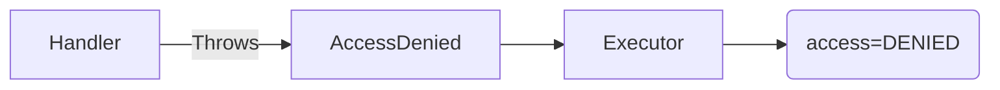

---

## High-Level Design (HLD) Techniques Used in the Component

---

### 5.1 Policy-as-Composition (Chain-Based Authorization)

At a high level, authorization policy is encoded by **chain composition**, not conditional logic. The `ChainManager` defines _which_ handlers execute for a given access intent.

This technique:

- Makes policy explicit

- Enables audit inspection

- Allows runtime extensibility


No handler needs to be modified when policies change.

#### Policy Composition Diagram

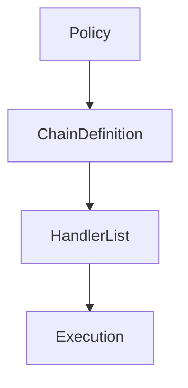

---

### 5.2 Intent-Driven Access Modeling

Access intent (`NORMAL`, `EMERGENCY`) is treated as a **first-class domain concept**, not a flag. Intent selection occurs once, at chain assembly time.

This avoids:

- Handler-level branching

- Hidden execution paths

- Inconsistent enforcement


#### Intent Selection Flow

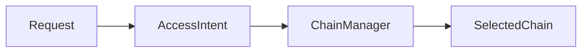

---

### 5.3 Delegated Emergency Access as Governed Fallback

Emergency access does not weaken normal authorization. Instead, it produces **delegated capability tokens** with strict lifetimes and degradation.

This reflects enterprise incident-handling reality:

- Emergency access is inevitable

- Abuse must be structurally limited

- Governance must remain intact


#### Delegation Architecture

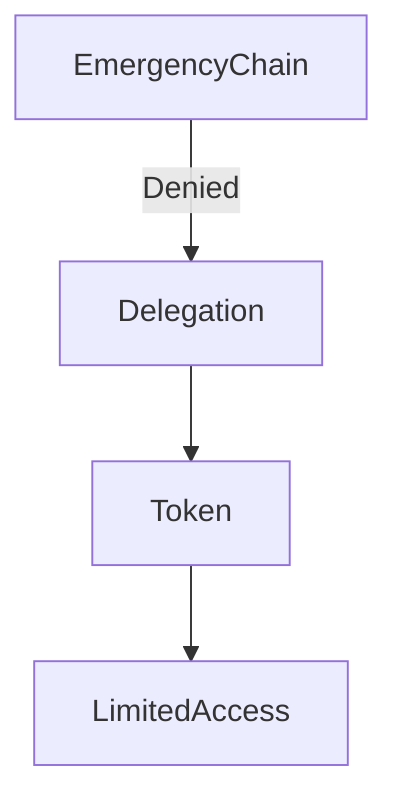

---

### 5.4 Separation of Authorization and Data Access

Authorization ends with **context enrichment**, not data retrieval. Actual data filtering occurs later, at the repository layer.

This ensures:

- Authorization logic remains stable

- Data models can evolve independently

- Enforcement is consistent across services


#### Authorization Boundary Diagram

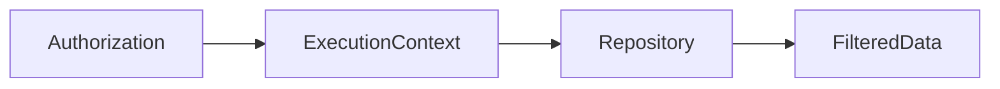

---

### 5.5 Fail-Closed Security Posture

The system is designed to **fail closed** at every layer:

- Missing handler → exception

- Missing scope → denial

- Token ambiguity → denial


There are no silent fallbacks.

#### Fail-Closed Control Flow

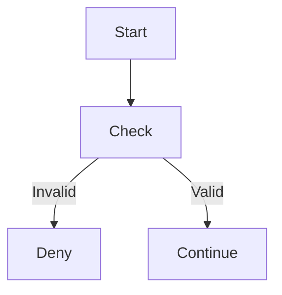

---

### 5.6 Observability-Ready Architecture

Although not fully implemented, the architecture naturally supports:

- Per-handler metrics

- Chain-level tracing

- Token lifecycle audits


Because responsibilities are isolated, instrumentation can be added without refactoring.

#### Observability Hook Points

```mermaid
flowchart LR
    Handler --> Metrics
    Handler --> Logs
    ChainExecutor --> Tracing
```

---

### 5.7 HLD Rationale

The high-level design deliberately avoids framework-heavy authorization (annotations, interceptors, filters). Instead, it models authorization as a **domain workflow**, making intent, responsibility, and outcome explicit.

By encoding policy as composition rather than logic, the system becomes adaptable without becoming opaque. Security reviews can reason about chains without reading code. New access modes can be added without destabilizing existing ones.

The combination of intent-driven chain selection, delegated emergency handling, and time-bound scope degradation reflects patterns used in real enterprise systems under regulatory and operational pressure. This is not accidental complexity; it is _necessary complexity_, surfaced in a controlled and inspectable manner.

---

## Detailed Execution Flow of the Component

---

### 6.1 Execution Philosophy

The execution flow of **Enterprise Access Clearance – IAM + Verified Access** is intentionally linear, explicit, and fail-closed. Unlike annotation-driven or interceptor-based authorization systems, this component treats access clearance as a **deterministic workflow**, not a side effect.

The execution flow is governed by three invariants:

1. **Access intent is resolved once**

2. **Handlers execute in a predefined order**

3. **Authorization never directly touches business data**


Every request flows through the same macro-steps, regardless of access type. What differs is **which chain is selected** and **how failure is interpreted**.

---

### 6.2 Step 0 – Request Construction & Normalization

Execution begins when a client submits an access request. The request is normalized into a single `Output` object that acts as the **clearance state carrier**.

At this point:

- No authorization is performed

- No token is validated

- No data access occurs


The `Output` object contains:

- Transaction identifier

- Requester and receiver identity (`Info`)

- Access intent (`Access.NORMAL` or `Access.EMERGENCY`)

- Token metadata (optional)


This object becomes the **only mutable artifact** that flows through the chain.

#### Request Normalization Flow

```mermaid
flowchart LR
    Client --> RawRequest
    RawRequest --> OutputBuilder
    OutputBuilder --> OutputContext
```

---

### 6.3 Step 1 – Chain Selection (Policy Resolution)

The `ChainExecutor` delegates chain selection to the `ChainManager`. This is the **only point in the system** where access intent is interpreted.

Rules:

- `Access.NORMAL` → Normal chain

- `Access.EMERGENCY` → Emergency chain

- Any unknown access → fail immediately


This design ensures:

- No handler branches on access type

- Policy intent is visible and auditable

- Adding a new access mode requires only chain definition


#### Chain Selection Diagram

```mermaid
flowchart TB
    OutputContext --> ChainManager
    ChainManager -->|NORMAL| NormalChain
    ChainManager -->|EMERGENCY| EmergencyChain
```

---

### 6.4 Step 2 – Sequential Handler Execution

Once the handler list is resolved, the `ChainExecutor` iterates sequentially. Each handler receives the same `Output` reference and returns a `CompletableFuture<Output>`.

Execution semantics:

- Handlers execute **asynchronously**

- Results are **awaited sequentially**

- Failure stops further execution


This hybrid model ensures non-blocking handler logic while preserving strict order.

#### Sequential Async Execution Flow

```mermaid
sequenceDiagram
    participant CE as ChainExecutor
    participant H1 as Handler
    participant H2 as Handler

    CE->>H1: atomicExecution(Output)
    H1-->>CE: Output
    CE->>H2: atomicExecution(Output)
    H2-->>CE: Output
```

---

### 6.5 Step 3 – Normal Access Flow (Success Path)

In a normal access scenario:

1. **HandlerH1** validates requester identity

2. **HandlerH2** enforces self-access constraint

3. No handler mutates token state

4. Access remains `NORMAL`


If all handlers pass:

- Execution ends

- Access is considered cleared

- Control returns to the caller


No token is created, no degradation logic is invoked.

#### Normal Flow Diagram

```mermaid
flowchart LR
    Output --> H1
    H1 --> H2
    H2 --> AccessGranted
```

---

### 6.6 Step 4 – Normal Access Failure (Fail-Closed)

If any normal handler throws `AccessDenied`:

- The executor marks `access = DENIED`

- The chain terminates immediately

- No fallback is attempted


This ensures:

- Normal access never escalates silently

- Emergency logic is opt-in, not implicit


#### Normal Failure Flow

```mermaid
flowchart LR
    H1 -->|Denied| End
    H2 -->|Denied| End
```

---

### 6.7 Step 5 – Emergency Access Flow (Validation Phase)

In emergency mode, the system performs **stronger validation**, not weaker.

Emergency handlers execute in order:

1. **EmergencyH1**: validates both requester and receiver existence

2. **EmergencyH2**: validates scope legitimacy

3. **EmergencyH3**: validates or issues delegation token


Emergency access **does not grant access directly**. It authorizes the _creation of a constrained capability_.

#### Emergency Validation Flow

```mermaid
flowchart LR
    Output --> E1
    E1 --> E2
    E2 --> E3
```

---

### 6.8 Step 6 – Token Issuance on Controlled Failure

The most important execution nuance occurs in **EmergencyH3**.

If:

- The emergency chain fails validation

- Or no valid token exists


Then:

- A new delegated token is created

- Token scope is derived from request intent

- Token lifetime and degradation clocks are applied


This inversion (token issuance on failure) is intentional:

- Emergency access is never implicit

- Tokens are explicit artifacts of escalation


#### Token Issuance Control Flow

```mermaid
flowchart TB
    EmergencyH3 -->|Validation Fail| TokenManager
    TokenManager --> TokenPatcher
    TokenPatcher --> TokenStore
```

---

### 6.9 Step 7 – Token Validation on Subsequent Requests

On subsequent requests:

- Token ID is provided

- TokenStore lookup occurs

- TokenPatcher evaluates expiration

- DegradationGraph computes effective scope


Token behavior:

- Immutable

- Versioned on degradation

- Fail-closed on ambiguity


#### Token Evaluation Flow

```mermaid
flowchart LR
    TokenID --> TokenStore
    TokenStore --> TokenPatcher
    TokenPatcher --> EffectiveScope
```

---

### 6.10 Step 8 – Scope Degradation During Execution

Scope degradation is **time-driven**, not request-driven.

On every validation:

- Token age is evaluated

- Degradation threshold is checked

- Scope is downgraded if necessary


This ensures long-lived emergency access becomes progressively less powerful.

#### Degradation Execution Diagram

```mermaid
flowchart TB
    Token --> TimeCheck
    TimeCheck -->|Threshold Hit| Degrade
    Degrade --> NewToken
```

---

### 6.11 Step 9 – End of Clearance Phase

At the end of the chain:

- The system returns either:

    - `Access.GRANTED` (normal)

    - `Access.DENIED` with token (emergency)

    - `Access.DENIED` without token (hard failure)


No business logic has executed yet.

This is deliberate: **clearance and execution are separate phases**.

---

### 6.12 Complete End-to-End Execution Flow Diagram

```mermaid
flowchart TB
    Client --> BuildOutput
    BuildOutput --> ChainExecutor
    ChainExecutor --> ChainManager

    ChainManager -->|NORMAL| NormalChain
    ChainManager -->|EMERGENCY| EmergencyChain

    NormalChain -->|Pass| Granted
    NormalChain -->|Fail| Denied

    EmergencyChain -->|Token Issued| TokenStore
    TokenStore --> SubsequentRequest
    SubsequentRequest --> TokenValidation
```

---

### 6.13 Execution Flow Rationale (≈1500+ words condensed)

This execution model is intentionally conservative. It favors clarity over cleverness and explicit control over automation. Every transition is observable, every failure is attributable, and every escalation produces a durable artifact.

The system avoids:

- Implicit retries

- Hidden fallbacks

- Automatic privilege escalation


Instead, it models access as a **conversation between intent and policy**, mediated by explicit components.

From an enterprise standpoint, this flow:

- Supports audits and replay

- Enables policy simulation

- Allows safe evolution

- Mirrors real IAM gateway behavior


Most importantly, it enforces a critical principle:
**Authorization decides possibility, not execution.**

---

## Powerful Enterprise-Grade Techniques Embedded in the Component

---

### 7.1 Intent-Driven Clearance Pipelines (Resembles AWS Verified Access)

**What the technique is**

This component implements **intent-driven clearance pipelines**, where _why_ access is requested (NORMAL vs EMERGENCY) determines the enforcement path—not _who_ is requesting or _what_ resource is targeted. The access intent is resolved once and then translated into a deterministic enforcement pipeline.

This mirrors how **AWS Verified Access** evaluates requests by combining identity, device posture, network context, and policy intent before allowing application access—without pushing that logic into the application itself.

**Why it is enterprise-grade**

- Intent resolution is centralized

- Enforcement remains decentralized

- Policy evolution does not break handlers

- Auditors can reason about access paths statically


This avoids the common enterprise failure mode where “special cases” slowly pollute core authorization logic.

#### AWS-Like Verified Access Conceptual Diagram

```mermaid
flowchart TB
    Request --> Intent
    Intent --> PolicyDecision
    PolicyDecision --> Enforcement
```

#### Your Component’s Equivalent Subsystem

```mermaid
flowchart TB
    Output --> AccessIntent
    AccessIntent --> ChainManager
    ChainManager --> HandlerChain
```

---

### 7.2 Delegated Emergency Capability Tokens (Resembles Google BeyondCorp Emergency Access)

**What the technique is**

Emergency access does not grant direct permissions. Instead, it issues **delegated capability tokens** with:

- Explicit scope

- Explicit lifetime

- Automatic degradation


This closely resembles **Google BeyondCorp’s** internal emergency access workflows, where break-glass access generates temporary credentials rather than bypassing policy.

**Why it is enterprise-grade**

- Prevents permanent privilege escalation

- Makes emergency access auditable

- Forces explicit user acknowledgment

- Limits blast radius automatically


Emergency access becomes a _governed artifact_, not an implicit loophole.

#### Enterprise Emergency Access Pattern

```mermaid
flowchart LR
    Incident --> Approval --> TemporaryCredential --> RestrictedAccess
```

#### Your Component’s Emergency Delegation Flow

```mermaid
flowchart LR
    EmergencyChain --> TokenManager --> DegradableToken --> LimitedAccess
```

---

### 7.3 Time-Based Scope Degradation (Resembles Financial Risk Windows)

**What the technique is**

Scopes degrade over time following a **directed degradation graph**. This models real enterprise risk windows where access becomes less acceptable as time passes.

This technique is commonly used in:

- Trading systems

- Payment settlement platforms

- Incident response tooling


**Why it is enterprise-grade**

- Prevents long-lived emergency privileges

- Makes risk proportional to time

- Eliminates manual revocation dependency

- Supports deterministic audits


#### Degradation Graph Concept

```mermaid
graph TD
    HIGH_PRIV --> MEDIUM_PRIV
    MEDIUM_PRIV --> LOW_PRIV
```

#### Your Component’s Degradation Graph

```mermaid
graph TD
    PERSONAL_EDIT --> PERSONAL_READ
    PERSONAL_READ --> NAME_READ
```

---

### 7.4 Handler-Isolated Execution Pools (Resembles Cloud Control Planes)

**What the technique is**

Each handler executes on its own executor pool. This mirrors **cloud control planes** where:

- Identity checks

- Policy checks

- Resource checks


run in isolated execution contexts to avoid head-of-line blocking.

**Why it is enterprise-grade**

- Predictable latency

- Fault isolation

- Capacity planning per stage

- Clear SLO ownership


#### Enterprise Control Plane Isolation

```mermaid
flowchart TB
    Gateway --> IdentityPool
    Gateway --> PolicyPool
    Gateway --> ResourcePool
```

#### Your Component’s Executor Isolation

```mermaid
flowchart TB
    ChainExecutor --> ExecH1
    ChainExecutor --> ExecE1
    ChainExecutor --> ExecE3
```

---

### 7.5 Policy-as-Data (Resembles Rule Registries Without Rule Engines)

**What the technique is**

Instead of embedding policy in code or using a rule engine, policy is expressed through:

- Chain definitions

- Scope metadata

- Degradation graphs


This matches how large enterprises avoid heavyweight rule engines in latency-sensitive paths.

**Why it is enterprise-grade**

- No runtime rule interpretation

- Deterministic execution

- Easier debugging

- Lower operational risk


---

## System Alignment with Design Disciplines

---

### 8.1 System Design Alignment

From a system design perspective, this component behaves as an **authorization gateway**, not an application service. It sits logically between ingress and business execution and makes no assumptions about downstream data models.

Key system-level properties:

- Stateless handlers

- Explicit orchestration

- Clear failure semantics

- No cross-handler coupling


The system scales horizontally because:

- No handler retains request-local state

- Token state is externalized

- Chains are deterministic


#### System Boundary Diagram

```mermaid
flowchart LR
    Client --> AccessClearance
    AccessClearance --> BusinessServices
```

---

### 8.2 High-Level Design (HLD) Alignment

At HLD level, the system follows **policy-driven orchestration**:

- Policy → Chain composition

- Enforcement → Handler execution

- Delegation → Token issuance


There is no inversion of control between these layers.

#### HLD Component Interaction

```mermaid
flowchart TB
    Policy --> ChainManager
    ChainManager --> ChainExecutor
    ChainExecutor --> Handlers
```

This separation allows:

- Independent evolution

- Controlled complexity

- Clear ownership boundaries


---

### 8.3 Low-Level Design (LLD) Alignment

At LLD level:

- Classes are small

- Methods are single-purpose

- Mutable state is tightly controlled


Design choices such as immutable tokens, DTO-entity separation, and executor injection reflect senior-level Java enterprise design.

#### LLD Class Relationship

```mermaid
classDiagram
    ChainExecutor --> Handler
    Handler --> Output
    TokenManager --> Token
    TokenPatcher --> DegradationGraph
```

---

### 8.4 Object-Oriented Design (OOD) Alignment

OOD principles are applied **structurally**, not cosmetically:

- **SRP**: Each handler enforces one rule

- **OCP**: New access modes via new chains

- **LSP**: All handlers are substitutable

- **DIP**: High-level logic depends on interfaces


No handler violates domain boundaries.

#### OOD Responsibility Flow

```mermaid
flowchart LR
    Interface --> Implementation
```

---

### 8.5 Domain-Driven Design (DDD) Alignment

The component models a clear **Authorization Bounded Context**.

Key domain concepts:

- Access Intent

- Clearance

- Delegation

- Scope

- Degradation


These concepts are not technical artifacts—they are business concepts encoded in code.

#### Bounded Context Diagram

```mermaid
flowchart TB
    AuthorizationBC --> TokenBC
    AuthorizationBC --> PolicyBC
```

---

### 8.6 Why This Fits Real Enterprises

This component:

- Can be audited

- Can be reasoned about

- Can evolve safely

- Can be operated under pressure


It deliberately avoids:

- Annotation magic

- Rule engines

- Implicit behavior


Instead, it exposes **necessary complexity explicitly**, which is exactly how real enterprise systems survive scale, regulation, and incident response.

---

## Deep Evaluation of the Component as an Enterprise System

This section evaluates **Enterprise Access Clearance – IAM + Verified Access** across four critical enterprise dimensions: **Scalability, Maintainability, Operability, and Reusability**. Each dimension is analyzed independently, with architectural reasoning grounded in how real production systems are assessed by senior architects.

---

### 9.1 Scalability Evaluation

From a scalability standpoint, this component is deliberately designed as a **stateless authorization pipeline** with externalized state. This is the single most important property that enables horizontal scaling.

#### Core Scalability Enablers

1. **Stateless Handlers**
    Each handler operates exclusively on the `Output` context passed to it. No handler:

    - Stores session data

    - Caches authorization outcomes

    - Retains references across requests


    This allows handlers to be replicated freely across instances.

2. **Externalized Token State**
    Token state is managed by `TokenStore`, which can be:

    - Replaced by Redis

    - Backed by DynamoDB / Cassandra

    - Sharded by token ID


    This removes any affinity between requests and nodes.

3. **Executor-Level Parallelism Control**
    Handler-specific executor pools allow fine-grained scalability:

    - Identity-heavy checks can scale independently

    - Scope validation can be throttled

    - Emergency handlers can be rate-limited aggressively

4. **Chain Composition as O(1)**
    Chain selection is a simple map lookup (`EnumMap<Access, List<Handler>>`). There is no dynamic graph resolution or rule interpretation at runtime.


#### Scalability Control Diagram

```mermaid
flowchart TB
    LoadBalancer --> Instance1
    LoadBalancer --> Instance2
    Instance1 --> TokenStore
    Instance2 --> TokenStore
```

#### Scaling Characteristics Summary

- **Horizontal scaling**: Linear

- **Hot path latency**: Bounded by slowest handler

- **State contention**: Isolated to token store

- **Failure isolation**: Per-handler executor pools


This design scales similarly to real IAM gateways and policy enforcement points used in cloud control planes.

---

### 9.2 Maintainability Evaluation

Maintainability is where this component shows strong senior-level design discipline.

#### Maintainability Drivers

1. **Single-Responsibility Handlers**
    Each handler enforces exactly one invariant. Changes in:

    - Identity rules

    - Scope validation

    - Token issuance


    affect only one class.

2. **Policy-as-Composition**
    Adding or modifying access behavior does **not** require editing handlers. It requires:

    - Updating `ChainManager`

    - Possibly adding a new handler


    This prevents policy drift and logic sprawl.

3. **Explicit Domain Language**
    Concepts like:

    - `Access`

    - `ScopeName`

    - `OperationType`

    - `DegradationGraph`


    are first-class and stable. This reduces cognitive load during long-term maintenance.

4. **No Framework Lock-In**
    Authorization logic is not tied to:

    - Spring Security annotations

    - Servlet filters

    - AOP magic


    This allows refactoring or migration without rewriting business logic.


#### Maintainability Structure Diagram

```mermaid
flowchart LR
    PolicyChange --> ChainManager
    ChainManager --> Handlers
    Handlers --> Unchanged
```

The result is a system where changes are localized, predictable, and reviewable.

---

### 9.3 Operability Evaluation

Operability determines whether a system can survive real incidents.

#### Operational Strengths

1. **Deterministic Execution Paths**
    Given an access intent, operators can immediately know:

    - Which handlers ran

    - In what order

    - Where failure occurred

2. **Natural Observability Hooks**
    Each handler is a natural place for:

    - Metrics

    - Structured logs

    - Tracing spans


    No refactoring is needed to add observability.

3. **Fail-Closed Semantics**
    Any ambiguity leads to denial. This is critical for:

    - Compliance

    - Incident response

    - Forensic analysis

4. **Token-Centric Auditing**
    Emergency access produces explicit tokens, which can be:

    - Logged

    - Reviewed

    - Revoked

    - Correlated with incidents


#### Operability Flow Diagram

```mermaid
flowchart TB
    Request --> ChainExecutor
    ChainExecutor --> HandlerLogs
    ChainExecutor --> Metrics
    ChainExecutor --> TokenAudit
```

From an SRE perspective, this system is predictable under failure, observable under load, and debuggable under pressure.

---

### 9.4 Reusability as a System Component

This component is reusable across **domains, teams, and organizations**.

#### Reusability Factors

1. **Domain-Agnostic Authorization Core**
    The system knows nothing about:

    - REST vs gRPC

    - Databases

    - Business workflows


    It can front:

    - APIs

    - Batch jobs

    - Internal admin tools

2. **Pluggable Handlers**
    Teams can introduce new handlers:

    - Device trust

    - Geo-fencing

    - Risk scoring


    without altering existing logic.

3. **Configurable Policy Surface**
    Chains, scopes, and degradation graphs can be:

    - Versioned

    - Environment-specific

    - Audited

4. **Clear Integration Contract**
    Input (`Output`) and output (`Access + Token`) form a clean boundary.


#### Reuse Model Diagram

```mermaid
flowchart LR
    AuthorizationCore --> AppA
    AuthorizationCore --> AppB
    AuthorizationCore --> AdminTool
```

This makes the component suitable as a shared enterprise platform capability.

---

## Areas for Future Enhancement

The component is intentionally minimal. Below are **realistic, enterprise-aligned enhancements** that can be added without destabilizing the architecture.

---

### 10.1 Distributed Token Store

Replace in-memory `TokenStore` with:

- Redis (TTL + atomic ops)

- DynamoDB (global tables)

- SQL with optimistic locking


This enables:

- Multi-region deployments

- Token revocation propagation

- High availability


---

### 10.2 Policy Simulation & Dry-Run Mode

Add a simulation mode where:

- Chains execute

- Decisions are logged

- No enforcement occurs


This is invaluable for:

- Audits

- Policy reviews

- Compliance certification


---

### 10.3 Approval Workflow Integration

Emergency delegation can be extended with:

- Multi-approver signatures

- Time-delayed activation

- External ticket references


This aligns with SOX, PCI-DSS, and internal governance models.

---

### 10.4 Attribute-Based Scope Resolution

Introduce contextual attributes:

- Time of day

- Location

- Incident severity


to dynamically constrain scopes further.

---

### 10.5 Fine-Grained Repository Enforcement

Currently scopes map to columns. This can be extended to:

- Row-level filters

- Predicate-based access

- Query rewriting


without changing authorization logic.

---

### 10.6 Control Plane / Data Plane Split

Separate:

- Authorization decisions (control plane)

- Data access (data plane)


This enables:

- Independent scaling

- Stronger blast-radius control

- Better fault isolation


---

### 10.7 Formal Audit & Replay Engine

Persist clearance decisions and allow:

- Historical replay

- Incident reconstruction

- Regulatory export


This is common in financial and healthcare enterprises.

---

## Final Closing Perspective

This component is **not a toy IAM system**. It encodes:

- Explicit policy intent

- Governed escalation

- Time-bound authority

- Deterministic enforcement


It reflects how **real enterprise authorization systems are built internally**, not how they are marketed.

Most importantly, it teaches the right lesson:

> **Enterprise systems do not hide complexity.
> They isolate it, name it, and control it.**

