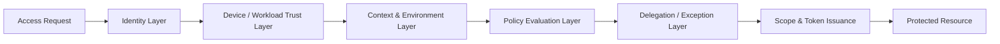
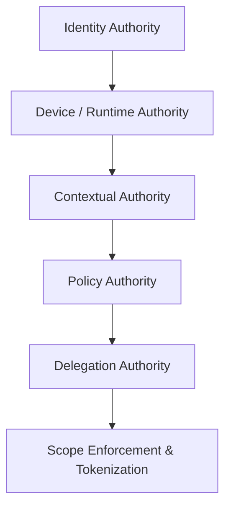
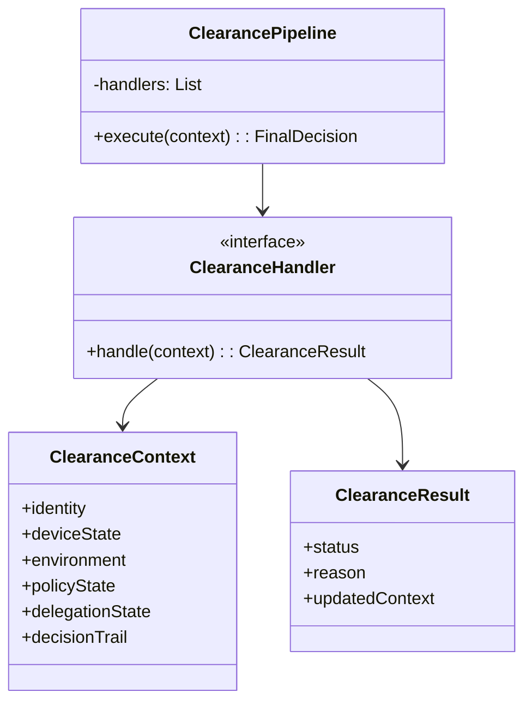
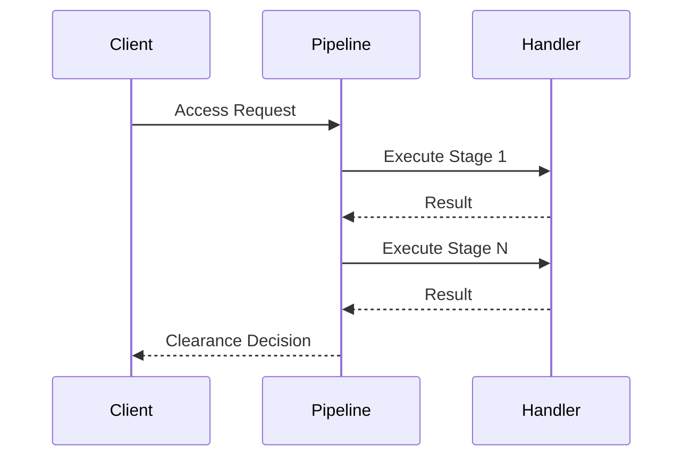
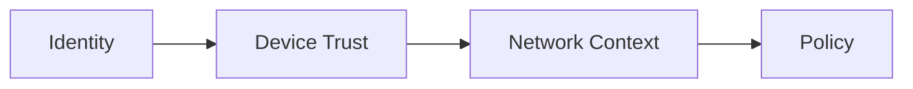
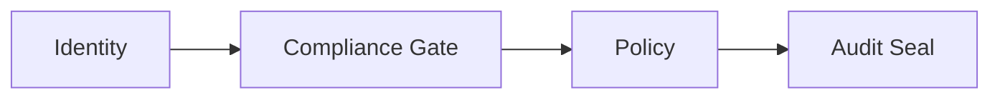
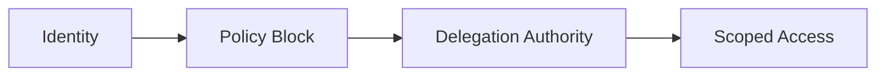
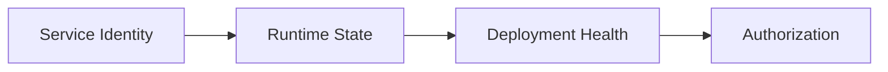

# Enterprise Access Clearance Pipeline

## 1. What is an Enterprise Access Clearance Pipeline?

An **Enterprise Access Clearance Pipeline** is a structured, deterministic decision system responsible for evaluating and authorizing access to protected enterprise resources. Unlike traditional authorization models that rely on a single evaluation step, this pipeline decomposes access decisions into a sequence of responsibility-owned stages. Each stage evaluates a distinct dimension of trust—such as identity validity, device posture, environmental context, policy compliance, or exceptional authority—and either resolves the decision or explicitly hands it off downstream.

The defining characteristics of the system are **ordered evaluation**, **explicit failure semantics**, and **native auditability**. Access is not treated as a binary outcome but as a progressive trust determination under uncertainty. This design allows enterprises to enforce governance, accommodate operational exceptions, and evolve access rules without collapsing security boundaries. The pipeline becomes the backbone of zero-trust, compliance-heavy, and incident-resilient environments.

---

## 2. Architecture Layout of the Enterprise Access Clearance Pipeline

At an architectural level, the Enterprise Access Clearance Pipeline is composed of **sequential clearance layers**, each owned by a distinct domain and evaluated in a strict order. Requests enter the system through a unified entry point and are wrapped into a shared **Clearance Context** that accumulates evidence and decisions as it moves forward.

The pipeline enforces _fail-fast_ behavior for high-risk conditions and _progressive refinement_ for contextual or ambiguous cases. Each layer emits a structured decision: `ALLOW`, `DENY`, `DEFER`, or `DELEGATE`. Only one layer may terminate the pipeline; all others must either enrich context or explicitly block progression.

### General Pipeline Architecture

### Layered Architecture View

Each layer is **logically isolated**, independently testable, and replaceable. No layer assumes the behavior of another. This separation enables cross-team ownership and regulatory alignment while preserving system composability.

---

## 3. Generalized Class Diagram and Operational Explanation

The system can be modeled using a small, disciplined object model centered around responsibility delegation and immutable context propagation.

### Generalized Class Diagram

### Operational Explanation

The **ClearancePipeline** is an orchestrator, not a decision-maker. It executes handlers in a fixed order and enforces termination semantics. Each **ClearanceHandler** owns a single concern and operates only on the provided `ClearanceContext`.

Handlers are stateless and deterministic. They inspect the context, append evidence or decisions, and return a `ClearanceResult`. A result may indicate success, failure, or delegation eligibility. The pipeline reacts to the result, either continuing or terminating execution.

Crucially, the **ClearanceContext is immutable or append-only** in mature systems. This ensures auditability and prevents retroactive decision mutation. The `decisionTrail` records every stage’s input and output, forming a complete decision narrative.

This design prevents hidden coupling, enables fine-grained testing, and makes responsibility boundaries explicit—key requirements for enterprise governance.

---

## 4. Usage and Workflow

In practice, the Enterprise Access Clearance Pipeline is invoked whenever a subject attempts to access a protected capability—API call, database query, internal tool, or service-to-service request.

The workflow begins with context construction: identity claims, device telemetry, request metadata, and environmental signals are collected. The pipeline then executes handlers sequentially. Most requests terminate early—either allowed quickly due to low risk or denied due to obvious violations.

Exceptional cases progress deeper into the pipeline, where policy conflicts or elevated risk may trigger delegation or scoped authorization. The final output is a **clearance artifact** (typically a signed token) encoding exactly what was approved.

### Workflow Diagram

---

## 5. Enterprise Adjustments and Variations

Enterprises adapt the pipeline based on domain constraints. Below are common variations.

### Zero Trust Workforce Access (e.g., Google-style)

Focus: device-first evaluation, continuous revalidation.

---

### Regulated Data Access (e.g., Financial / Healthcare)

Focus: legal precedence, audit integrity.

---

### Incident-Era Delegation Pipeline

Focus: emergency overrides with bounded scope and duration.

---

### Service-to-Service Zero Trust

Focus: workload identity, release safety.

---

Each variation preserves the same core invariants:

- Deterministic ordering

- Explicit ownership

- No implicit bypass

Only the **composition and semantics of stages change**, not the pipeline contract itself.

---

## 6. Final Summarization

An **Enterprise Access Clearance Pipeline** is a governance-first access system that determines _how_ access authority is exercised before deciding _whether_ access is granted.
It replaces implicit trust with ordered responsibility, making access decisions explainable, auditable, and resilient under operational pressure.

## 7. Reference & Extensions

| Resource Technique  |    Description                           |      Implementation           |     Synonymous Technology        |  Case Study           |
|---------------------|------------------------------------------|-------------------------------|----------------------------------|-----------------------|
| Trust Escalation    | Where the chain providing access to resources, not on basis of role like RBAC but by basis of constituents in requests |  [Springboot](https://github.com/VishuKalier2003/System-Design-Components/tree/main/ChainOfResponsibility/S-04EnterpriseAccessClearance/phaseA-Trust-Escalation) | Google BeyondCorp - security service of Google drive |  [Case-Study-I]() |

This pipeline mirrors patterns used in **AWS IAM**, **Zero Trust systems**, and **enterprise access brokers**, serving as a practical foundation for secure system design exploration.

---

