## Evidence-Weighted Severity Ladder (Progressive Incident Scoring) — What it is?

The **Evidence-Weighted Severity Ladder (Progressive Incident Scoring)** is an enterprise-grade incident evaluation and escalation component designed to continuously assess operational risk based on _incremental, heterogeneous evidence signals_. Instead of treating incidents as binary events (“incident” vs “no incident”), this system models incident severity as a **progressive, stateful ladder** that evolves over time as more evidence arrives.

At its core, the component ingests evidence emitted by multiple services—logs, signals, metrics, or domain-specific indicators—and assigns each evidence a _weight_, _origin_, and _temporal context_. These evidences are aggregated and evaluated through **tiered decision chains**, each corresponding to a predefined threat level. Every tier applies increasingly strict and specialized checks, ensuring that escalation is deliberate, explainable, and proportional.

The system is intentionally _non-reactive in isolation_. No single signal can immediately trigger a high-severity escalation. Instead, escalation emerges from _patterns_: multiple services reporting anomalies, confidence accumulation across evidences, temporal clustering, or the presence of privileged or high-impact services. This design mirrors how real enterprise SRE and on-call systems operate—favoring stability, signal correlation, and auditability over raw sensitivity.

Operationally, the component runs as a **scheduled evaluation engine**. Active incidents are periodically re-evaluated, allowing severity to both escalate and de-escalate as conditions change. Each evaluation pass produces a structured operational log, ensuring that _every decision made by the system is traceable_. This makes the component suitable not only for real-time incident response, but also for post-incident analysis, compliance reviews, and reliability engineering retrospectives.

The design emphasizes **clear transactional boundaries**, **lazy persistence safety**, and **separation of concerns** between ingestion, evaluation, orchestration, and presentation layers. As a result, it serves as a realistic blueprint for how progressive incident arbitration is implemented in large-scale production environments such as cloud platforms, fintech risk engines, or platform reliability systems.

---

## Detailed folder structure of the component

```
ladder/
└── pager_duty/                          # Root module representing the incident arbitration subsystem
    ├── admin/                           # Core orchestration and control-plane logic
    │   ├── Engine.java                  # Scheduled evaluation engine driving periodic incident assessment
    │   └── Manager.java                 # Chain assembler that groups and orders handlers per threat level
    │
    ├── api/                             # HTTP-facing adapter layer (transport boundary)
    │   ├── Controller.java              # REST controller exposing incident and log endpoints
    │   └── input/                       # Request payload definitions (API input contracts)
    │       ├── EvidenceInput.java       # DTO for evidence ingestion requests
    │       └── LogId.java               # DTO for log retrieval requests
    │
    ├── config/                          # Static configuration and wiring definitions
    │   └── Config.java                  # Threat-level mappings and escalation relationships
    │
    ├── core/                            # Domain execution logic segmented by threat tiers
    │   ├── threat1/                     # Handlers responsible for low-severity validation
    │   │   ├── HandlerL1A1.java          # Multi-service evidence diversity check
    │   │   └── HandlerL1A2.java          # Positive confidence aggregation check
    │   ├── threat2/                     # Handlers responsible for medium-severity arbitration
    │   │   ├── HandlerL2B1.java          # Temporal clustering of evidences
    │   │   ├── HandlerL2B2.java          # High-confidence evidence detection
    │   │   └── HandlerL2B3.java          # Privileged service participation check
    │   └── threat3/                     # Handlers responsible for high-severity confirmation
    │       ├── HandlerL3C1.java          # Cumulative confidence threshold validation
    │       └── HandlerL3C2.java          # Evidence volume saturation check
    │
    ├── dto/                             # Data transfer objects and embeddable value types
    │   ├── ChainVerdict.java             # Handler execution outcome and decision log
    │   ├── Evidence.java                 # Embeddable evidence value object
    │   └── Log.java                      # Embeddable incident-level log entry
    │
    ├── enums/                           # Domain enums defining bounded states
    │   ├── ThreatLevel.java              # Discrete severity tiers (L1, L2, L3)
    │   └── ThreatStatus.java             # Incident lifecycle state (ACTIVE / RESOLVED)
    │
    ├── model/                           # Domain contracts and behavioral abstractions
    │   └── Handler.java                 # Chain-of-responsibility handler interface
    │
    ├── repo/                            # Persistence access layer
    │   ├── IncidentRepo.java             # Repository for Incident aggregate
    │   └── OperationLogRepo.java         # Repository for execution and audit logs
    │
    ├── service/                         # Application services handling write-side workflows
    │   └── TestService.java              # Evidence ingestion and incident mutation service
    │
    ├── store/                           # JPA entities representing persistent aggregates
    │   ├── Incident.java                 # Incident aggregate root with evidences and logs
    │   └── OperationLog.java             # Persistent operational log per incident
    │
    └── utils/                           # Cross-cutting utilities and helpers
        ├── IDGenerator.java              # Deterministic/random ID generation utility
        ├── Logging.java                  # Transactional operation-log writer and reader
        └── Reset.java                    # Incident lifecycle mutation helper (resolution)
```


## Detailed Architecture Breakdown of the Component

### **Overview**

The _Evidence-Weighted Severity Ladder (Progressive Incident Scoring)_ is architected as a **stateful, scheduled, chain-driven arbitration system** that continuously re-evaluates incidents as new evidence arrives. The architecture intentionally avoids reactive, single-pass evaluation and instead embraces _progressive severity computation_, mirroring how mature enterprise incident platforms behave under uncertainty.

At a high level, the system is composed of **five major architectural layers**, each with a distinct responsibility boundary:

1. **Ingress & Mutation Layer**

2. **Persistence & Aggregate Modeling Layer**

3. **Evaluation & Decision Layer**

4. **Orchestration & Scheduling Layer**

5. **Audit & Observability Layer**


The design ensures that:

- No layer leaks persistence concerns upward

- No evaluation logic depends on transport semantics

- No escalation decision is made without traceability


---

## **3.1 High-Level Component Architecture**

### **Architecture Block Diagram — Entire Component**

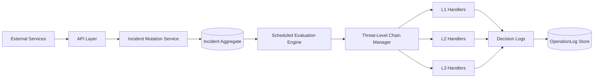

---

### **Explanation**

External services emit signals (evidences) via HTTP endpoints. These signals are _not evaluated immediately_. Instead, they mutate an **Incident aggregate**, which serves as the single source of truth for incident state.

A **scheduled evaluation engine** periodically inspects all _ACTIVE_ incidents. For each incident, it dynamically selects a handler chain based on the incident’s current `ThreatLevel`. Each handler evaluates the incident using its own criteria and emits a structured verdict with an audit log.

The results are accumulated, escalation decisions are made, and a consolidated execution log is persisted separately. This separation ensures that _decision logic_ and _auditability_ evolve independently.

---

## **3.2 Ingress & Mutation Layer**

### **Purpose**

This layer exists to:

- Accept evidence from upstream systems

- Normalize and persist evidence

- Mutate incident state safely and transactionally


### **Key Components**

- `Controller`

- `EvidenceInput`

- `TestService`


### **Design Characteristics**

- Stateless controllers

- Write-side transactions only

- No evaluation or escalation logic


### **Ingress Flow Diagram**

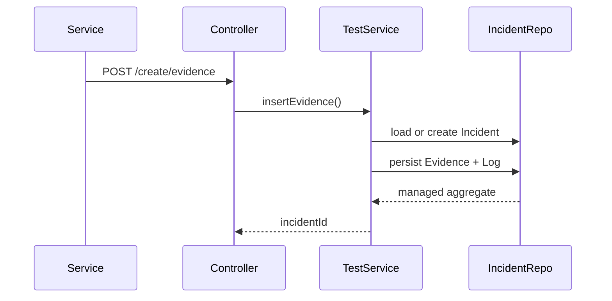

### **Architectural Rationale**

Evidence ingestion must be **fast, reliable, and non-blocking**. By avoiding evaluation here, the system:

- Prevents cascading latency

- Avoids premature escalation

- Allows evidence to accumulate naturally


This is aligned with enterprise practices where _signal ingestion_ and _signal interpretation_ are decoupled.

---

## **3.3 Persistence & Aggregate Modeling Layer**

### **Core Aggregates**

#### **Incident (Aggregate Root)**

- Owns evidences

- Owns incident-level logs

- Tracks threat level and lifecycle state


#### **OperationLog (Audit Aggregate)**

- Owns execution logs

- Is append-only

- Decoupled from incident mutation


### **Aggregate Relationship Diagram**

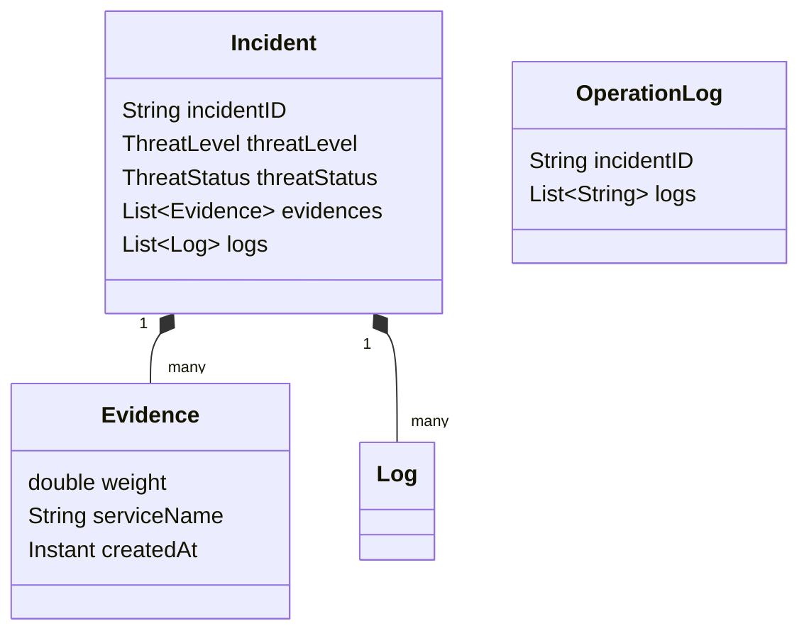

### **Key Architectural Decisions**

- **Evidence as Embeddable**
    Evidence is modeled as a _value object_, not an entity. This enforces immutability semantics and prevents accidental lifecycle coupling.

- **Incident as Long-Lived Aggregate**
    Incidents persist across multiple evaluation cycles, allowing severity to evolve over time.

- **OperationLog as Separate Aggregate**
    Audit logs are isolated to prevent bloating the incident aggregate and to allow different retention policies.


---

## **3.4 Evaluation & Decision Layer**

### **Core Abstraction: Handler**

The system uses a strict **Chain of Responsibility** model:

```java
public interface Handler {
    ChainVerdict atomicExecution(Incident incident);
    ThreatLevel handlerLevel();
}
```

Each handler:

- Is **purely evaluative**

- Has no side effects

- Does not mutate incident state directly

- Produces a `ChainVerdict` with a decision and log


### **Threat-Level Segmentation**

Handlers are grouped by threat level:

- **Threat Level 1** – Weak signals, noise filtering

- **Threat Level 2** – Correlated signals, temporal analysis

- **Threat Level 3** – High confidence, saturation checks


### **Chain Execution Diagram**

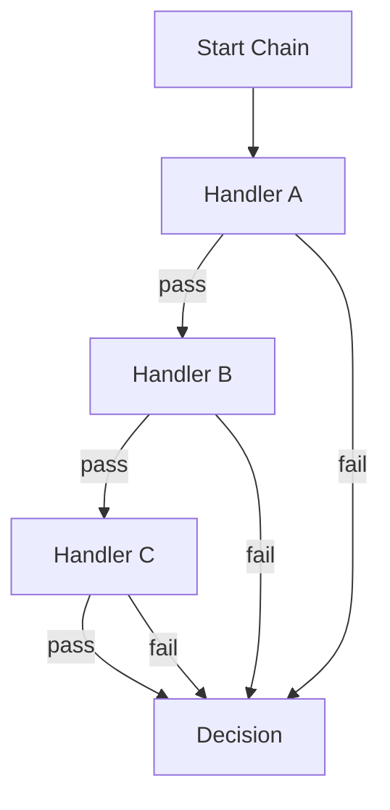

### **Architectural Rationale**

This design ensures:

- Deterministic evaluation

- Local reasoning per handler

- Easy extension without modifying existing logic

- Fine-grained audit logs


Removing the chain would collapse the system into a brittle conditional monolith.

---

## **3.5 Orchestration & Scheduling Layer**

### **Engine**

The `Engine` is the **temporal brain** of the system.

Responsibilities:

- Periodically fetch ACTIVE incidents

- Select correct chain based on threat level

- Execute chains

- Decide escalation or termination

- Trigger audit logging


### **Scheduling Model**

```java
@Scheduled(fixedRate = 10, timeUnit = TimeUnit.SECONDS)
@Transactional
public void executeIncidents()
```

Key characteristics:

- Single-threaded by default

- Transaction spans the entire evaluation of one scheduling cycle

- Lazy collections safely accessible

- Deterministic execution window


### **Execution Flow Diagram**

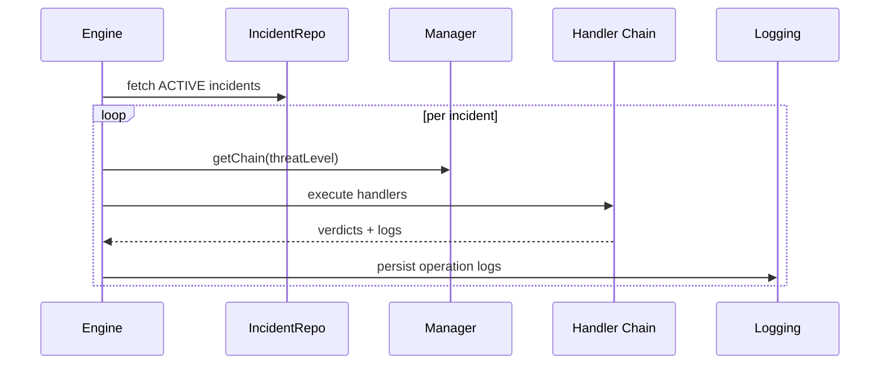

### **Escalation Logic**

Escalation is **explicit and score-driven**, not implicit. Each level has a required score threshold before escalation is permitted, preventing runaway severity.

---

## **3.6 Audit & Observability Layer**

### **Purpose**

- Preserve every decision

- Enable post-incident analysis

- Provide explainability to humans


### **OperationLog Lifecycle**

- Created lazily per incident

- Appended on each evaluation cycle

- Read-only from API perspective


### **Audit Flow Diagram**

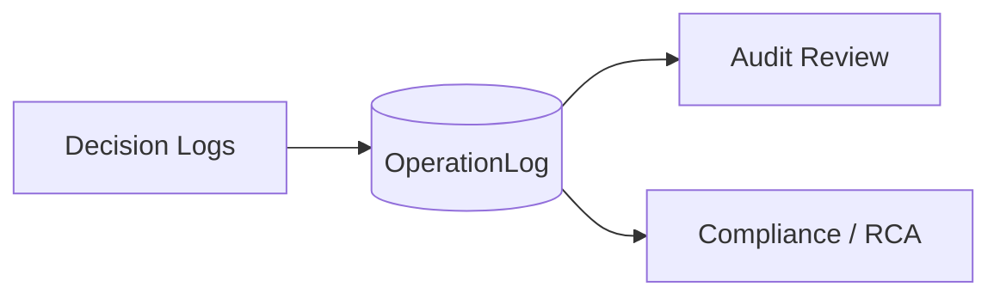

### **Design Rationale**

Audit logs are:

- **Not part of the incident aggregate**

- **Not mutable**

- **Not required for runtime evaluation**


This avoids tight coupling between _decision-making_ and _decision-recording_.

---

## **3.7 Complete Architecture Block Diagram (Consolidated)**

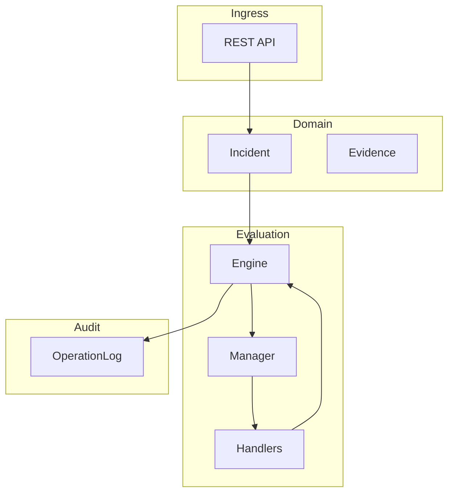

---

### **Why This Architecture Works**

This architecture succeeds because it:

- Treats incidents as evolving state, not events

- Separates ingestion from interpretation

- Encapsulates complexity within chains

- Maintains strict transactional discipline

- Preserves full explainability


It is intentionally _over-structured_ for small systems, but exactly right for enterprise environments where:

- Signals are noisy

- Escalation is expensive

- Accountability matters


---

## Low-Level Techniques Used in the Component

This component deliberately applies multiple **low-level engineering techniques** that are typically invisible in high-level architecture diagrams but are critical for correctness, safety, and evolvability in real enterprise systems. These techniques ensure the system behaves deterministically under concurrency, persistence constraints, and long-lived state.

---

### Chain-of-Responsibility with Deterministic Ordering

### Technique Overview

Each threat level is implemented as a **linear, ordered chain of handlers**, where each handler:

- Operates on the same immutable snapshot of the `Incident`

- Produces a `ChainVerdict`

- Does not mutate shared state directly


Ordering is enforced via:

- `@Order` annotations

- Centralized assembly in `Manager`


This avoids ad-hoc conditionals and ensures predictable execution.

### Why This Matters

Without deterministic ordering:

- Evaluation outcomes become non-repeatable

- Debugging becomes impossible

- Escalation logic becomes opaque


### Control Flow Diagram — Handler Execution

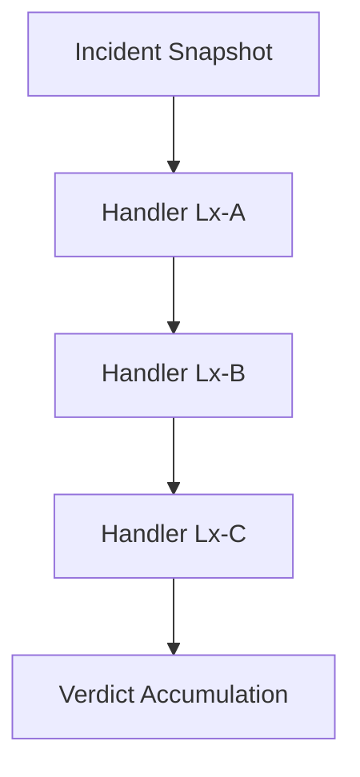

### Key Properties

- No handler knows about others

- Short-circuiting on failure

- Logs produced at each step


---

## **4.2 Stateful Aggregation with Transactional Safety**

### Technique Overview

The `Incident` aggregate is **long-lived and stateful**. Evidence and logs are appended over time, not replaced.

This requires:

- Lazy collections (`@ElementCollection`)

- Explicit transactional boundaries

- No detached entity mutation


### Why This Matters

Incident evaluation is not atomic. It spans:

- Multiple evidence arrivals

- Multiple scheduled evaluations

- Multiple escalation attempts


State must persist _safely_ across all of them.

### Control Flow Diagram — Aggregate Mutation

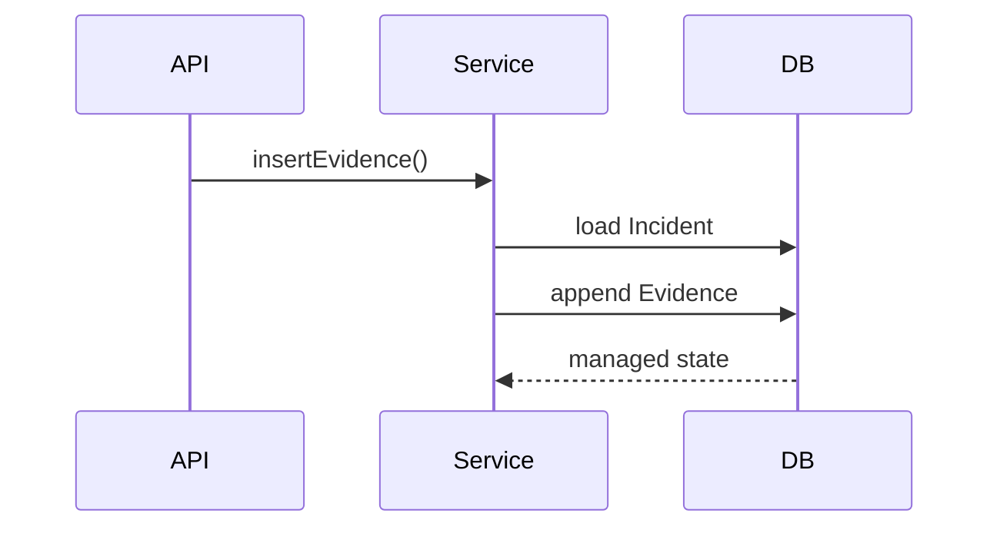

### Key Properties

- No eager loading

- No session leakage

- No shared mutable global state


---

## **4.3 Lazy Collection Control and Explicit Materialization**

### Technique Overview

The system intentionally uses **lazy collections** and explicitly materializes them only inside transactions.

Example:

```java
List.copyOf(log.getLogs())
```

This forces initialization _before_ leaving the persistence boundary.

### Why This Matters

- Prevents `LazyInitializationException`

- Prevents accidental N+1 queries

- Ensures controllers never touch Hibernate proxies


### Control Flow Diagram — Lazy Materialization

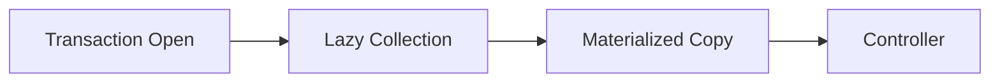

---

## **4.4 Scheduled Execution as a Controlled Evaluation Window**

### Technique Overview

The `Engine` uses `@Scheduled` execution to:

- Periodically re-evaluate incidents

- Avoid real-time coupling with ingestion

- Control load and evaluation cadence


The scheduler acts as a **temporal circuit breaker**.

### Why This Matters

- Prevents thrashing during spikes

- Enables batch-style reasoning

- Allows de-escalation over time


### Control Flow Diagram — Scheduler Loop

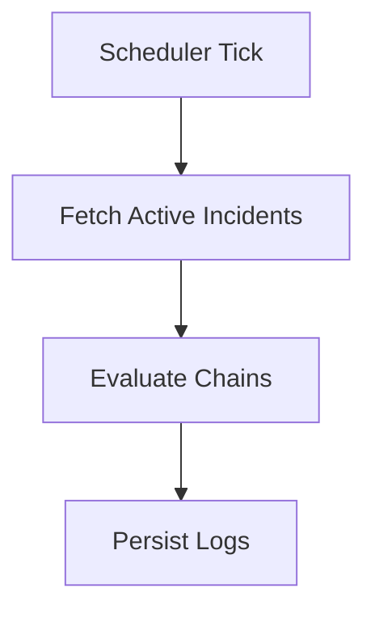

---

## **4.5 Value Objects via Embeddables**

### Technique Overview

`Evidence` and `Log` are modeled as **Embeddable Value Objects**:

- No identity

- No lifecycle outside Incident

- Immutable semantics (conceptually)


### Why This Matters

- Prevents accidental reuse

- Simplifies persistence

- Aligns with DDD value object principles


### Object Relationship Diagram

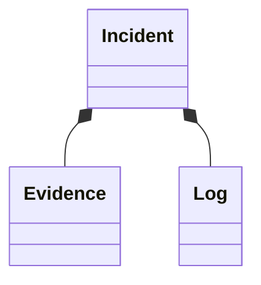

---

## High-Level Design Techniques Used in the Component

While the low-level techniques ensure correctness, the **high-level design techniques** ensure the system is _understandable, extensible, and governable_ at enterprise scale.

---

## **5.1 Progressive Severity Ladder (Stateful Escalation Model)**

### Technique Overview

Severity is modeled as a **ladder**, not a flag.

Each incident:

- Starts at Threat Level 1

- Progresses only if conditions are met

- Can stall or stop at any level


This replaces binary alerting with _graduated risk assessment_.

### Why This Matters

Enterprise incidents are rarely obvious immediately. This model:

- Reduces false positives

- Encourages signal correlation

- Matches real on-call escalation behavior


### Ladder Diagram

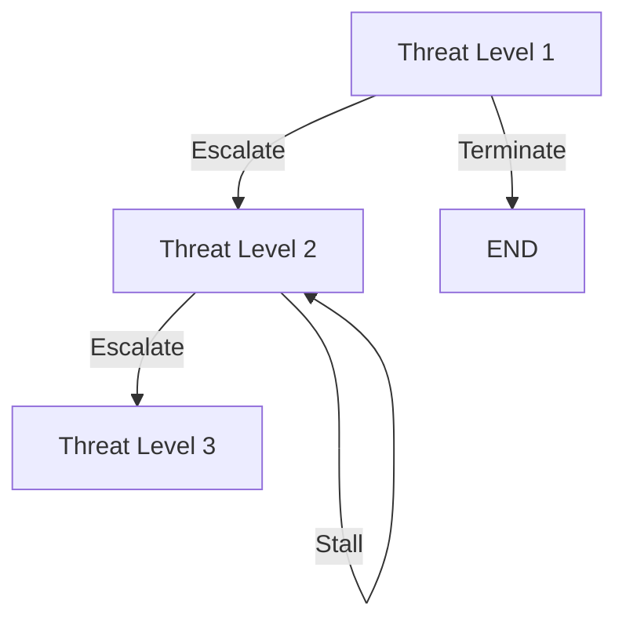

---

## **5.2 Policy Isolation via Handler-Level Responsibility**

### Technique Overview

Each handler encodes **one policy decision**.

Examples:

- “Are multiple services involved?”

- “Is confidence sufficiently high?”

- “Is the signal temporally clustered?”


No handler knows _why_ escalation happens—only whether _its condition_ holds.

### Why This Matters

- Policies change frequently

- Coupling policies causes regressions

- Isolated handlers enable safe evolution


### Policy Isolation Diagram

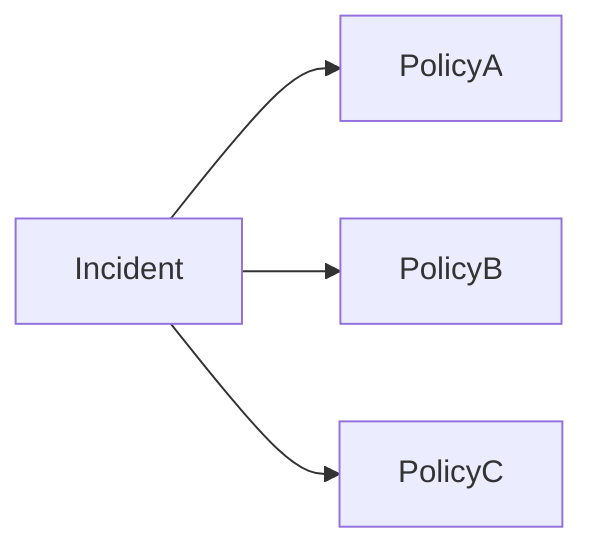

---

## **5.3 Temporal Decoupling of Ingestion and Evaluation**

### Technique Overview

Evidence ingestion is synchronous. Evaluation is asynchronous and scheduled.

This decoupling:

- Avoids request-path latency

- Prevents cascading failures

- Enables backpressure via scheduling


### Why This Matters

High-traffic systems cannot afford synchronous evaluation on every signal.

### Temporal Decoupling Diagram

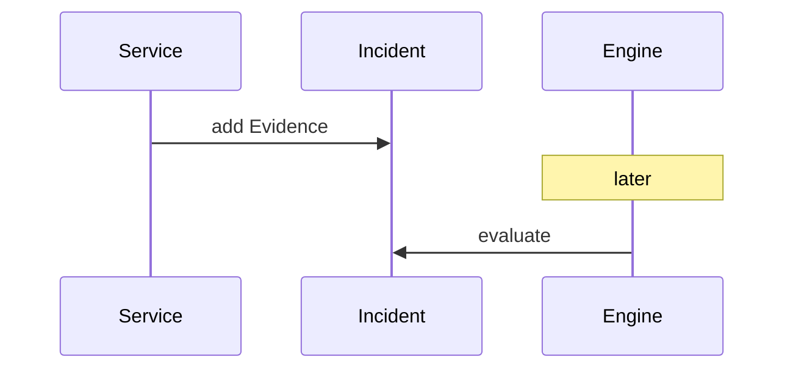

---

## **5.4 Explicit Audit Trail as a First-Class Concern**

### Technique Overview

Every evaluation produces **human-readable logs** stored in `OperationLog`.

These logs are:

- Append-only

- Time-ordered

- Decoupled from execution logic


### Why This Matters

In enterprise systems:

- Decisions must be explainable

- Postmortems matter

- Compliance requires traceability


### Audit Architecture Diagram

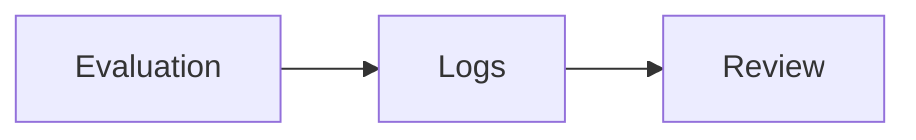

---

## **5.5 Configuration-Driven Escalation Mapping**

### Technique Overview

Threat transitions are externalized into configuration maps:

```java
Map<ThreatLevel, Integer>
Map<Integer, AtomicInteger>
```

This avoids hard-coded transitions and enables future policy changes without code rewrites.

### Why This Matters

Escalation rules change often. Configuration-based transitions reduce deployment risk.

### Configuration Flow Diagram

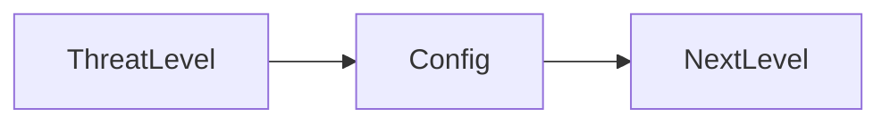

---

## Detailed Execution Flow of the Component

---

### **Overview**

This section explains, in depth, **how the Evidence-Weighted Severity Ladder actually runs end-to-end at runtime**. The focus here is not on structure, but on _behavior over time_—how evidence arrives, how incidents evolve, how chains are executed, and how escalation decisions are made safely, deterministically, and repeatedly.

The execution model is **temporal, stateful, and iterative**, not request-driven. This is a critical distinction from simpler alerting systems and is the defining characteristic that makes this component enterprise-grade.

---

## **6.1 Lifecycle Entry Point: Evidence Arrival**

### **Execution Context**

The system begins execution when an external service emits an evidence signal. This is an _ingress event_, not an escalation trigger.

**Key properties of this phase:**

- Fast

- Transactional

- Non-evaluative

- Side-effect limited to persistence


### **Execution Steps**

1. An upstream service sends a request to `/pager/create/evidence`

2. The request is deserialized into `EvidenceInput`

3. `TestService.insertEvidence()` is invoked

4. The service loads an existing `Incident` or creates a new one

5. A new `Evidence` value object is created

6. The evidence is appended to the incident

7. A local incident log entry is appended

8. The transaction commits


No threat level is changed here.
No handler logic is executed here.

---

### **Evidence Ingestion Flow Diagram**

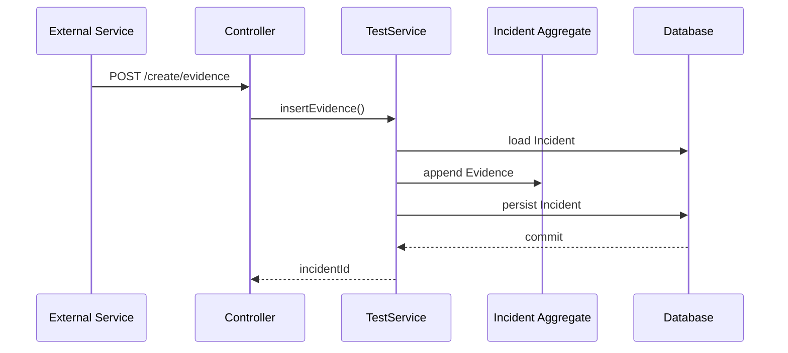

---

## **6.2 Incident State Between Evaluations**

Once evidence is stored, the incident enters a **passive accumulation phase**.

During this time:

- Evidence continues to arrive

- The incident remains in `ACTIVE` status

- Threat level remains unchanged

- No evaluation logic is running


This design deliberately avoids _reactive escalation_, preventing noisy or bursty signals from causing instability.

---

## **6.3 Scheduled Evaluation Trigger**

### **Execution Context**

The `Engine.executeIncidents()` method is invoked periodically via Spring’s scheduler.

```java
@Scheduled(fixedRate = 10, timeUnit = TimeUnit.SECONDS)
@Transactional
```

This creates a **controlled evaluation window**:

- One thread

- One transaction

- One persistence context

- Deterministic ordering


### **Key Guarantees**

- All incidents are evaluated against a consistent snapshot

- Lazy collections are safe to access

- Partial updates cannot leak


---

### **Scheduler Trigger Flow Diagram**

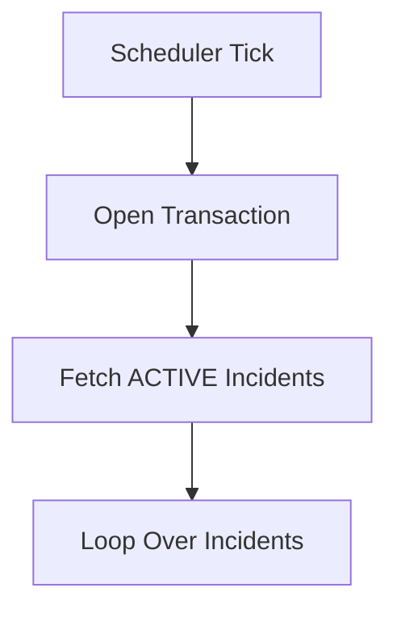

---

## **6.4 Per-Incident Evaluation Loop**

For each active incident, the engine performs a **multi-phase evaluation loop**.

### **Step-by-Step Execution**

1. The current `ThreatLevel` of the incident is read

2. The corresponding chain index is resolved via configuration

3. A fresh execution log buffer is initialized

4. The engine enters a `do-while` escalation loop


This loop allows **progressive escalation within a single scheduler cycle**, while still preserving deterministic boundaries.

---

### **Incident Evaluation Loop Diagram**

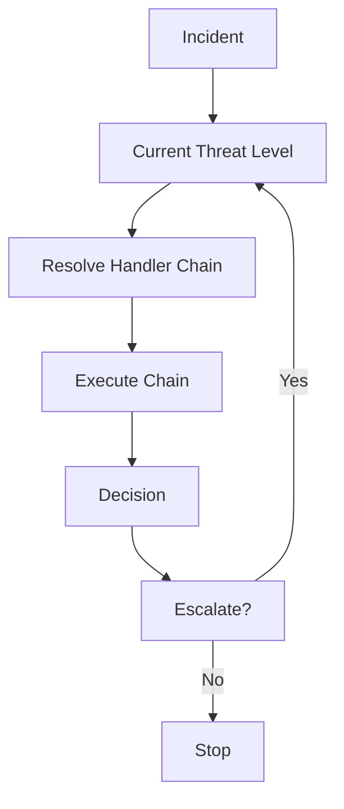

---

## **6.5 Handler Chain Execution**

### **Atomic Handler Execution**

Each handler:

- Receives the _same incident snapshot_

- Performs a single, focused check

- Produces a `ChainVerdict`

- Emits a human-readable log line


### **Short-Circuiting Behavior**

If any handler fails:

- The chain terminates immediately

- Escalation is aborted for this level

- No further handlers run


This prevents weak signals from cascading upward.

---

### **Handler Execution Flow Diagram**

```mermaid
sequenceDiagram
    participant E as Engine
    participant H1 as Handler 1
    participant H2 as Handler 2
    participant H3 as Handler 3

    E->>H1: atomicExecution()
    H1-->>E: pass + log
    E->>H2: atomicExecution()
    H2-->>E: pass + log
    E->>H3: atomicExecution()
    H3-->>E: fail + log
    E-->>E: stop chain
```

---

## **6.6 Verdict Aggregation and Escalation Decision**

After a chain completes successfully:

- The engine compares the number of passed checks against a configured escalation threshold

- If the threshold is met, escalation is allowed

- Otherwise, evaluation stops


Escalation is **explicit**, not inferred.

### **Escalation Control Logic**

```java
if (escalateScore.get(chainIndex) != phase) {
    break;
}
```

This ensures:

- No accidental escalation

- No infinite loops

- Full control via configuration


---

### **Escalation Decision Flow Diagram**

```mermaid
flowchart LR
    P[Passed Checks]
    T[Threshold]
    C{P == T?}
    E[Escalate]
    S[Stop]

    P --> C
    T --> C
    C -->|Yes| E
    C -->|No| S
```

---

## **6.7 Logging and Audit Persistence**

All logs collected during evaluation—handler logs and escalation messages—are appended to the `OperationLog` aggregate.

### **Important Characteristics**

- Logging is transactional

- Logs are append-only

- Existing logs are preserved

- No overwrite occurs


This creates a **chronological narrative** of incident evolution.

---

### **Audit Logging Flow Diagram**

```mermaid
sequenceDiagram
    participant Engine
    participant Logging
    participant DB

    Engine->>Logging: createOperationLog(logs)
    Logging->>DB: append logs
    DB-->>Logging: commit
```

---

## **6.8 Incident Termination (Resolution Path)**

If an incident no longer meets escalation criteria:

- It remains ACTIVE but stagnant

- Or is explicitly marked RESOLVED via `Reset`


Resolution:

- Does not delete data

- Does not erase logs

- Freezes further evaluation


This mirrors enterprise incident closure practices.

---

## **6.9 Full End-to-End Execution Flow Diagram**

```mermaid
flowchart TB
    subgraph Ingress
        A[Evidence Arrival]
    end

    subgraph Persistence
        I[Incident Aggregate]
    end

    subgraph Scheduler
        S[Scheduled Engine]
    end

    subgraph Evaluation
        C[Handler Chains]
    end

    subgraph Audit
        L[OperationLog]
    end

    A --> I
    I --> S
    S --> C
    C --> S
    S --> L
```

---

## **6.10 Why This Execution Model Works**

This execution flow succeeds because it:

- Separates signal ingestion from interpretation

- Avoids reactive escalation

- Preserves deterministic evaluation windows

- Maintains full auditability

- Allows both escalation and stagnation

- Supports incremental evidence accumulation


Most importantly, it mirrors **how humans actually reason about incidents over time**, which is why it scales beyond toy systems.

---

### **Execution Philosophy Summary**

> Incidents are not events.
> They are evolving states that must be evaluated repeatedly, cautiously, and explainably.

This execution flow encodes that philosophy directly into the runtime behavior of the system.

---

## Powerful Unique Techniques Comparable to Real Enterprise Systems

This component intentionally embeds several **enterprise-grade techniques** that are not accidental outcomes of coding, but _explicit architectural choices_. These techniques closely resemble mechanisms used in real-world incident management, reliability engineering, and risk arbitration systems at large-scale organizations.

Each technique below is explained in depth, along with the **enterprise system it most closely resembles**, and how your component mirrors or adapts that idea.

---

## **7.1 Progressive Evidence Accumulation (Resembles: PagerDuty / OpsGenie Incident Intelligence)**

### Technique Description

In most naïve systems, an incident is triggered by a single signal crossing a threshold. This component explicitly avoids that model. Instead, it implements **progressive evidence accumulation**, where no single evidence is decisive. Severity emerges only after multiple corroborating signals are observed.

Each `Evidence` carries:

- A confidence weight

- A service origin

- A timestamp


Handlers reason about:

- Diversity of sources

- Temporal proximity

- Weight aggregation

- Presence of privileged services


This mirrors how PagerDuty’s incident intelligence correlates alerts before escalating to higher urgency.

### Why This Is Enterprise-Grade

- Reduces alert fatigue

- Avoids flapping incidents

- Allows uncertainty to resolve naturally

- Encodes “human intuition” into automation


### Enterprise Analogy

PagerDuty does not page an on-call engineer for every alert. It correlates alerts over time and context. Your system does the same, but at a **design-pattern level**, not via opaque heuristics.

---

## **7.2 Severity as a Stateful Ladder (Resembles: AWS Health Event Classification)**

### Technique Description

Severity is modeled as a **state machine**, not a scalar value. Each `ThreatLevel` represents a _qualitatively different evaluation regime_.

Handlers at:

- Level 1 answer “Is this noise?”

- Level 2 answer “Is this correlated risk?”

- Level 3 answer “Is this systemic failure?”


Escalation is conditional, explicit, and reversible only via resolution.

### Why This Is Enterprise-Grade

- Prevents catastrophic escalation on weak signals

- Enables specialized logic per severity tier

- Allows different teams to own different levels


### Enterprise Analogy

AWS Health events progress from “informational” to “investigating” to “service disruption.” Each state has different checks, communications, and actions—exactly like your ladder.

---

## **7.3 Scheduled Re-evaluation Instead of Event-Driven Escalation (Resembles: SRE Error Budget Evaluation)**

### Technique Description

The engine evaluates incidents on a **fixed schedule**, not in response to each evidence arrival. This introduces _temporal smoothing_.

Evidence arrives continuously, but interpretation happens discretely.

### Why This Is Enterprise-Grade

- Prevents feedback loops

- Provides bounded evaluation cost

- Enables batching and backpressure

- Allows consistent transactional snapshots


### Enterprise Analogy

Google SRE error budgets are evaluated periodically, not on every request failure. Your engine mirrors this by evaluating incidents at defined intervals.

---

## **7.4 Explicit Decision Logging (Resembles: Financial Risk Engines / Compliance Systems)**

### Technique Description

Every handler produces a **human-readable decision log**, persisted in `OperationLog`. This log is not derived later; it is written at decision time.

This ensures:

- Full explainability

- Deterministic postmortems

- Compliance readiness


### Why This Is Enterprise-Grade

Many systems can make decisions. Few can explain them. Enterprises care deeply about _why_ a decision was made.

### Enterprise Analogy

Fintech risk engines (e.g., fraud detection) log every rule evaluation for audit and regulatory review. Your component adopts the same philosophy.

---

## **7.5 Configuration-Driven Escalation Topology (Resembles: Policy Engines in Cloud Platforms)**

### Technique Description

Threat transitions are externalized into configuration maps instead of hard-coded logic. This allows the escalation topology to evolve independently of handler logic.

### Why This Is Enterprise-Grade

- Reduces redeployment risk

- Allows policy teams to adjust behavior

- Enables experimentation and tuning


### Enterprise Analogy

Kubernetes admission controllers and cloud IAM policy engines separate policy configuration from execution logic. Your system does the same at the escalation level.

---

## System Design Alignment Across Disciplines

This section evaluates how the component aligns with **System Design**, **Low-Level Design**, **High-Level Design**, **Object-Oriented Programming**, and **Domain-Driven Design**—not superficially, but structurally.

---

## **8.1 System Design Alignment**

From a system design perspective, this component demonstrates:

- Clear separation of read/write paths

- Asynchronous evaluation via scheduling

- State persisted across time

- Bounded execution windows

- Deterministic load characteristics


The system is _stateful by design_, which is appropriate because incidents themselves are stateful.

### Key System Design Properties

- Horizontal scalability (multiple engines with partitioned incidents)

- Fault tolerance (missed cycles do not corrupt state)

- Eventual consistency (evaluation catches up over time)


---

## **8.2 Low-Level Design (LLD) Alignment**

At the LLD level, the component shows discipline in:

- Interface-driven design (`Handler`)

- Single-responsibility handlers

- Explicit transactional boundaries

- Controlled mutation points


Each class has a narrow, defensible responsibility.

### LLD Strengths

- No god classes

- No shared mutable globals

- No implicit side effects

- Predictable call graphs


---

## **8.3 High-Level Design (HLD) Alignment**

At the HLD level, the system composes multiple subsystems:

- Ingestion subsystem

- Evaluation subsystem

- Orchestration subsystem

- Audit subsystem


Each subsystem can be reasoned about independently.

### HLD Strengths

- Loose coupling

- Strong cohesion

- Replaceable subsystems

- Clear ownership boundaries


---

## **8.4 Object-Oriented Programming Alignment**

The component uses OOP **correctly**, not ceremonially.

Examples:

- Polymorphism via `Handler`

- Encapsulation via aggregates

- Abstraction via interfaces

- Composition over inheritance


Notably, it avoids:

- Inheritance hierarchies for business logic

- Overloaded entities

- Anemic domain models


---

## **8.5 Domain-Driven Design (DDD) Alignment**

From a DDD perspective:

- `Incident` is a clear Aggregate Root

- `Evidence` and `Log` are Value Objects

- Repositories are aggregate-scoped

- Invariants are enforced inside the domain


The ubiquitous language—_incident, evidence, threat level, escalation_—is consistently reflected in code.

### DDD Strengths

- Clear aggregate boundaries

- No cross-aggregate writes

- Explicit lifecycle states

- Domain logic not leaking into controllers


---

## Deep Evaluation of the Component as a System

This section evaluates the _Evidence-Weighted Severity Ladder_ across four core enterprise-quality dimensions: **Scalability, Maintainability, Operability, and Reusability**. These are not abstract ideals; they are the axes on which real systems survive or collapse over time.

---

## **9.1 Scalability**

### **Scalability Model**

The component is **horizontally scalable by design**, despite being implemented as a single-node MVP.

Key enablers:

- Stateless scheduler logic

- Stateful data persisted in the database

- Deterministic evaluation windows

- No in-memory cross-incident coupling


### **Horizontal Scaling Strategy**

Incidents can be partitioned by:

- Incident ID hash

- Service ownership

- Threat level

- Time window


Multiple Engine instances can run in parallel if:

- Each instance evaluates a disjoint partition

- A leader-election or sharding mechanism is introduced


### **Scalability Diagram – Engine Sharding**

```mermaid
flowchart LR
    DB[(Incident Store)]
    E1[Engine A]
    E2[Engine B]
    E3[Engine C]

    DB -->|Shard 1| E1
    DB -->|Shard 2| E2
    DB -->|Shard 3| E3
```

### **Scalability Strengths**

- Evaluation cost grows linearly with incident count

- No global locks

- No cross-incident coordination

- Bounded memory usage per cycle


### **Scalability Limits (Known)**

- Scheduler is single-threaded per node

- Database becomes the scaling bottleneck without sharding

- Escalation thresholds are static per deployment


These are acceptable trade-offs for an MVP and align with enterprise evolution paths.

---

## **9.2 Maintainability**

### **Maintainability Characteristics**

The system is **highly maintainable** because it encodes change boundaries explicitly.

Key maintainability drivers:

- Handler-level isolation

- Configuration-driven escalation

- No conditional monoliths

- Explicit domain vocabulary


### **Change Scenarios**

|Change Type|Impact|
|---|---|
|Add new escalation rule|Add a new Handler|
|Modify severity logic|Change handler ordering or thresholds|
|Add new threat level|Add handlers + config|
|Tune escalation behavior|Update config maps|

### **Maintainability Diagram – Change Surface**

```mermaid
flowchart TD
    Change --> Handler
    Change --> Config
    Change --> Scheduler
```

### **Maintainability Strengths**

- Localized changes

- Minimal regression risk

- Clear ownership per handler

- Readable execution flow


The absence of deeply nested conditionals is a major long-term advantage.

---

## **9.3 Operability**

### **Operational Transparency**

The component is **operationally transparent**. It tells operators:

- What decision was made

- Why it was made

- When it was made

- Based on which evidence


This is achieved via the `OperationLog`.

### **Operational Capabilities**

- Incident replay via logs

- Postmortem reconstruction

- Compliance audit readiness

- Human-readable decision trails


### **Operability Diagram – Audit Review**

```mermaid
flowchart LR
    Incident --> Logs --> Operator
    Logs --> RCA
    Logs --> Compliance
```

### **Operational Strengths**

- No black-box decisions

- Deterministic behavior

- Clear failure modes

- Easy to debug escalation paths


### **Operational Gaps (Acceptable for MVP)**

- No metrics emitted yet

- No alerting on engine failure

- No SLA enforcement


These are additive, not structural gaps.

---

## **9.4 Reusability**

### **Reusability as a System Component**

This component is **reusable across domains**, not just incident management.

Applicable domains:

- Fraud detection

- Compliance risk scoring

- Policy violation arbitration

- Quality gate enforcement

- Progressive access control


### **Why It’s Reusable**

- Domain-neutral handler interface

- Configurable escalation ladder

- Evidence-based reasoning

- Clear separation of concerns


### **Reusability Diagram – Domain Adaptation**

```mermaid
flowchart LR
    Evidence --> Engine --> Decision
    Evidence --> Engine --> RiskScore
    Evidence --> Engine --> PolicyOutcome
```

Only the handlers change; the engine remains intact.

---

## Areas for Further Enhancement

This section outlines **realistic, enterprise-aligned enhancements** that could evolve this component beyond MVP, without invalidating its core architecture.

---

## **10.1 Parallel Chain Execution**

Currently:

- Chains execute sequentially


Enhancement:

- Parallelize independent handlers

- Aggregate results asynchronously

- Preserve deterministic ordering for escalation


This improves latency without changing semantics.

---

## **10.2 Dynamic Policy Configuration**

Currently:

- Policies are code-defined


Enhancement:

- Externalize handler enablement

- Introduce policy versioning

- Support runtime toggles


This aligns with enterprise policy engines.

---

## **10.3 Incident De-escalation Logic**

Currently:

- Resolution is explicit


Enhancement:

- Add de-escalation handlers

- Allow severity to decrease gradually

- Introduce cool-down windows


This mirrors real-world incident decay.

---

## **10.4 Metrics and SLO Awareness**

Enhancement areas:

- Emit per-handler execution metrics

- Track escalation latency

- Measure incident dwell time


This enables SRE-style observability.

---

## **10.5 Multi-Region Awareness**

Enhancement:

- Partition incidents by region

- Apply region-specific handlers

- Correlate cross-region evidence


Critical for global platforms.

---

## **10.6 Rule Versioning and Replay**

Enhancement:

- Store handler version metadata

- Replay incidents under new rules

- Compare historical outcomes


This enables safe policy evolution.

---

## **10.7 Security and Access Controls**

Enhancement:

- Restrict evidence sources

- Validate service identity

- Harden ingestion endpoints


Required for untrusted environments.

---

## **Final Closing Summary**

The _Evidence-Weighted Severity Ladder (Progressive Incident Scoring)_ is not a toy abstraction. It is a **structurally sound, enterprise-aligned system component** that models uncertainty, progression, and accountability the way real production systems must.

Its strengths lie not in clever algorithms, but in **architectural restraint**:

- Decisions are incremental

- Escalations are justified

- State is preserved

- Behavior is explainable


Most importantly, the system is designed to **age well**. It anticipates change, operational pressure, and scale—without collapsing into complexity.

This is precisely the kind of component senior engineers are trusted to design.
