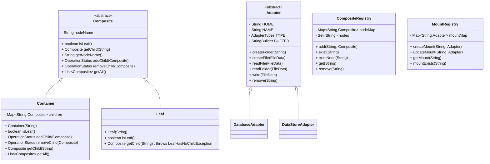
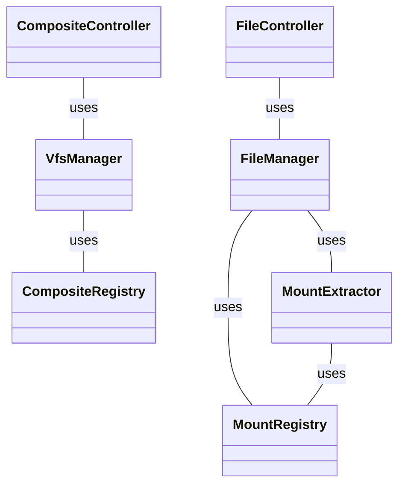
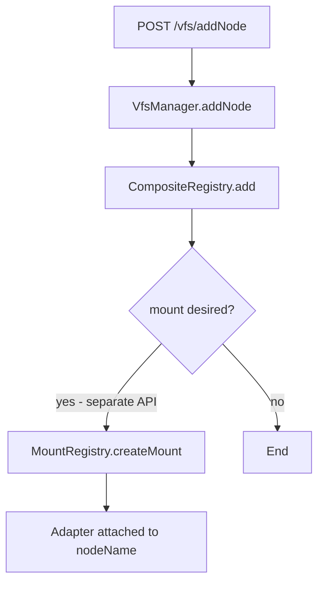
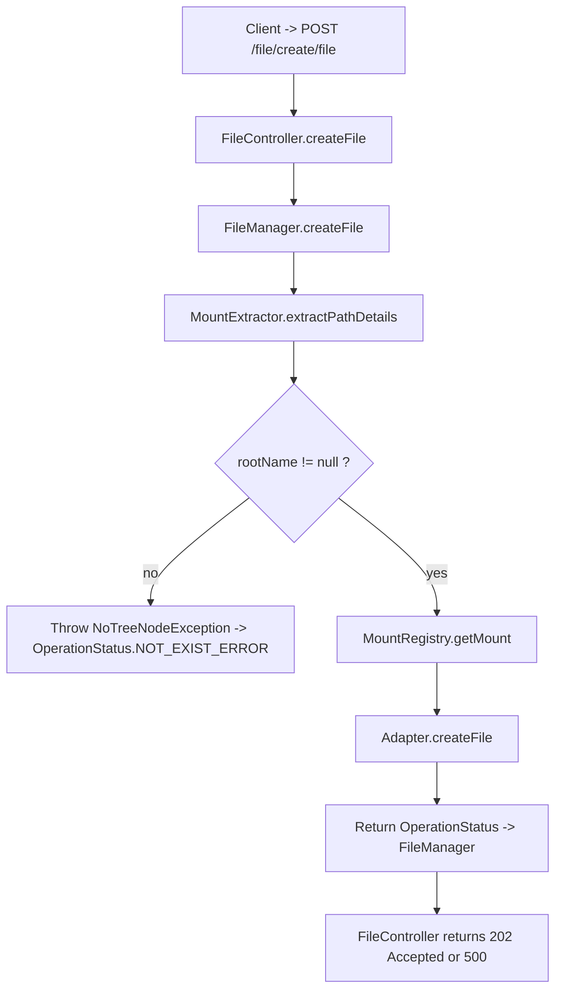
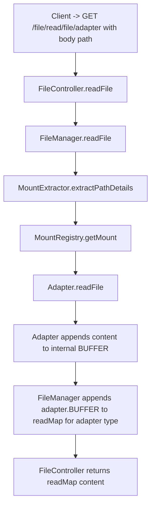
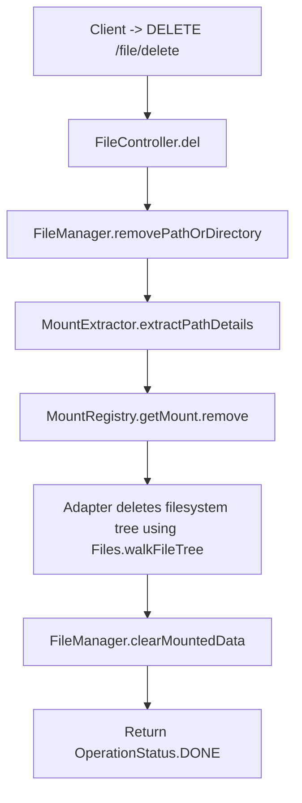
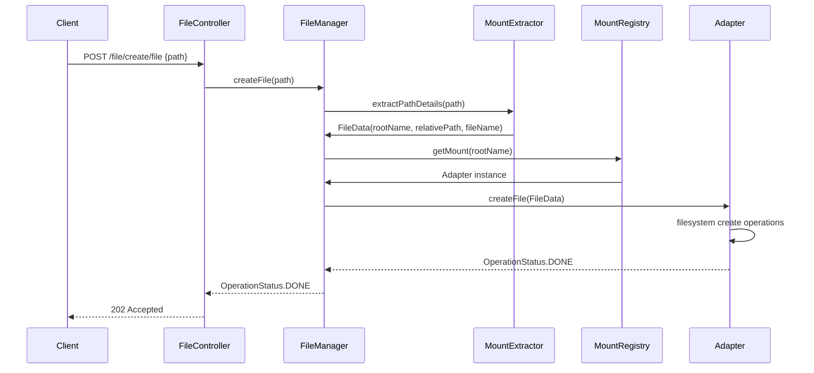

# Virtual File System —  Design Documentation

**Project:** Virtual Filesystem Tree — Unified Virtual Filesystem Gateway
**Scope:** Design document, component descriptions, class diagrams, control-flow charts, folder structure, and usage notes for the provided Spring Boot prototype.

---

# Table of Contents

1. Introduction (summary)

2. Goals and Design Constraints

3. High-level Architecture

4. Folder structure (with one-line description per file/class)

5. Core techniques explained

    - Composite Tree (hierarchical node model)

    - Adapter pattern and external storage modeling

    - Mounting model (node mounting)

    - Path extraction and resolution

6. Class-level diagrams (Mermaid + code blocks)

7. Control-flow diagrams (operations)

    - Mount creation flow

    - Create file flow

    - Read file flow

    - Delete path flow

8. API surface and sample usage

9. Testing & observability notes

10. Extensibility, operational considerations, and recommended next steps

11. Summary


---

# 1. Introduction

This repository implements a **Virtual Filesystem Tree (VFS)** that composes hierarchical in-memory nodes (containers and leaves) with pluggable adapters that map subtrees to external storage backends. The system exposes management APIs (create roots, add nodes/leaves) and file management APIs (create file/folder, read, write, remove) via Spring Boot controllers. The design emphasizes modularity (Composite pattern for in-memory tree), adapter abstraction for external stores, and a mount registry that binds nodes to adapters.

This document explains how the pieces fit together, the architectural rationale, core techniques used (composite tree, adapter attaching, mount semantics), and step-by-step control flows for important operations.

---

# 2. Goals and Design Constraints

**Primary goals**

- Provide a structured VFS namespace where logical nodes may be plain in-memory nodes (containers or leaves) or mount anchors that delegate file operations to adapters.

- Provide a pluggable adapter abstraction so multiple external backends (file system, object-store, DB) can be supported without changing the core VFS logic.

- Keep the prototype lightweight and testable while modeling production concerns like idempotency, nomenclature checks, basic ACL-like behavior (via adapter checks), and operation status semantics.


**Constraints**

- Operation-level atomicity only; no multi-operation distributed transactions.

- Simple path model (string-based, slash-delimited). Mounting is per-node name (word) rather than full path overlaying.

- Designed as a learning prototype — not intended as a production-ready file system (no POSIX permissions, no per-file locking, no replication).


---

# 3. High-level Architecture

At runtime the application contains these major logical layers:

1. **VFS Tree (Composite)** — in-memory hierarchical node graph (Container / Leaf), maintained by `VfsManager` and registered in `CompositeRegistry`.

2. **Mount Registry** — maps node names to `Adapter` instances. When a path references a mounted node, file operations are delegated to the corresponding adapter.

3. **Adapters** — implementations of storage-specific logic (`DatabaseAdapter`, `DataStoreAdapter`), exposing `createFile`, `createFolder`, `readFile`, `write`, `remove`.

4. **Path extraction** — `MountExtractor` parses a full path and identifies the mount anchor, relative path and filename to forward to adapters.

5. **APIs** — REST controllers (`CompositeController`, `FileController`) that orchestrate user requests and call manager/service classes.

6. **Utilities** — `PathGenerator`, `FileData` DTOs, `OperationStatus` enum for consistent return semantics.


---

# 4. Folder structure (classes with one-liner purpose)

```
src/main/java/filesystem/virtual/
├─ VirtualApplication.java                // Spring Boot entry point
├─ api/
│  ├─ CompositeController.java            // APIs to create root, add nodes/leaves, list children/subtree
│  └─ FileController.java                 // File APIs: create files/folders, read, delete
├─ config/
│  └─ AdapterConfig.java                  // Spring bean config: adapter->StringBuilder map
├─ core/
│  ├─ Container.java                      // Composite Container node (non-leaf) with children map
│  ├─ Leaf.java                           // Composite Leaf node (no children)
│  ├─ DatabaseAdapter.java                // Adapter implementation backed by filesystem path
│  ├─ DataStoreAdapter.java               // Adapter implementation with nomenclature checks
│  └─ CoreTest.java / DatabaseTest.java   // Unit tests for core adapters and VFS manager
├─ generator/
│  └─ PathGenerator.java                  // Path manipulation helpers (joiner)
├─ middleware/
│  ├─ CompositeRegistry.java              // Global path -> Composite mapping and node name set
│  └─ MountRegistry.java                  // Mount registry: nodeName -> Adapter map
├─ model/
│  ├─ Adapter.java                        // Abstract adapter with BUFFER and HOME
│  └─ Composite.java                      // Abstract composite/base class for nodes
├─ service/
│  ├─ MountExtractor.java                 // Extracts mount anchor, filename, and relative path
│  └─ admin/
│     ├─ FileManager.java                 // Service layer: adapter-level file operations
│     └─ VfsManager.java                  // Service layer: in-memory composite management
├─ utils/
│  └─ FileData.java                       // DTO: fileName, rootName, relativeFilePath, text
└─ Enum/
   ├─ AdapterTypes.java                   // Adapter type enum
   ├─ MountStatus.java                    // Mount status enum (MOUNTED/UNMOUNTED)
   └─ OperationStatus.java                // Operation result enum
```

---

# 5. Core techniques explained

## Composite Tree (hierarchical node model)

**What it is:** The Composite pattern models a tree where both leaves and containers are accessed through the same interface. `Composite` is the abstract base. `Container` implements nodes that can hold children (map keyed by nodeName). `Leaf` overrides behavior to disallow children.

**Why used:** Enables treating a subtree uniformly (you can ask any `Composite` for `getChild`, `getAll`) and simplifies traversal/DFS in `VfsManager#getSubtreeDfs`.

**Key classes:** `Composite`, `Container`, `Leaf`, `CompositeRegistry`, `VfsManager`.

**Behavior notes:** Containers maintain insertion order (LinkedHashMap) to preserve deterministic traversal order used explicitly in tests.

---

## Adapter attaching (Adapter pattern, external storage modeling)

**What it is:** `Adapter` is an abstract class that expresses the contract for external storage backends: `createFolder`, `createFile`, `readFile`, `readFolder`, `write`, `remove`. Concrete implementations include `DatabaseAdapter` and `DataStoreAdapter`.

**Why used:** Abstracts storage semantics and permits plugging multiple backends without changing VFS graph logic. `MountRegistry` binds node names to specific `Adapter` instances.

**Key classes:** `Adapter`, `DatabaseAdapter`, `DataStoreAdapter`, `MountRegistry`, `FileManager`.

**Behavior notes:** Adapters maintain a `BUFFER` used to collect read output; `FileManager` collects adapter output into a central `readMap` per adapter type.

---

## External database connections and modeling

**What it is:** In the prototype adapters, external storage is modeled as file paths on local disk (`getHOME()` string). The adapter uses `java.nio.file` APIs to perform operations. `DataStoreAdapter` adds domain-specific validation (nomenclature checks) before creating folders.

**Why used:** Modeling external storage as path-based simplifies the prototype and highlights adapter boundaries; in production an adapter would wrap JDBC, S3 SDK, or other APIs.

**Key classes & techniques:** `DatabaseAdapter` & `DataStoreAdapter` implement IO via `Files.createDirectories`, `Files.writeString` etc., and translate exceptions into `OperationStatus`.

---

## Node mounting

**What it is:** Mounting connects a node (identified by node name in the VFS tree) to an adapter. `MountRegistry` stores the mapping. `MountExtractor` parses a request path and returns the mount root name and relative path to forward to adapter operations.

**Why used:** Offers separation between logical tree and storage backend. Mount points become the boundary where in-memory structure delegates to external store adapters.

**Behavior notes:** Mounting is word-based (node name), so a path like `/root/tempA/f2/file.txt` gets `tempA` as the mount anchor if `tempA` is registered. The extractor returns `rootName=tempA` and `relativeFilePath=f2/` and `fileName=file.txt`.

---

# 6. Class diagrams (Mermaid)

## Primary classes (Composite + Adapter + Registries)



## Service relationships



---

# 7. Control-flow diagrams (Mermaid flowcharts)

## 7.1 Mount creation flow



**Notes:** In the prototype, mounting is done via `MountRegistry.createMount("nodeName", adapter)` programmatically (tests) rather than REST. Once mounted, file calls under that node are delegated.

---

## 7.2 Create file flow (high-level)



**Key details:** `MountExtractor` ensures the correct adapter and relative path; adapter performs actual filesystem operations and returns an `OperationStatus`.

---

## 7.3 Read file flow (high-level)



**Notes:** Adapters use an internal `BUFFER` append pattern; `FileManager` transfers and clears this buffer to a shared StringBuilder per adapter type (configured in `AdapterConfig`).

---

## 7.4 Remove path flow (high-level)



---

# 8. API surface and example usage

**CompositeController**

- `POST /vfs/createRoot/{rootName}` — create root node (VFS root container).

- `POST /vfs/addNode` — add an intermediate container node. Body: `{ "path": "/root", "nodeName": "tempA" }`

- `POST /vfs/addLeaf` — add a leaf node. Body: `{ "path": "/root/tempA", "nodeName": "leafX" }`

- `GET /vfs/root` — returns root node name.

- `GET /vfs/getChildren` — POST/GET with body `{ "path": "/root" }` returns children list.

- `GET /vfs/getSubtree` — POST/GET with body `{ "path": "/root" }` returns subtree DFS set.


**FileController**

- `POST /file/create/file` — create remote file at path. Body: `{ "path": "/root/tempA/dir/file.txt" }`

- `POST /file/create/folder` — create folder.

- `GET /file/read/file/{adapter}` — read file contents; body contains path. `adapter` is adapter type string for the read buffer retrieval.

- `DELETE /file/delete` — remove file or directory; body contains path.


**Example flow**

1. `POST /vfs/createRoot/root` — creates `/root`.

2. `POST /vfs/addNode` with `{ "path": "/root", "nodeName": "tempA" }`.

3. Programmatic: `mountRegistry.createMount("tempA", dbAdapter)`.

4. `POST /file/create/file` with `{ "path": "/root/tempA/folder/file.txt" }` => delegated to `dbAdapter.createFile`.


---

# 9. Testing & observability notes

- Unit tests exist in `core` and `DatabaseTest`. They exercise mounting, file creation, read/write, and removal flows.

- `AdapterConfig` constructs a `Map<AdapterTypes, StringBuilder>` to collect read output per adapter type — this is a simple instrumentation and output aggregation technique for prototype/testing.

- Adapters translate `IOException` and `NoSuchFileException` into `OperationStatus` values for consistent error handling.

- Logs should be added (SLF4J) in production to track `copyUp` (when implemented), mount registration, and path resolution failures.


---

# 10. Extensibility, operational considerations, and recommended next steps

**Extensibility**

- **New Adapters:** Implement `Adapter` abstract methods for cloud stores (S3Adapter), databases (JdbcAdapter), or in-memory caches. Keep `BUFFER` semantics consistent or replace with a stream-oriented approach for large files.

- **Mount semantics:** Extend `MountRegistry` to support overlay mounts (ordered adapter stacks) and copy-up semantics.

- **Permissions:** Add an ACL layer in `VfsManager` and enforce in `MountExtractor`/`FileManager` before adapter calls.

- **Concurrency:** Implement per-path locks or ReadWriteLocks to avoid races during concurrent `createFile`/`remove` operations.

- **Streaming reads/writes:** Replace `StringBuilder` buffer approach with streaming APIs (InputStream / OutputStream) for large payloads.


**Operational**

- Use health endpoints (Spring Actuator) for adapter connectivity checks.

- Persist mount configuration and composite registry to bootstrap state on restart.

- Add metrics (Micrometer) for operation latencies, adapter failure rates, and copy-up events.


**Security**

- Add token-based authentication for API calls and role-based access to mount and create operations.

- Validate inputs to avoid path traversal vulnerabilities (normalize paths and ensure strict adapter-relative path enforcement).


---

# 11. Summary

This document described the Virtual Filesystem Tree prototype, explained core design choices (Composite pattern for the tree, Adapter pattern for storage backends, node mounting via MountRegistry), and provided diagrams and control flows for common operations. The design emphasizes separation of concerns: the in-memory VFS graph is independent of adapters, mounts bind the two, and services (`VfsManager`, `FileManager`, `MountExtractor`) orchestrate operations.

**Next immediate engineering tasks:**

1. Replace `StringBuilder` buffer with streaming API for file contents.

2. Implement robust per-path locking and stronger error propagation.

3. Add persisted configuration for mounts and registry.

4. Add an API to create mounts (currently done via registry in tests).

5. Add metrics and structured logs for observability.


---

# Appendix — Useful material

## OperationStatus enum

```
public enum OperationStatus {
    DONE, FAIL, PATH_ERROR, NOMENCLATURE_ERROR, NOT_EXIST_ERROR, IDEMPOTENT;
}
```

## FileData DTO

```
@Getter @Setter @Builder
public class FileData {
    private String fileName;
    private String rootName;
    private String relativeFilePath;
    private String text;
}
```

---

# Mermaid sequence diagram — create file (detailed)


---
