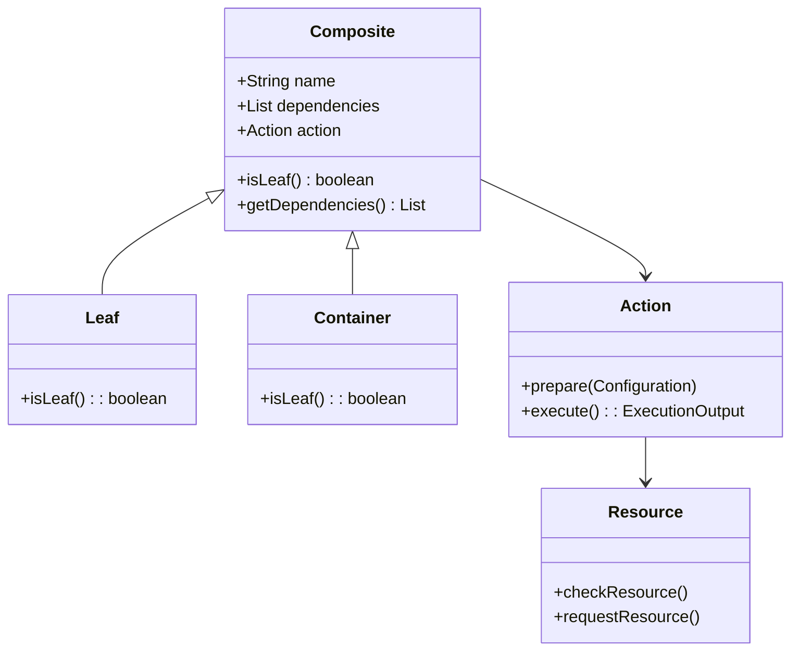
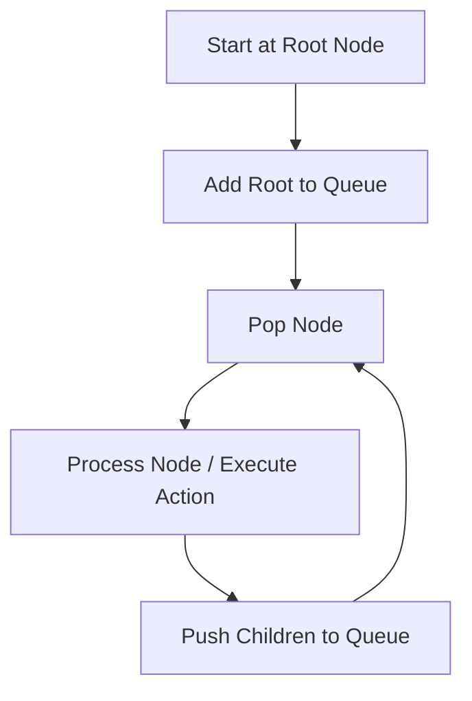
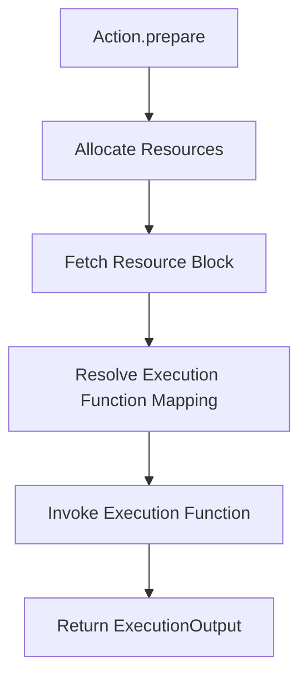
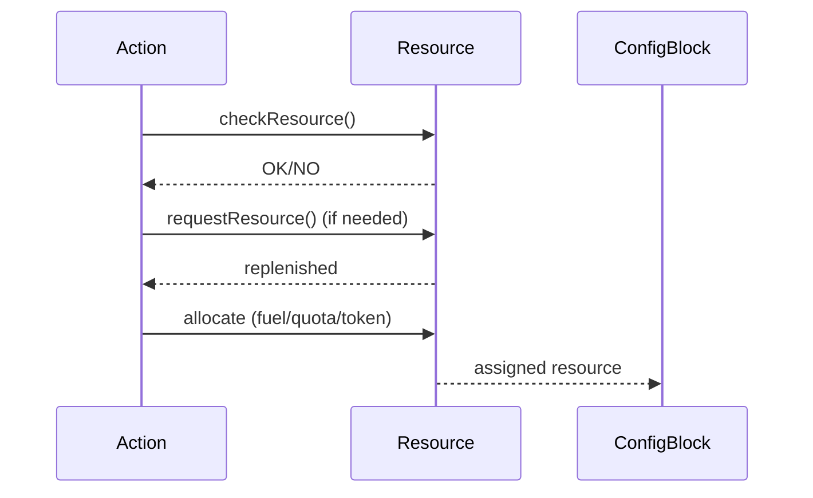
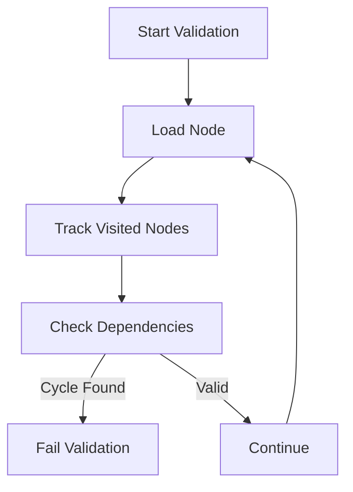
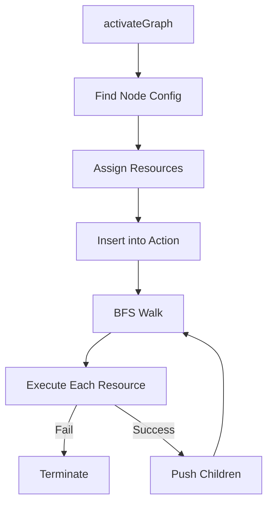

# **Virtual File System Component — Detailed README**

*An enterprise-grade abstraction for hierarchical storage, resolution, and composite node orchestration*

---

## **1. Overview**

The Virtual File System (VFS) component models a hierarchical structure of files, folders, and execution nodes abstracted away from any physical filesystem implementation. It leverages the Composite design pattern to represent files and directories uniformly, enabling consistent traversal, resource management, and operation dispatch.

This system provides a scalable, extensible architecture for managing “virtualized” entities: configuration nodes, resource-backed elements, pseudo-files, composite build units, or domain-specific tree structures. The VFS component is intentionally generic, allowing application-specific semantics—execution, evaluation, scheduling, or allocation—to be attached to nodes without modifying the underlying hierarchy.

The component is most suitable for:

* Graph-based execution environments
* Workflow orchestration engines
* Build system prototypes
* Resource-dependent execution graphs
* Hierarchical representation of components, modules, or assets

It builds on principles used in enterprise systems like Linux VFS, Java NIO, Gradle/Bazel virtual module trees, and workflow engines (GitHub Actions, Argo Workflows, Airflow DAGs).

---

## **2. Architecture Summary**

At the core of the VFS component lie three conceptual pillars:

1. **Composite Node Abstraction**
   Every entity (file or folder, leaf or container) derives from a `Composite` model, forming a unified node API.

2. **Execution Layer**
   Each node attaches an `Action` unit capable of resource allocation and execution.

3. **Registry & Graph Management**
   The VFS maintains a global registry of nodes and a structured method for attaching, validating, traversing, and executing parts of the graph.

---

## **3. High-level Architecture (Mermaid Diagram)**

This shows the structural decoupling between node hierarchy (Composite), execution semantics (Action), and resource providers. The Composite pattern ensures tree uniformity; Action ensures operational parity.

---

## **4. Node Types and Behavior**

### **4.1 Composite Base Class**

The `Composite` node serves as the foundational abstraction:

* Stores node name
* Maintains dependencies (children)
* Owns an `Action` executor
* Defines abstract methods `isLeaf()` and `getDependencies()`

This structure supports tree or DAG modeling.

### **4.2 Leaf Node**

Represents an atomic, non-divisible element.
Examples:

* A file
* A single execution task
* An endpoint with no downstream processing

### **4.3 Container Node**

Represents a directory-like composite element.

* Can contain children
* Drives recursive execution
* Supports BFS/DFS-based traversal

---

## **5. Hierarchy Traversal**

Node traversal is highly deterministic. The system provides BFS for:

* Bulk execution
* Resource activation
* Graph validation

### **Traversal Flow (Mermaid)**

This ensures all nodes are visited in predictable order for evaluation or execution.

---

## **6. Execution Layer**

Each node has an associated `Action` class instance which is *prototype-scoped* for independent state.

### **Execution responsibilities**

* Prepare resource allocations using `Configuration`
* Cycle through resource blocks (fuel, quota, token)
* Resolve execution function via registry
* Produce `ExecutionOutput`
* Abort execution if constraints fail

### **Execution Flow (Mermaid)**

This decoupling allows plug-and-play extensibility.

---

## **7. Resource System**

Resources represent capacity constraints or consumable units.

Implementations:

* **FuelResource**
* **QuotaResource**
* **TokenResource**

Each resource type provides:

* `checkResource()` – ensuring availability
* `requestResource()` – replenishment
* Allocation logic (assignFuel, acquireToken, …)

### **Resource Allocation Lifeline (Mermaid)**

---

## **8. Registry & Management System**

Two registries are crucial:

### **NodeRegistry**

* Stores all nodes
* Prevents duplicates
* Enables global lookups

### **ComponentRegistry**

Maps `ConfigType → execution function`.
This is a factory for pluggable, type-specific computation.

### **ResourceRegistry**

Maps `ConfigType → Resource` providers.

These registries ensure modularity, extensibility, and clean dependency injection.

---

## **9. Graph Validation**

Before execution, the VFS checks:

* Node existence
* Cycles in dependencies
* Illegal leaf extensions
* Duplicate nodes

### **Validation Flow (Mermaid)**

Cycle detection ensures execution safely terminates.

---

## **10. Full Execution Pipeline**

### **Activation Stage**

Resources allocated for each node before execution begins.
This allows consistent and deterministic execution.

### **Execution Stage**

Walk the graph, executing resource blocks sequentially.

The two-phase model matches enterprise build engines (Gradle, Bazel).

---

## **11. API Layer**

This component includes a REST controller supporting:

* Root creation
* Node creation
* Dependency attachment
* Graph execution
* Graph validation

Useful for automation, UI integration, or distributed coordination.

---

## **12. Strengths of the VFS Component**

### **Uniform Representation**

Everything (leaf or container) shares the same interface.

### **Extensibility**

New resource types or execution logic can be plugged in without modifying the hierarchy.

### **Separation of Concerns**

* Node structure
* Execution semantics
* Resource allocation
* Registry mapping

### **Enterprise Readiness**

* Deterministic traversal
* Structured failure propagation
* Configurable execution
* Pluggable resources

---

## **14. Summary**

The Virtual File System Component is a powerful, cleanly decoupled composite framework capable of representing hierarchical structures and executing resource-backed actions. Inspired by enterprise-grade execution engines, it incorporates deterministic traversal, resource-aware execution, pluggable function mapping, and a strong structural foundation using the Composite pattern.

Its modular design ensures:

* Robust extensibility
* Predictable behavior
* Clean separation of responsibilities
* Easy integration into larger systems

This VFS component is highly suited for workflow orchestration, build graphs, task execution hierarchies, and internal platform tooling demanding structured, composite node management.
