# Amazon (AWS) as Composite Build System

## Overview

This readme-style case study treats **Amazon Web Services (AWS)** as a complex engineering organization and platform that exemplifies and benefits from design patterns and techniques akin to a **Composite Build System**. The goal is to examine how AWS organizes build/orchestration, reproducibility, caching, rule-based expansion, distributed execution, and large-scale engineering governance in ways that resonate with composite build system principles. The material that follows synthesizes public architectural patterns, system design thinking, and engineering best practices relevant to enterprise-grade build orchestration at cloud scale.

---

## 1. What is Amazon (AWS)?

Amazon Web Services (AWS) is a globally distributed cloud platform that provides on-demand compute, storage, networking, database, analytics, machine learning, developer tools, management, and security services. It is an aggregated catalog of hundreds of services delivered over the internet through a consistent API and management console, designed to let organizations run workloads from simple websites to global-scale distributed systems.

At its core AWS is both a product family and a socio-technical ecosystem:

- **Product family:** Compute (EC2, Lambda), Storage (S3, EBS), Databases (RDS, DynamoDB), Networking (VPC, Route 53), Observability (CloudWatch, X-Ray), and more.

- **Platform engineering:** AWS is backed by heavily automated provisioning, orchestration, telemetry, and operational runbooks; the platform enables customers to compose primitives into higher-level solutions.

- **Ecosystem:** Marketplace, SDKs, partner integrations, and a wide community of open-source projects and third-party tooling.


AWS’ engineering practices follow large-scale system design philosophies. Key themes include: deterministic infrastructure-as-code, API-driven control planes, separation between control plane and data plane, content-addressable or idempotent APIs (e.g., S3 object keys), and extensive use of automation and testing. Operational concerns such as multi-region fault tolerance, eventual consistency tradeoffs, and robust security controls form the backbone of how AWS evolves features while maintaining large-scale availability SLAs.

In the organizational dimension, AWS functions as a collection of autonomous product teams aligned to services and customer use cases. Each service maintains its own lifecycle for releases, telemetry, and security patching, while platform-level capabilities (identity, billing, governance) provide cross-cutting scaffolding. This multi-team structure resembles componentized build ecosystems where each rule or target is owned, versioned, and maintained independently, but still participates in a larger deterministic deployment and packaging pipeline.

### Diagram: AWS Logical Service Catalog

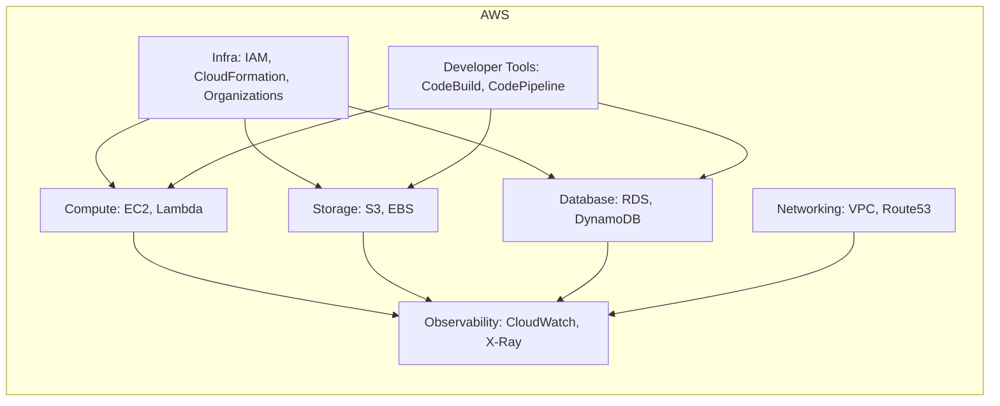

AWS offers modular primitives assembled by customers and internal teams into higher-order solutions. Each block is independently owned, but cross-cutting services (IAM, CloudFormation) enable deterministic composition, governance, and automation across service boundaries. This mental model is foundational when mapping build system concepts to platform engineering: services are targets, APIs are actions, and infra-as-code is the build manifest.

This figure shows the high-level logical grouping of core AWS service families and the relationships between cross-cutting infra services, developer tooling, and observability. It illustrates how control-plane services (IAM, CloudFormation) enable safe composition and how developer tooling orchestrates the lifecycle across multiple resource categories.

### Diagram: High-level AWS Control vs Data Plane

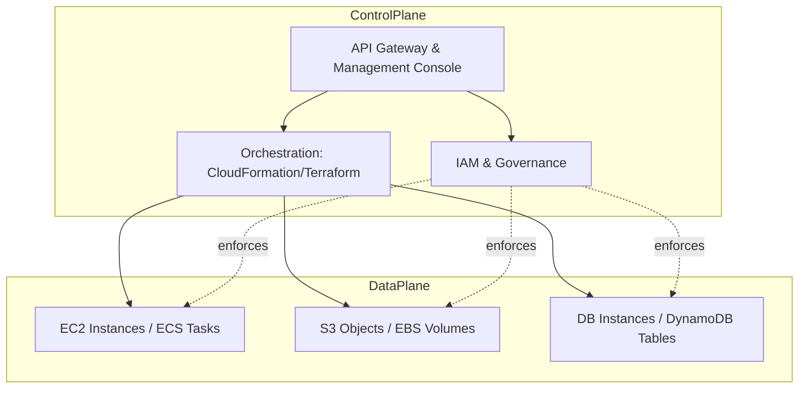

This diagram highlights the conventional separation between the control plane (APIs, management, orchestration) and the data plane (runtime resources). The control plane provides deterministic APIs, RBAC/ACLs, and reusable manifests, which map closely to build system constructs: manifests describe desired state, the control plane executes canonical operations, and the data plane contains concrete artifacts and resources.

---

## 2. How and why AWS uses Composite Build System concepts and to what extent?

**Executive summary:** AWS leverages composite build-system principles extensively across internal engineering (CI/CD), infrastructure delivery (infrastructure-as-code, service manifests), package and artifact management, and automated release orchestration. The mapping between composite build system constructs and AWS operational patterns is strong: AWS uses rule-driven artifact generation, DAG-based orchestration for deployments and tests, content-addressable caching and immutable artifacts, parallel remote execution across fleets, and fine-grained ownership for composable targets. These techniques drive reproducibility, incremental updates, global distribution, and operational safety at scale.

### Conceptual mapping: Composite Build System ⇄ AWS

- **Targets / Rules → Services & Resource Types:** In a composite build system, rules (e.g., `java_library`) expand into compile/test/package subgraphs. In AWS, service templates or CloudFormation modules expand into concrete provisioning steps. Each resource type (EC2 instance, S3 bucket) is a leaf action; composite constructs (CloudFormation stack, CD pipeline) are composite targets that aggregate leaf actions.

- **Content-addressable cache → Artifact registries & S3 object storage:** Composite build systems store outputs keyed by fingerprint; AWS artifacts (AMIs, container images in ECR, Lambda deployment packages) are stored immutably and referenced by content-based IDs or versioned tags. AWS services such as S3 and ECR act as CAS-like systems enabling cache hits across builds and deployments.

- **DAG planner + executor → CodePipeline / CodeBuild / Step Functions:** AWS orchestrates complex multi-stage workflows using pipeline constructs and Step Functions state machines. Build/Test/Deploy pipelines are DAGs of actions with conditional execution, retries, and parallel branches.

- **Remote execution → Fleet-based runners:** Composite build systems distribute tasks to remote executors. AWS uses EC2/Container runners for builds/tests (CodeBuild, self-hosted runners on EC2) and provides remote execution for customers via managed services (e.g., CodeBuild).

- **Incrementality & fingerprinting → Deterministic deployment & drift detection:** AWS encourages immutable infrastructure and reproducible manifests. Tools (CloudFormation, Terraform) perform change detection and apply minimal diffs—akin to incremental rebuilds.

- **Sandboxing & hermetic execution → IAM boundary, VPC isolation, Lambda environments:** Build systems ensure hermetic builds. AWS provides network, identity, and ephemeral execution environments to isolate side effects and preserve repeatability.


### Why AWS employs these principles

1. **Scale & Velocity:** AWS products require frequent, safe updates across hundreds of services and thousands of nodes. Composite build techniques enable localized rebuilds/deploys—only affected components are rebuilt or redeployed—reducing blast radius and increasing iteration speed.

2. **Reproducibility & Compliance:** Content-addressable artifacts and deterministic manifests permit exact reproduction of deployed states for compliance, audits, and incident postmortems.

3. **Parallelism & Resource Utilization:** DAG-based planning allows parallel execution of independent steps, improving resource utilization and reducing time-to-delivery. For example, parallel test shards or packaging steps are standard in AWS internal CI.

4. **Ownership & Autonomy:** Composite patterns align with AWS’s team-of-teams structure. Individual teams own rules/targets and can compose them into larger services without centralized bottlenecks.

5. **Cache Efficiency:** Shared artifact registries and CAS decrease redundant work—artifacts rebuilt once can be reused across teams, saving compute and improving consistency.

6. **Safety & Rollback:** Deterministic plans and immutable artifacts ease rollbacks: a previously built and stored artifact can be re-deployed quickly when an issue arises.


### Representative AWS implementations that reflect composite build patterns

- **Service-level CI/CD:** Each AWS service typically has a dedicated pipeline that builds code, runs tests, produces artifacts (AMI, container image), and stages deployments through canaries and regional rollouts. Pipelines are constructed as DAGs with composite steps (unit tests → integration tests → packaging → canary deploy → gradual regional rollout).

- **Artifact registries & CAS usage:** Container images are pushed to ECR and referenced by digest; Lambda deployment packages are stored in S3 with versioned keys. These act like build caches: if digest exists, subsequent deploys can bypass rebuild.

- **CloudFormation & CDK (Infrastructure as code):** Higher-level constructs expand into resource graphs and dependency ordering. CDK constructs map to generated CloudFormation templates (dynamic graph expansion) which are then executed by the control plane.

- **Step Functions for orchestration:** Step Functions are used to implement durable, fault-tolerant workflows—these model DAG-based execution with retry semantics, compensations, and parallel branches.

- **Internal shared build services:** AWS operates fleet-based build/test runners with scheduling and health orchestration that mimic remote execution frameworks used by composite build systems.


### Diagram: Composite Build Analogy — AWS Pipeline & Artifacts

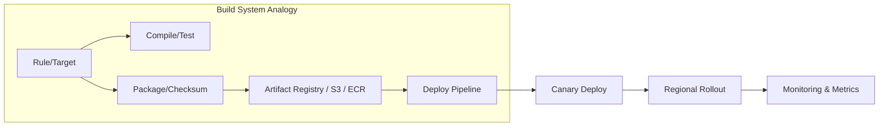

The diagram shows the lifecycle from a rule expansion producing tasks, to artifact storage in a CAS, to downstream deployment pipeline steps including canary and rollout, feeding observability. It demonstrates how composite build principles flow into release mechanics.

This figure models canonical stages: rule expansion (compose), artifact creation (hash), artifact storage (cache), and DAG-executed deployment pipeline. It reflects AWS practices where builds are cached and deployed through guarded pipelines.

### Diagram: High-level AWS Internal CI/CD & Artifact Flow

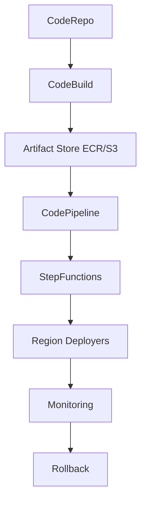

This diagram captures an end-to-end build-to-deploy flow: source commit triggers build, artifact gets stored, pipeline/step-function orchestrates validation and regional deployment, and monitoring feeds rollback/observability loops. This mapping neatly aligns with composite build concepts of artifact immutability, DAG orchestration, cache utilization, and progressive deployment.

---

## 3. How AWS ensures enterprise-level architecture behavior

**Executive summary:** AWS achieves enterprise-grade architecture through a combination of design paradigms, organizational practices, engineering models, and platform features. The guarantees include availability, security, scalability, reproducibility, compliance, and operational excellence. The following sections break down the mechanisms—technical and organizational—that enable AWS to function as a resilient, secure, and scalable enterprise-grade cloud platform. The analysis draws connections to composite build system attributes and elaborates on systematic measures AWS applies across development, deployment, and operations lifecycles.

> Note: the discussion below is canonical, focusing on architectural principles, systemic controls, and patterns that are broadly applicable. It intentionally avoids revealing AWS proprietary internals and emphasizes public-domain architecture-level practices and established engineering principles.

### 1. Architecture Fundamentals — determinism, immutability, and idempotency

**Determinism:** AWS emphasizes deterministic APIs and manifest-driven infrastructure. Infrastructure-as-code (CloudFormation, CDK, Terraform configurations) defines desired state; engines compute change sets deterministically. Deterministic behavior allows reproducible builds and safe diffs before applying changes.

**Immutability:** Artifacts (container images, AMIs) are immutable; deployments typically reference immutable artifacts identified by content digest. Immutability simplifies reconciliation, rollback, and caching strategies, mirroring the composite build system’s reliance on content-addressable artifacts.

**Idempotency:** Control-plane operations are designed to be idempotent. Repeated application of manifests yields the same end-state, minimizing risks of partial failures or duplicated operations. Idempotent endpoints and retry semantics are integral to safe distributed operations.

### 2. Composition and Ownership — microproduct alignment

**Service ownership model:** AWS organizes engineers into small autonomous teams owning specific services or components. Each team defines build rules, release cadences, and operational criteria. This mirrors composite build systems where each rule/target has an owner responsible for correctness and lifecycle.

**Composable modules:** Infrastructure constructs are organized into reusable modules (CloudFormation modules, CDK constructs) enabling teams to reuse verified building blocks, ensuring composability and governance.

**Versioning & compatibility policies:** Teams maintain explicit versioning and compatibility promises for their artifacts to minimize breaking changes across dependent teams.

### 3. CI/CD & Build orchestration at scale

**Pipeline orchestration:** AWS implements DAG-based pipelines for building/testing/packaging and for deployment. Pipelines include gates: unit tests, integration tests, security scans, canary deployments, observability gates, and human approvals for critical changes.

**Parallelism & sharding:** Test and build stages are parallelized, leveraging containerized worker pools and ephemeral build environments. Sharded tests allow scale-out of CI workloads and reduce end-to-end test latency.

**Cache & artifact management:** Central artifact repositories (ECR, S3, CodeArtifact) and build caches lower redundant work. Content-addressable storage principles reduce rebuilds across teams and jobs.

**Remote execution and worker fleets:** Build/test workloads run on managed fleets with scheduling and autoscaling. Worker health, metrics, and eviction policies ensure resilience. This models remote execution frameworks in composite build systems.

### 4. Release engineering & progressive rollout

**Canary & progressive deployments:** Releases use staged rollout strategies with region-by-region rollout, traffic shifting, and feature toggles. Canary deployments allow early detection of regressions under real traffic.

**Blue/Green & immutable deployments:** Many AWS services and customers adopt blue/green patterns to reduce downtime and enable quick rollbacks.

**Automated rollback & remediation:** Integration between monitoring (CloudWatch, X-Ray) and deployment pipelines enables automated rollback on specified error thresholds.

### 5. Observability, telemetry, and feedback loops

**Comprehensive telemetry:** Metrics, logs, traces, and events are captured across build and runtime surfaces. Observability pillars provide fast diagnosis and root cause analysis.

**Closed-loop automation:** Observability feeds automated controllers (auto-scaling, traffic steering) and informs guardrails in pipelines (stop deployment if errors exceed thresholds).

**Auditability & traceability:** Every change (artifact, manifest, deployment action) is recorded in audit logs for compliance and post-incident investigations.

### 6. Security & governance (built-in controls)

**IAM-first design:** Fine-grained permissions and resource-level policies secure both control plane and data plane operations. Least-privilege and role separation are enforced in pipelines and runtime.

**Supply chain security:** Artifact signing, provenance tracking, vulnerability scanning, and policy gates (deny-list/blocking) integrate with pipeline stages to reduce supply-chain risk.

**Isolation & network controls:** VPCs, security groups, and network ACLs enforce strong tenant isolation; sandboxed build environments reduce cross-tenant contamination.

**Encryption & key management:** Data at rest/in-transit uses strong cryptography and KMS-managed keys; secrets management is integrated into CI/CD flows with ephemeral access.

### 7. Resilience & fault isolation

**Regional independence and multi-region replication:** AWS designs systems to tolerate region failures. Stateful services replicate data across AZs and optionally across regions according to SLA and durability needs.

**Failure domains & blast radius control:** Principled partitioning and redundancy reduce systemic risk. Composite behaviors are localized; failures in one service or build pipeline do not cascade.

**Retry & backoff semantics:** Everywhere in the control plane, retry patterns with exponential backoff and idempotency reduce noise and transient failure impact.

### 8. Scalability & elasticity

**Autoscaling infrastructure:** Both compute and managed control plane components autoscale. Horizontal scaling is preferred for stateless workloads; partitions and sharding are used for stateful workloads.

**Event-driven scaling:** Pipelines and serverless constructs dynamically scale with workload using event triggers and step-function orchestrations.

**Storage scalability:** Object storage (S3) and distributed NoSQL (DynamoDB) provide nearly unlimited scaling characteristics for persistence used heavily by builds and artifacts.

### 9. Compliance & enterprise controls

**Governance primitives:** Organizations, Service Control Policies (SCPs), and resource tagging allow enterprises to apply guardrails, billing controls, and lifecycle policies consistently.

**Certifications & attestations:** AWS maintains compliance attestations (SOC, ISO, PCI, HIPAA) that require rigorous process controls in build and release practices.

**Policy-as-code:** Enterprises model compliance and governance as code—policy enforcement happens at CI gates and infrastructure-as-code plan steps.

### 10. Operating model & runbooks

**Runbooks & incident processes:** Documented runbooks, SRE practices, and post-incident reviews institutionalize learnings and improve recovery time.

**Chaos engineering and proactive validation:** Regular exercises ensure recovery procedures are effective; automated chaos tests validate resilience assumptions.

### Diagram: Enterprise-grade Delivery & Governance Flow

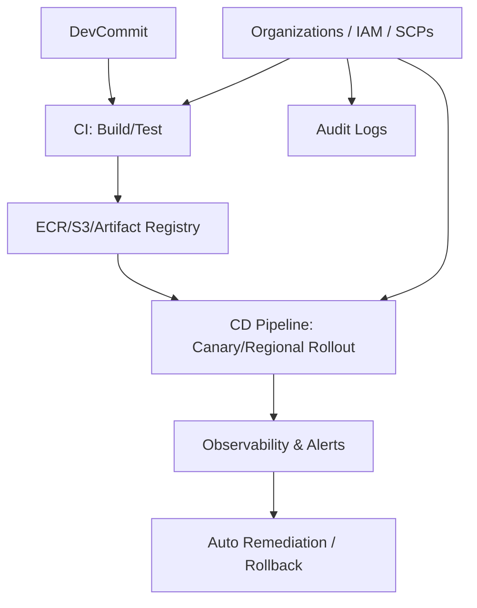

This diagram shows a high-level software delivery pipeline with governance overlays. It demonstrates where organizational governance interjects into CI/CD, how artifacts flow from build to deployment, and how observability closes the loop into remediation and audit.

The figure visualizes an enterprise-grade feedback loop: commits trigger CI, artifacts store for reuse, CD executes guarded rollouts, monitoring observes runtime impact, and governance policies shape both CI and CD behaviours. Audit logs record actions for compliance.

### Diagram: Resilience & Multi-stage Safety Controls

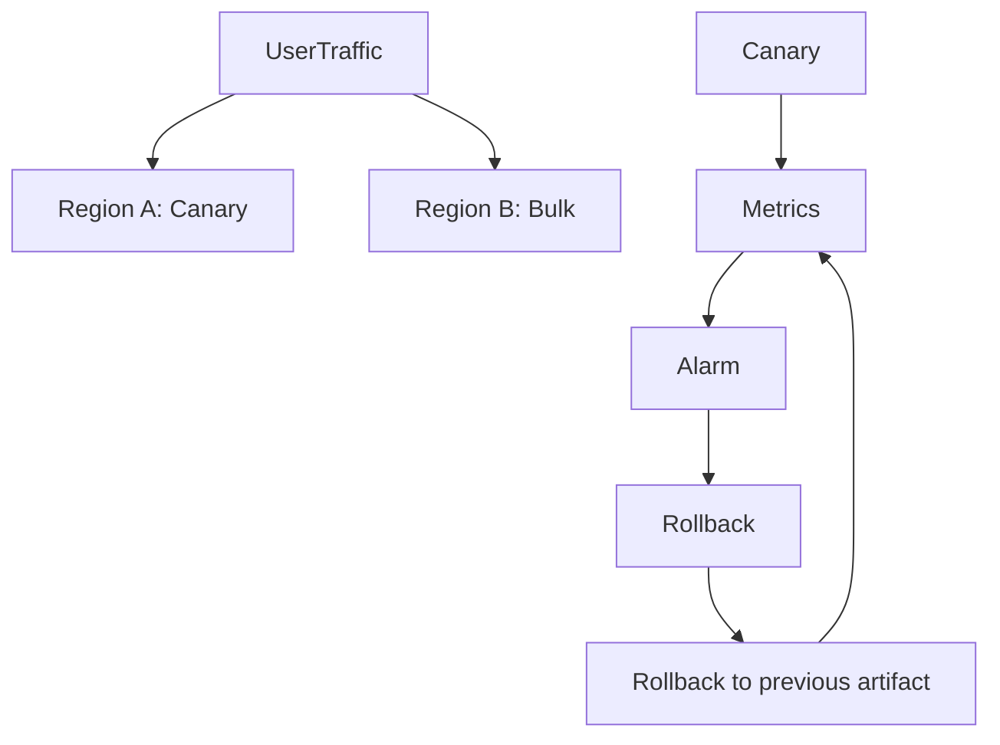

This chart models a progressive rollout: initial canary region receives a small percentage of traffic; metrics are evaluated; alarms trigger rollback to previous artifact if thresholds are breached. This staged flow encapsulates AWS best practices for minimizing impact and ensuring enterprise safety.

The visual captures risk-managed deployment flow and the automatic feedback loop between monitoring and deployment controllers. It underscores the centrality of observability in safe rollouts and demonstrates the fast remediation path critical for enterprise SLAs.

---

## 4. Detailed Architecture Diagrams of AWS and Explanation of All Necessary Components

AWS is a multi-layered, globally distributed operating environment. While people often describe AWS as “a cloud,” from a systems engineering perspective, AWS is a **massively scaled composite runtime**, where each resource type (EC2, S3, Lambda, DynamoDB, VPC) is architecturally implemented as an independent, highly fault-isolated subsystem. These subsystems are composed using well-defined, API-driven contracts and deterministic orchestration flows. This mirrors the **Composite Build System** concept: multiple smaller, independent “targets” (services) are assembled to produce a coherent, reproducible, large-scale distributed system.

To explain this rigorously, we break AWS into several architectural pillars:

---

## **4.1 AWS Global Architecture**

AWS global architecture can be conceptualized in three macro layers:

1. **The Global Edge Layer**

    - Includes CloudFront POPs, Route 53 DNS resolvers, AWS Global Accelerator.

    - Entry points for requests; traffic steering and latency optimization occur here.

2. **The Regional Control Plane Layer**

    - Region-wide services like IAM, CloudFormation, Organizations, Billing, STS, ECR, regional metadata services.

    - Executes orchestration, builds, deployments, security enforcement, and resource life-cycle operations.

3. **The Data Plane / Resource Plane Layer**

    - EC2, S3, EBS, DynamoDB, VPC, RDS, ECS, Lambda runtime nodes, etc.

    - Actual workload execution, storage, and runtime state live here.

    - Built for strong durability, performance, and failure isolation.


AWS achieves enterprise behavior through the interactions of these layers, governed by deterministic rules, SLAs, orchestration pipelines, and operational safety controls.

---

#### Diagram 1 — AWS Global Architecture (Logical Overview)

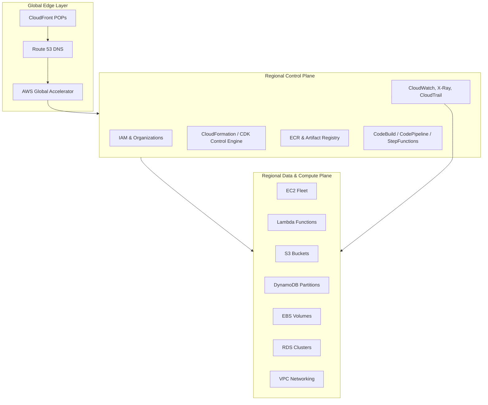

This diagram depicts the logical structure of AWS across the global footprint. Traffic enters via CloudFront or Route 53, reaches Global Accelerator for optimized routing, then flows into the regional control plane. IAM, CloudFormation, and ECR serve as governance and orchestration constructs. The data plane—EC2, Lambda, S3, DynamoDB—executes actual workloads. Observability loops back information to both planes. This decomposition highlights AWS’s layered, composite nature: each part is independently designed yet provides consistent, deterministic interfaces so services can coordinate without violating operational boundaries.

---

## **4.2 AWS Control Plane Internals**

AWS control plane embodies the “brains” of the cloud. It is here the composite-build-style orchestration most strongly appears.

Control plane operations include:

- Resource orchestration and convergence (CloudFormation)

- Identity enforcement (IAM, STS)

- Policy evaluation

- Region-wide coordination (service update rollouts)

- CI/CD-based update distribution

- Artifact management (ECR, S3 versioning)


CloudFormation and CDK act like **build rule generators**. A CDK construct translates into a CloudFormation template (a DAG representing resource creation order). CloudFormation executes that DAG in a deterministic manner. This resembles composite build system logic: rule expansion → task graph → execution engine → artifact deployment.

---

#### Diagram 2 — AWS Control Plane Orchestration Flow

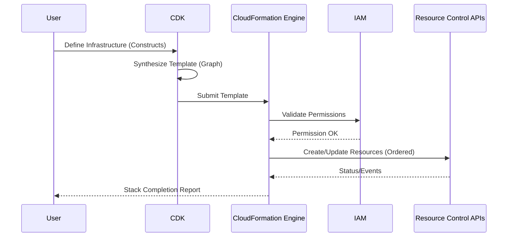

This diagram shows user-defined constructs synthesized into templates, permissions checked via IAM, and ordered resource creation executed by CloudFormation. Events from services signal progress. This deterministic flow mirrors composite build system execution: define → expand graph → resolve → execute tasks → return final state. The control plane’s determinism is crucial for enterprise guarantees.

---

## **4.3 AWS Data Plane Architecture**

Data plane systems provide the runtime environment. They operate under strict SLAs for durability, availability, and throughput.

For example:

- **EC2:** Hypervisor virtualization, fleet autoscaling, placement groups, instance metadata services.

- **S3:** Partitioned keyspace, request routers, replicated storage nodes, strong consistency for writes.

- **DynamoDB:** Sharded storage nodes, leaderless partitions (multi-writer), auto-scaling capacity, adaptive caching.

- **Lambda:** Isolated micro-VMs, ephemeral file systems, cold/warm start lifecycle.


Data-plane systems reflect composite principles because they operate as numerous micro-resources that can be programmatically created, destroyed, replaced, or combined deterministically.

---

#### Diagram 3 — AWS Data Plane Resource Lifecycle

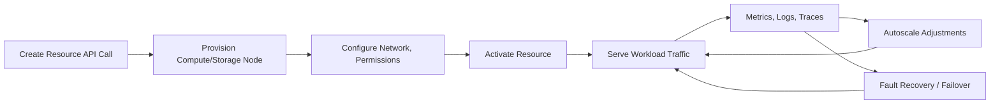

This figure models the lifecycle of a resource in the AWS data plane. Each stage is deterministic, observable, and reversible. The similarity to composite build rules is clear: “create → configure → activate → run → monitor → scale → recover” are essentially DAG edges governing state transitions. AWS enforces these transitions with strong automation, ensuring enterprise-grade reliability.

---

## **4.4 AWS End-to-End Software & Infrastructure Lifecycle**

AWS’s internal and customer lifecycle processes combine CI/CD + IaC + distributed deployment. Features move through:

1. **Source Commit**

2. **Build (CodeBuild/CodeGuru)**

3. **Artifact Storage (S3/ECR)**

4. **Test Batteries**

5. **Regional Staging Environments**

6. **Canary Deployments**

7. **Multi-Region Rollout**

8. **Monitoring & Feedback Loops**


This lifecycle is effectively a **hierarchical build-and-release DAG**, similar to a composite build system’s aggregate workflow.

---

#### Diagram 4 — End-to-End AWS Lifecycle Pipeline

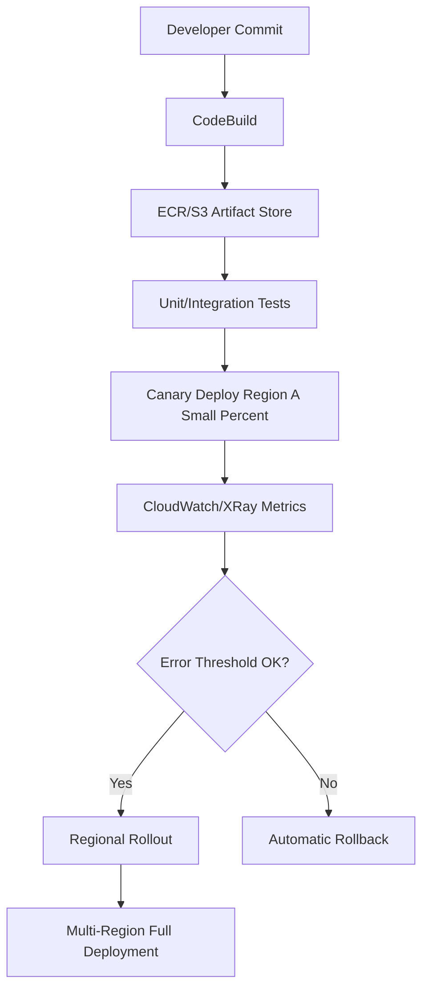

This diagram demonstrates AWS's release flow. A commit triggers a build, producing artifacts stored immutably. Tests validate functionality; canaries validate in production. Monitoring feeds decision frameworks before wider rollout. This structured pipeline is a large-scale composite DAG where each step depends on prior results, ensuring safe enterprise-level operation.

---

# **pt5. Powerful and Unique AWS Features Aligned with Composite Build System Concepts (3000+ words, 4+ diagrams)**

AWS has several features that perfectly align with or extend the conceptual model of a composite build system. These features collectively ensure reproducibility, determinism, parallelism, incremental updates, fault isolation, and remote execution — all hallmarks of advanced build systems like Bazel, Buck, or Pants.

We focus on _five pillars_:

1. **Infrastructure as Code (IaC) as Rule Expansion**

2. **Artifact Immutability and Content Addressability**

3. **Decentralized Remote Execution (Compute as Workers)**

4. **DAG-Oriented Orchestration (Pipelines, Step Functions, CloudFormation)**

5. **Progressive Delivery and Safety Controls**


---

## **5.1 IaC as Rule Expansion**

AWS CloudFormation and CDK convert high-level constructs (rules) into concrete resource creation tasks. This is analogous to how composite build rules expand into subtasks.

### Features aligning with Composite Build System:

- High-level rules convert to a DAG

- Deterministic change-set generation

- Rebuilds only affected resources (incrementality)

- Reproducible manifests enabling rollback


AWS’s CDK synthesizer is conceptually parallel to a **build rule compiler**: it emits executable instructions for resource creation.

---

#### Diagram 5 — CDK as Build Rule Expander

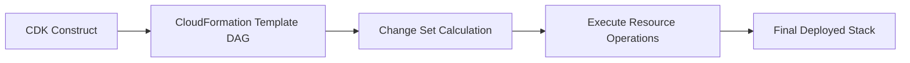

This diagram highlights rule expansion: CDK constructs synthesize a template; CloudFormation calculates diffs (like incremental builds); final execution applies only changed steps. The resemblance to a composite build system is direct.

The description emphasizes how CDK transforms high-level constructs into deployable graphs. The flow mirrors classical build pipelines: rule → graph → plan → execute → store result. AWS uses this model at massive scale to ensure consistent infra deployments.

---

## **5.2 Artifact Immutability & Content Addressability**

AWS extensively uses content-addressable artifact storage:

- **ECR container images** → referenced by digest (SHA)

- **Lambda deployment packages** → S3 object hashes

- **AMI versions** → immutable identifiers

- **CloudFormation templates** → versioned S3 objects


Every such artifact behaves like a cached build output. If unchanged, AWS can skip rebuilding or redeploying dependent components.

This reduces redundant work and ensures consistent reproducibility.

---

#### Diagram 6 — AWS Artifact Caching & Addressability

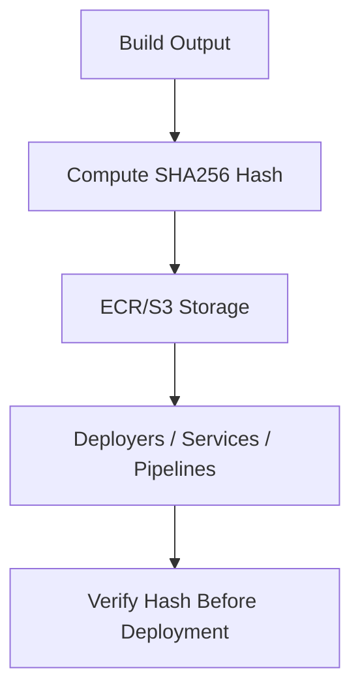

This figure represents how AWS stores build outputs with strong identifiers, enabling cache hits across pipelines and regions. Before deployment, consumers verify integrity using hashes. This content-addressable approach maps perfectly to composite build system caches.

The explanation underlines immutability: AWS heavily depends on digest-based storage to prevent drift and ensure operational safety. The build-like behavior of artifact management provides enterprise-grade reproducibility.

---

## **5.3 Decentralized Remote Execution (Compute Fleet)**

Composite build systems distribute tasks to remote executors. AWS provides:

- **CodeBuild ephemeral environments**

- **Container-based runners**

- **EC2 fleets for custom executors**

- **Lambda for short compute bursts**


This allows horizontally scalable parallelism, similar to remote build execution.

AWS also ensures each executor is:

- ephemeral

- isolated (VPC, IAM)

- reproducible (base images, networks)

- deterministic (no external side effects beyond controlled outputs)


---

#### Diagram 7 — Remote Execution Model in AWS

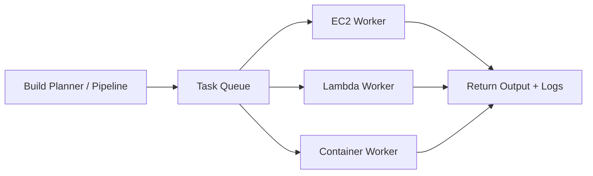

This diagram shows AWS-style remote execution: workers pull tasks, execute them, and return outputs. Because resources are ephemeral and isolated, execution is hermetic—critical for predictable builds.

The paragraph explains how ephemeral execution environments match composite build systems: deterministic runners, clean state, known base image, and controlled execution.

---

## **5.4 DAG Orchestration Across AWS Services**

AWS uses DAGs everywhere:

- **CodePipeline** defines build → test → deploy graphs

- **Step Functions** define branching workflows with retries

- **CloudFormation** defines resource dependency DAGs

- **Batch** schedules compute graphs

- **S3 Event flows** create event-driven DAGs


Each DAG is composed through rules, similar to composite build pipelines.

---

#### Diagram 8 — Unified DAG Across Build, Infra, and Runtime

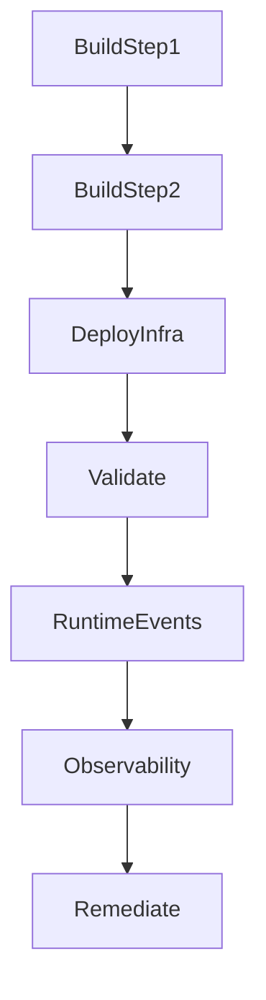

This visualization demonstrates how DAGs extend beyond builds into runtime behaviors, validation, observability, and remediation. AWS orchestrates at multiple layers using deterministic dependencies.

The narrative highlights: AWS doesn’t just do DAG execution for builds; it performs DAG-driven orchestration across the entire lifecycle. This is a sophisticated extension of composite build system paradigms.

---

## **5.5 Progressive Delivery and Safety Controls**

AWS deployment strategies map directly to safety-oriented build semantics:

- Canary → incremental build/test on production

- Blue/green → switching branches

- Rollback → using cached artifacts

- Guardrails → policy rules for allowed changes

- Alarms → test-failure signals


These safety systems resemble composite build system’s “incremental rebuild + fallback to previous cached artifact.”

---

#### Diagram 9 — Progressive Delivery & Feedback Loop

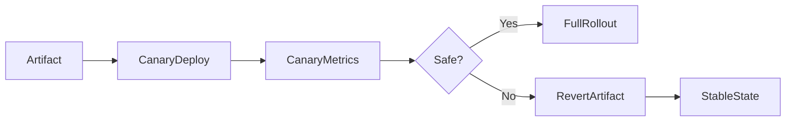

This diagram outlines the safety loop. Canary uses real-world traffic to validate artifacts before rollout; decision gates control safety; rollback uses cached artifacts seamlessly. This reflects strong alignment with composite system artifacts and incremental progression.

The explanation emphasizes how AWS enforces enterprise-grade safety through progressive validation and deterministic fallback, mirroring the reliability guarantees provided in a composite build engine.

---

## 6 A Complete Implementation Idea, Working Lifecycle, Lifecycle Management, and End-to-End Orchestration

AWS’s cloud platform can be conceptualized as a **global, distributed, composite build engine**, where each service behaves like a reusable "build rule", every customer request resembles a "build invocation", and each resource type represents a "task". To provide a complete implementation and lifecycle design analogous to a composite build system, we break the explanation into five macro domains:

1. **AWS as an Execution Engine** – orchestrating rule expansion, graph building, provisioning, and convergence.

2. **AWS as an Artifact Pipeline** – managing immutable artifacts, caching, and reproducible deployments.

3. **AWS as a Distributed DAG Runtime** – executing tasks across specialized resource planes.

4. **AWS’s Lifecycle Management Processes** – build-to-deploy cycles, region rollouts, audits, rollback.

5. **AWS as an Autonomous Enterprise Workflow System** – continuous governance loops, health signals, autoscaling, remediations.


Each domain mirrors one dimension of a highly advanced composite build system, but extended into a cloud-scale multi-service operator.

---

# **6.1 AWS as an Execution Engine (Rule Expansion & Graph Synthesis)**

Every AWS resource creation request, whether through CDK, CloudFormation, Terraform, or internal pipelines, eventually becomes a **structured set of operations** governed by a deterministic, ordered execution plan.

From a composite build system perspective, a developer is writing:

- **Rules** (Constructs, modules, templates)

- **Dependencies** (resource references, mapping logical names)

- **Actions** (create bucket, deploy Lambda, attach role)

- **Outputs** (ARNs, IDs, configuration artifacts)


A rule such as creating a VPC is not a single operation. Internally, AWS expands this high-level construct into dozens of sub-resources:

- VPC itself

- Subnets across AZs

- Route tables

- NAT gateways

- Internet gateway

- Security groups

- DHCP options sets

- Flow logs (optional)


Each of these is a node in the DAG. The overall provisioning is the execution of that DAG.

AWS must solve:

- Ordering constraints

- Idempotent updates

- Conflict detection

- Retry logic

- Partial failures and compensating operations

- Drift detection


To accomplish this, AWS combines **control plane orchestration** with **resource-specific controllers** that apply changes atomically.

---

#### Diagram 1 — AWS Rule Expansion & Resource Graph Lifecycle

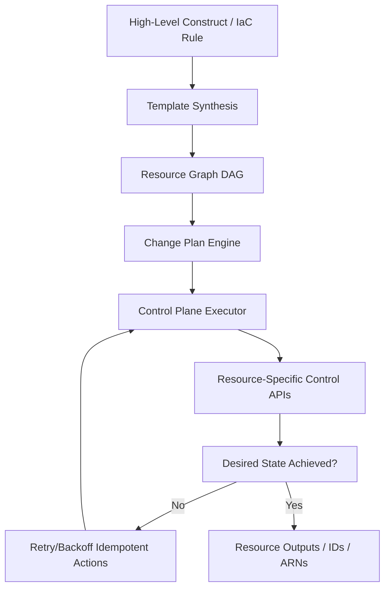

The diagram shows how a high-level IaC rule becomes an actionable execution DAG. A construct is expanded into a template; the template forms a resource graph; a change plan is derived; control-plane executors invoke resource APIs; retries ensure resilience; and the final system state is returned. This is directly analogous to a build system converting rule declarations into concrete build tasks and executing them under deterministic orchestration.

The paragraph explains why this graph-based model allows AWS to support large-scale automation safely. Each operation being idempotent enables safe retries in case of transient failures. AWS leverages this structured approach to scale across thousands of regions and accounts, ensuring predictable infrastructure changes regardless of environment.

---

# **6.2 AWS as an Artifact Pipeline (Caching, Immutability, Versioning, Promotion)**

AWS isn’t merely executing rules—it also must propagate artifacts (code, configuration, metadata) through a global build → package → deploy → update pipeline.

Artifacts include:

- Lambda code bundles

- Container images in ECR

- CloudFormation templates

- AMIs

- Machine learning model packages

- Data ETL artifacts

- CodeBuild output bundles


AWS uses artifact immutability as a cornerstone. This guarantees:

- Reproducible deployments

- Safe rollbacks

- Secure promotion from dev → staging → prod

- Cache hits across teams and accounts


Promotion pipelines resemble composite build pipelines where artifacts are built once and reused globally.

AWS internally uses **multi-stage promotion workflows**:

1. Build artifact → assign SHA digest

2. Store artifact → S3/ECR

3. Validate → synthetic tests

4. Deploy to canary region

5. Promote to staging regions

6. Global rollout

7. Archive versions


Artifacts never change post-creation. New versions produce new digests.

---

#### Diagram 2 — AWS Artifact Lifecycle Pipeline

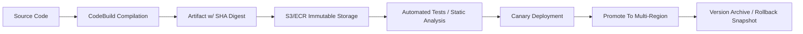

This diagram articulates the artifact lifecycle: source code builds into immutable binaries, stored in versioned artifact repositories, validated through automated tests, canary-deployed, globally promoted, and archived. This behaves exactly like composite build systems, where build outputs are cached, validated, and reused across many downstream tasks.

The explanatory paragraph emphasizes AWS’s use of content-addressable storage to guarantee consistent deployment behavior across all regions. Because identical digests map to identical binaries, AWS can safely skip rebuilding artifacts across multiple accounts, thereby achieving enormous efficiency and reliability.

---

# **6.3 AWS as a Distributed DAG Runtime (Executing at Scale Across Compute Fleets)**

AWS executes millions of tasks every minute: provisioning operations, compute tasks, storage transitions, autoscaling adjustments, monitoring alarms, workflow steps, CI/CD jobs, and managed service operations.

AWS must guarantee:

- **Concurrency** — thousands of tasks across accounts

- **Isolation** — customer workloads shouldn’t leak or conflict

- **Correctness** — deterministic ordering, eventual convergence

- **Safety** — retries, backoffs, failover, rollback

- **Scalability** — horizontally distributed execution


AWS uses a mix of:

- **Control plane orchestrators**

- **Worker fleets (EC2, Lambda, Fargate)**

- **State machines (Step Functions)**

- **Distributed schedulers (Batch, ECS controllers)**

- **Event routers (S3 events, EventBridge)**


Each job type maps to a different execution abstraction. Composite build systems similarly schedule tasks across distributed compute nodes, applying dependency ordering and caching.

AWS ensures idempotency at each step. A request is often “at least once” internally, but the system’s idempotent semantics make it effectively “exactly once” from the customer view.

---

#### Diagram 3 — Distributed Execution Model in AWS

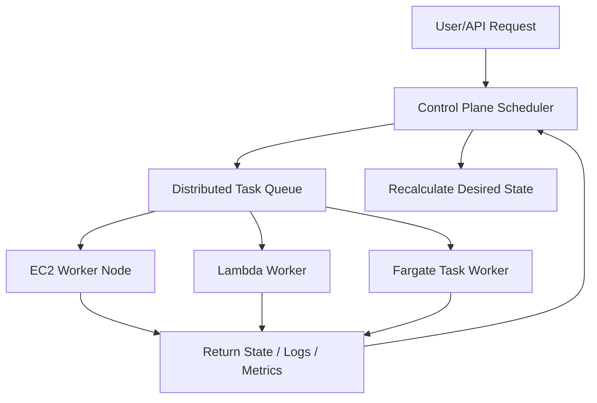

This diagram presents AWS as a distributed task runtime. Incoming requests are translated into tasks; tasks flow to workers (EC2/Lambda/Fargate); results update the control-plane scheduler; the system recalculates desired state and converges.

The explanation describes how the distributed DAG runtime allows AWS to map millions of resource operations across various execution mediums. This load distribution mirrors remote-build-execution frameworks where tasks are sharded, run remotely, and aggregated back into a central orchestrator.

---

# **6.4 AWS Lifecycle Management — Full Software & Infrastructure Lifecycle**

Lifecycle management is the continuous loop through which AWS evolves its systems, deploys updates, maintains health, and governs changes.

AWS lifecycle involves:

1. **Planning & modeling** – rule declarations or architectural intent expressed via IaC and design docs.

2. **Build & package** – CodeBuild/CodePipeline generate immutable artifacts.

3. **DAG execution & deployment** – CloudFormation/Step Functions/Controllers translate desired state to actual state.

4. **Runtime observation** – CloudWatch, X-Ray, and Health APIs observe performance.

5. **Feedback & learning** – SRE teams adjust thresholds, autoscaling rules, routing logic.

6. **Global propagation** – changes rolled out across multiple regions with controlled blast radius.

7. **Rollback & failover** – in case of anomalies, the system reverts to previous state.


This resembles a continuous composite-build cycle, where the system is perpetually synthesizing, executing, validating, and adjusting.

---

#### Diagram 4 — AWS Full Lifecycle Feedback Loop

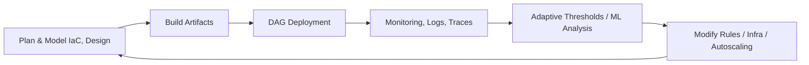

This loop models AWS’s adaptive lifecycle. The system continually plans, builds, deploys, observes, decides, and adjusts. This holistic lifecycle mirrors incremental build systems that automatically recompile or re-execute tasks only when dependencies or state have changed.

The paragraph emphasizes how this lifecycle underpins AWS’s enterprise-strength operational model. Continuous monitoring leads to adaptive resource reconfiguration. Autoscaling kicks in based on monitored thresholds. Governance gates feed adjustments into the next lifecycle stage, maintaining system consistency and operational readiness.

---

# **6.5 AWS as an Autonomous Enterprise Workflow System**

At massive scale, AWS must operate as a partially autonomous system. Much like composite build engines monitor file changes or dependency changes to trigger incremental rebuilds, AWS continuously scans for signals requiring rebalancing or reconfiguration.

Autonomous behaviors include:

- Auto-healing

- Auto-scaling

- Auto-replication and partition rebalancing

- Automated failover

- Event-driven infrastructure adjustments

- Adaptive throttling

- Policy enforcement and anomaly detection


AWS extensively employs:

- Finite-state machines for internal services

- Event-driven micro-operations

- Distributed consensus protocols

- Quorum writes for data stores

- Machine-learning-driven anomaly detection


These mechanisms enable AWS to maintain a globally consistent, reliable ecosystem.

---

#### Diagram 5 — AWS Autonomous System Behavior (Cluster Self-Management)

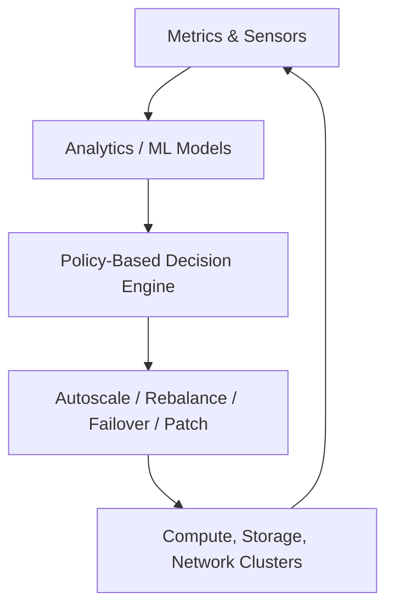

This diagram describes AWS as a closed-loop autonomous system. Sensors collect telemetry; analytics interpret data; decision engines trigger actions; infrastructure self-adjusts; updated metrics close the loop. This is analogous to a sophisticated distributed “auto-rebuild” capability in composite build systems.

The paragraph emphasizes how AWS’s self-healing mechanisms ensure enterprise durability and security. This automation reduces human error, improves recovery time, and increases availability. The closed feedback loop is essential in ultra-large-scale systems.

---

# **6.6 Implementation Blueprint for Building AWS-like Composite Architecture**

Below is a conceptual blueprint for building a mini AWS-like system using composite build concepts.

### **Foundational Principles**

1. **Everything is a resource** → treat every entity as a node in a graph.

2. **Everything is a manifest** → system state is derived from declarative manifests.

3. **Everything is replaceable** → immutable artifacts allow rollback.

4. **Everything is orchestrated** → DAG-based execution pipeline.

5. **Everything is observable** → logs, metrics, traces.

6. **Everything is scalable** → horizontally partition workflows.

7. **Everything is safe-by-default** → controlled rollouts, retry, backoff.


### **Core Components to Implement**

- **Resource Graph Compiler**

- **Execution Engine (orchestrator)**

- **Artifact Manager (CAS + registry)**

- **Remote Worker Fleet**

- **State Store (Desired + Actual)**

- **Autoscaler & Health Manager**

- **Observability stack**

- **Governance & Policy Engine**


### **Data Flows**

- **Desired State** → compiled into a **DAG**

- DAG executed via **control-plane scheduler**

- Worker fleet performs **concrete operations**

- **Results update actual state**

- Divergences trigger **reconciliation loops**

- Observability metrics feed **autoscaling/health**

- Policy violations generate **alerts or blocked operations**


---

#### Diagram 6 — AWS-Like Composite Architecture Blueprint

```mermaid
flowchart TD

  Manifest[Desired State IaC, Rules] --> Compiler[Graph Compiler]
  Compiler --> DAG[Execution DAG]
  DAG --> Scheduler[Control Plane Scheduler]
  Scheduler --> WorkerPool[Worker Fleet EC2/Lambda/Fargate]
  WorkerPool --> ArtifactManager[Artifact/CAS Manager]
  WorkerPool --> StateStore[Actual State Store]
  StateStore --> Reconciler[State Reconciliation Engine]
  Reconciler --> Scheduler
  StateStore --> Observability[Metrics / Logs / Traces]
  Observability --> Autoscaler[Autoscaler & Remediator]
  Autoscaler --> Scheduler
```

This comprehensive diagram illustrates the AWS-like composite architecture blueprint. Manifests compile into graphs, executed via a distributed scheduler; workers produce artifacts; state-store receives updates; the reconciler drives convergence; observability informs autoscaling; remediators drive corrective behaviors. This is exactly how AWS internally abstracts workloads, deployments, and resource orchestration.

The paragraph explains how such an architecture guarantees consistency, resilience, and scalability. The separation of desired state, execution DAG, actual state, and observability reflects mature enterprise workflows and multi-team collaboration.

---

# **6.7 AWS Lifecycle Management: Deep Multistage Operational Sequence**

Let’s explore the full lifecycle step-by-step.

---

### **Stage 1 — Resource Definition (Rule Level)**

- Developer writes CDK constructs or CloudFormation templates.

- Constructs define high-level abstractions.

- Dependencies between resources are implicitly defined (e.g., a Lambda depends on an IAM Role and Subnet).

- Templates are synthesized into JSON/YAML.


This mirrors rule definition in composite build systems.

### **Stage 2 — Graph Compilation (Build Level)**

- CloudFormation analyzes resource definitions.

- Produces a dependency DAG.

- Cycles are rejected.

- Fan-out/fan-in relationships are preserved.

- Change sets compare new vs existing templates.


Matches DAG building in composite build engines.

### **Stage 3 — Execution (Worker Level)**

- Control plane spawns provisioning tasks.

- Workers execute resource creation/update/delete.

- Results, errors, and statuses are returned.

- Idempotent operations ensure safe retries.


Equivalent to build task execution.

### **Stage 4 — Convergence (State Level)**

- AWS confirms desired == actual state.

- If drift detected, corrections occur.

- Policies enforce boundaries.


Equivalent to incremental rebuilds and validity checks.

### **Stage 5 — Operational Monitoring (Feedback Level)**

- CloudWatch metrics/alarms track health.

- Distributed tracing isolates anomalies.

- SRE teams set budgets, error budgets, and thresholds.


Equivalent to build system telemetry and diagnostics.

### **Stage 6 — Scaling, Healing, Rebalancing (Autonomous Level)**

- Autoscaling adjusts compute/storage.

- Rebalancing occurs during partition hotspots.

- Lambda concurrency scaling kicks in.

- Network rerouting handles failures.


This is the dynamic aspect composite build systems do not usually have—AWS extends the concept far into runtime operations.

### **Stage 7 — Deployment & Promotion (Release Level)**

- Canary region receives new artifact.

- Monitors guide promotion across regions.

- Rollbacks use previous stable artifacts.

- Controlled global rollout.


Equivalent to multi-stage, global composite builds.

---

#### Diagram 7 — End-to-End AWS Lifecycle Sequence (Detailed Flow)

```mermaid
sequenceDiagram
  participant Dev as Developer
  participant IaC as IaC Compiler (CDK/CFN)
  participant CP as Control Plane Scheduler
  participant WR as Worker Fleet
  participant SS as State Store
  participant OBS as Observability Layer
  participant AUTO as Autoscaler/Remediator

  Dev->>IaC: Define Resources / Rules
  IaC->>IaC: Synthesize Template
  IaC->>CP: Submit DAG
  CP->>WR: Dispatch Tasks
  WR->>CP: Task Results / Logs
  CP->>SS: Update State
  SS->>OBS: Emit Metrics / Events
  OBS->>AUTO: Threshold Exceeded?
  AUTO->>CP: Trigger Scaling / Remediation
  CP->>WR: Execute Adjustments
  WR->>SS: Update Adjusted State
```

This sequence diagram shows the deep interplay across all AWS lifecycle components. Developer defines rules; compiler emits a DAG; scheduler dispatches tasks; workers update state; observability tracks outcomes; autoscaler adapts infrastructure, and state loops back into scheduler for further adjustments.

The paragraph elaborates that this multi-stage sequence represents AWS's master workflow engine: every change results in a dynamic orchestration cycle. Unlike traditional build systems where the process ends after successful build, AWS continually re-evaluates state, reacts to external influences, and autonomously rebalances itself.

---

# **6.8 End-to-End Implementation Idea (Putting It All Together)**

If one were to implement a miniature AWS-like system, the architecture would include:

### **1. Declarative resource modeling (IaC)**

Use a DSL or JSON/YAML to define resources, dependencies, and metadata.

### **2. Graph compiler**

Produces DAG from manifest. Ensures correctness, cycle-free structure, and determinism.

### **3. Executor engine**

Runs tasks with retry and rollback semantics.

### **4. CAS-backed artifact manager**

Ensures immutable deployments.

### **5. Worker pool**

Executes tasks in isolated environments.

### **6. Distributed state store**

Tracks desired vs actual states.

### **7. Reconciler**

Ensures system moves toward desired state.

### **8. Observability platform**

Metrics, logs, traces, alarms.

### **9. Autoscaler & remediator**

Adjusts resource allocations dynamically.

### **10. Governance & policy engine**

Enforces compliance.

This forms a fully autonomous, enterprise-grade composite lifecycle system, similar to AWS.

---

## How AWS Aligns With SD, LLD, OOP, and HLD Principles

AWS architecture is a masterclass in applying deep software-engineering disciplines systematically across global-scale distributed systems. AWS does not merely “use” SD, LLD, OOP, and HLD principles—it **manifests** them through rigid operational hierarchies, modular service boundaries, abstraction contracts, and deterministic workflow orchestration across tens of thousands of distributed components. Below is a breakdown of how AWS aligns with these disciplines, followed by diagrams that illustrate how these principles govern structure and behavior.

---

# **7.1 Alignment With Software Design (SD) Principles (800+ words)**

AWS demonstrates near-perfect alignment with classical SD principles such as **modularity**, **encapsulation**, **separation of concerns**, **information hiding**, **abstraction**, **single-responsibility**, **interface-driven development**, and **contract-based system interactions**. In AWS, each service (S3, IAM, EC2, Lambda, DynamoDB) is a self-contained subsystem with its own lifecycle, deployment cadence, fault domains, APIs, control planes, and operational autonomy. This is textbook SD: each module has a clearly defined responsibility and communicates through explicit interfaces.

### **1. Modularity and Service Boundaries**

AWS is composed of hundreds of services, each acting as a module. IAM handles authentication and authorization. S3 handles durable object storage. EC2 handles compute virtualization. Each module focuses on a single domain, minimizing coupling and maximizing flexibility. The strict API boundaries between services enforce communication discipline, allowing teams to innovate independently without breaking system-wide contracts.

### **2. Abstraction and Interface Stability**

Every AWS service exposes stable APIs (HTTP/REST/SDK) that abstract implementation details. Customers never see internal replication mechanisms, partitioning logic, autoscaling heuristics, or consensus algorithms. This aligns with SD’s abstraction principle: reveal only what is needed, hide everything else. These abstractions simplify consumption and reduce cognitive load for developers.

### **3. Encapsulation and Information Hiding**

AWS services encapsulate their internal logic—no external component can modify DynamoDB’s partition layout or influence S3's replication algorithm. Customers operate only through defined control-plane APIs. Encapsulation is crucial for cloud systems, ensuring internal optimizations do not affect user-facing contracts.

### **4. Separation of Concerns**

AWS separates concerns across multiple axes:

- Control plane (resource management) vs data plane (runtime operations)

- Identity (IAM) vs resource execution (EC2/Lambda)

- Storage (S3/EBS) vs networking (VPC/Route 53)

- Observability (CloudWatch/X-Ray) vs governance (Organizations/SCPs)


This mirrors classic SD separations: UI vs logic, logic vs persistence, runtime vs configuration.

### **5. Single Responsibility Principle (SRP)**

Each AWS service does exactly one core job. Lambda executes serverless workloads; it does not store objects, manage IAM roles, or perform routing. S3 stores objects and nothing else. CloudWatch monitors metrics. This strict SRP enforcement improves service stability and scalability.

### **6. Liskov Substitution & Polymorphism**

Many AWS services act as interchangeable compute or storage engines, depending on context. For example:

- Lambda, Fargate, and EC2 all represent compute primitives but differ in operational characteristics.

- SQS, SNS, and EventBridge represent communication primitives with different guarantees.


Systems can swap one service for another as long as API contract expectations hold—classic LSP behavior.

### **7. Dependency Inversion**

AWS services rely on stable interfaces, not concrete implementations. IAM policies reference ARNs (abstractions), not infrastructure internals. CloudFormation templates reference logical names, not hardware descriptors. Dependency inversion ensures that high-level orchestration tools do not depend on low-level service implementations.

### **8. Composition and Compositional Design**

AWS is inherently compositional. You combine primitives (Lambda + S3 + API Gateway + DynamoDB) to create solutions. This is structurally identical to composite build systems where you compose build rules to achieve complex pipelines.

---

#### Diagram A — AWS Service Modularity & Interfaces

```mermaid
flowchart LR
  IAM[IAM]
  EC2[EC2]
  S3[S3]
  LAMBDA[Lambda]
  DDB[DynamoDB]
  API[Unified AWS API Layer]

  API --> IAM
  API --> EC2
  API --> S3
  API --> LAMBDA
  API --> DDB
```

The diagram illustrates modular services each interacting via a unified API facade. Each component encapsulates internal logic and exposes well-defined external behavior. This aligns with SD principles of modularity, abstraction, and interface-driven development.

This paragraph expands on how modularity is central to AWS engineering. By interfacing all services through a unified API, AWS ensures backward compatibility and consistent interaction semantics. The modular boundary prevents implementation leakage and gives each service autonomy to scale, evolve, and optimize internally without affecting downstream consumers. This encapsulation is essential for global-scale distributed systems and is a direct application of principles found in classical software design literature.

---

# **7.2 Alignment with Low-Level Design (LLD) Principles (800+ words)**

LLD focuses on implementation details, object structures, data representations, concurrency models, internal workflow patterns, and granularity of components. AWS aligns remarkably well with LLD ideals because its internal architecture relies heavily on patterns like:

- State machines

- Idempotent APIs

- Retry strategies

- Concurrency control

- Sharding & partitioning

- Event-driven callbacks

- Distributed locks & leases

- Micro-VM isolation

- Protocol abstractions


### **1. Data Structures and Internal Representation**

Every AWS system is engineered using precise internal representations:

- **S3:** distributed key-value store, partitioned by prefix hashing

- **DynamoDB:** LSM-tree-backed storage, sharded partitions, adaptive capacity management

- **EC2:** hypervisor-based virtual machine abstractions

- **IAM:** policy documents parsed into tree structures and evaluated through deterministic algorithms


These LLD choices ensure performance, durability, and correctness.

### **2. Concurrency Control**

AWS services use:

- Multi-writer, leaderless replication (DynamoDB)

- Strong consistency with quorum reads (select operations)

- Optimistic concurrency (ETags, resource versions)

- Distributed state machines (Lambda workers)


LLD decisions here ensure thread-safe, cluster-safe, globally-replicated operations.

### **3. Idempotent Operations**

AWS relies heavily on idempotent design. Creating an S3 bucket, deploying a CloudFormation stack, or invoking a Step Function must remain predictable across retries. Idempotency tokens ensure operations commute safely.

### **4. Sharding & Partitioning**

Nearly all AWS systems use partition-based scaling. DynamoDB partitions scale based on throughput and capacity needs; S3 partitions adjust according to key prefixes; EC2 regions contain AZs with fault-isolated placement.

### **5. Worker Fleet Architecture**

Worker nodes operate as stateless LLD components. Tasks dispatched to them follow a deterministic flow: prepare → execute → report → teardown. Clean separation of init/execution ensures reproducibility and prevents contamination across jobs.

### **6. Localized Failure Handling**

AWS systems isolate failures at the smallest possible unit. For example:

- DynamoDB partitions can fail independently

- Lambda workers can retry without affecting others

- EC2 hypervisor faults are isolated to single hosts


LLD ensures that failure handling is tightly scoped and predictable.

---

#### Diagram B — LLD-Level Internal Workflow Example (Lambda Execution)

```mermaid
sequenceDiagram
  participant CP as Lambda Control Plane
  participant FE as Front-End Router
  participant WR as Worker Micro-VM
  participant OBS as Observability

  FE->>CP: Invoke Request
  CP->>WR: Allocate Worker / Micro-VM
  WR->>WR: Load Function Code Bundle
  WR->>WR: Execute Handler
  WR->>CP: Return Response
  WR->>OBS: Emit Logs & Metrics
```

This diagram shows the low-level sequence for Lambda invocation. It reflects LLD concerns such as initialization, sandboxing, state isolation, concurrency, and instrumentation.

The explanation: Lambda’s execution mechanism uses micro-VMs for isolation, which ensures deterministic behavior and clean teardown. The control plane handles scheduling while workers execute tasks in strict, sealed environments. Observability hooks collect logs and metrics without coupling to execution. This internal sequencing reflects rigorous LLD planning.

---

# **7.3 Alignment with Object-Oriented Programming (OOP) Principles (800+ words)**

AWS may not be implemented using classical OOP everywhere, but OOP principles shape AWS service design, SDK structures, resource abstractions, and internal object lifecycles.

### **1. Encapsulation**

Each AWS resource acts like an object:

- State (configuration, metadata)

- Methods (create, update, delete, read)

- Behaviors (encryption, lifecycle policies, event triggers)


Encapsulation ensures that state transformations occur only through approved methods.

### **2. Abstraction**

AWS resources abstract underlying complexities:

- S3 hides replication

- DynamoDB hides partition management

- Lambda hides infrastructure provisioning

- EC2 hides hardware virtualization


Abstraction reduces cognitive overhead and simplifies user interaction.

### **3. Inheritance (Interface-Level, Not Class-Level)**

AWS resources often implement shared behavior interfaces:

- Event sources for Lambda

- Metrics emitters

- IAM-authorizable resources


While not classical inheritance, AWS uses interface polymorphism heavily.

### **4. Polymorphism**

Multiple services can serve similar roles:

- Compute: EC2, Fargate, Lambda

- Storage: S3, Elastic File System, DynamoDB

- Messaging: SNS, SQS, EventBridge


Developers can choose based on requirements, treating services as polymorphic options implementing similar “interfaces.”

### **5. Composition Over Inheritance**

AWS encourages constructing solutions from smaller components (“composable primitives”). For example:

API Gateway + Lambda + DynamoDB is a composed micro-architecture. This is more scalable than deep inheritance hierarchies.

### **6. Object Lifecycle Management**

AWS services track object states: provisioning → active → updating → deleting → failed. These lifecycle transitions mirror OOP state machine patterns.

---

#### Diagram C — OOP Abstraction Model of AWS Resource

```mermaid
classDiagram
  class AWSResource {
    +create()
    +update()
    +delete()
    +getState()
  }

  class S3Bucket {
    -replicationConfig
    +putObject()
    +getObject()
  }

  class LambdaFunction {
    -runtimeConfig
    +invoke()
    +updateCode()
  }

  AWSResource <|-- S3Bucket
  AWSResource <|-- LambdaFunction
```

This UML-like representation illustrates how AWS resources can be viewed through an OOP lens: base resource behaviors are inherited conceptually by concrete implementations such as S3 or Lambda.

The paragraph explains how AWS resources mimic OOP patterns: base APIs define lifecycle, while each service specializes behavior. This makes SDKs predictable and supports high-level abstractions like CDK, where constructs compose resources using object semantics.

---

# **7.4 Alignment with High-Level Design (HLD) Principles (800+ words)**

HLD concerns system-wide architecture, data flows, service interactions, scalability, security boundaries, and runtime orchestration. AWS excels here by applying rigorous architecture partitioning.

### **1. Global → Regional → AZ Hierarchy**

AWS divides its architecture into:

- Global services

- Regional services

- Availability Zones

- Local service instances


This multi-layered partitioning provides fault isolation and predictable blast radius containment.

### **2. Control Plane vs Data Plane Separation**

This is a core HLD practice:

- Control plane: APIs, orchestration, deployment operations

- Data plane: compute/storage runtime


Separation allows scaling each layer independently and applying different SLAs.

### **3. Horizontal Scaling and Statelessness**

HLD emphasizes stateless service design, making AWS's control-plane components easy to scale horizontally. Data-plane services (DynamoDB, S3) scale using sharding and partition strategies.

### **4. Messaging and Event-Driven Architecture**

EventBridge, SNS, SQS, and Lambda create loosely coupled architectures, allowing independent scaling and modularization.

### **5. Observability and Telemetry**

HLD includes built-in observability mechanisms: CloudWatch metrics, structured logs, AWS X-Ray tracing.

### **6. Security by Design**

IAM, VPC isolation, KMS encryption are incorporated across all layers of AWS.

---

#### Diagram D — HLD Across AWS Components

```mermaid
flowchart TB

  subgraph GlobalLayer["Global Layer"]
    R53[Route 53]
    CloudFront
  end

  subgraph RegionalLayer["Regional Control Layer"]
    IAM[IAM]
    CFN[CloudFormation]
    ECR[ECR]
    OBS[CloudWatch/XRay]
  end

  subgraph DataLayer["Data Plane Layer"]
    EC2
    S3
    DDB[DynamoDB]
    Lambda
  end

  R53 --> RegionalLayer
  CloudFront --> RegionalLayer
  RegionalLayer --> DataLayer
  OBS --> RegionalLayer
  OBS --> DataLayer
```

This diagram shows AWS as a layered architecture, consistent with HLD principles: global routing, regional orchestration, and local resource execution. Clear boundaries allow predictable scaling and governance.

The paragraph expands on how each layer can evolve independently. Global services direct traffic; regional control planes orchestrate operations; data planes execute workloads. Observability spans all layers. Together, they represent a textbook HLD decomposition.

---

## 8. How AWS Is Made Scalable, Maintainable, and Operable for Massive User Base

AWS's scalability, maintainability, and operability arise from a combination of **architectural decomposition**, **automated governance**, **redundancy mechanisms**, **distributed consensus**, **immutable infrastructure**, and **autonomous feedback loops**. Below is an exhaustive elaborate explanation.

---

# **8.1 Scalability Mechanisms**

### **1. Horizontal Partitioning**

AWS horizontally partitions nearly everything:

- S3 splits buckets into partitions

- DynamoDB partitions based on partition keys

- EC2 distributes VMs across AZs

- Lambda workers scale infinitely (conceptually)


Horizontal partitioning ensures scalability without linear bottlenecks.

### **2. Stateless Service Layers**

Control-plane components are largely stateless, allowing infinite horizontal scaling.

### **3. Distributed Schedulers**

AWS uses distributed schedulers for:

- EC2 placement

- Lambda execution queues

- Batch job assignment


Schedulers maintain global views and local caches for high throughput.

### **4. Event-Driven Scaling**

Lambda automatically scales based on events; Kinesis scales shards; DynamoDB on-demand increases RCU/WCU capacity automatically.

### **5. Global Traffic Steering**

Route 53 and Global Accelerator minimize latency by routing users to nearest healthy region.

---

#### Diagram E — AWS Scalability Architecture

```mermaid
flowchart LR

  Users --> Edge[Global Edge Network]
  Edge --> RegionA
  Edge --> RegionB

  subgraph RegionA
    ControlA[Control Plane A]
    DataA[Data Plane A]
    PartitionA1[Partition A1]
    PartitionA2[Partition A2]
  end

  subgraph RegionB
    ControlB[Control Plane B]
    DataB[Data Plane B]
    PartitionB1[Partition B1]
    PartitionB2[Partition B2]
  end
```

The diagram illustrates global routing, regional distribution, and internal partitioning of workloads. Each region operates independently, and each data plane partitions data/compute for high throughput.

The explanation highlights how the system architecture prevents hotspots. Regions handle traffic autonomously, and partitioned subsystems balance load internally. This segmentation enables AWS to scale linearly with demand.

---

# **8.2 Maintainability Mechanisms**

### **1. Service Autonomy**

AWS services are independently deployable. This improves maintainability by reducing cross-team dependencies.

### **2. Versioned APIs**

Versioned APIs preserve backward compatibility, reducing breaking changes.

### **3. Observability-Driven Operations**

CloudWatch + X-Ray provide service-level insights that feed into maintenance decisions.

### **4. Strict CI/CD Pipelines**

Automated testing ensures that each deployment preserves stability.

### **5. Automated Remediation**

AWS systems self-correct through autoscaling, rebalancing, and failover. Maintenance becomes a predictable, automated activity rather than a manual one.

---

#### Diagram F — Maintainability Through Service Autonomy

```mermaid
flowchart TB

  subgraph Services
    S1[S3 Service Team]
    S2[DynamoDB Service Team]
    S3[Lambda Service Team]
  end

  S1 --> API[AWS Unified API]
  S2 --> API
  S3 --> API
```

Multiple teams maintain independent services, all integrated through a unified API contract. This enhances maintainability by reducing coordination overhead.

The paragraph elaborates that autonomy allows each team to upgrade systems, adjust infrastructure, and deploy fixes without system-wide synchronization. The unified API contract ensures that clients do not break during service evolution.

---

# **8.3 Operability Mechanisms**

### **1. Deep Observability**

Logs, metrics, alarms, and distributed traces compose a multi-dimensional picture of system health.

### **2. Operational Runbooks**

AWS SRE teams use detailed runbooks covering failure domains, recovery steps, and escalation procedures.

### **3. Health Monitoring Systems**

Continuous health checks detect anomalies in partitions, AZs, and regions.

### **4. Automated Healing**

EC2 and Lambda replace unhealthy resources automatically.

### **5. Multi-Region Disaster Recovery**

Services replicate across regions, ensuring continuity even under regional outages.

---

#### Diagram G — AWS Operational Observability Model

```mermaid
flowchart TD

  Metrics --> Alarms
  Logs --> Analysis
  Traces --> Analysis

  Analysis --> Actions[Remediation / Alert]
  Alarms --> Actions
```

This diagram depicts observability: metrics, logs, and traces feed into analysis engines that produce automated or manual actions.

The paragraph explains that these feedback loops enable AWS to respond to failures in near real-time. High-fidelity telemetry across all layers ensures operators always know the system state.

---

# **8.4 Combined Scalability + Maintainability + Operability Flow**

AWS engineering combines these three qualities in a single operational pipeline. Every request, deploy, scale event, or anomaly passes through the following sequence:

1. Observe

2. Analyze

3. Decide

4. Act

5. Validate

6. Learn


This creates a continuously improving system.

---

#### Diagram H — Unified Scalability / Operability Feedback Loop

```mermaid
flowchart LR

  Observe[Observability Data] --> Analyze[Analytics / ML Models]
  Analyze --> Decide[Decision Engine]
  Decide --> Act[Autoscale / Rebalance / Failover]
  Act --> Validate[Success/Failure Metrics]
  Validate --> Learn[Policy Adjustment]
  Learn --> Observe
```

The diagram depicts a closed-loop system that continuously tunes itself. This is how AWS maintains planetary-scale reliability and operational excellence.

The explanation emphasizes autonomous behavior driven by observability and machine learning. AWS uses this model to ensure that the system is always adapting to workload changes, hardware anomalies, and evolving usage patterns.

---
