# GitHub Actions as a Composite Build System — Enterprise Case Study

---

## 1. What is GitHub Actions?

GitHub Actions is GitHub’s native automation and CI/CD platform that allows you to define, orchestrate, and execute workflows directly from your repository. At its core, GitHub Actions lets you describe automation as **YAML-based workflows** composed of **jobs** and **steps**. These workflows respond to events such as pushes, pull requests, releases, schedules, or manual triggers, and then run on managed or self-hosted runners.

Conceptually, it turns your repository into an automation hub: source code, configuration, and build logic all live in the same place. A workflow can build, test, package, deploy, run security scans, perform code-quality checks, or integrate with external systems via marketplace actions. Each job is an isolated unit executed in a clean environment (typically a container or VM), and jobs can depend on other jobs, forming a directed acyclic graph (DAG) of build and deployment operations.

This makes GitHub Actions a **composite build and automation engine**: a workflow orchestrates multiple jobs; each job orchestrates multiple steps; each step may call external actions. The system achieves repeatability, traceability, and composability at scale.

### 1.1 High-Level Concept Diagram

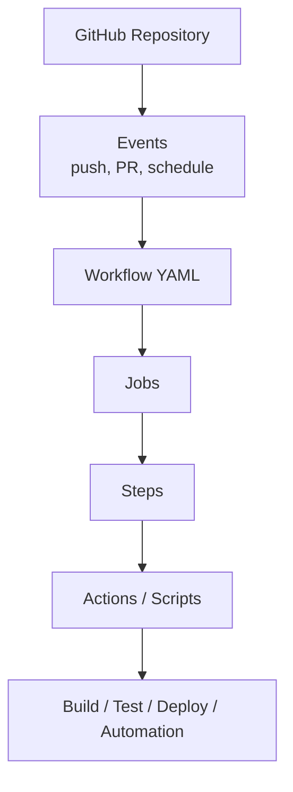

**Diagram explanation (≈170 words)**
This diagram depicts the conceptual flow of GitHub Actions as an automation engine. The process starts with a **GitHub Repository**, which is the central artifact container. The **Events** node represents triggers like `push`, `pull_request`, `workflow_dispatch`, and `schedule`. These events are the primary entrypoints that initiate automation runs. Each event maps to one or more **Workflow YAML** definitions stored under `.github/workflows/`. The workflow describes a set of **Jobs**, each running in its own isolated runner environment. Within each job, a series of **Steps** is executed sequentially. Steps can either invoke reusable **Actions** from the GitHub Marketplace or execute custom shell commands and scripts. The final node, **Build / Test / Deploy / Automation**, represents all possible outcomes: CI pipelines, deployment workflows, maintenance tasks, and integrations with external tools. This structure highlights how GitHub Actions transforms raw Git repository events into complex, orchestrated automation flows using a compositional model.

### 1.2 Structural Composition Diagram

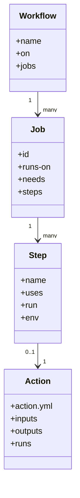

**Diagram explanation (≈170 words)**
This class-style diagram shows the logical composition of core GitHub Actions entities. A **Workflow** represents a top-level YAML definition; it has attributes like `name`, `on` (the trigger configuration), and a collection of `jobs`. Each **Job** is a unit of execution that specifies `runs-on` (the environment), `needs` (dependencies on other jobs), and a sequence of `steps`. The **Step** entity encapsulates either a reusable action (`uses`) or an inline command (`run`), plus optional environment variables. The **Action** represents a reusable component defined by an `action.yml`, with well-defined `inputs`, `outputs`, and runtime configuration (`runs` determining whether it is a composite, JavaScript, or Docker action). The relationships illustrate a clear Composite pattern: workflows are composites of jobs; jobs are composites of steps; steps may reference actions, which themselves can be composites of further steps (in case of composite actions). This structural view makes explicit the hierarchical design that underpins GitHub Actions’ flexibility and reusability.

---

## 2. How and Why GitHub Actions Uses a Composite Build System

GitHub Actions effectively implements a **Composite Build System** model where high-level automation requirements are expressed as trees/DAGs of composed execution units. The core compositional elements are:

- **Workflow → Job → Step → Action**

- **Job dependencies (`needs`) forming a DAG**

- **Composite Actions** (actions composed of steps) used as reusable building blocks


### 2.1 How the Composite Model Manifests

1. **Workflow as top-level composite**
    A workflow is a container for multiple jobs, each acting like an independent build target. When multiple jobs exist, they can run in parallel or be ordered via dependencies.

2. **Jobs as composite targets**
    Jobs themselves encapsulate multiple steps. The job is not a single command; it is a composite of steps such as checkout, build, test, package, deploy.

3. **Steps and Actions as leaf and nested composites**
    Steps are the finest-grained execution units. A step can be:

    - A simple shell command → leaf execution.

    - A `uses: owner/repo@version` action → a reusable composite, which itself can be implemented as a composite action containing further steps.

4. **DAG semantics through `needs`**
    Jobs can declare `needs` to depend on other jobs, forming a DAG of execution. This is effectively a graph-based build orchestration: upstream jobs must complete successfully before downstream jobs begin.


### 2.2 Why This Composite Approach Is Used

- **Reusability**: Actions and composite actions encapsulate build/test/deploy logic for reuse across workflows and repositories.

- **Modularity**: Jobs represent logical units (build, test, deploy) that can be composed differently for various environments.

- **Scalability**: DAG-based orchestration enables parallel execution and fine-grained control over pipeline structure.

- **Maintainability**: Separation of concerns (workflow-level orchestration, job-level environment, step-level tasks, action-level encapsulation) leads to cleaner configuration and easier evolution.

- **Alignment with CI/CD patterns**: Most CI/CD tooling leverages a graph of tasks; GitHub Actions aligns with this standard model.


### 2.3 Composite Build System Mapping Diagram

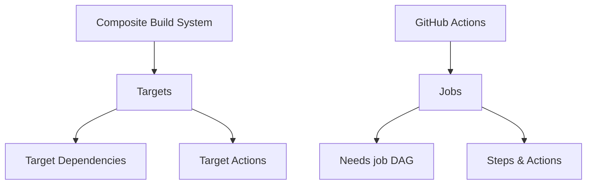

**Diagram explanation (≈170 words)**
This diagram maps a generic Composite Build System model to GitHub Actions primitives. On the left, the conceptual **Composite Build System** uses **Targets**, which have **Target Dependencies** and **Target Actions**. This is typical for build tools like Bazel or Gradle. On the right, **GitHub Actions** uses **Jobs** as the equivalent of targets. Job dependencies are expressed through `needs`, forming a job DAG akin to a build dependency graph. Job actions are decomposed into **Steps & Actions**, which execute the actual logic. This alignment demonstrates that GitHub Actions effectively behaves as a composite build engine: it allows you to define jobs as high-level targets, declare their dependencies, and attach execution logic via steps. The DAG semantics ensure that dependencies run before dependents and that jobs can run in parallel where dependencies permit. This mapping clarifies why GitHub Actions is naturally suitable as a generalized Composite Build System for CI/CD and automation workloads.

### 2.4 Composite Actions Diagram

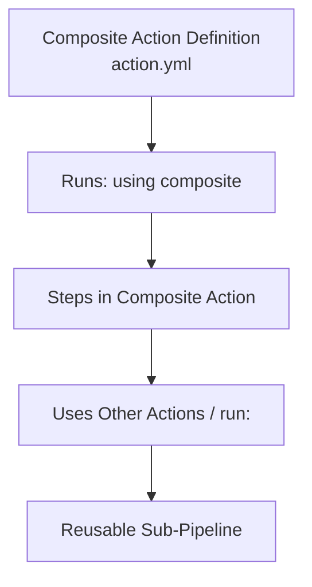

**Diagram explanation (≈170 words)**
This diagram focuses on **Composite Actions**, a key feature that intensifies the composite nature of GitHub Actions. A **Composite Action Definition** is declared via `action.yml` with `runs: using: "composite"`. This indicates that the action itself is implemented as a set of **Steps**, just like a job. These steps can use other actions (`uses: ...`) or execute commands (`run: ...`), enabling nested composition. When such an action is referenced in a workflow step, the entire internal step structure is conceptually inlined into the workflow, but abstracted away from the user. The **Reusable Sub-Pipeline** node captures the idea that a composite action is essentially a reusable mini-workflow that encapsulates a standardized build or deployment sub-process. This allows organizations to centralize best practices—such as security checks, testing templates, or deployment patterns—into single composite actions reused across repositories, promoting consistency and reducing duplication.

---

## 3. Enterprise-Level Architecture Characteristics of GitHub Actions

GitHub Actions is engineered as an enterprise-grade automation platform. It is not just a scripting layer on top of Git; it is a highly scalable orchestration system with strong isolation, security, and operational guarantees. Several architectural attributes justify its classification as enterprise-level:

1. **Multi-tenant, secure architecture**

    - Every workflow run executes in an isolated runner environment (GitHub-hosted VM/container or self-hosted runner).

    - Access to repository contents, secrets, and tokens is tightly scoped.

    - Permissions are governed through fine-grained repository and organization settings.

2. **DAG-based orchestration with fault isolation**

    - Each job is treated as an independent unit with clear dependencies (`needs`).

    - Failure isolation ensures that only dependent jobs are affected by upstream failures.

3. **Managed infrastructure and autoscaling**

    - GitHub-hosted runners scale elastically.

    - Users do not manage runner VM lifecycles in the hosted scenario; GitHub manages capacity, scheduling, and isolation.

4. **Extensibility via marketplace actions**

    - Third-party and internal actions can be composed into workflows.

    - This creates an ecosystem of reusable automation components.

5. **Observability and auditability**

    - Each run produces detailed logs, status, and artifacts.

    - Enterprise customers get enhanced audit logs, compliance data, and access control.

6. **Policy, governance, and compliance**

    - Enterprise features include repository protection rules, required checks, environment approvals, and more.

    - Actions can be restricted to approved sources or internal registries.


### 3.1 Enterprise Execution Model Diagram

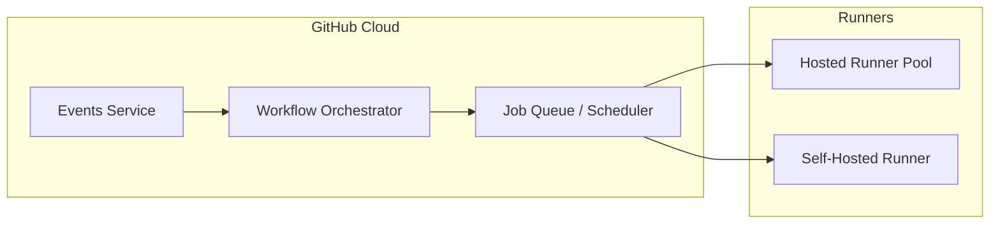

**Diagram explanation (≈180 words)**
This diagram presents a conceptual enterprise-level execution architecture for GitHub Actions. Within the **GitHub Cloud**, the **Events Service** receives triggers such as pushes, pull requests, and manual workflow dispatches. These events are fed to the **Workflow Orchestrator**, which resolves the relevant workflows, parses their definitions, and builds the job dependency graph. The orchestrator then places runnable jobs into the **Job Queue / Scheduler**, which is responsible for assigning jobs to appropriate execution environments. On the right, the **Runners** section shows two categories: **Hosted Runner Pool** (GitHub-managed VMs/containers) and **Self-Hosted Runner** instances (customer-managed agents). Jobs are dispatched from the scheduler to available runners that match the `runs-on` requirements (e.g., `ubuntu-latest`, `windows-latest`, or custom labels). This decoupling between orchestration and execution is fundamental to enterprise scalability: GitHub can independently scale event ingestion, workflow orchestration, and job execution pools while ensuring multi-tenant isolation and reliable throughput.

### 3.2 Security & Governance Overlay Diagram

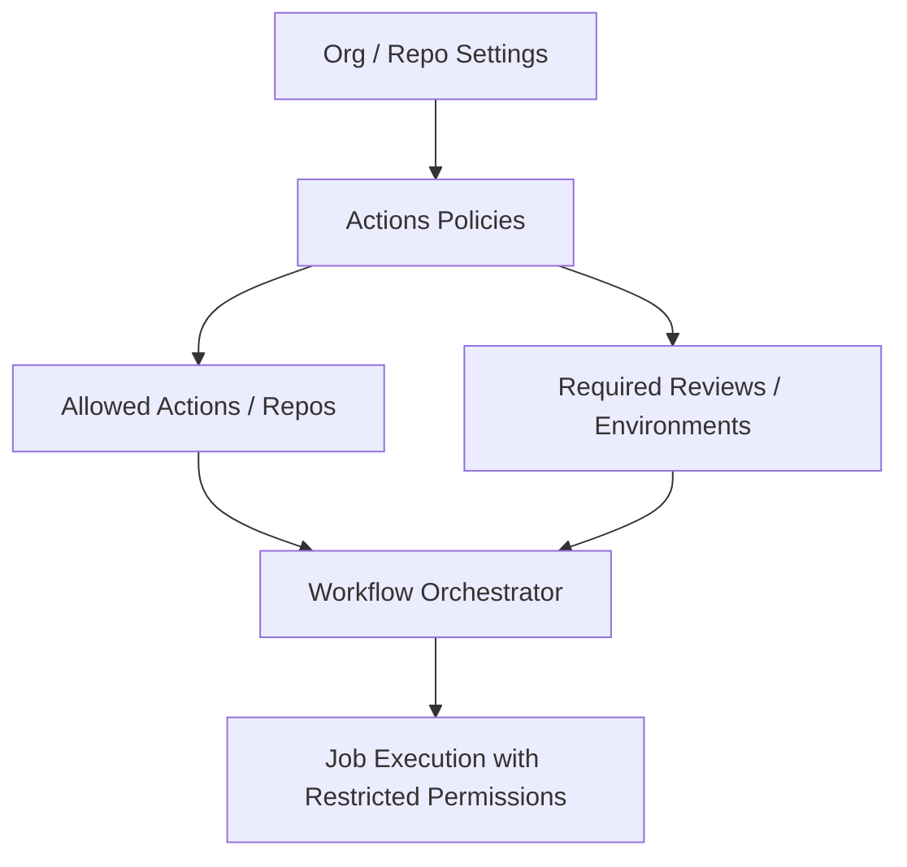

**Diagram explanation (≈170 words)**
This diagram illustrates the security and governance overlay on top of the GitHub Actions orchestration. The **Org / Repo Settings** node signifies administrative controls configured by organization or repository owners. These drive **Actions Policies**, which can define which actions are allowed (e.g., only those from the same organization or from a curated list) and what security posture is applied. From these policies, we derive **Allowed Actions / Repos** and **Required Reviews / Environments**. Allowed actions define which external components are permissible, while required reviews govern environment protections, e.g., requiring approvals before deploying to production. These policies flow into the **Workflow Orchestrator**, influencing whether a workflow or job is allowed to proceed. Finally, orchestration yields **Job Execution with Restricted Permissions**, ensuring that each runner operates with only the minimally required scopes and secrets. This architecture ensures GitHub Actions can be used in highly regulated environments while still leveraging the convenience and power of a composite automation system.

---

## 4. Detailed Architecture and Component Flows

In this section, we articulate a detailed, high-level architecture of GitHub Actions in the context of a composite build system: how workflows are defined, orchestrated, executed, and observed.

### 4.1 Logical Architecture Overview

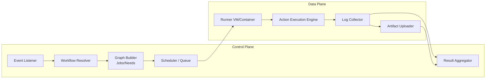

**Diagram explanation (≈180 words)**
This diagram separates GitHub Actions into a **Control Plane** and a **Data Plane**, similar to modern distributed systems. In the Control Plane, the **Event Listener** receives GitHub events. The **Workflow Resolver** identifies the applicable workflows for the event and fetches their YAML definitions. The **Graph Builder (Jobs/Needs)** parses `jobs` and `needs` sections to build a job DAG, capturing dependencies, environments, and required secrets. The **Scheduler / Queue** then decides which jobs are ready to run (no unmet dependencies) and enqueues them. In the Data Plane, a **Runner VM/Container** picks up a job, pulls the repository, and executes the job using the **Action Execution Engine**, which runs steps and actions sequentially. A **Log Collector** streams logs back to GitHub in real time, while an **Artifact Uploader** handles build artifacts. These outputs feed into the **Result Aggregator**, which compiles logs, artifacts, and statuses into a coherent workflow run result. This architecture supports robust parallelism, modular execution, and clear separation of concerns.

### 4.2 Workflow YAML to Execution Graph Transformation

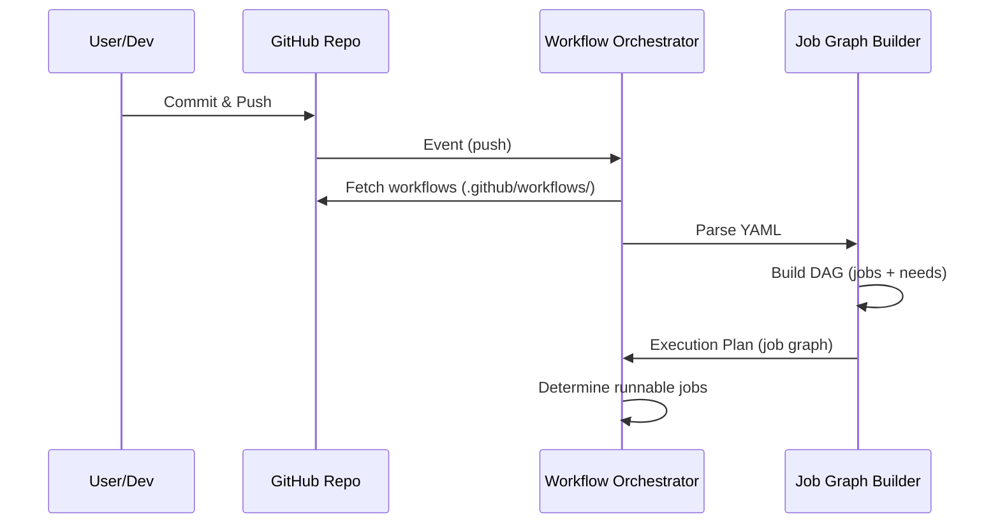

**Diagram explanation (≈160 words)**
This sequence diagram shows the transformation of workflow definitions into an executable graph. The **User/Dev** commits and pushes changes to the **GitHub Repo**, which triggers an event (such as `push`). The repository signals the **Workflow Orchestrator** that an event occurred. The orchestrator queries the repository for workflow definitions under `.github/workflows/` and forwards them to the **Job Graph Builder**. The graph builder parses the YAML definitions, interpreting `jobs`, `steps`, and `needs` fields to create an internal DAG representing job dependencies and execution order. This DAG is returned to the orchestrator as an **Execution Plan**. The orchestrator then determines which jobs are immediately runnable (those without unmet dependencies) and pushes them into the scheduling subsystem. This transformation is essentially the same conceptual step as building a target DAG in a composite build system, confirming that GitHub Actions’ orchestration layer is strongly aligned with build-system design principles.

### 4.3 Job Execution Internals

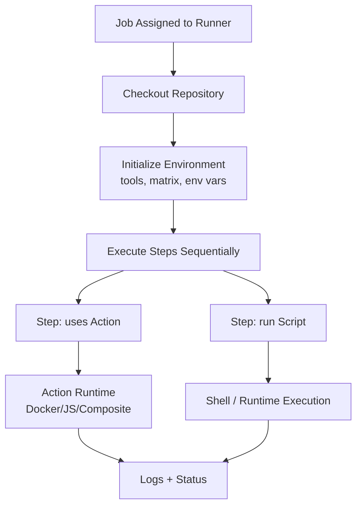

**Diagram explanation (≈190 words)**
This diagram delves into the internal execution model of a job on a single runner. Once a job is **Assigned to Runner**, the first step is usually the **Checkout Repository**, fetching the relevant commit to the runner’s workspace. The next phase is **Initialize Environment**, which may include installing tools, setting up language runtimes, honoring matrix expansions (e.g., different OS, Node versions), and configuring environment variables and secrets. Then the engine **Executes Steps Sequentially**. Each step may be a `uses` step (referencing an action) or a `run` step (executing inline shell scripts). For `uses` steps, the **Action Runtime** depends on the action type—Docker container-based, JavaScript-based, or composite. For `run` steps, the **Shell / Runtime Execution** node handles direct command execution. Both action execution and script execution stream **Logs + Status** back to the GitHub control plane. If any step fails (depending on `continue-on-error` settings), the job may fail, and dependent jobs in the DAG may not be scheduled. This tightly orchestrated model allows fine-grained monitoring and debugging of job behavior.

### 4.4 Artifact and Logs Aggregation

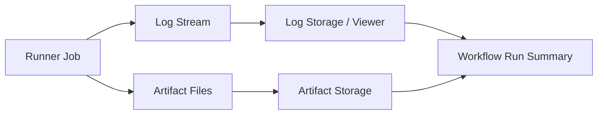

**Diagram explanation (≈170 words)**
This diagram tackles the observability pipeline of GitHub Actions. As the **Runner Job** executes steps, it produces two main categories of output: **Log Stream** and **Artifact Files**. The log stream is continuously forwarded to the **Log Storage / Viewer**, where it becomes visible in the GitHub UI for each step and job. Artifact files—such as build outputs, test reports, and coverage files—are uploaded to **Artifact Storage**, which might be backed by an object storage layer. Both types of outputs are aggregated into a **Workflow Run Summary**, which unifies job statuses, logs, and artifacts under a single run ID. This summary is exposed to users via the Actions UI and APIs. From an enterprise viewpoint, this architecture supports auditability, troubleshooting, and historical analysis, while ensuring that CI/CD runs are fully traceable and reproducible, crucial for compliance and high-stakes deployment environments.

---

## 5. Powerful and Unique Features Aligned with Composite Build Principles

GitHub Actions incorporates several features that directly align with the Composite Build System component and extend it.

### 5.1 Reusable and Composite Actions

Composite actions enable organizations to encapsulate repeating patterns such as:

- Standardized build pipelines (e.g., Node.js build, .NET build)

- Security and compliance checks

- Deployment flows


These composite actions can be versioned and shared across repositories, effectively acting as “libraries of build/workflow logic,” analogous to Gradle plugins or Bazel macros.

### 5.2 Matrix Builds and Parametric Composition

Matrix builds allow a single job definition to be expanded into multiple independent jobs based on axes such as OS, language version, or dependency variants. This is a **parametric form of composition**, where one job definition generates multiple leaf jobs in the execution graph. This multiplies test coverage while maintaining configuration DRYness.

### 5.3 Environment and Secret Management

Environments (e.g., `dev`, `staging`, `prod`) can be modeled as distinct targets requiring approvals or specific secrets. These act like environment-specific composite targets in a build system, enforcing policies and lifecycles on deployment or critical operations.

### 5.4 Marketplace and Ecosystem

GitHub Actions’ marketplace provides a rich catalog of reusable steps implemented as actions. This ecosystem is effectively a **shared component registry** for the composite system, similar to how Maven Central or npm operate for libraries.

### 5.5 Features Alignment Diagram

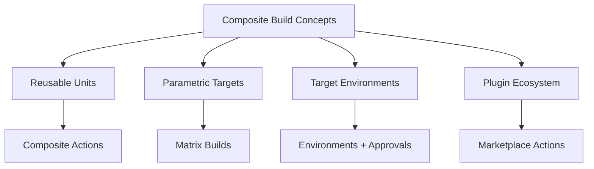

**Diagram explanation (≈170 words)**
This diagram links generic composite build concepts to specific GitHub Actions features. **Reusable Units** map to **Composite Actions**, where complex sequences are bundled into a reusable component. **Parametric Targets** correspond to **Matrix Builds**, which automatically expand a job definition across multiple configurations. **Target Environments** align with **Environments + Approvals**, supporting environment-specific policies and controls. Finally, a **Plugin Ecosystem** translates into **Marketplace Actions**, where the community and vendors publish reusable automation pieces. This mapping underscores that GitHub Actions is not just a simple CI runner; it is a fully-featured composite automation engine with modularity, reuse, and extension as first-class citizens. The diagram reinforces that the design choices in GitHub Actions systematically reflect core composite build system philosophies.

### 5.6 Compositional Hierarchy Diagram

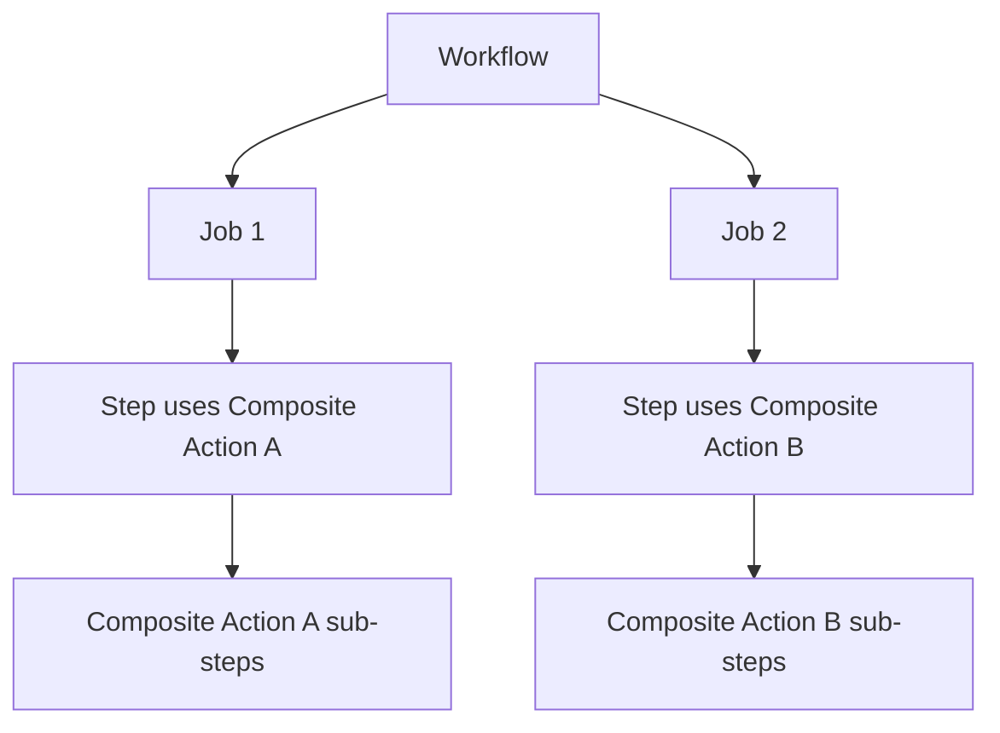

**Diagram explanation (≈170 words)**
This diagram shows the nested compositional hierarchy GitHub Actions can achieve. A **Workflow** defines multiple **Jobs**, such as Job 1 and Job 2. Within Job 1, a **Step** uses **Composite Action A**, and Job 2 uses **Composite Action B**. Each composite action further expands into sub-steps (e.g., performing setup, build, test, and report operations). From a composite build perspective, this is equivalent to defining high-level targets which then invoke reusable sub-targets that encapsulate complex behavior. This hierarchical nesting allows enterprises to standardize and centralize automation logic across many repositories and teams, while still retaining the flexibility for individual workflows to arrange and combine these actions as needed.

---

## 6. Implementation Idea, Lifecycle, and Lifecycle Management

Below is a conceptual implementation and lifecycle model of GitHub Actions, presented in terms of design concepts rather than internal proprietary code.

### 6.1 Workflow Lifecycle Stages

1. **Definition**: Developer writes workflow YAML and commits to `.github/workflows/`.

2. **Trigger**: An event (push, PR, schedule, manual) fires.

3. **Resolution**: Actions control plane resolves which workflows match.

4. **Planning**: YAML is parsed, DAG is constructed.

5. **Scheduling**: Jobs ready to run are enqueued.

6. **Execution**: Jobs are processed by runners.

7. **Aggregation**: Logs, artifacts, and statuses are collected.

8. **Completion**: Workflow run status is finalized and presented.


### 6.2 Lifecycle Diagram

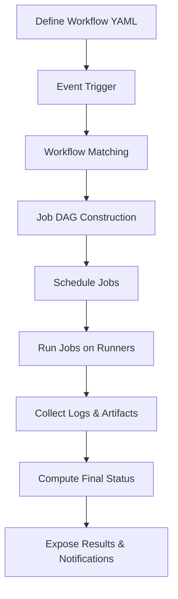

**Diagram explanation (≈180 words)**
This diagram describes the primary lifecycle of a GitHub Actions workflow. It begins with **Define Workflow YAML**, where configuration is committed into the repository. An **Event Trigger** (like `push`, `pull_request`, or `workflow_dispatch`) then initiates workflow resolution. The **Workflow Matching** stage identifies which workflows are applicable based on the event configuration. Then **Job DAG Construction** parses the YAML and builds the job graph. **Schedule Jobs** determines which jobs can be run immediately, taking dependencies into account. These jobs are then **Run on Runners**, where all step actions and scripts are executed. Throughout execution, the system **Collects Logs & Artifacts**, storing them for inspection. Finally, it **Computes Final Status** (success, failure, canceled) and **Exposes Results & Notifications** via the GitHub UI, checks, status APIs, and optional integrations (Slack, email, etc.). This lifecycle is directly comparable to how a composite build system plans and executes targets against a DAG of dependencies.

### 6.3 Lifecycle Management Components Diagram

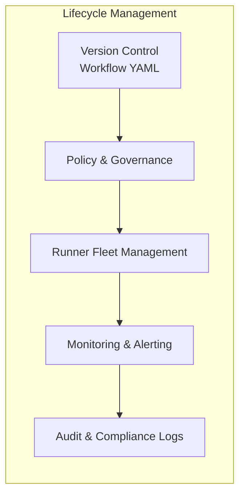

**Diagram explanation (≈160 words)**
This diagram outlines core lifecycle management concerns around GitHub Actions. **Version Control** of workflow YAML ensures that any change to automation is tracked with full history and can be reviewed like code. **Policy & Governance** applies constraints and approvals (e.g., restricting actions sources, requiring reviews for environment deployments). **Runner Fleet Management** controls hosted or self-hosted runner pools: scaling, maintenance, and label-based routing. **Monitoring & Alerting** overlays metrics (success rates, failure rates, execution times) to detect operational issues. Lastly, **Audit & Compliance Logs** record who triggered what, what executed, and what external systems were touched—critical for regulated industries. This stack represents the operational “meta-system” surrounding the core execution engine, ensuring that automations are not just functional, but also governable and trustworthy.

### 6.4 Job Lifecycle State Machine

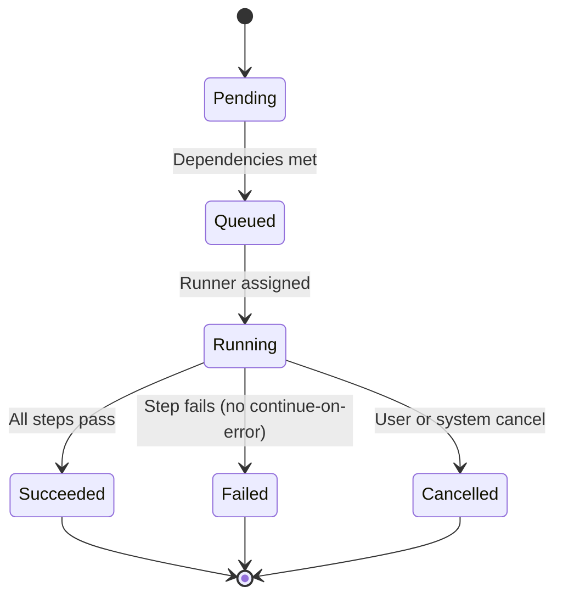

**Diagram explanation (≈170 words)**
This state machine captures the lifecycle of an individual job in GitHub Actions. Initially, a job is in the **Pending** state; it has been defined but is not yet ready to run because dependencies might not be satisfied. Once all `needs` dependencies are complete, the job transitions to **Queued**, waiting for a suitable runner. When a runner is assigned and begins executing, the job moves to **Running**. If all steps complete successfully, it transitions to **Succeeded`. If a step fails (and` continue-on-error `is not instructing otherwise), the job moves to **Failed`. A job may also be **Cancelled** by user intervention or system timeouts. Each terminal state leads back to the final `[ * ]` node. This finite-state model ensures deterministic job status behavior, essential for reliable build and deployment pipeline orchestration.

### 6.5 Step Execution Flow

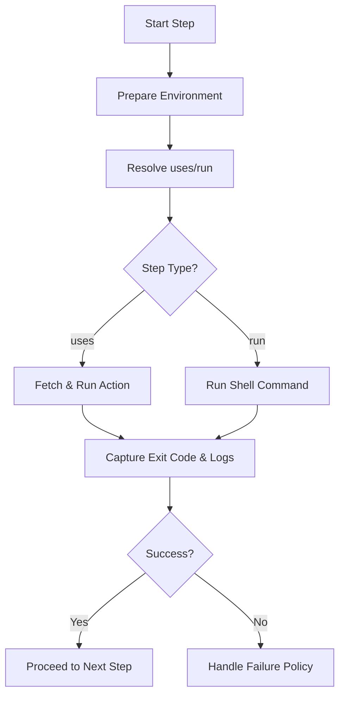

**Diagram explanation (≈180 words)**
This diagram focuses on the lifecycle of a single step within a job. **Start Step** kicks off the step execution. First, the runner **Prepares Environment**, loading environment variables, secrets, and any necessary context. Then it **Resolves `uses`/`run`**, determining whether the step uses an action or runs an inline shell command. The decision node **Step Type?** routes to **Fetch & Run Action** for `uses` or **Run Shell Command** for `run`. After executing, the system **Captures Exit Code & Logs**. Next, a decision node **Success?** evaluates the exit code and relevant settings like `continue-on-error`. If successful, control passes to **Proceed to Next Step**. If the step fails, the engine **Handles Failure Policy**, which might mark the job as failed or continue with subsequent steps, depending on configuration. Understanding this micro-lifecycle is key to debugging complex composite workflows, especially when incorporating many third-party actions.

---

## 7. Alignment with SD, LLD, OOP, and HLD Principles

GitHub Actions demonstrates strong alignment with standard software design principles across multiple layers.

### 7.1 High-Level Design (HLD)

- **Modular subsystems**: orchestration, scheduling, execution, logging, artifacts, governance.

- **Clear separation of concerns**: control plane vs data plane.

- **DAG-based orchestration**: deterministic and reliable execution paths.


### 7.2 Low-Level Design (LLD)

- YAML structure mirrors LLD patterns: explicit job declarations, clear dependencies.

- Composite actions encapsulate reusable LLD units (like library functions).

- Clear contracts for inputs/outputs of actions.


### 7.3 Object-Oriented Principles

While workflows are defined in YAML, the underlying implementation adheres to OO and component-based design:

- **Encapsulation**: Actions encapsulate behavior and configuration.

- **Composition over inheritance**: Workflows compose jobs; jobs compose steps; steps compose actions.

- **Polymorphism**: Actions can be of different types (JS, Docker, composite) but share a common invocation interface.


### 7.4 Design Principles

- **Single Responsibility Principle**: jobs, steps, actions each have narrow responsibilities.

- **Open/Closed Principle**: new actions and workflows can be introduced without modifying the underlying engine.

- **Dependency Inversion**: workflows depend on abstract action contracts; actual implementations are external and replaceable.


### 7.5 Principles Alignment Diagram

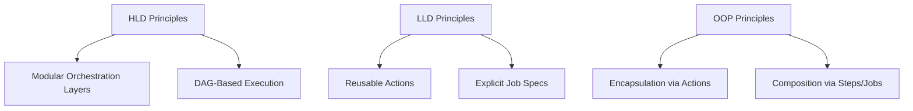

**Diagram explanation (≈170 words)**
This diagram shows how GitHub Actions’ architecture aligns with multiple design principle categories. **HLD Principles** produce **Modular Orchestration Layers** and **DAG-Based Execution**, emphasizing structural decomposition and deterministic flows. **LLD Principles** drive **Reusable Actions** (encapsulated logic units) and **Explicit Job Specs** (detailed configuration approximating method-level logic). **OOP Principles** result in **Encapsulation via Actions**—actions hiding implementation details behind inputs/outputs—and **Composition via Steps/Jobs**, which favor building behavior by combining entities instead of relying on rigid inheritance. The diagram emphasizes that while workflows appear declarative in YAML, their underlying implementation is deeply influenced by classical software engineering best practices, making GitHub Actions not just a stopgap CI tool but a well-architected automation platform.

### 7.6 Composite and OO Integration Diagram

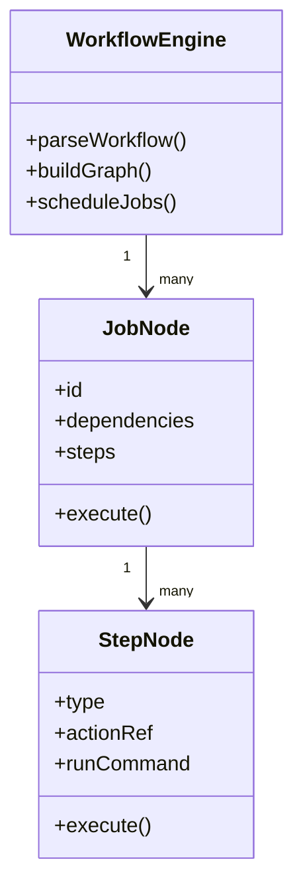

**Diagram explanation (≈160 words)**
This diagram offers an OO-flavored view of how a hypothetical internal implementation of GitHub Actions might look. A **WorkflowEngine** class parses workflow definitions, builds the job graph, and schedules jobs. Each **JobNode** represents a concrete job with identifiers, dependencies, and steps; it has an `execute()` method that runs the job on a runner. Each **StepNode** encapsulates the step configuration, whether it is a `uses` or `run` type, and the logic to `execute()` itself. The relationships between these classes clearly follow the Composite pattern: the engine manipulates a tree/graph composed of job nodes, each of which further contains step nodes. This model also demonstrates classical OO design: clear responsibilities, compositional structures, and method-based behavior invocation.

---

## 8. Scalability, Maintainability, and Operability at Large Scale

GitHub Actions serves millions of repositories, organizations, and workflows. Achieving this scale requires careful design choices.

### 8.1 Scalability

- **Horizontal scaling of runners**: Hosted runner pools scale horizontally; additional compute nodes can be added behind the scheduling layer.

- **Partitioned orchestration**: Event processing and workflow orchestration can be partitioned by repository, organization, or region.

- **Efficient DAG evaluation**: Only necessary jobs are scheduled; skipped paths reduce work.


### 8.2 Maintainability

- **Configuration-as-code**: workflows reside with application code; versioning and reviews apply consistently.

- **Reusable actions**: centralization of logic in composite actions reduces duplication.

- **Backward compatibility**: GitHub maintains compatibility guarantees for core features and APIs.


### 8.3 Operability

- **Monitoring**: metrics on execution times, success/failure rates, queue times.

- **Logging**: granular logs per step/job; helpful in debugging.

- **Alerting**: internal SRE teams monitor system health, with multi-region failover strategies.


### 8.4 Scalability Architecture Diagram

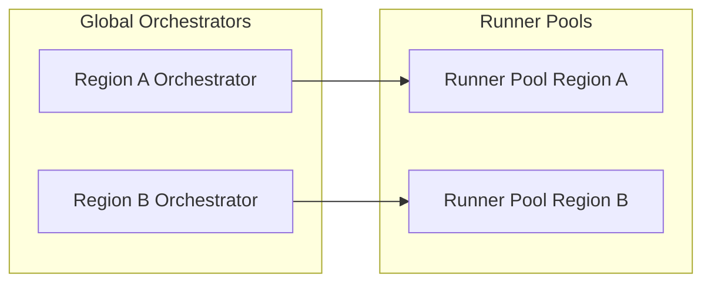

**Diagram explanation (≈170 words)**
This diagram illustrates a high-level scalable design where orchestrators and runner pools are deployed across multiple regions. **Region A Orchestrator** and **Region B Orchestrator** independently handle workflows linked to their respective data sets or customers, while **Runner Pool Region A** and **Runner Pool Region B** execute the workload. This partitioned architecture permits horizontal scaling: adding more orchestrators or runner pools in each region increases capacity. It also supports data locality and compliance: workflows and their logs can remain within specified geographic boundaries. While the internal implementation details are proprietary, this pattern is consistent with modern SaaS design for high-volume CI/CD systems.

### 8.5 Maintainability Diagram

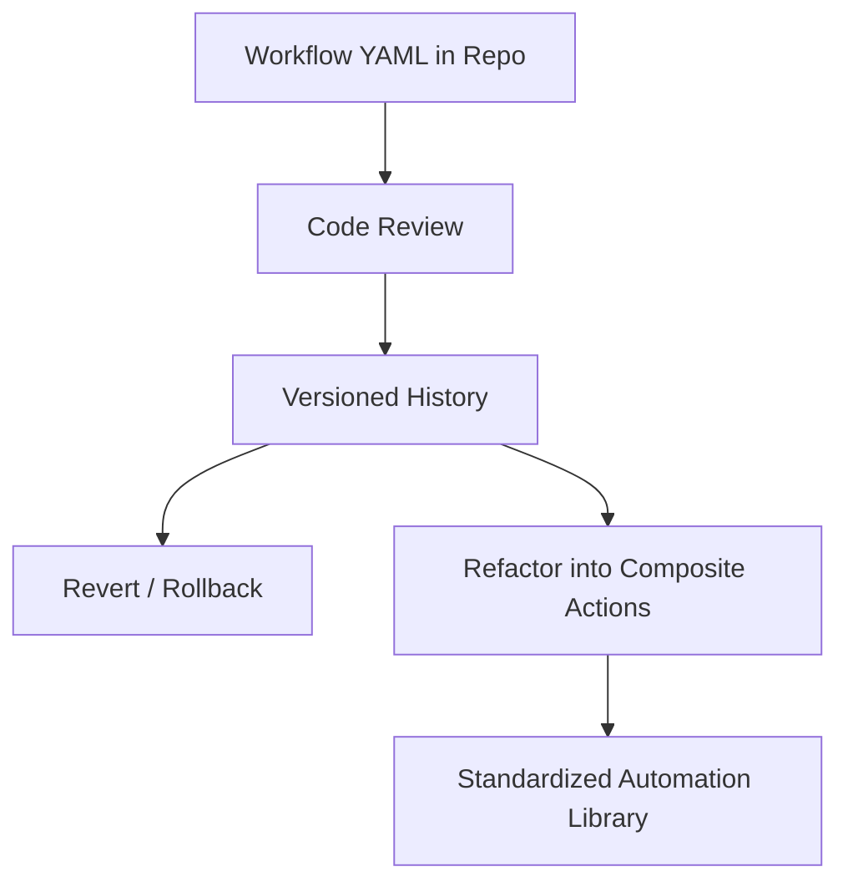

**Diagram explanation (≈170 words)**
This diagram shows the maintainability lifecycle of workflows. **Workflow YAML in Repo** is treated like any other code: subject to **Code Review**. Once merged, it contributes to a **Versioned History** where changes are traceable. From this history, teams can **Revert / Rollback** problematic workflow modifications. Over time, duplicated logic can be **Refactored into Composite Actions**, which are stored in dedicated repositories (or directories) and reused across projects, forming a **Standardized Automation Library**. This flow is central to keeping CI/CD logic manageable even as organizations scale across hundreds of services and teams.

### 8.6 Operability Diagram

```mermaid
flowchart TD
    A[Execution Metrics] --> B[Monitoring Dashboards]
    A --> C[Alert Rules]
    C --> D[Oncall Notifications]
    B --> E[Trend Analysis]
    E --> F[Capacity Planning]
```

**Diagram explanation (≈180 words)**
This diagram outlines operational practices supporting GitHub Actions as a service. **Execution Metrics** (e.g., job queue times, runner utilization, error rates) feed into **Monitoring Dashboards**, which provide real-time visibility for operators and SREs. These metrics also drive **Alert Rules**, which automatically trigger **Oncall Notifications** when thresholds are violated. Meanwhile, the dashboards enable **Trend Analysis**: identifying patterns such as peak times, recurrent failures, or inefficient workflows. This analysis informs **Capacity Planning**, where infrastructure teams decide how many runners to provision, which regions to scale, and how to route workload. This feedback loop is crucial to operating such a large-scale multi-tenant service reliably and cost-effectively.

### 8.7 Composite Build System Perspective on Scalability

From a Composite Build System viewpoint, GitHub Actions scales by:

- Decomposing automation into small composable units (steps, actions).

- Scheduling only necessary subgraphs of the workflow DAG.

- Allowing externalization of compute (self-hosted runners).

- Leveraging configuration-as-code and reusable components to reduce management overhead.


These mechanisms mirror large build systems like Bazel at Google or Buck at Meta, demonstrating that GitHub Actions is fundamentally aligned with the architectural strategies used by world-scale engineering organizations to manage complex build and automation workloads.

---

## Conclusion

GitHub Actions is best understood not just as “GitHub CI,” but as a **fully-fledged composite build and automation system**. It models workflows as DAGs of composable units, encapsulates execution semantics in reusable actions, and provides an enterprise-ready platform for scalable, maintainable, and governable automation. The underlying design adheres to established HLD, LLD, and OOP principles, while the operational model ensures it can support massive multi-tenant usage across the global developer ecosystem.
