# GitHub Actions as a Composite Build System

_A production-grade architectural case study_

---

## Table of Contents

1. [What is GitHub Actions?](https://chatgpt.com/c/69248c4a-5418-8323-9f5e-e22b9526f426#1-what-is-github-actions)

2. [How and why it uses Composite Build System concepts](https://chatgpt.com/c/69248c4a-5418-8323-9f5e-e22b9526f426#2-how-and-why-it-uses-composite-build-system-and-to-what-extent)

3. [Enterprise-grade behavior and architecture](https://chatgpt.com/c/69248c4a-5418-8323-9f5e-e22b9526f426#3-how-they-ensure-that-github-actions-behave-as-an-enterprise-level-architecture)

4. [Detailed architecture and component flows](https://chatgpt.com/c/69248c4a-5418-8323-9f5e-e22b9526f426#4-detailed-architecture-diagrams-and-component-flows)

5. [Powerful and unique features aligned with Composite Build System](https://chatgpt.com/c/69248c4a-5418-8323-9f5e-e22b9526f426#5-powerful-and-unique-features-aligned-with-composite-build-system)

6. [Implementation idea, lifecycle, lifecycle management](https://chatgpt.com/c/69248c4a-5418-8323-9f5e-e22b9526f426#6-complete-implementation-idea-and-lifecycle-management)

7. [Alignment with SD, LLD, OOP, and HLD principles](https://chatgpt.com/c/69248c4a-5418-8323-9f5e-e22b9526f426#7-alignment-with-sd-lld-oop-and-hld-principles)

8. [Scalability, maintainability, operability at GitHub scale](https://chatgpt.com/c/69248c4a-5418-8323-9f5e-e22b9526f426#8-scalability-maintainability-and-operability)


---

## 1. What is GitHub Actions?

GitHub Actions is GitHub’s native automation and CI/CD platform. It allows you to define **workflows** as YAML files under `.github/workflows` in a repository. A workflow is a configurable automated process made up of one or more **jobs**; each job consists of a series of **steps**. Jobs run in isolated **runners**—either GitHub-hosted VMs/containers or self-hosted machines—and can execute scripts or invoke reusable **actions**, which are packaged automation units.([GitHub Docs](https://docs.github.com/actions/using-workflows/workflow-syntax-for-github-actions?utm_source=chatgpt.com "Workflow syntax for GitHub Actions"))

These workflows are triggered by repository events like pushes, pull requests, issue events, or on schedules. GitHub Actions therefore becomes the “automation fabric” of a repository: building, testing, releasing, scanning, or performing operational routines in direct response to development activities. Runners provide preconfigured images for Linux, Windows, and macOS, with tooling already installed.([GitHub Docs](https://docs.github.com/actions/using-github-hosted-runners/about-github-hosted-runners?utm_source=chatgpt.com "GitHub-hosted runners"))

From a systems-design perspective, GitHub Actions is a **declarative orchestration engine**: you describe the workflow (graph of jobs and steps) in YAML, GitHub resolves dependencies, provisions compute, executes tasks in parallel or sequence, and collects logs and artifacts. It blends a build system, task scheduler, and pipeline orchestrator into a single integrated service deeply coupled to GitHub repositories.

### Diagram 1.1 – Conceptual View of GitHub Actions

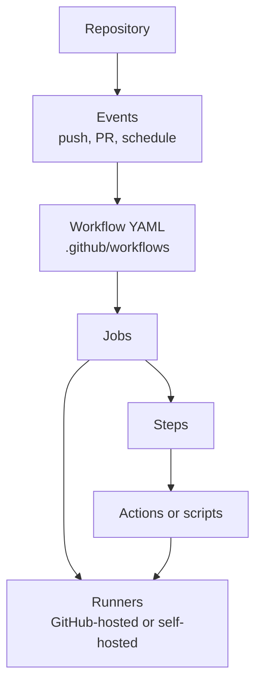

### Diagram 1.2 – Workflow–Job–Step Hierarchy

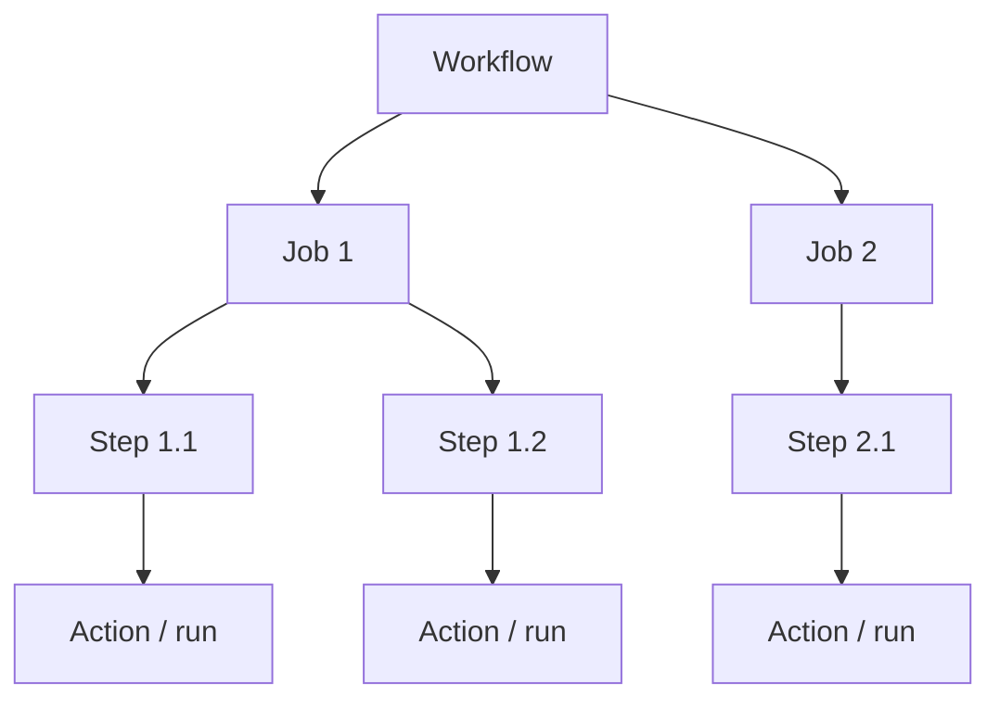

---

## 2. How and why it uses Composite Build System and to what extent?

GitHub Actions behaves very much like a **Composite Build System**: it composes build and automation logic from smaller building blocks into larger graphs. At the lowest level, a **step** is an atomic execution unit (run script or use an action). Steps are composed into **jobs**; jobs are composed into **workflows**. Moreover, GitHub introduces **composite actions** and **reusable workflows**, which are higher-order composites that encapsulate sets of steps or jobs into reusable modules.([GitHub Docs](https://docs.github.com/en/actions/concepts/workflows-and-actions/reusing-workflow-configurations?utm_source=chatgpt.com "Reusing workflow configurations"))

1. **Atomic units – steps / actions**
    Each step or action is a standalone “task” with inputs, outputs, and side effects (build, test, deploy, scan, etc.).

2. **Composite units – jobs**
    A job is a sequence of steps executed on a runner. Jobs can depend on other jobs via `needs`, forming a directed acyclic graph of job dependencies.([GitHub Docs](https://docs.github.com/actions/using-workflows/workflow-syntax-for-github-actions?utm_source=chatgpt.com "Workflow syntax for GitHub Actions"))

3. **Higher-level composites – workflows**
    Workflows group jobs into an end-to-end CI/CD or automation process (e.g., build → test → deploy). This is your **graph root** in the Composite Build System analogy.

4. **Composable modules – composite actions & reusable workflows**

    - Composite actions: multiple steps bundled into one “step” that can be reused across workflows.

    - Reusable workflows: entire workflows that can be called from other workflows using `uses`.([GitHub Docs](https://docs.github.com/en/actions/how-tos/reuse-automations/reuse-workflows?utm_source=chatgpt.com "Reuse workflows"))


This composition hierarchy effectively implements the Composite pattern:

- Steps are leaves

- Jobs are intermediate composites

- Workflows are top-level composites

- Composite actions and reusable workflows act as reusable composite subtrees


The **why** is straightforward:

- **Reusability** – avoid duplicating YAML across repositories.

- **Modularity** – encapsulate complex logic behind clean interfaces (inputs/outputs).

- **Maintainability** – change centralized actions/workflows, and all consumers benefit.

- **Scalability** – orchestrate tens or hundreds of jobs per workflow using matrix builds, job dependencies, and reusable modules.([GitHub Docs](https://docs.github.com/actions/writing-workflows/choosing-what-your-workflow-does/running-variations-of-jobs-in-a-workflow?utm_source=chatgpt.com "Running variations of jobs in a workflow"))


### Diagram 2.1 – Composite Pattern Analogy

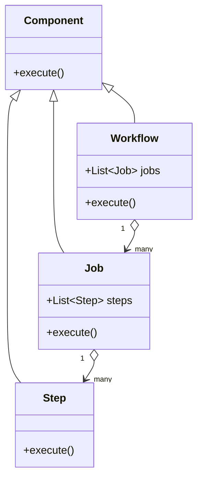

### Diagram 2.2 – Reusable Composites

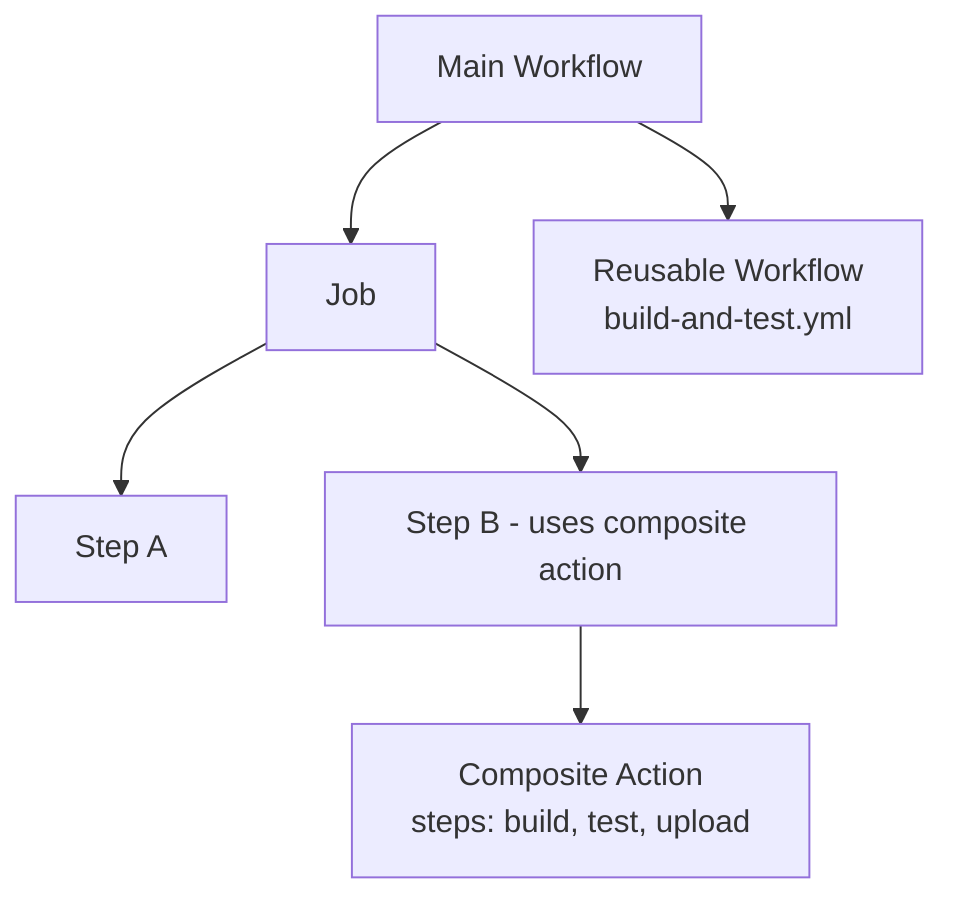

GitHub Actions therefore uses Composite Build System concepts extensively: at the structural (workflow graph), behavioral (job dependencies), and reuse (composite/reusable actions) layers.

---

## 3. How they ensure that GitHub Actions behave as an enterprise level architecture

From an enterprise architecture standpoint, GitHub Actions is designed as a **multi-tenant, highly available, secure, and observable automation fabric** on top of GitHub’s repository platform. Several key dimensions make it enterprise-grade:

### 3.1 Multi-tenant isolation and security

Each workflow run executes on an isolated runner (VM or container). GitHub-hosted runners are ephemeral: created for the job, execute steps, and are then destroyed.([GitHub Docs](https://docs.github.com/actions/using-github-hosted-runners/about-github-hosted-runners?utm_source=chatgpt.com "GitHub-hosted runners"))

This provides:

- **Tenant isolation** – workloads of different repos and organizations do not share stateful machines.

- **Security boundaries** – secrets are injected at runtime via encrypted secrets; ephemeral VMs reduce long-lived attack surfaces.

- **Controlled privileges** – permissions can be scoped using fine-grained token permissions (`GITHUB_TOKEN`) and environments with required approvals.([GitHub Docs](https://docs.github.com/actions/using-workflows/workflow-syntax-for-github-actions?utm_source=chatgpt.com "Workflow syntax for GitHub Actions"))


In enterprise GitHub (GitHub Enterprise Cloud/Server), organizations can restrict where workflows can run, which actions can be used, and how secrets are managed and protected.([GitHub Docs](https://docs.github.com/actions/creating-actions/sharing-actions-and-workflows-with-your-organization?utm_source=chatgpt.com "Sharing actions and workflows with your organization"))

### 3.2 Declarative definition and deterministic orchestration

Enterprise systems care deeply about **repeatability** and **determinism**. Workflows are defined declaratively via YAML, including:

- triggers (`on`)

- job dependency graph (`needs`)

- runner types (`runs-on`)

- environment, conditions, and matrices


This ensures that any run with the same commit and configuration behaves predictably, a key requirement for regulated industries.

### 3.3 Scalability and parallelism

GitHub Actions supports:

- **Multiple parallel jobs** per workflow run

- **Matrix builds** that multiply a single job definition into many parallel jobs across versions, OS, architectures, etc.([GitHub Docs](https://docs.github.com/actions/writing-workflows/choosing-what-your-workflow-does/running-variations-of-jobs-in-a-workflow?utm_source=chatgpt.com "Running variations of jobs in a workflow"))


This gives enterprises:

- horizontal scalability (e.g., hundreds of tests in parallel)

- configurability (e.g., 256 jobs per workflow for matrix runs)


### 3.4 Observability and governance

GitHub Actions exposes:

- per-step logs

- workflow, job, and step status

- artifact management

- audit logs (in enterprise plans)


Organizations can also restrict or vet marketplace actions, and share approved internal actions/workflows in private repos.([GitHub Docs](https://docs.github.com/actions/creating-actions/sharing-actions-and-workflows-with-your-organization?utm_source=chatgpt.com "Sharing actions and workflows with your organization"))

### 3.5 Reliability and fault tolerance

The runner infrastructure leverages cloud providers; GitHub-hosted runners are automatically maintained, updated, and replaced. GitHub can route workloads across regions and handle failures transparently, providing resilience at platform level.

### Diagram 3.1 – Enterprise Architecture Layers

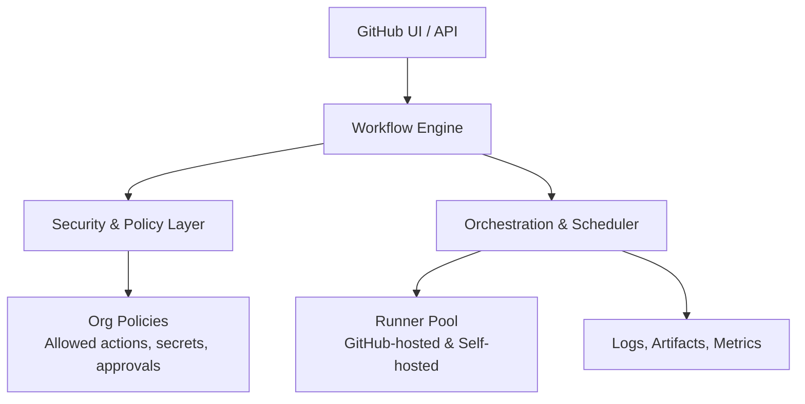

### Diagram 3.2 – Multi-Tenant Isolation Model

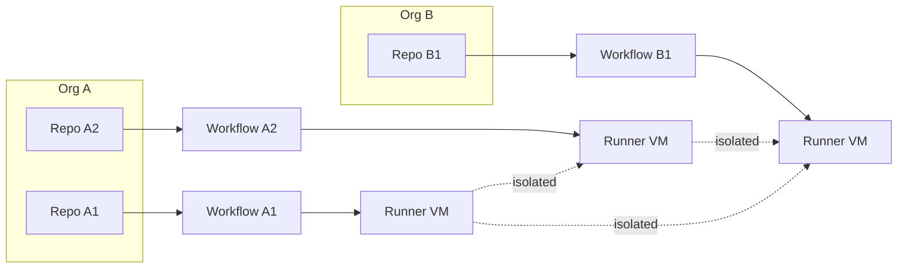

By combining isolation, declarative orchestration, scalability, governance, and observability, GitHub Actions behaves as an enterprise-class CI/CD and automation system.

---

## 4. Detailed architecture diagrams about this GitHub Actions and component flows

This section walks through the architecture with a focus on components and flows that mirror a Composite Build System.

### 4.1 Core architecture components

At a high level, GitHub Actions can be decomposed into:

- **Event system** – emits events from GitHub (push, PR, issue, schedule).

- **Workflow engine** – selects and schedules workflows based on events.

- **Workflow definition** – YAML describing jobs and steps.([GitHub Docs](https://docs.github.com/actions/using-workflows/workflow-syntax-for-github-actions?utm_source=chatgpt.com "Workflow syntax for GitHub Actions"))

- **Orchestrator / scheduler** – resolves job dependency graphs and schedules jobs to runners.

- **Runner infrastructure** – executes job steps.([GitHub Docs](https://docs.github.com/actions/using-github-hosted-runners/about-github-hosted-runners?utm_source=chatgpt.com "GitHub-hosted runners"))

- **Actions marketplace / registries** – hosts reusable actions.([arXiv](https://arxiv.org/abs/2303.04084?utm_source=chatgpt.com "Developers' Perception of GitHub Actions: A Survey Analysis"))

- **Storage & artifacts** – workflow logs, artifacts, caches.

- **Policy / security layer** – organization policies, secrets, permissions.([GitHub Docs](https://docs.github.com/actions/creating-actions/sharing-actions-and-workflows-with-your-organization?utm_source=chatgpt.com "Sharing actions and workflows with your organization"))


### Diagram 4.1 – High-Level Architecture

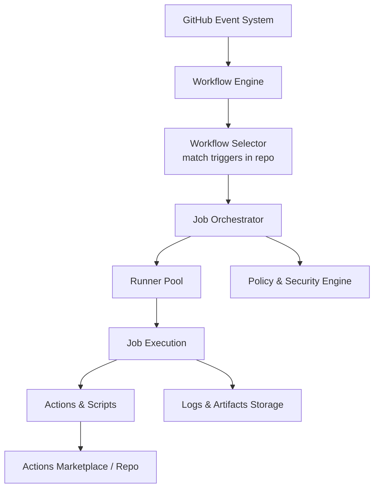

### 4.2 Workflow definition as composite graph

A workflow is a YAML file containing:

- `on`: triggers

- `jobs`: each job with `runs-on`, `steps`, `needs`, `strategy`, etc.([GitHub Docs](https://docs.github.com/actions/using-workflows/workflow-syntax-for-github-actions?utm_source=chatgpt.com "Workflow syntax for GitHub Actions"))


Jobs form a graph through the `needs` keyword, and each job holds steps (actions or `run` scripts).

### Diagram 4.2 – Workflow YAML → Internal Graph

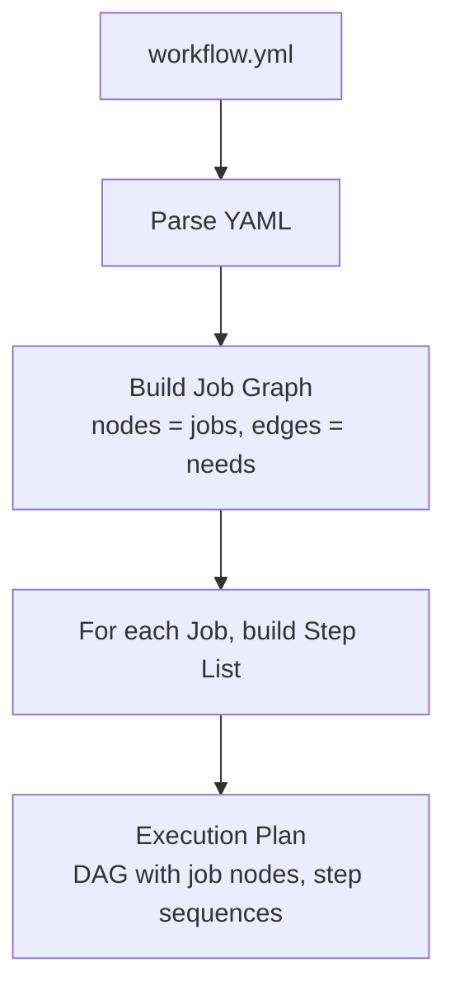

Internally, this is a composite build graph:

- Graph nodes: jobs

- Each job contains an ordered sequence of step nodes

- Some steps may call composite actions or reusable workflows (subgraphs)


### 4.3 Runners and job execution

GitHub-hosted runners are dynamically provisioned VMs or containers with preinstalled tools; self-hosted runners are user-managed machines that run the runner agent.([GitHub Docs](https://docs.github.com/actions/using-github-hosted-runners/about-github-hosted-runners?utm_source=chatgpt.com "GitHub-hosted runners"))

The orchestrator assigns a job to a runner based on `runs-on` constraints, matrix configuration, and available capacity. The runner:

1. Receives the job specification (steps, environment, secrets).

2. Checks out the repository (commonly via `actions/checkout`).

3. Executes each step sequentially.

4. Streams logs and results back.


### Diagram 4.3 – Job Execution on Runner

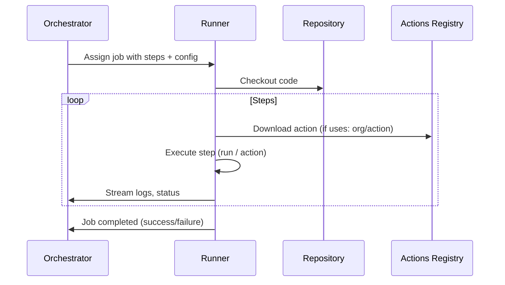

### 4.4 Composite actions and reusable workflows

**Composite actions**: a YAML-defined action that declares multiple `runs` steps. They are defined under `.github/actions/...` or separate repos. When used, they appear as a single step in a workflow but internally execute multiple steps.([GitHub Docs](https://docs.github.com/actions/creating-actions/creating-a-composite-action?utm_source=chatgpt.com "Creating a composite action"))

**Reusable workflows**: complete workflows that can be invoked via `uses` inside a job, enabling reuse of multi-job pipelines across repos.([GitHub Docs](https://docs.github.com/en/actions/how-tos/reuse-automations/reuse-workflows?utm_source=chatgpt.com "Reuse workflows"))

### Diagram 4.4 – Composite Action Expansion

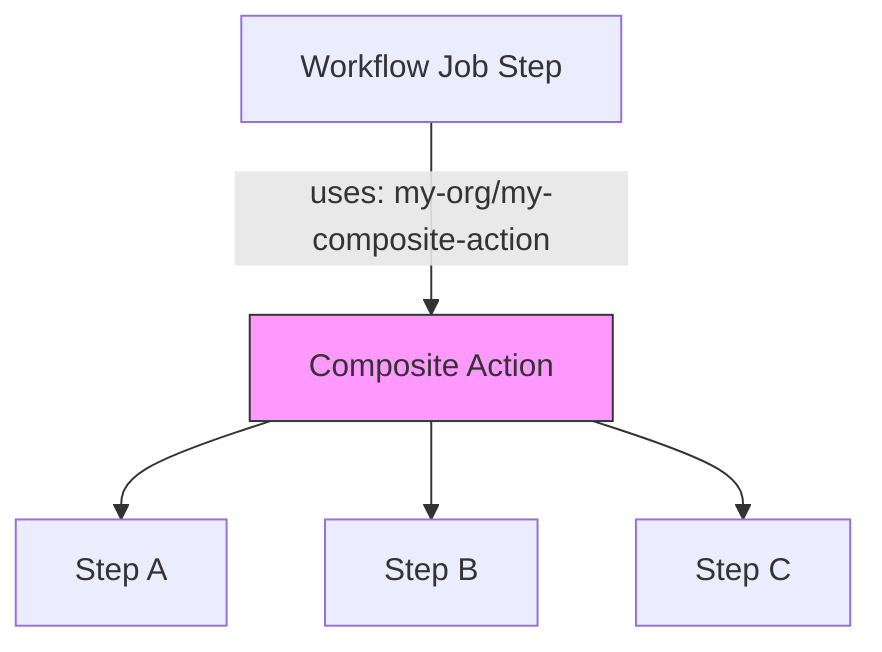

### 4.5 Control flow of a typical workflow run

A typical flow:

1. Event fires (e.g., push to `main`).

2. Workflow engine scans repo workflows to find those whose `on` matches event.

3. For each matching workflow:

    - Parse YAML

    - Build job DAG

    - Prepare execution plan

4. Orchestrator schedules jobs (respecting `needs` and matrix).

5. Jobs run on runners; results are aggregated at workflow level.


### Diagram 4.5 – End-to-End Flow

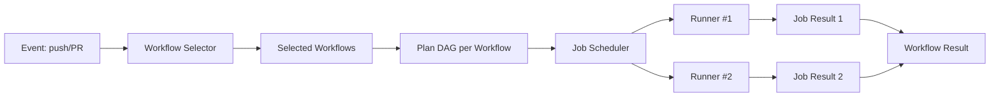

### 4.6 Enterprise constructs on top

On top of the raw engine, GitHub layers:

- **Environments** – for deploy approvals, environment-specific secrets.

- **Protected branches** – require certain checks (workflows) to pass.

- **Organization policies** – controlling allowed actions, external access, reuse policies.


These build governance into the architecture.

---

## 5. Powerful and unique features aligned with Composite Build System

GitHub Actions implements several powerful features that map strongly to Composite Build System concepts.

### 5.1 Matrix builds as composite expansions

Matrix builds allow you to define a job once, but run it across multiple combinations (OS, versions, configurations). GitHub automatically expands the single logical job definition into multiple physical jobs in the workflow DAG.([GitHub Docs](https://docs.github.com/actions/writing-workflows/choosing-what-your-workflow-does/running-variations-of-jobs-in-a-workflow?utm_source=chatgpt.com "Running variations of jobs in a workflow"))

This is effectively a **meta-composite**: a template job that expands into many concrete jobs.

### Diagram 5.1 – Matrix Job Expansion

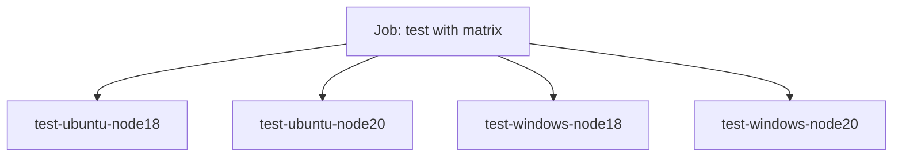

### 5.2 Composite actions as reusable subtrees

Composite actions are especially aligned with composite build systems:

- They group steps into a reusable pipeline.

- They can receive inputs and produce outputs, like a function.([GitHub Docs](https://docs.github.com/actions/creating-actions/creating-a-composite-action?utm_source=chatgpt.com "Creating a composite action"))


They act as **subgraphs** that can be embedded into other graphs (workflows) without exposing internal complexity.

### Diagram 5.2 – Composite Subtree Reuse

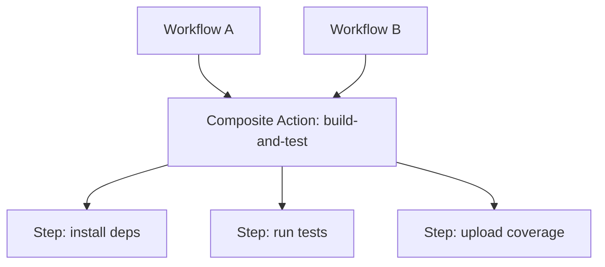

### 5.3 Reusable workflows as higher-level composites

Reusable workflows operate one level up:

- They encapsulate full pipelines (multiple jobs).

- They can be invoked from other workflows with `uses`.([GitHub Docs](https://docs.github.com/en/actions/how-tos/reuse-automations/reuse-workflows?utm_source=chatgpt.com "Reuse workflows"))


This is a classic Composite Build System pattern: pre-packaged build pipelines representing organizational standards (e.g., “standard Java service workflow”).

### 5.4 Integration with marketplace and ecosystem

GitHub hosts a marketplace of thousands of actions—each a reusable component that can be wired into workflows.([arXiv](https://arxiv.org/abs/2303.04084?utm_source=chatgpt.com "Developers' Perception of GitHub Actions: A Survey Analysis"))

Actions can be:

- official (from GitHub or vendors)

- community-maintained

- internal (private repos)


This ecosystem amplifies composite design: the more reusable components exist, the more complex pipelines can be constructed declaratively.

Collectively, matrix builds, composite actions, reusable workflows, and marketplace actions make GitHub Actions a powerful, composite-oriented automation fabric.

---

## 6. Complete implementation idea, working lifecycle, lifecycle management

This section outlines how you could conceptually implement a system like GitHub Actions, modeling its lifecycle as a Composite Build System.

### 6.1 Lifecycle overview

Logical phases:

1. **Definition phase** – author workflows, actions, and reusable workflows.

2. **Trigger phase** – event occurs in GitHub (push, PR, schedule).

3. **Selection & planning phase** – workflows are matched, parsed, and job graph built.

4. **Scheduling phase** – jobs queued and dispatched to runners.

5. **Execution phase** – jobs run; steps execute actions/scripts.

6. **Aggregation & reporting phase** – statuses, logs, and artifacts aggregated.

7. **Lifecycle management phase** – clean-up, runner recycling, secrets rotation, versioning, governance.


### Diagram 6.1 – High-Level Lifecycle

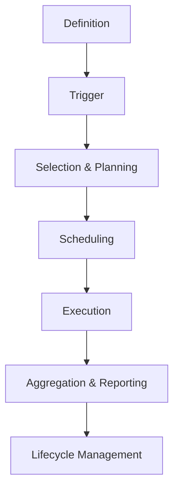

### 6.2 Implementation idea – internal services

A conceptual implementation may consist of:

- **Workflow Service** – stores and parses workflow YAML, validates schema.

- **Event Service** – ingests GitHub events and routes them.

- **Planner Service** – builds execution plans (job DAGs, step sequences, matrices).

- **Scheduler Service** – schedules jobs to runner pools.

- **Runner Service** – runner agents (GitHub-hosted / self-hosted).

- **Results Service** – logs, statuses, artifacts.

- **Policy Service** – controls allowable actions, secrets usage, environment gates.


### Diagram 6.2 – Internal Microservice View

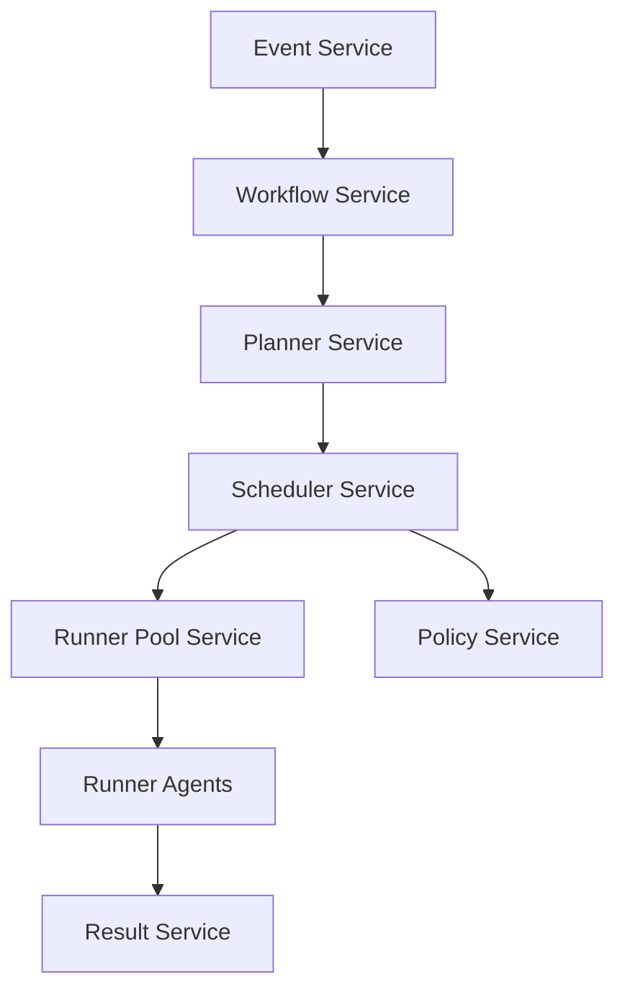

### 6.3 Workflow execution lifecycle – detailed

#### Step 1: Trigger

- GitHub emits an event: push, PR, schedule, issue event, etc.

- Event payload includes repo, branch, commit, actor, and metadata.([GitHub Docs](https://docs.github.com/articles/getting-started-with-github-actions?utm_source=chatgpt.com "Understanding GitHub Actions"))


#### Step 2: Workflow selection

- Workflow engine scans the repository’s `.github/workflows` directory.

- For each workflow YAML, it evaluates the `on` section to see if it matches the event.([GitHub Docs](https://docs.github.com/actions/using-workflows/workflow-syntax-for-github-actions?utm_source=chatgpt.com "Workflow syntax for GitHub Actions"))


#### Step 3: Planning

For each selected workflow:

- Parse YAML

- Build job graph (`jobs.*`, `needs`)

- For jobs with `strategy.matrix`, expand into multiple job instances.([GitHub Docs](https://docs.github.com/actions/writing-workflows/choosing-what-your-workflow-does/running-variations-of-jobs-in-a-workflow?utm_source=chatgpt.com "Running variations of jobs in a workflow"))

- Determine job ordering and parallelism.

- Check policy constraints (allowed actions, repo settings).


### Diagram 6.3 – Planning of Job Graph

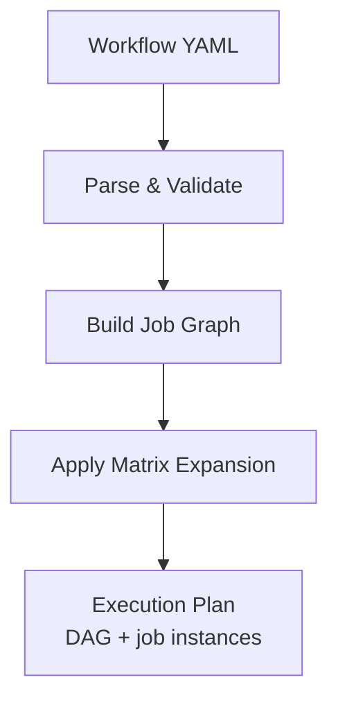

#### Step 4: Scheduling

- Scheduler receives execution plan.

- Jobs without unmet dependencies are enqueued for execution.

- For each job, the scheduler selects a runner that matches `runs-on` and has capacity.


#### Step 5: Job execution

- Runner spins up a fresh VM/container (GitHub-hosted) or uses a self-hosted machine.([GitHub Docs](https://docs.github.com/actions/using-github-hosted-runners/about-github-hosted-runners?utm_source=chatgpt.com "GitHub-hosted runners"))

- Runner checks out code, sets up environments.

- Steps execute in order; steps may `run` shell or `uses` actions.

- Composite actions are expanded on the runner side into multiple internal steps.


### Diagram 6.4 – Step Execution on Runner

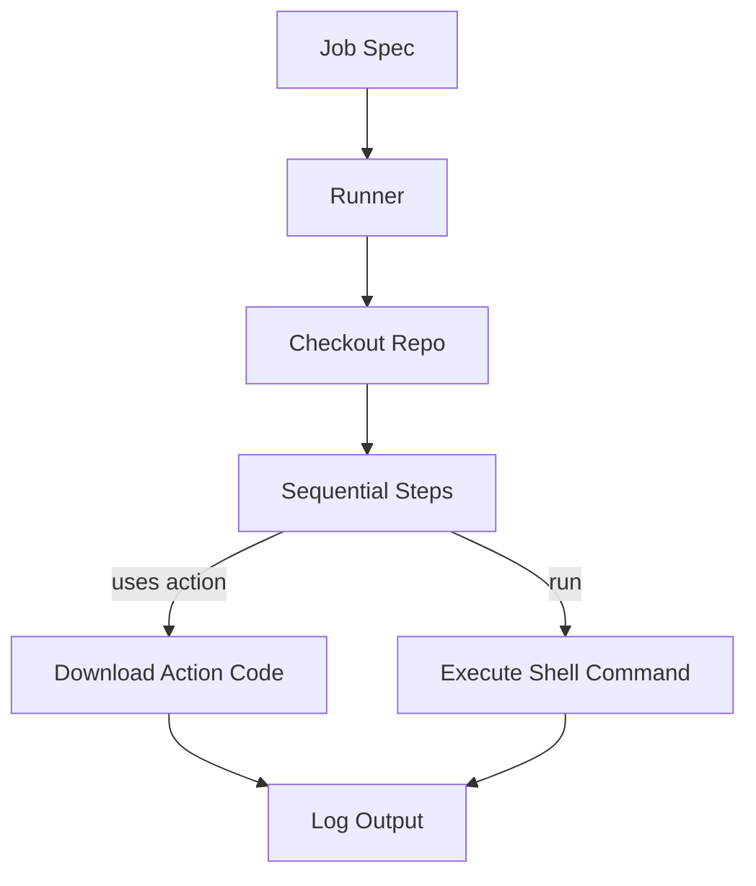

#### Step 6: Aggregation

- Results stream back: per-step logs, job status, workflow status.

- Artifacts (build outputs, test reports) are uploaded to artifact storage.


#### Step 7: Lifecycle management

- Runners are cleaned up or returned to pool.

- Workflow logs and artifacts retained according to retention policies.

- Policies and secrets lifecycle (rotation, revocation) are handled by underlying GitHub infrastructure.


### Diagram 6.5 – Lifecycle State Machine (Workflow Run)

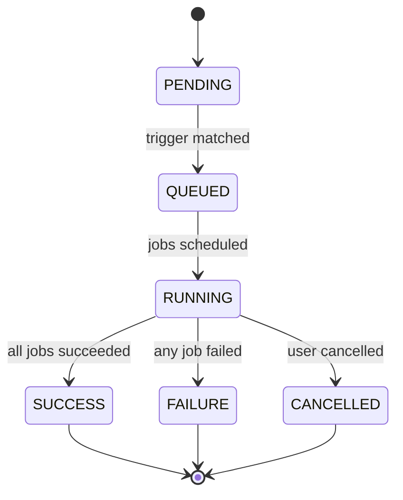

This state machine reflects a typical workflow run lifecycle.

---

## 7. Alignment with SD, LLD, OOP and HLD principles

GitHub Actions is a strong example of sound software design principles across the stack.

### 7.1 System Design (SD) and High-Level Design (HLD)

From an SD/HLD viewpoint, the architecture embraces:

- **Event-driven design** – GitHub Actions is event-triggered; workflows attach to repository events.([GitHub Docs](https://docs.github.com/articles/getting-started-with-github-actions?utm_source=chatgpt.com "Understanding GitHub Actions"))

- **Service decomposition** – conceptual split between workflow parsing, planning, scheduling, execution, policy, and result management.

- **Multi-tenant platform** – organizational boundaries, repo-scoped config, runner isolation, action access control.([GitHub Docs](https://docs.github.com/actions/creating-actions/sharing-actions-and-workflows-with-your-organization?utm_source=chatgpt.com "Sharing actions and workflows with your organization"))

- **Composite graph orchestration** – DAG-based job orchestration.


### Diagram 7.1 – HLD Logical View

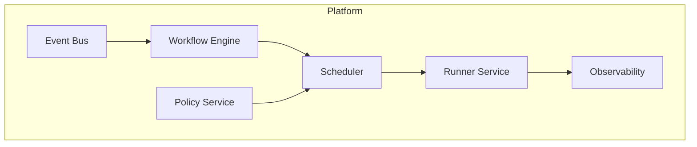

### 7.2 Low-Level Design (LLD) and OOP

Conceptually, core entities map nicely to OOP abstractions:

- `Workflow` – aggregate root containing `Job` objects.

- `Job` – contains `Step` list and metadata.

- `Step` – references an `Action` or script.

- `Action` – encapsulates reusable logic, with inputs and outputs.


### Diagram 7.2 – Conceptual OOP Class Model

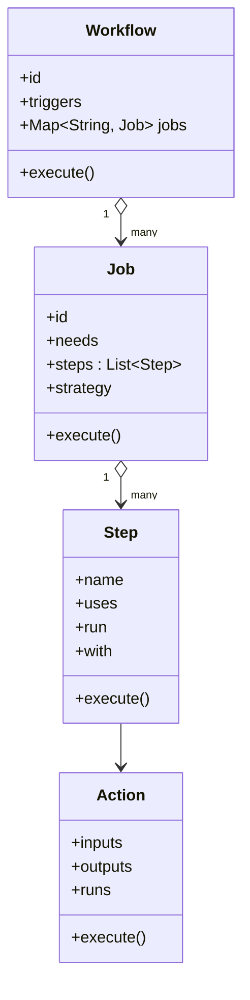

This supports:

- **Encapsulation** – each component manages its own behavior.

- **Abstraction** – structural vs runtime responsibilities separated.

- **Composition over inheritance** – workflows composed of jobs, jobs composed of steps.


### 7.3 Design principles

GitHub Actions architecture reflects key principles:

- **Single Responsibility** – each part (workflow, job, step, action, runner) has focused responsibility.

- **Open/Closed** – new actions and workflows can be added without modifying the platform core (plug-in model via marketplace).([GitHub Docs](https://docs.github.com/actions/creating-actions/about-custom-actions?utm_source=chatgpt.com "About custom actions"))

- **Separation of concerns** – event handling, orchestration, execution, security, and observability are distinct layers.

- **Declarative interface** – YAML as external DSL for describing workflows.([GitHub Docs](https://docs.github.com/actions/using-workflows/workflow-syntax-for-github-actions?utm_source=chatgpt.com "Workflow syntax for GitHub Actions"))


### Diagram 7.3 – Responsibility Segmentation

```mermaid
graph TD
    CONF[Configuration YAML] --> ORCH[Orchestration]
    ORCH --> EXEC[Execution Runners]
    ORCH --> SEC[Security & Policy]
    EXEC --> OBS[Logs & Artifacts]
    SEC --> ORG[Org Governance]
```

The architecture is deliberately designed this way to:

- Keep **workflow definition** simple and repository-centric.

- Allow GitHub to evolve the **execution platform** (runners, scheduling, caching) without breaking users’ YAML.

- Enable integration with enterprise security and compliance requirements.


---

## 8. How it is made scalable, maintainable and operable for such a large user base

GitHub Actions runs at enormous scale: thousands of organizations, millions of workflow runs. The architecture must be highly scalable, maintainable, and operable.

### 8.1 Scalability

#### 8.1.1 Horizontal scaling via runner pools

Runners are the primary compute resource. GitHub-hosted runners are provisioned in cloud environments, allowing almost arbitrary horizontal scaling based on demand.([GitHub Docs](https://docs.github.com/actions/using-github-hosted-runners/about-github-hosted-runners?utm_source=chatgpt.com "GitHub-hosted runners"))

- Workflows with many jobs / matrix builds fan out across multiple runners.([Provar Documentation](https://documentation.provar.com/documentation/devops/continuous-integration/github-actions/parallel-execution-in-github-actions-using-job-matrix/?utm_source=chatgpt.com "Parallel Execution in GitHub Actions using Job Matrix"))

- Additional capacity can be provisioned as load grows.

- Self-hosted runners allow enterprises to bring their own compute, further decoupling GitHub from compute scaling constraints.


### Diagram 8.1 – Runner Pool Scaling

```mermaid
graph TD
    SCH[Scheduler] --> RP1[Runner Pool Region 1]
    SCH --> RP2[Runner Pool Region 2]
    RP1 --> R1a[Runner 1a]
    RP1 --> R1b[Runner 1b]
    RP2 --> R2a[Runner 2a]
    RP2 --> R2b[Runner 2b]
```

#### 8.1.2 Multi-region deployment

While implementation details are not fully public, large SaaS platforms like GitHub typically deploy services across multiple regions and availability zones for redundancy and latency optimization.

- Event processing, workflow engine, and scheduler can be distributed.

- Workflows are routed to appropriate regional runner pools.


### 8.2 Maintainability

#### 8.2.1 Declarative configuration

Because workflows are YAML, the system’s “behavior” is plain text stored in version control. This enhances maintainability:

- Changes are code-reviewed and versioned.

- Rollbacks are trivial.

- Standardization via reusable workflows and composite actions reduces duplication.([GitHub Docs](https://docs.github.com/en/actions/concepts/workflows-and-actions/reusing-workflow-configurations?utm_source=chatgpt.com "Reusing workflow configurations"))


#### 8.2.2 Ecosystem and marketplace

By centralizing common concerns (checkout, caching, language setup, deployment, scanning) into marketplace actions, the GitHub Actions core platform remains smaller and more maintainable, while the ecosystem provides extensibility.([arXiv](https://arxiv.org/abs/2303.04084?utm_source=chatgpt.com "Developers' Perception of GitHub Actions: A Survey Analysis"))

### Diagram 8.2 – Maintainability via Reuse

```mermaid
graph TD
    WF1[Workflow 1] --> A1[Common Build Action]
    WF2[Workflow 2] --> A1
    WF3[Workflow 3] --> RW[Reusable Workflow<br/>org-standard-pipeline]
```

### 8.3 Operability

#### 8.3.1 Observability and diagnostics

GitHub Actions provides granular logs per:

- workflow

- job

- step


Additionally:

- artifacts for test results, coverage, etc.

- audit logs (enterprise) for governance.([GitHub Docs](https://docs.github.com/actions/creating-actions/sharing-actions-and-workflows-with-your-organization?utm_source=chatgpt.com "Sharing actions and workflows with your organization"))


At platform level, GitHub likely runs comprehensive metrics on:

- workflow run rates

- failure rates

- runner utilization

- action marketplace usage


This enables SRE teams to detect issues, regressions, or capacity constraints early.

#### 8.3.2 Security and risk management

Security is a strong operational concern:

- Controlled use of third-party actions (verified creators, allowed lists).([arXiv](https://arxiv.org/abs/2303.04084?utm_source=chatgpt.com "Developers' Perception of GitHub Actions: A Survey Analysis"))

- Token permissions (`GITHUB_TOKEN`) follow least privilege.

- Environments and approvals for critical deployments.


Research has shown that misconfigured workflows can introduce security vulnerabilities; GitHub and the community have built tooling and best practices to mitigate risks.([arXiv](https://arxiv.org/abs/2208.03837?utm_source=chatgpt.com "Automatic Security Assessment of GitHub Actions Workflows"))

### Diagram 8.3 – Operational Feedback Loop

```mermaid
flowchart TD
    RUNS[Workflow Runs] --> METRICS[Metrics & Logs]
    METRICS --> SRE[SRE / Ops]
    SRE --> TUNING[Capacity & Policy Tuning]
    TUNING --> PLATFORM[Platform Config]
    PLATFORM --> RUNS
```

### 8.4 Resilience and continuity

GitHub-hosted runners are ephemeral; if a runner fails, the scheduler can reschedule jobs to new runners. Workflows can be retried. Availability at scale is achieved by:

- stateless orchestration services (easier to scale and failover)

- persistent storage for logs and artifacts

- clear failure semantics (job failed vs infrastructure failure)


### 8.5 Governance at scale

For large enterprises:

- Actions and workflows can be shared privately within organizations.([GitHub Docs](https://docs.github.com/actions/creating-actions/sharing-actions-and-workflows-with-your-organization?utm_source=chatgpt.com "Sharing actions and workflows with your organization"))

- Policies restrict what actions can be used and from where.

- Central teams can publish “blessed” reusable workflows and composite actions that encode organization standards.


### Diagram 8.4 – Enterprise Governance Layer

```mermaid
graph TD
    ORG[Organization] --> GOV[Governance Policies]
    GOV --> WFSTD[Standard Reusable Workflows]
    GOV --> ACTSTD[Standard Actions]
    WFSTD --> REPOS[Product Repositories]
    ACTSTD --> REPOS
    REPOS --> ACTIONS[Actual Workflow Runs]
```

This governance model keeps operations under control while still allowing teams to move fast.

---

## Closing Summary

GitHub Actions is effectively a **Composite Build System at SaaS scale**:

- It models automation as composable graphs of workflows → jobs → steps → actions.

- It offers higher-order composability via composite actions, reusable workflows, and matrix builds.

- It embeds enterprise concerns: security, governance, observability, scalability, and multi-tenancy.

- It aligns with sound SD/OOP/HLD/LLD principles: compositional modeling, clear boundaries, declarative configuration, and plug-in extensibility.


From a system design perspective, GitHub Actions is a mature, production-grade embodiment of the Composite Build System idea—elevated from a single codebase to a multi-tenant global automation platform.
