## Maven and Gradle as Composite Build Systems

## 1. What are Maven and Gradle?

Maven and Gradle are build automation and project management tools used primarily in the JVM ecosystem, but extendable to many other languages and platforms.

Maven is a convention-driven, XML-configured build system that standardizes project structures, dependency resolution, and lifecycle phases. It centers around a declarative model (`pom.xml`) that describes what a project is, and lets plugins decide how to build it.

Gradle is a more flexible, Groovy/Kotlin DSL–driven build system that combines declarative configuration with imperative scripting. It introduces a richer task graph model, incremental builds, and a more efficient dependency resolution and caching layer.

Both tools provide dependency management, multi-module/project composition, lifecycle hooks, and integrations with IDEs and CI/CD platforms. Conceptually, they are industrial-grade implementations of the Composite Build System pattern: builds are expressed as graphs of tasks/modules, where higher-level targets aggregate lower-level units into coherent pipelines.

---

**Diagram 1.1 – Positioning Maven and Gradle in the SDLC**

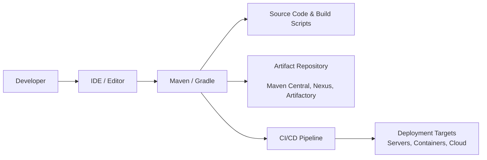

Both Maven and Gradle act as the core “automation engine” between developers, source code, dependencies, and downstream deployment pipelines. The diagram shows how the build tool receives instructions from either an IDE or CLI, reads project/build configuration, resolves dependencies from artifact repositories, and integrates directly with CI/CD systems.

From a composite-system perspective, the build tool here is not a single linear step but a coordinator of many internal tasks. It composes compilation, testing, packaging, verification, and publishing into a single lifecycle. The diagram deliberately places Maven/Gradle at the center because they become the “control plane” for build and packaging logic, enabling consistent, repeatable processes across local, CI, and deployment environments.

---

**Diagram 1.2 – Conceptual View of Maven vs Gradle**

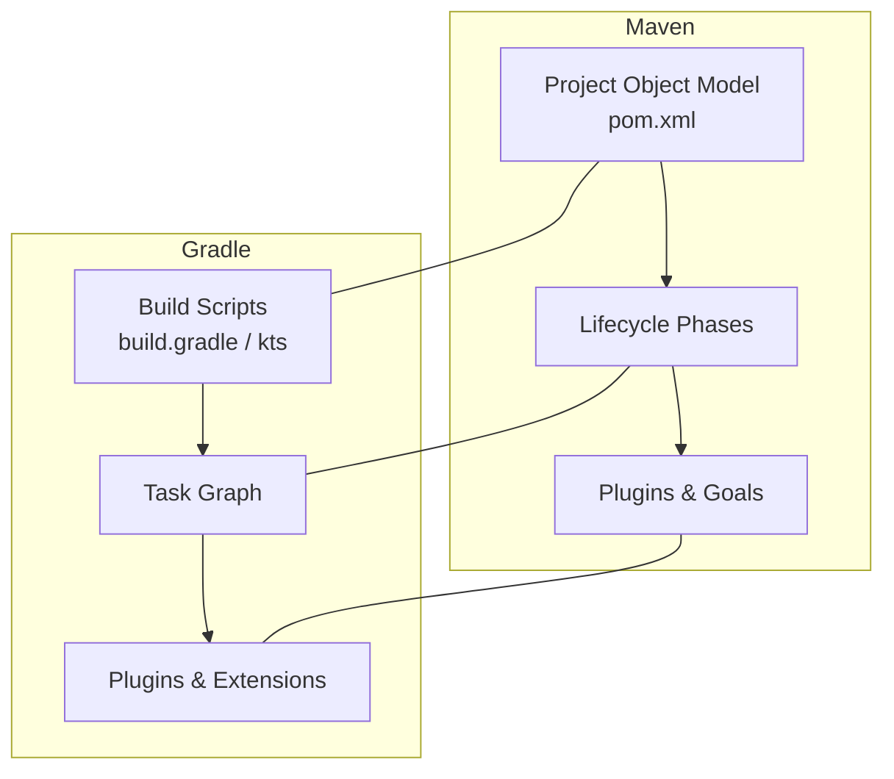

This diagram highlights the conceptual symmetry between Maven and Gradle while also showing their differences. Maven centers around a Project Object Model (`pom.xml`), lifecycle phases (compile, test, package, install, deploy), and plugins that bind goals to those phases. Gradle, in contrast, focuses on build scripts that define a task graph, where tasks depend on one another to form a directed acyclic graph that the engine evaluates.

The dotted connections between Maven and Gradle blocks emphasize that both ecosystems share comparable abstractions: project model vs build script, phase sequence vs task graph, and plugins in both cases. The key difference is flexibility and granularity: Maven’s model is more rigid but predictable; Gradle’s model is more flexible and expressive, enabling richer composite graphs and incremental optimizations.

---

## 2. How and why they use the Composite Build System pattern

Maven and Gradle both embody the Composite Build System pattern at multiple levels: project/module aggregation, lifecycle orchestration, and task/goal composition.

In Maven, the Composite pattern appears primarily through **multi-module projects** and the binding of plugin goals to lifecycle phases. Each module has its own `pom.xml`, but parent POMs aggregate these into a larger logical build. Invoking a lifecycle phase (e.g., `mvn install`) on the root triggers that phase in each module, respecting inter-module dependencies. Here, the root project acts as a composite node; individual modules act as children.

Lifecycle phases (validate, compile, test, package, verify, install, deploy) also act like composite steps. Each phase is bound to multiple plugin goals (compile Java, run tests, package JAR, generate reports). Execution of a phase triggers each bound goal in order. Thus, the “phase” is a composite of goals; the project is a composite of modules.

Gradle extends this pattern more explicitly via its **task graph**. Tasks (`compileJava`, `test`, `jar`, `publish`) depend on each other, forming a DAG. Composite behavior is modeled by higher-level tasks depending on lower-level tasks. For instance, `build` depends on `assemble` and `check`; `assemble` depends on `jar`; `check` depends on `test`. When you run `gradle build`, Gradle evaluates the graph, identifies the minimal set of tasks required, and executes them in dependency order.

Multi-project builds in Gradle further extend this composite structure. A root project can include many subprojects, each with its own tasks. Cross-project dependencies (e.g., project B depends on project A) translate into edges in the global task graph. The engine then orchestrates this entire composite graph, parallelizing where safe and applying incremental build logic.

Both tools leverage this Composite pattern because it scales naturally. Instead of a monolithic, hardcoded build script, you have nested, reusable components: tasks, goals, phases, plugins, and modules all composed into larger structures. This improves maintainability, supports incremental execution, and allows plug-ins and extensions to hook into specific nodes in the graph.

---

**Diagram 2.1 – Maven Composite Structure**

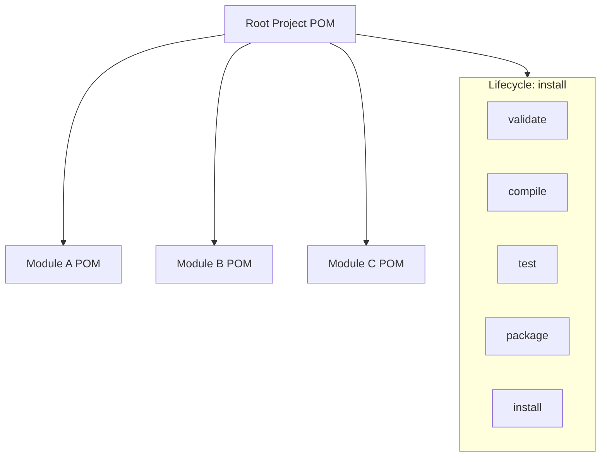

This diagram illustrates Maven’s composite nature from two angles. First, the root project aggregates modules A, B, and C, forming a tree where each child POM inherits or overrides configuration from the parent. Invoking a lifecycle phase at the root cascades across modules according to defined dependencies.

Second, the lifecycle itself is modeled as a sequence of phases, and each phase can be thought of as a composite of plugin goals. While not fully visible in the diagram, you can imagine each lifecycle node fan-out into plugin goal invocations. This dual-level composite structure—project hierarchy plus lifecycle composition—allows Maven to orchestrate complex builds in a controlled, reproducible manner across large codebases.

---

**Diagram 2.2 – Gradle Task Graph as Composite**

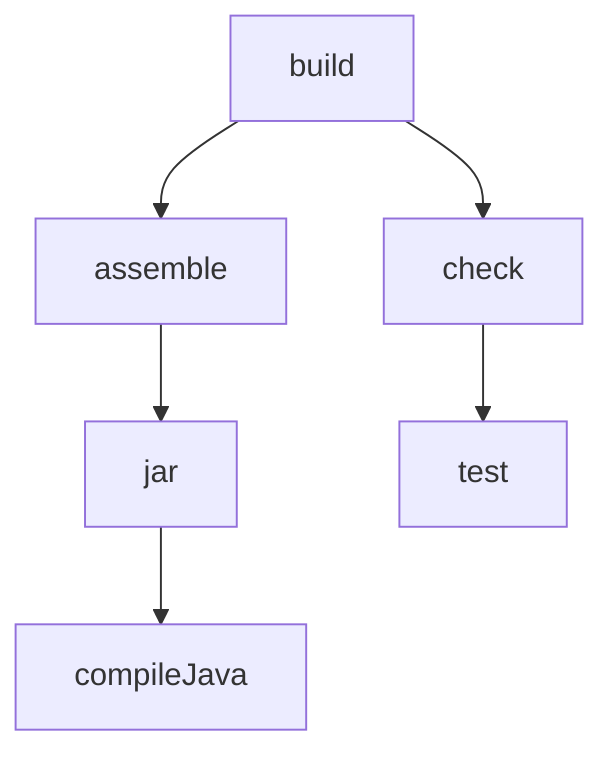

Here, Gradle’s composite behavior is represented as a task graph. The `build` task is a composite node composed of `assemble` and `check`. `assemble` is itself a composite of `jar`, which depends on `compileJava`. `check` depends on `test`.

The execution engine walks this graph, determines the minimal set of tasks required for the requested top-level task, and executes tasks in dependency order. Gradle can easily parallelize non-conflicting branches (e.g., `test` and `jar` in different projects) and apply incremental builds by skipping tasks whose inputs and outputs have not changed. The graph structure is key: it formalizes relationships and allows the engine to behave like an optimized composite build orchestrator.

---

## 3. Enterprise-level behavior and architecture

Maven and Gradle have evolved to meet enterprise requirements: large codebases, multiple teams, compliance, governance, and integration with a wide range of tooling. Their architectures reflect this.

First, both tools are **plugin-based platforms**. Maven’s core is relatively thin; real behavior comes from plugins that implement goals bound to lifecycle phases. Gradle’s core similarly delegates work to plugins that register tasks, configure conventions, and extend the DSL. This plug-in architecture allows enterprises to standardize certain behaviors (e.g., corporate quality checks, security scans) across many projects by publishing internal plugins.

Second, they integrate tightly with **artifact repositories**. Maven Central, Artifactory, and Nexus are integral to the ecosystem. Maven and Gradle both understand repository layouts, metadata, snapshot vs release semantics, and checksum verification. For enterprises, this supports reproducible builds, internal artifact promotion flows (dev → staging → production repositories), and controlled dependency sourcing.

Third, both tools support **multi-module/multi-project builds** with dependency graphs that can scale to hundreds or thousands of modules. These graphs align with microservice architectures, multi-layer libraries, and shared components. By modeling builds as graphs, the tools can work with CI/CD orchestrators to run partial builds (impacted modules only) and parallel pipelines.

Fourth, they provide **extensibility and customization** in an orderly way. In Maven, parent POMs define corporate standards and BOMs (Bill of Materials) for dependency versions. In Gradle, convention plugins and version catalogs centralize dependency coordinates and plugin usage. These mechanisms let enterprises control version drift, align security patches, and enforce base configurations.

Fifth, they are engineered with **operability** in mind. Logging, debug output, build scans (Especially in Gradle via Gradle Enterprise), test reports, and build reports give SRE and platform teams visibility into build performance and failures. Gradle in particular exposes rich build scan data, including task timelines, cache hits/misses, configuration time, and more.

Finally, both tools are designed to be **tooling-friendly**. IDE integrations (IntelliJ, Eclipse, VS Code) rely on standardized project models. CI systems (Jenkins, GitLab CI, GitHub Actions, Azure DevOps) can trigger Maven/Gradle builds with predictable exit codes and outputs. This consistency and compatibility is crucial at enterprise scale where heterogeneous tooling is the norm.

---

**Diagram 3.1 – Enterprise Build Ecosystem Around Maven/Gradle**

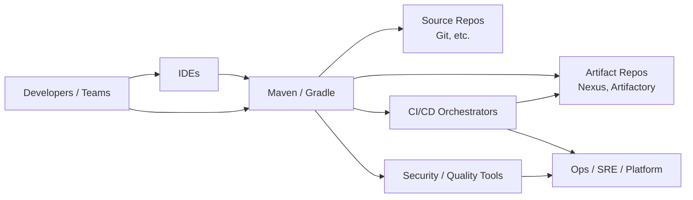

The diagram exposes Maven/Gradle as central participants in a broader enterprise development ecosystem. Developers and IDEs invoke builds, which interact with version control and artifact repositories. CI/CD orchestrators run builds on every change and manage promotion through environments. Security and quality tools integrate into builds via plugins or external scanners.

Platform and operations teams consume logs, reports, and artifacts to maintain reliability and compliance. The central role of the build tool forces it to meet enterprise standards around stability, backward compatibility, security, and extensibility. It has to be predictable, scriptable, and observable, as it becomes the standard way to produce deployable units in the organization.

---

**Diagram 3.2 – Plugin and Extension Architecture**

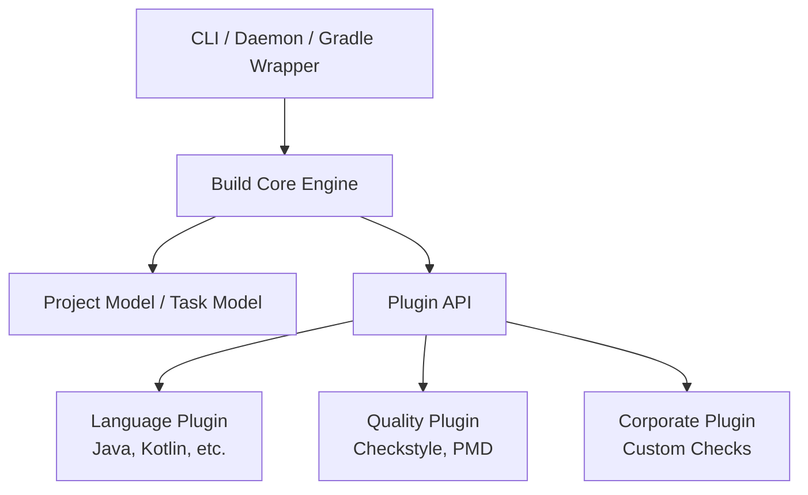

This diagram shows the layered plugin architecture that underpins enterprise extensibility. The core engine handles configuration, DAG management, lifecycle orchestration, and basic I/O. The project/task model represents the build graph. A well-defined plugin API lets external modules register tasks, contribute configuration, and hook into lifecycle events.

Language plugins handle compilation, testing, and packaging for specific languages. Quality plugins incorporate static analysis and code style. Corporate plugins encode organization-specific policies and conventions. The CLI or Gradle Daemon interacts with the core engine, which delegates behavior to plugins through the Plugin API. This architecture ensures that enterprise-specific needs can be met without forking the core or breaking the ecosystem.

---

## 4. Detailed architecture and component flows

In this section we walk through a deeper architecture view for Maven and Gradle, focusing on how they implement Composite Build System concepts and support enterprise workflows.

### 4.1 Maven architecture at a high level

Maven’s architecture consists of:

- The **Maven core**: responsible for reading POMs, building the project model, resolving dependencies, and orchestrating lifecycles.

- The **POM hierarchy**: parent/child POMs, inheritance, dependencyManagement and pluginManagement sections.

- The **Lifecycle engine**: standard lifecycles (`default`, `clean`, `site`) with ordered phases.

- The **Plugin system**: plugins providing goals bound to phases.

- The **Repository subsystem**: local and remote repositories, artifact resolution, snapshots/releases.


---

**Diagram 4.1 – Maven Internal Architecture**

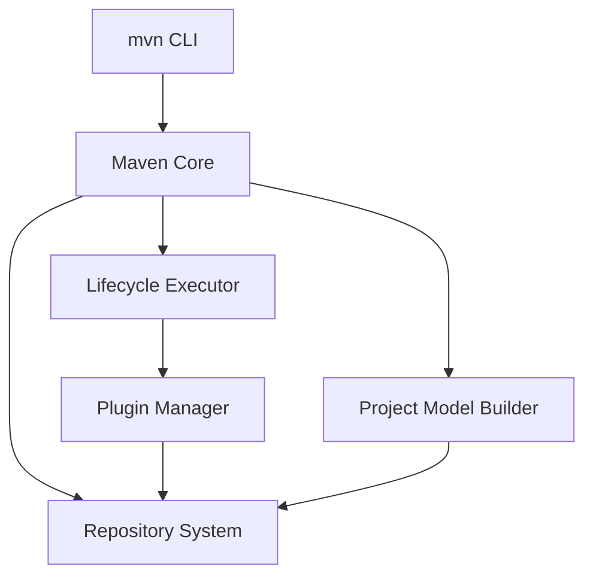

This diagram shows Maven’s core orchestration path. The CLI triggers the Maven Core, which first delegates to the project model builder to parse and resolve all POMs, including inheritance and aggregation. The repository system is used both to resolve plugin artifacts and project dependencies.

Once the model is built, the lifecycle executor evaluates the appropriate lifecycle and phases, and asks the plugin manager to execute bound goals. Plugins themselves use the repository system to fetch additional artifacts and may generate new outputs that flow back into subsequent phases. The entire process is declaratively driven from the POMs, and the core coordinates behavior via lifecycles and plugins.

---

### 4.2 Maven lifecycle and plugin flow

Lifecycle execution in Maven is a composite orchestration of goals bound to phases.

---

**Diagram 4.2 – Maven Lifecycle Flow**


Although simple, this diagram captures the standard lifecycle phases invoked by `mvn install`. Each phase is a logical checkpoint to which goals are bound. For example, `maven-compiler-plugin:compile` is bound to `compile`, `maven-surefire-plugin:test` to `test`, `maven-jar-plugin:jar` to `package`, and `maven-install-plugin:install` to `install`.

When you invoke `install`, Maven ensures that all preceding phases are executed in order. Each phase may trigger multiple goals, and each goal executes against the project model. This linear but composite lifecycle approach is deterministic and easy to reason about, which is why many enterprises prefer Maven for predictable, standardized builds.

---

### 4.3 Gradle architecture at a high level

Gradle’s architecture builds on a richer, dynamic model:

- The **Gradle daemon and tooling API**: long-running process that keeps state and avoids JVM startup cost.

- The **Settings and build scripts**: configure projects/subprojects, plugins, and tasks.

- The **Task graph engine**: constructs and evaluates the DAG of tasks.

- The **Incremental build and caching engine**: input/output snapshotting, task history, build cache.

- The **Plugin ecosystem**: similar to Maven but more expressive via DSL.


---

**Diagram 4.3 – Gradle Internal Architecture**

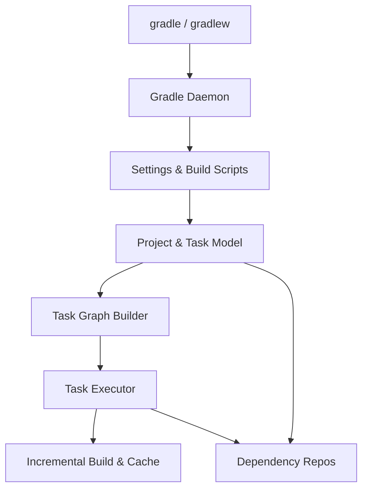

This diagram captures the Gradle build lifecycle. The CLI communicates with the Gradle Daemon, which loads settings and build scripts. These scripts configure the project and task model. The task graph builder determines which tasks are needed for the requested targets. The executor runs tasks, using the caching engine to skip up-to-date tasks and the repository subsystem to resolve dependencies.

The daemon maintains state between runs, improving performance. The project and task model is dynamic, allowing plugins and scripts to add or reconfigure tasks at configuration time. This flexibility is what makes Gradle particularly powerful for complex composite build graphs and performance optimizations.

---

### 4.4 Gradle task lifecycle and configuration vs execution phases

Gradle distinguishes between **configuration** and **execution** phases.

---

**Diagram 4.4 – Gradle Configuration vs Execution**

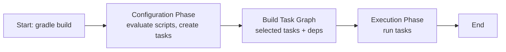

The diagram shows Gradle’s two-phase model. When you invoke `gradle build`, Gradle first enters the configuration phase. In this phase, it evaluates settings and build scripts, lets plugins register tasks, and builds the project model. Then it constructs the task graph based on the requested tasks and their dependencies.

Only after the graph is built does Gradle enter the execution phase, during which it runs tasks in the correct order, applying incremental build and caching logic. This separation of configuration from execution is key for performance and correctness. It lets Gradle safely calculate the minimal work required and enables skipping tasks whose inputs and outputs have not changed.

---

## 5. Powerful and unique Composite Build System–aligned features

Maven and Gradle incorporate a number of powerful features that align closely with the Composite Build System concept.

First, **multi-module/multi-project support** allows a root project to aggregate many submodules. This is a direct application of the Composite pattern: the root is a composite, modules are leaves or sub-composites. Gradle’s multi-project builds and Maven’s reactor builds both follow this principle.

Second, **declarative dependency graphs** are central. Dependencies between modules are explicitly declared, and the build system uses them to compute an execution graph. Maven’s dependency management and Gradle’s configuration of `implementation`, `api`, `testImplementation`, etc., define edges between components.

Third, **incremental and cache-aware execution** fits the Composite pattern well. Because build tasks are nodes in a graph with well-defined inputs and outputs, both tools can compute task-level fingerprints and decide whether to re-execute or reuse cached outputs. Gradle is particularly strong here with its build cache and up-to-date checks.

Fourth, **plugin-driven composition** allows behavior to be layered. In Maven, plugins attach goals to lifecycle phases; in Gradle, plugins register tasks and configure conventions. In both, the build configuration composes multiple plugins, each adding its own nodes to the graph.

Finally, **convention-over-configuration** and **centralized governance** bring enterprise alignment. Parent POMs and BOMs in Maven, and convention plugins / version catalogs in Gradle, provide a way to define reusable composite configurations across many projects. This ensures consistent behavior without repeating configuration.

---

**Diagram 5.1 – Multi-Module Composite Build**

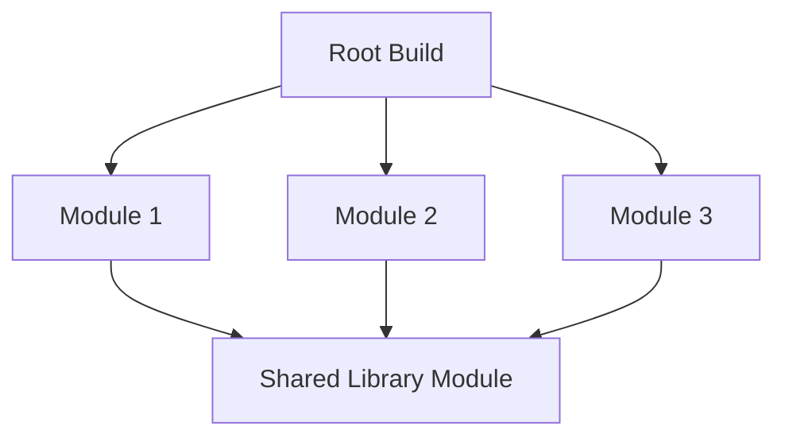

This diagram shows a root build that aggregates three modules, all depending on a shared library. In Maven, this would be a parent POM with `<modules>` and inter-module dependencies; in Gradle, a multi-project build with `settings.gradle` including subprojects and `implementation project(":lib")` references.

The composite nature is evident: the root build orchestrates all child modules, but each module retains its own configuration and tasks. The shared library is a lower-level node in the graph, reused by all. Such a pattern is typical for layered architectures in large companies, enabling modularity while still keeping a unified build command at the top.

---

**Diagram 5.2 – Plugin-based Composite Behavior**

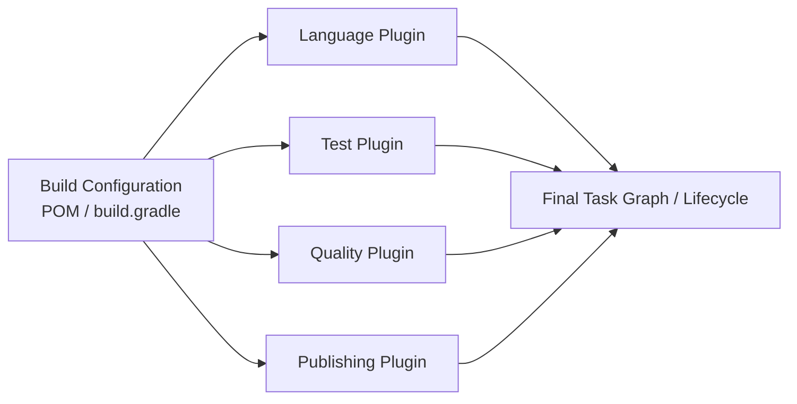

In this diagram, the build configuration acts as a composition root that applies multiple plugins: language, testing, quality, and publishing. Each plugin contributes tasks or goals, which collectively form the final lifecycle or task graph.

The Composite Build System concept appears as the aggregation of responsibilities into a coherent pipeline. Instead of building a monolithic build script, you combine smaller, focused plugins. This modular approach is essential for enterprise extensibility and reuse: teams can plug in organization-specific policies without rewriting the entire build system.

---

## 6. Implementation ideas, lifecycle, and lifecycle management

### 6.1 Conceptual implementation idea for Maven-like system

Maven’s core concepts can be reimagined as:

- **Project Model**: Derived from `pom.xml`, including coordinates (groupId, artifactId, version), dependencies, build configuration, and modules.

- **Lifecycles and phases**: Predefined sequences capturing the typical build pipeline.

- **Plugin execution**: Each plugin defines goals; goals are bound to phases via configuration.

- **Reactor**: For multi-module builds, it orders modules based on inter-dependencies and runs lifecycles across them.


The lifecycle starts when a user invokes a goal or phase. Maven resolves what must run, resolves dependencies, then executes each phase in order across all relevant modules.

---

**Diagram 6.1 – Maven Reactor Lifecycle**

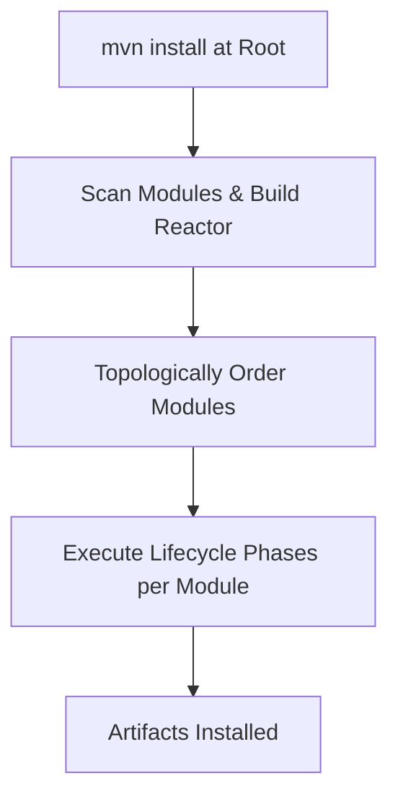

The diagram shows the Maven reactor flow. First, Maven scans for modules and builds a module graph. Then it orders modules based on dependency relationships. Next, it executes lifecycle phases for each module in reactor order, ensuring dependencies are built before dependent modules.

Lifecycle phases (compile, test, package, install) are run per module, and plugins are invoked at each phase. As outputs are produced (JARs, WARs), they are installed into the local repository and become available to dependent modules’ builds. This approach scales to large multi-module builds with strict determinism.

---

### 6.2 Conceptual implementation idea for Gradle-like system

Gradle’s implementation idea:

- **Configuration phase**: Load settings, build scripts, and plugins; construct a graph of projects and tasks.

- **Task graph calculation**: Determine which tasks are needed for requested targets.

- **Execution phase**: Traverse the DAG, apply incremental checks, retrieve from or publish to cache, and run tasks.


Gradle’s lifecycle is not phase-centric like Maven; instead, tasks and their dependencies are primary. Lifecycle-style tasks such as `build`, `assemble`, and `check` are simply composite tasks wired into the graph.

---

**Diagram 6.2 – Gradle Build Lifecycle**

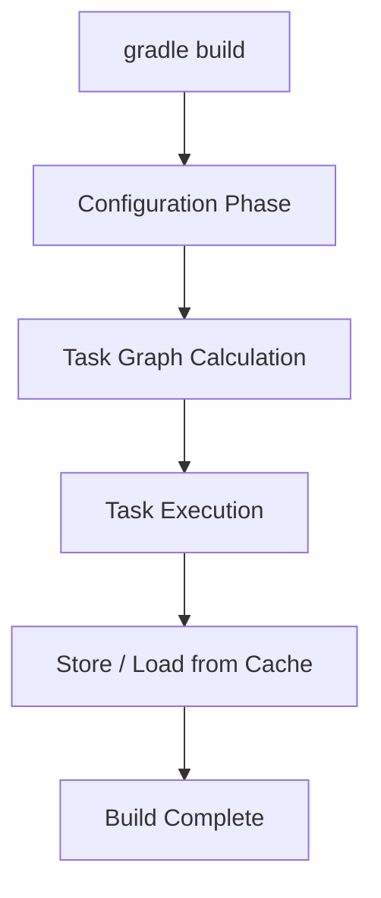

The diagram emphasizes the separation of concerns in Gradle’s lifecycle. Configuration collects all information and defines tasks. Graph calculation ensures Gradle knows exactly which tasks need to run. Execution interacts closely with the cache: before each task, Gradle checks whether it is up to date; if so, it may skip execution or restore outputs from the build cache.

This lifecycle enables powerful optimizations such as avoiding unnecessary work and parallelizing independent tasks. In large codebases, these optimizations significantly reduce build times and make the system responsive enough for continuous feedback in CI and local development.

---

### 6.3 Lifecycle management considerations

Both tools need robust lifecycle management:

- **Consistency**: Re-running the same command on the same inputs should produce the same outputs.

- **Extensibility**: Lifecycles and tasks must be extensible via plugins without breaking existing behavior.

- **Observability**: Logs and reports should reflect the lifecycle clearly for troubleshooting.

- **Failure handling**: Fail fast vs fail-continue strategies, especially with multi-module graphs.


Maven solves this with well-defined lifecycles and plugin bindings. Gradle solves it with a structured task graph and ordered execution.

---

**Diagram 6.3 – Error Handling in Composite Lifecycle**

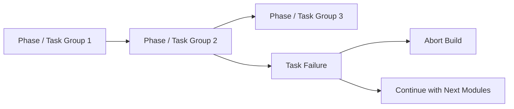

This diagram abstracts error handling for composite builds. A failure in Phase/Task Group 2 can trigger either an abort or a continue strategy. Maven often fails fast by default, while some CI scripts may choose to continue running certain non-critical tasks.

Lifecycle management includes deciding which tasks can be skipped on failure, how to surface detailed error information, and how to aggregate statuses across modules. Gradle’s build scans and Maven’s surefire reports, for example, collect detailed failure information that feeds back into lifecycle governance.

---

### 6.4 Gradle incremental builds and cache lifecycle

Gradle’s build cache introduces its own lifecycle: populate, reuse, invalidate.

---

**Diagram 6.4 – Gradle Incremental / Cache Lifecycle**

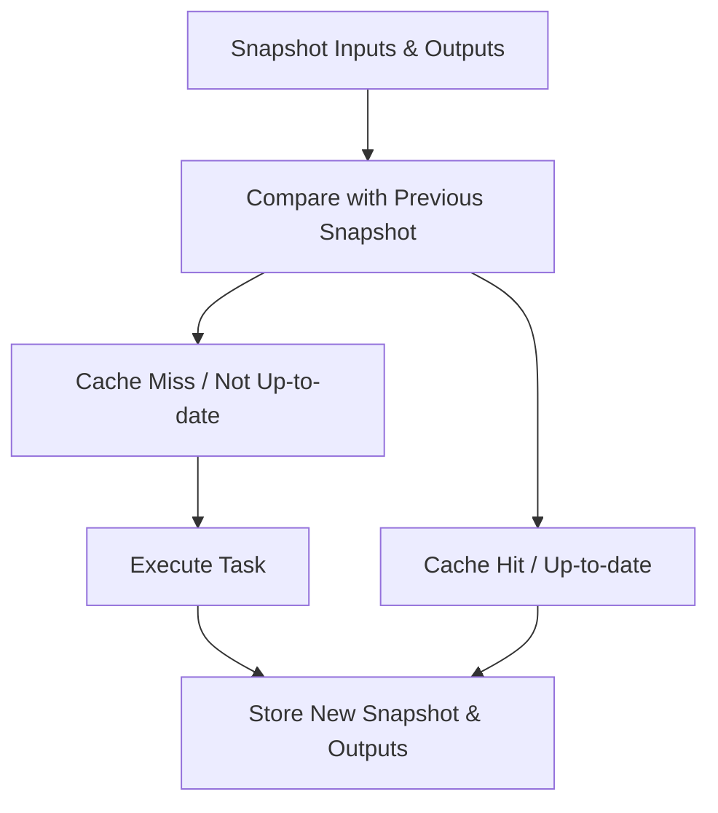

The diagram outlines how Gradle determines whether to run a task. It captures input/output snapshots, compares them with previous state, and distinguishes between cache hits and misses. If a task is a miss, it is executed and outputs are stored. If it’s a hit, Gradle can skip execution, relying on previously produced outputs.

Lifecycle management here includes deciding which tasks are cacheable, how long cache entries live, and how to handle remote vs local caches. This is central to making Gradle performant in large enterprise builds with many repeated tasks across CI pipelines and developer machines.

---

### 6.5 Maven snapshot/release lifecycle

Maven implements a release management lifecycle via snapshot and release semantics in versions.

---

**Diagram 6.5 – Maven Snapshot vs Release Lifecycle**

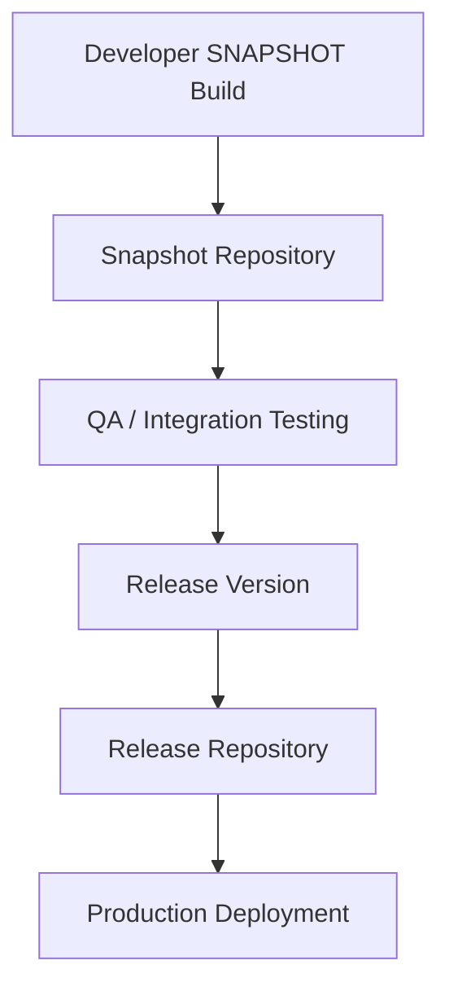

This diagram illustrates how Maven uses versioning and repository separation to manage lifecycle. Developers publish SNAPSHOT builds to a snapshot repository. QA and integration environments use these for early testing. Once stabilized, a release process increments the version, publishes to a release repository, and that artifact is used in production deployments.

This lifecycle enforces clean separation between mutable snapshot artifacts and immutable release artifacts. It aligns well with enterprise governance practices, where approvals and audits are tied to release versions. Gradle can participate in similar flows by using Maven publishing and following the same conventions.

---

## 7. Alignment with SD, LLD, OOP, and HLD principles

Maven and Gradle architectures align strongly with classical software design principles.

From a **system design (SD) and high-level design (HLD)** perspective, they implement:

- Clear separation of concerns: core engine vs plugins vs project model vs repositories.

- Explicit contracts between components: plugin APIs, repository interfaces, task/goal interfaces.

- Composability: tasks, modules, and lifecycle phases combine to form bigger workflows.


From a **low-level design (LLD)** and **OOP** viewpoint:

- They use interfaces and abstractions extensively (e.g., `Task`, `Plugin`, `Goal`, `LifecycleParticipant`).

- They employ patterns such as Composite, Strategy (for dependency resolution strategies, conflict resolution), Template Method (lifecycle hooks), and Observer (for logging, build events).

- They encapsulate configuration and behavior in cohesive classes, exposing narrow, meaningful APIs.


Designing them this way ensures:

1. **Extensibility without modification** (Open/Closed Principle). Plugins can extend behavior without touching core logic.

2. **Substitutability** (Liskov). Different implementations of repositories, caches, or logging facilities can be swapped in.

3. **Interface segregation**. Plugins implement only what they need—e.g., Gradle’s plugin interfaces are purpose-specific.

4. **Dependency inversion**. Core modules depend on abstractions, not concrete implementations.


---

**Diagram 7.1 – Layered Architecture with Abstractions**

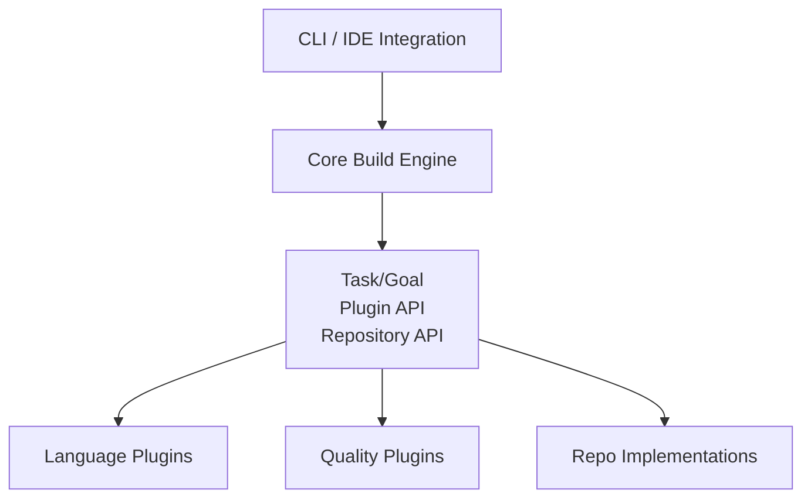

This diagram shows a layered architecture where the core engine depends only on abstract interfaces. Plugins and repository implementations depend on those abstractions, not vice versa. The UI layer interacts with the core, which delegates out via the abstractions.

This layering supports decoupling and testability. You can unit test the core engine using mocks for tasks, plugins, and repositories. Enterprises can also provide alternative implementations (e.g., custom repositories, security scanners) without forking the core. This follows clean architecture principles and is a hallmark of robust SD/HLD.

---

**Diagram 7.2 – Key Design Patterns Used**

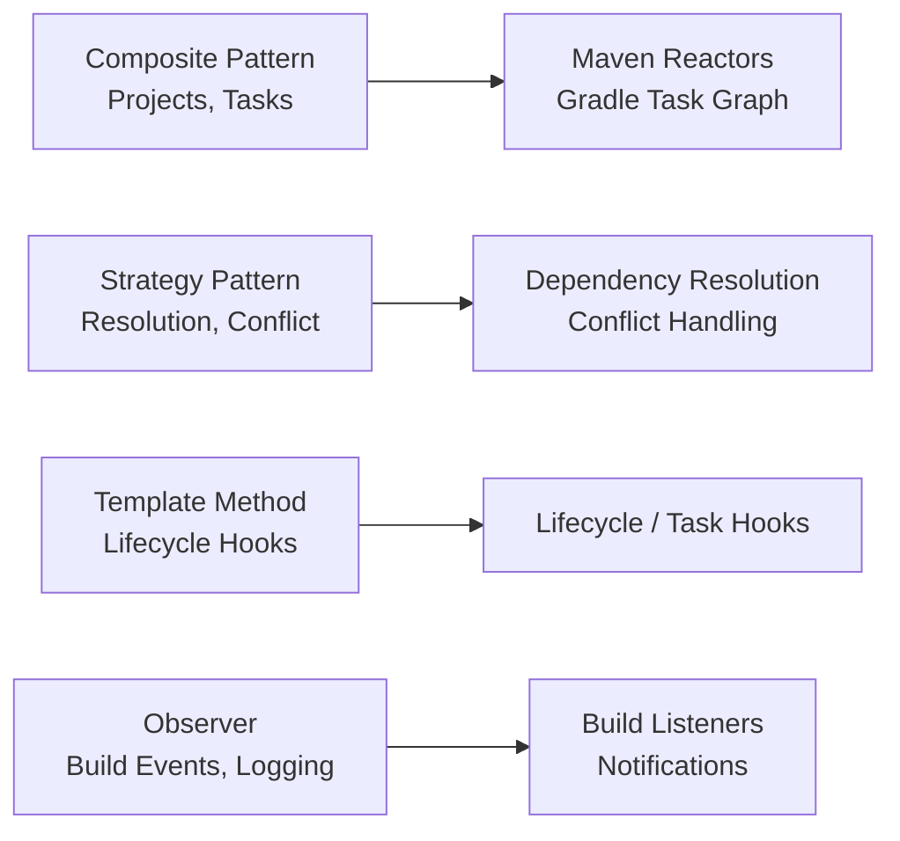

This diagram maps design patterns to concrete use cases. Composite is used in project/module graphs and task graphs. Strategy governs how dependencies are resolved or version conflicts are handled. Template Method appears in lifecycle hooks and task execution templates. Observer is used for build listeners, progress notifications, and logging.

These patterns make the architecture robust and maintainable. They are well-known, well-understood, and align with OOP and SD best practices. For a system as widely used as Maven or Gradle, leaning on these proven patterns is a deliberate design decision to reduce complexity and increase extensibility.

---

**Diagram 7.3 – Why This Architecture Choice**

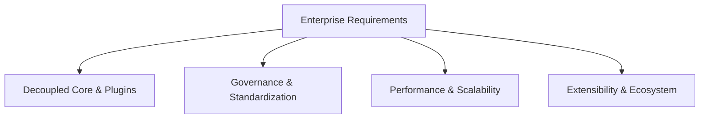

This diagram ties high-level requirements to architectural decisions. Enterprise requirements (standardization, scale, governance, tooling integration) lead to decoupled core and plugin-based extensions. Governance needs parent POMs, convention plugins, and centralized dependency management. Performance and scalability require incremental builds, caching, and efficient dependency resolution. Extensibility and ecosystem health demand stable plugin APIs.

The architecture of Maven and Gradle is not accidental; it is a response to the needs of large organizations and ecosystems. Using Composite structures, clean abstractions, and standard patterns ensures that build logic remains manageable even as projects, languages, and tools evolve.

---

## 8. Scalability, maintainability, and operability

Scalability, maintainability, and operability are core non-functional requirements for Maven and Gradle in real-world use.

### 8.1 Scalability

Scalability is addressed in multiple dimensions:

- **Project scale**: multi-module/multi-project builds with dependency graphs spanning hundreds or thousands of modules. Build engines must handle these graphs efficiently.

- **Team scale**: many teams contribute to shared builds; conventions and governance ensure consistency.

- **Execution scale**: builds running on many CI agents, leveraging caches and remote repositories.


Gradle focuses heavily on performance: configuration caching, build caching, daemon processes, and parallel execution. Maven focuses on determinism and straightforward lifecycles, and can be scaled using CI orchestrators and distributed artifact repos.

---

**Diagram 8.1 – Scaling Across Modules and Teams**

```mermaid
flowchart TB
    Org[Organization]
    TeamA[Team A Services]
    TeamB[Team B Libraries]
    TeamC[Team C Platforms]
    BuildRoot[Shared Root Build<br/>Parent POM / Root Gradle]

    Org --> TeamA
    Org --> TeamB
    Org --> TeamC

    TeamA --> BuildRoot
    TeamB --> BuildRoot
    TeamC --> BuildRoot
```

The diagram suggests an organization with multiple teams aligning under a shared root build configuration. Each team owns modules or subprojects, but all depend on a common build standard encoded in a parent POM or root Gradle build.

This structure scales governance: shared plugins, dependency versions, quality rules, and publishing conventions apply across teams. Teams retain autonomy over their modules, but they are still inside a composite structure orchestrated centrally. This balances standardization with flexibility and is key to maintainability in large organizations.

---

### 8.2 Maintainability

Maintainability comes from:

- **Convention over configuration**: standard directory layouts, lifecycle semantics, and dependency scopes reduce cognitive load.

- **Reusable configurations**: parent POMs, BOMs, convention plugins, and version catalogs centralize configuration.

- **Stable plugin contracts**: plugin authors can evolve features without breaking the core.


Refactoring monoliths into multi-module builds, and promoting reusable libraries, becomes straightforward. Shared patterns and corporate plugins reduce duplication and drift.

---

**Diagram 8.2 – Configuration Reuse**

```mermaid
flowchart TB
    ParentCfg[Parent POM / Convention Plugin]
    Mod1[Service A]
    Mod2[Service B]
    Mod3[Library C]
    Mod4[Tooling D]

    ParentCfg --> Mod1
    ParentCfg --> Mod2
    ParentCfg --> Mod3
    ParentCfg --> Mod4
```

The diagram shows a single configuration source reused across many modules. All services and libraries inherit baseline configuration—dependencies, plugin versions, quality gates—from the parent or convention plugin.

When a security patch is required (e.g., bumping a log library), you update the parent/config once and all consumers inherit it on their next build. This drastically reduces maintenance overhead, avoids configuration drift, and supports consistent enforcement of organizational policies.

---

### 8.3 Operability

Operability is about how easy it is to run, observe, troubleshoot, and evolve the build system.

Both Maven and Gradle support:

- **Verbose logging and debug modes**.

- **Structured reports**: test reports, coverage reports, dependency trees.

- **Integration with observability platforms**: logs and scans can be forwarded to monitoring tools.

- **CI-friendly behavior**: deterministic exit codes and non-interactive execution.


Gradle’s build scans provide deep insight into task execution times, cache hits, configuration time, and dependencies. Maven can be integrated with reporting and QA plugins generating HTML or XML artifacts for consumption by dashboards.

---

**Diagram 8.3 – Operability Feedback Loop**

```mermaid
flowchart LR
    BuildRun[Build Run <br/>Maven/Gradle]
    Logs[Logs / Reports / Build Scans]
    Dash[Dashboards & Monitoring]
    Teams[Developer & Platform Teams]
    Improve[Configuration / Plugin Improvements]

    BuildRun --> Logs --> Dash --> Teams --> Improve --> BuildRun
```

The diagram illustrates a feedback loop for operability. Each build run generates logs and reports, which feed dashboards and monitoring systems. Teams consume this information to identify bottlenecks or issues and improve configuration, plugins, or architecture.

These improvements are then encoded back into the build, completing the loop. Over time, this cycle increases performance, reduces failures, and aligns the build system with evolving organizational needs. This is central to operating Maven/Gradle at scale.

---

### 8.4 Docker and remote execution

Especially for Gradle, but increasingly for Maven, organizations run builds in containerized environments and sometimes use remote build execution.

---

**Diagram 8.4 – Containerized Build Execution**

```mermaid
flowchart TB
    DevEnv[Developer / CI]
    Docker[Docker Image<br/>Maven/Gradle + JDK]
    Agent[Build Agent / Runner]
    RepoSrc[Source Repo]
    RepoArt[Artifact Repo]
    CacheNode[Remote Cache / Volume]

    DevEnv --> Agent
    Agent --> Docker
    Docker --> RepoSrc
    Docker --> RepoArt
    Docker --> CacheNode
```

The diagram presents a containerized build setup. Build agents run Docker images that encapsulate Maven/Gradle, JDK, and necessary tooling. Source code is checked out inside containers; dependencies are pulled from artifact repos; build caches may be on shared volumes or remote services.

Containerization ensures environment parity across local and CI builds, improves reproducibility, and simplifies dependency management at the OS level. Remote caches further accelerate builds by sharing computed artifacts between agents. Both Maven and Gradle integrate smoothly into such environments, reinforcing their suitability for large-scale, modern delivery pipelines.

---

### 8.5 Summary

Maven and Gradle are not just scripting tools; they are sophisticated Composite Build Systems engineered for enterprise-scale projects. Their architectures emphasize composability (modules, tasks, plugins), abstraction (interfaces, patterns), governance (parent POMs, convention plugins), and operability (logging, scans, dashboards).

By modeling builds as graphs of composable components, they enable scalable, maintainable, and observable build pipelines that integrate deeply into the modern SDLC and DevOps toolchain.
