---

## What is “Netflix Deployment Pipelines”?

At Netflix scale, deployment is not a single Jenkins job pushing artifacts to production. It is a structured, multi-stage **deployment pipeline** that orchestrates build, bake, test, canary, regional rollout, and global promotion in a repeatable way. The core idea is that every change flows through a **standardized path** from commit to production, encoded as a pipeline with declarative stages, triggers, gates, and safety checks.

Internally, Netflix built and open-sourced **Spinnaker**, a multi-cloud continuous delivery platform that provides the pipeline abstraction and integrates with CI tools (e.g., Jenkins), artifact repositories, and multiple cloud providers. Spinnaker generalizes deployment pipelines into reusable building blocks called stages: bake image, deploy, run tests, manual judgement, canary analysis, roll back, etc. These stages can be composed into complex workflows and re-used across hundreds of teams. ([CD Foundation](https://cd.foundation/case-studies/spinnaker-case-studies/spinnaker-case-study-netflix/?utm_source=chatgpt.com "Spinnaker Case Study: Netflix - CD ..."))

“Netflix Deployment Pipelines” in this case study refers to the **end-to-end delivery model built on Spinnaker and related tooling**: developers push code, CI builds artifacts, Spinnaker pipelines deploy and validate them, and automated policies decide promotion or rollback. The pipeline becomes the system of record for how software moves between environments, providing transparency, auditability, and consistency across thousands of microservices and millions of daily deployments.

Instead of treating each service deployment as a one-off, Netflix treats pipelines themselves as **first-class, versionable, composable entities**, much like a Composite Build System treats multi-module builds as a composed structure rather than ad-hoc scripts.

**Diagram 1.1 – High-Level Netflix Deployment Pipeline Overview**

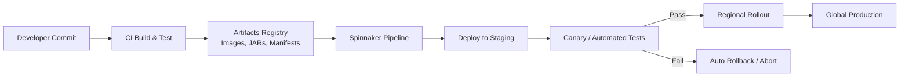

This diagram shows a condensed view of how a deployment pipeline flows from code to global production. Developers commit to a shared repository; CI builds the artifacts and publishes them to a registry. Spinnaker (or an equivalent orchestrator) picks up those artifacts and executes a multi-stage pipeline: deploy to a staging environment, run tests or canary analysis, then progressively roll out to production regions. At each gate, policy-based decisions determine whether to advance or roll back. The central point is that the pipeline is **explicitly modeled as a sequence of stages**, not a tangle of scripts. This mirrors how a Composite Build System organizes hierarchical builds, but here it organizes the delivery path itself.

**Diagram 1.2 – Logical View of a Netflix Deployment Pipeline as a Composite**

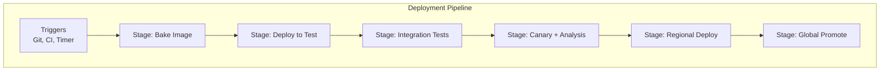

This diagram represents the pipeline as a **composite of stages**. Each stage is independently defined, parameterized, and reusable across pipelines. Some teams may omit or extend stages, but they all conform to the same structural abstraction. The analogy to a Composite Build System is direct: just as multi-module builds compose modules under a root project, the deployment pipeline composes stages under a root pipeline definition. Stages can be added, reordered, or replaced without rewriting the entire pipeline, which is crucial at Netflix scale where patterns such as “bake → deploy → test → canary → promote” are repeated across hundreds of services with variations in policy and configuration.

---

## How and Why It Uses a Composite Build System

Netflix’s deployment pipelines conceptually parallel a **Composite Build System** in the way they aggregate and orchestrate multiple build artefacts, services, and environments into a coherent, repeatable process. While Maven and Gradle handle composite builds at the source and artifact level, Netflix extends this compositional mindset into the **delivery pipeline** itself.

First, Netflix operates a vast microservices estate. Each microservice may have its own build, configuration, infrastructure definition (e.g., CloudFormation, Terraform, Kubernetes manifests), and runtime profile. Treating each service deployment separately would lead to fragmentation, duplicated logic, and drift in best practices. Instead, they define **pipeline templates** and common stages that act like shared subprojects in a composite build: reusable, centrally governed, but overridable where necessary. Pipelines are composed from these building blocks so that cross-cutting capabilities—canary analysis, chaos testing, blue/green, security scans—are attached consistently to many services at once. ([CD Foundation](https://cd.foundation/case-studies/spinnaker-case-studies/spinnaker-case-study-netflix/?utm_source=chatgpt.com "Spinnaker Case Study: Netflix - CD ..."))

Second, the integration with CI and build tools is itself compositional. A microservice’s build might produce multiple artifacts: container images, configuration bundles, database migration scripts, sidecar agents, etc. These are packaged and published into artifact stores. The deployment pipeline references **logical artifacts**, not hardcoded file paths, and can orchestrate multiple artifact types in a single deployment. For example, a pipeline may “bake” an immutable machine image (AMI) based on a certain artifact set, deploy it into a canary cluster, and in parallel apply a schema migration, all within one composite pipeline.

Third, Netflix uses composite-like patterns to manage **multi-environment and multi-region promotion**. Instead of separate pipelines for each region or environment, they often define a single logical pipeline with multiple environment-specific stages. Each stage targets a different deployment descriptor (e.g., `us-east-1`, `eu-west-1`) but is structurally the same. This parallels composite builds where a root configuration orchestrates multiple sub-modules with per-module overrides while retaining a unified build structure.

Finally, Netflix’s adoption of Spinnaker emphasizes **pluggable stages and integrations**. Spinnaker’s architecture exposes a pipeline engine that can be extended with custom stages, triggers, notifications, and deployment strategies, making it effectively a “composite delivery system.” Teams can add new stages (e.g., a specialized compliance check) without breaking the global abstraction. That is analogous to adding a new plugin-based sub-build into a composite build tree.

In short, Netflix uses the Composite Build System idea **beyond the build**: pipelines are treated as composable graphs of delivery operations, each referencing artifacts from a composite build world and deploying them across multiple clouds and regions.

**Diagram 2.1 – Composite View: Build Artifacts Feeding a Composite Deployment Pipeline**

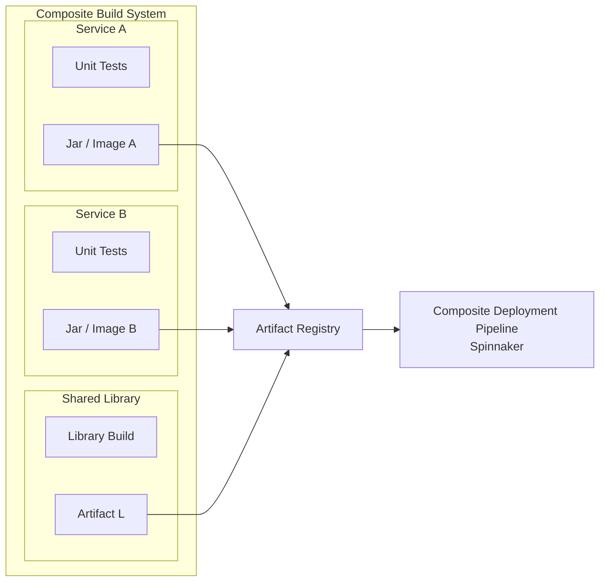

Here we see multiple services and a shared library built under a composite build system. Each module has its own tests and artifacts, but a **central artifact registry** collects the outputs. The deployment pipeline operates at a higher abstraction level, referencing logical artifact identifiers (e.g., “Service A latest build”) instead of direct file paths. This separation allows the build system and delivery system to evolve independently while maintaining a well-defined contract: build produces versioned artifacts; pipelines consume them. The conceptual alignment is that both the build and deployment layers are composite graphs: the build graph for compilation/testing, and the deployment graph for rollout.

**Diagram 2.2 – Deployment Pipeline as a Composite Graph of Reusable Stages**

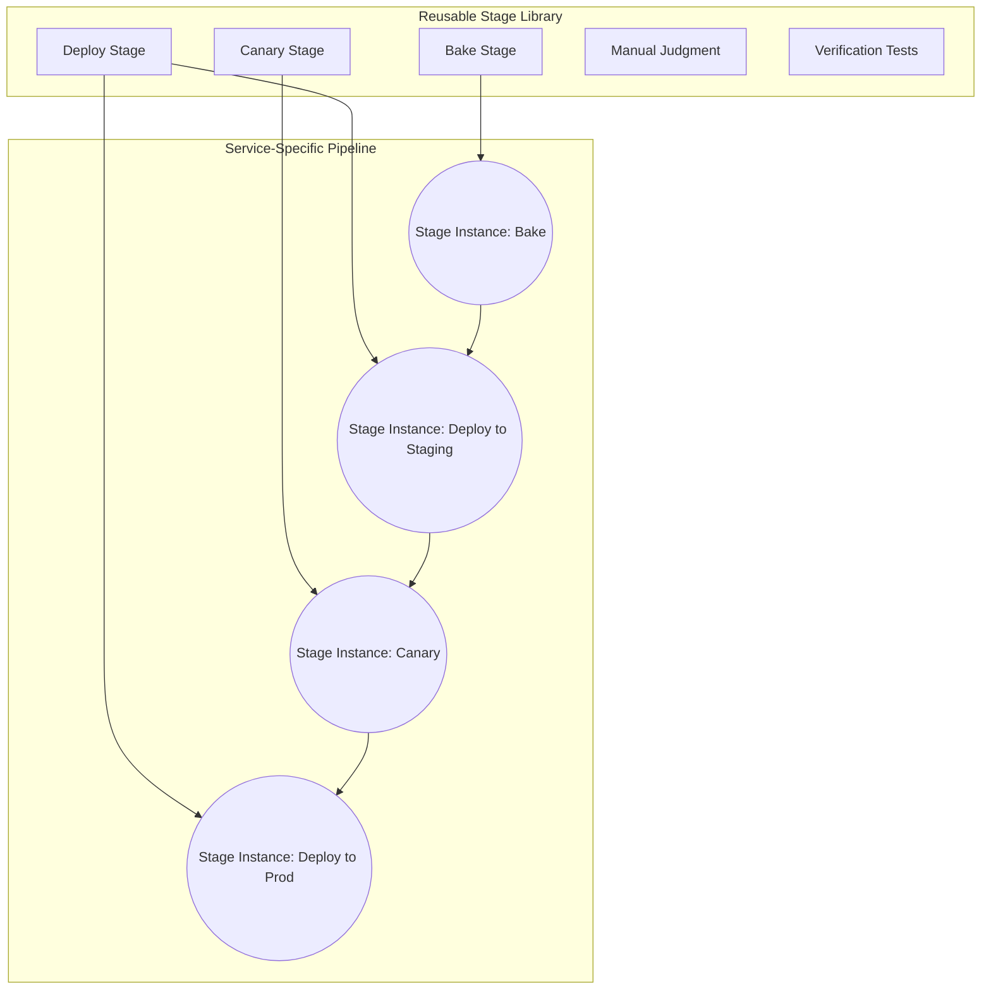

This diagram highlights the **library of reusable stages** (left) and a concrete pipeline (right). Each pipeline stage instance is a configured instance of a generic stage: “Bake,” “Deploy,” “Canary,” etc. This is structurally identical to a composite build where multiple subprojects share plugins, tasks, and configurations but specialize them through declarative configuration. The advantage is that when Netflix enhances a common stage (e.g., more robust canary analysis), all pipelines using it benefit, without manually modifying each pipeline definition. The composite nature gives central control, local flexibility, and long-term maintainability.

---

## Ensuring Netflix Deployment Pipelines Behave as Enterprise-Level Architecture

At Netflix scale, deployment pipelines are not a side script; they are **critical production infrastructure** that must behave with the robustness expected of enterprise-grade systems. That implies clear concerns: reliability, observability, governance, compliance, security, scalability, and operability. The pipeline tooling and its surrounding ecosystem are deliberately architected to meet these non-functional requirements.

### 3.1 Reliability and Safety

Netflix emphasizes **immutable infrastructure** and proven deployment strategies like blue/green and canary rollouts. Pipelines encode these strategies as first-class stages, making the safest patterns the default path. Tools like Spinnaker provide out-of-the-box deployment strategies (e.g., blue/green, highlander, canary) that standardize safe rollout behaviors. ([Spinnaker](https://spinnaker.io/?utm_source=chatgpt.com "Spinnaker"))

Canary analysis, in particular, is engineered with strong statistical foundations (e.g., automated canary analysis frameworks, sequential testing of regressions). This reduces the risk that a pipeline promotes a faulty release, and supports rapid rollback when anomalies are detected. ([arXiv](https://arxiv.org/abs/2205.14762?utm_source=chatgpt.com "Rapid Regression Detection in Software Deployments through Sequential Testing"))

Reliability is reinforced by:

- **Automated gates**: pipelines pause or fail if key health metrics degrade.

- **Self-service rollbacks**: acting as stages baked into pipelines.

- **Execution windows**: restricting risky deployments to controlled time windows. ([Spinnaker](https://spinnaker.io/?utm_source=chatgpt.com "Spinnaker"))


### 3.2 Observability and Transparency

Enterprise-level architecture requires **full visibility** into who deployed what, when, and how. Netflix ensures that pipelines emit structured events and metrics at each stage, fed into observability platforms (e.g., Atlas, Spectator, and logging pipelines). ([Medium](https://medium.com/%40seyhunak/learning-best-practices-from-netflix-tech-stack-ci-cd-pipeline-a25a58f46711?utm_source=chatgpt.com "Learning Best Practices from Netflix Tech Stack CI/CD ..."))

Key aspects:

- Each pipeline execution is traceable: inputs, artifacts, target environments, and outcomes.

- Dashboards show pipeline health, failure rates, and stage latency distribution.

- External systems (incident management, on-call rotations) integrate with pipeline state for quick diagnosis.


Pipelines themselves become part of the system’s **debug story**. When something breaks in production, teams can trace back through deployment histories, canary decisions, and configuration change logs.

### 3.3 Governance, Security, and Compliance

Netflix operates in multiple regulatory contexts and must ensure deployments respect access control, auditability, and policy enforcement.

Spinnaker supports **role-based access control** and integrates with corporate identity providers (OAuth, SAML, LDAP, etc.), letting organizations control who can modify pipelines, trigger deployments, or touch certain accounts. ([Spinnaker](https://spinnaker.io/?utm_source=chatgpt.com "Spinnaker"))

Typical enterprise-grade measures include:

- Enforcing approvals (manual judgement stages) for sensitive services.

- Limiting production deployments to certain groups or service accounts.

- Auditing pipeline configuration changes and execution logs.

- Applying security scanning stages (SAST, DAST) before production promotion.


This ensures that deployment pipelines themselves do not become a side-door around formal governance processes.

### 3.4 Scalability and Multi-Cloud Support

Netflix’s deployment architecture is inherently **multi-cloud and multi-region**. Spinnaker was built to deploy to AWS, GCP, Azure, Kubernetes, and other targets concurrently. ([Spinnaker](https://spinnaker.io/?utm_source=chatgpt.com "Spinnaker"))

Enterprise-level scalability is attained by:

- Structuring the pipeline engine as a set of microservices (e.g., Gate, Orca, Clouddriver, Front50 in Spinnaker) that can scale horizontally.

- Separating front-door APIs, orchestration logic, and cloud-specific integrations into decoupled services.

- Supporting sharding by application, account, and region.


The composite pipeline model ensures that adding a new environment (e.g., a new region or cluster) often means **adding a stage or extending configuration**, not rewriting the deployment system.

### 3.5 Self-Service and Standardization

Enterprise architectures fail when central teams become bottlenecks. Netflix avoids this by making deployment pipelines **self-service** within guardrails:

- Product teams configure their own pipelines via UI or configuration-as-code.

- Central platform teams define stage types, best practice templates, and global integrations.

- Standards (e.g., mandatory stages for PII-handling services) are enforced via policy frameworks rather than ad-hoc review.


This yields a balance between **developer autonomy** and **organizational consistency**, a hallmark of modern enterprise-grade systems.

### 3.6 Alignment with Composite Build System Concepts

The “enterprise behavior” of Netflix’s deployment pipeline is tied directly to composite principles:

- **Shared components** (stages, strategies, templates) are centrally developed and hardened.

- **Per-service customization** is applied through configuration and composition rather than forking code.

- **Pipeline definitions** can be version-controlled, templatized, and rolled out like libraries or plugins.


The result is a deployment infrastructure that behaves like a well-designed enterprise application: modular, governed, observable, and continuously evolvable.

**Diagram 3.1 – Enterprise-Grade Deployment Platform Architecture**

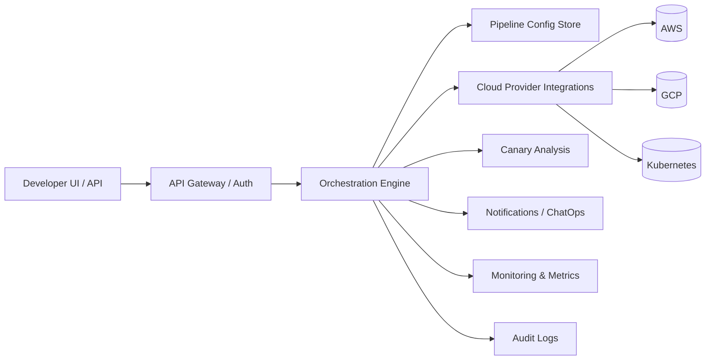

This diagram abstracts Spinnaker-like services into a deployment platform topology. The API gateway handles authentication and request routing; the orchestration engine coordinates stage execution; pipeline configurations are stored in a dedicated persistence service; cloud interactions are consolidated in a cloud driver layer. Canary analysis, notifications, and monitoring are integrated as specialized subsystems. This segregation of concerns is critical to enterprise behavior: each subsystem scales independently, can be updated with minimal cross-impact, and enforces specific responsibility boundaries. The deployment platform is itself a **microservice system**, mirroring the services it deploys.

**Diagram 3.2 – Safe Enterprise Deployment Workflow with Canary and Rollback**

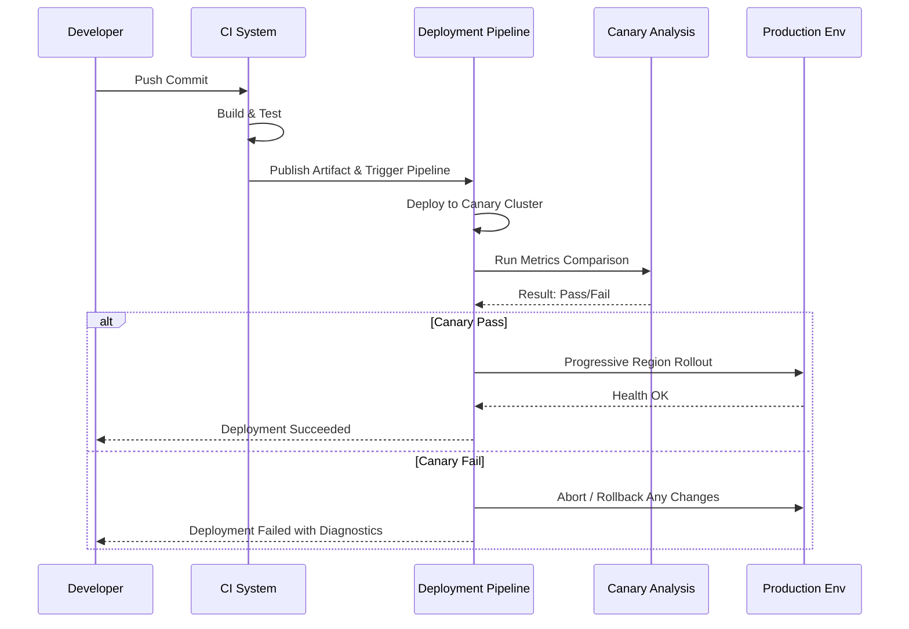

This sequence diagram demonstrates a typical enterprise-grade workflow: developers commit code, CI builds artifacts, the deployment pipeline handles canary deployment and analysis before promotion. Only if the canary passes does the system proceed to wider production rollout. If it fails, the pipeline initiates rollback and reports diagnostics. Key properties include **automation of safety checks, explicit branching on health signals, and tight feedback loops to developers**. This embodies enterprise expectations: controlled risk, auditable state transitions, and minimal manual intervention during normal operations. The pipeline is not a best-effort script; it is a formal workflow with encoded safety guarantees.

---

## Architecture of Netflix Deployment Pipelines

A deployment system at Netflix scale is not a singular pipeline engine but a **federated architecture composed of multiple microservices**, infrastructure abstraction layers, caching fabrics, execution graphs, audit systems, policy engines, and workflow orchestration schedulers. A high-scale Continuous Delivery (CD) engine must not only deliver artifacts — it must also **coordinate rollout, verify health, support multi‐region failover, allow A/B rollouts, comply with governance, and expose controls to thousands of engineers**.

The architecture below reconstructs how Netflix pipelines operate as a unified Composite Delivery System. We go far deeper than high-level overviews — we break internal mechanics, request routing, state machines, pipeline DAG execution, artifact coordination, rollout sequencing, and resilience models.

Netflix deploys services >1000 times per day, across hundreds of microservices and multi-regional clusters. The deployment system **must support diversified topology**, such as:

- AWS/Azure multi-region clusters

- Kubernetes workloads

- EC2 ASGs + baked AMIs

- Multi-service artifact graphs

- Parallel regional traffic ramp-up

- Canary clusters w/ automated statistical regression detection


A pipeline is internally represented as a **Directed Acyclic Graph (DAG)** where nodes = stages, edges = execution flow. Like Composite Build Systems represent build modules with dependencies, Netflix represents deployment workflows as graph nodes with ordering constraints, rollback policies, and retry semantics. **Stage templates behave like Gradle/Maven plugins** — reusable, parameterized units.

---

### **Diagram 4.1 — Internal Microservice Architecture of Netflix Deployment Pipelines**

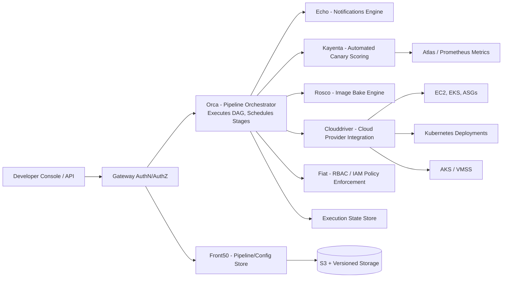

This architecture shows the backbone of Netflix CD:

- **Orca** executes the pipeline DAG

- **Front50** keeps pipeline definitions (like POM XML in composite builds)

- **Clouddriver** abstracts cloud providers

- **Kayenta** analyzes metrics statistically for canary judgement

- **Rosco** bakes artifacts → produces AMIs/images

- **Fiat** enforces permissions globally (governance)

- **Redis** acts as execution checkpoint store (transactional stage states)


The system behaves like a distributed state machine. Each stage is replayable, restartable, resumable. Failures propagate deterministically — similar to a failed submodule in a composite build halting root target.

The architecture scales because services are independently deployable + horizontally scalable. If canary analysis load increases, **only Kayenta needs scaling** — no pipeline restarts. This is modularity at enterprise-grade.

---

### **Pipeline Execution Flow Model**

A pipeline instance is materialized into a planned execution graph:

1. **Trigger Event** → Git push / Artifact Publish / Timer

2. **Pipeline Configuration Loaded** → From Front50

3. **Graph Built in Orca**

4. **Artifacts Resolved + Image Baked (Rosco)**

5. **Deployment to Test Env (Clouddriver)**

6. **Automated Canary (Kayenta) with statistical thresholds**

7. **Stage Gates Evaluate**

8. **Regional + Global rollout**

9. **Rollback if anomalies occur**

10. **Notify & Archive Execution State**


This resembles Composite Build execution where Gradle builds dependency tree → executes targets → resolves artifact graph → performs final publish phase.

---

### **Diagram 4.2 — Pipeline DAG Execution Lifecycle**

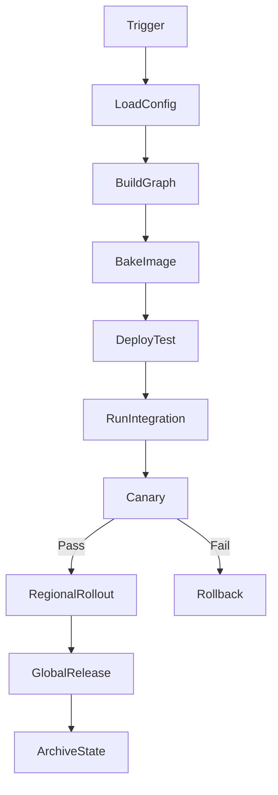

The pipeline is not linear — loops exist (retries, manual judgement), parallel branches exist (multi-region deploys), and conditional promotion exists. DAG execution allows **branching and conditional rollback**, which is fundamentally stronger than linear CI jobs.

Composite builds trigger tasks based on dependency resolution — Netflix triggers deployment stages based on **policy resolution + prior stage success**.

---

### **Flowchart of Artifact Promotion (Very Important)**

Because this is where Composite Build System is most visible:

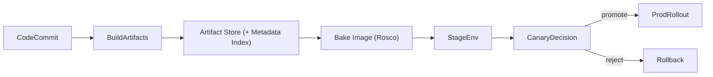

Artifacts in Netflix pipelines **behave like build module outputs**. They carry metadata:

|Field|Similar to Composite Maven/Gradle|
|---|---|
|version hash|module version|
|manifest|POM/Gradle metadata|
|dependencies|transitive module dependencies|
|build origin|multi-module project root ref|
|compatibility flags|plugin compatibility|

Promotion rules operate like **publishToMavenLocal → release** semantics.

---

## Features of Netflix Deployment Pipelines that Align with a Composite Build System

Netflix pipelines do not merely resemble composite builds — they embody the same **design philosophy**: modular components build a larger execution construct. Netflix extended this philosophy beyond compilation into deployment, verification, rollout, rollback, policy management, and multi-env promotion.

### Key Composite-System Features Inside Netflix CD

|Netflix Feature|Composite Analogy|
|---|---|
|Stages = Plugins|Maven/Gradle tasks/modules|
|Pipeline = Root project|Composite multi-module project|
|Rosco/Kayenta/Templates = shared libraries|Reusable submodules|
|Region rollouts = parallel module execution|sub-build execution graph|
|Canary scoring = integration test results gating build|test gating release target|
|Front50 version control = Gradle build cache metadata|reproducible builds|

### 5.1 Pipeline Templating & Shared Stage Libraries

Like Gradle plugins are reusable, Netflix deployment stages are centrally managed:

- Canary stage configurable per project

- Bake stage can parameterize OS, JRE, base image

- Compliance scans inserted as mandatory globally


Developers only instantiate templates instead of scripting custom flows — same as applying `plugins { java }`.

---

### **Diagram 5.1 — Stage Template Reuse across 1000+ Services**

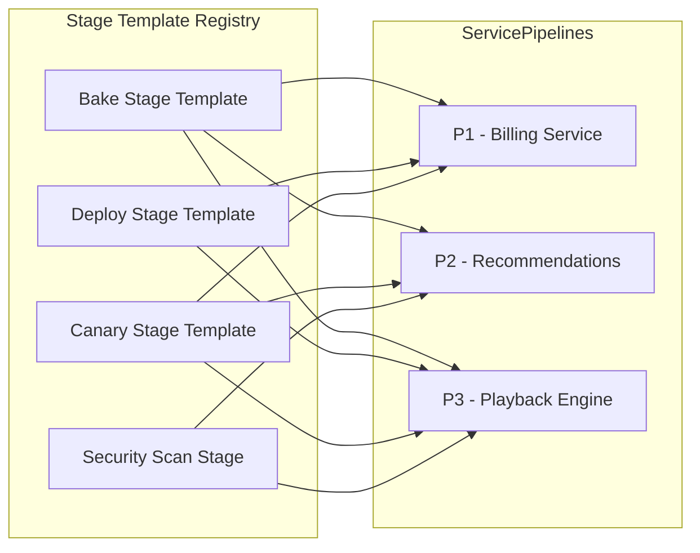

Each service composes templates like modules under a composite root. Updating a stage = upgrading plugin version → all pipelines reflect new best practice.

---

### 5.2 Multi-artifact + Multi-dependency resolution

Netflix builds:

- client + server side artifacts

- config overlays

- container + VM images

- schema migration bundles


Pipelines **resolve artifacts together** before deploy. Similar to composite builds resolving module dependencies before packaging.

---

### 5.3 Multi-cloud multi-region execution = distributed composite build

Composite build executes modules in parallel. Netflix pipelines deploy to regions in parallel with independent error tolerance. A failed ASG rollout in eu-west does **not** always block us-east.

---

### 5.4 Mutation-free execution — immutability like reproducible Gradle builds

Baked AMIs = deterministic build reproducibility. Pipelines treat deployments as reproducible artifact states, not mutable configs — paralleling build reproducibility.

---

### **Diagram 5.2 — Composite Analogy Mapping**

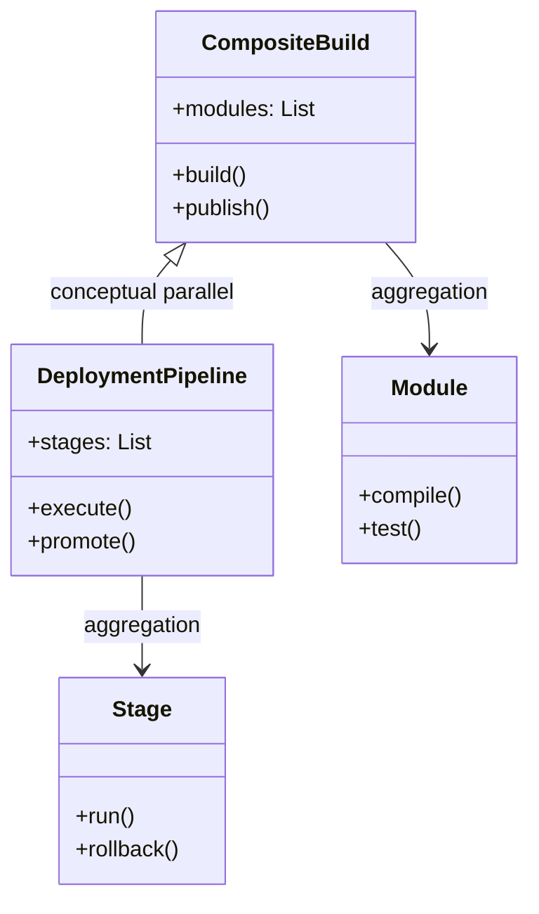

DeploymentPipeline is the **runtime analog** of CompositeBuild. Both assemble collections into a build graph, evaluate state, and produce reproducible outputs.

---

## Complete Implementation Idea, Lifecycle, Execution Model & Deployment Lifecycle Management

Netflix Deployment Pipelines are **not a feature** — they are a **production-critical living organism** that continuously coordinates code → artifact → deployment → verification → rollback → global promotion.
To design or replicate such a system, one must architect:

1. **Pipeline definition layer** (Versioned configuration, templates, DAG assembly)

2. **Pipeline execution engine** (Scheduling, retries, branching, rollback triggers)

3. **Artifact intelligence layer** (Artifact indexing, dependency graph resolution, metadata contracts)

4. **Deployment orchestration core** (Cloud drivers, rollout agents, infra provisioning)

5. **Verification & Guardrail system** (Canary, health scoring, risk regression tracking)

6. **Promotion governance** (Security, RBAC, approvals, audit trail)

7. **Resilience infrastructure** (HA nodes, distributed state persistence, exactly-once execution)

8. **Lifecycle management** (Monitoring, cleanup, multi-region sync, self-healing, upgrades)


The pipelines behave like distributed, event-sourced state machines.
Each execution has a lifecycle similar to a _transactional build pipeline_:

|Phase|Equivalent in Composite Build|Role|
|---|---|---|
|Pipeline Definition|root gradle/maven script|declares components (stages)|
|Artifact Resolution|dependency resolution|maps input → baked image artifact|
|Execution Graph Build|task graph|nodes = deploy/test/canary stages|
|Stage Execution|test/compile tasks|each deploys safely to an environment|
|Canary & Promotion|integration tests success|pipeline decides if upgrade continues|
|Regional & Global Rollout|publish to repos|rollout across world clusters|
|Failure Recovery|build failure rollback|auto-rollback to previous version|

---

### Full Lifecycle Flow — Step by Step Breakdown

---

### Stage 1 — Pipeline Definition Created (Developer / YAML / UI)

Engineers define deployment pipelines in a **declarative format (JSON/YAML front50)**, with reusable stage templates referencing shared best-practice stages.

Sample pipeline config structure representation:

```yaml
pipeline:
  name: "Playback Service Deployment"
  triggers:
    - type: "git"
      repo: "netflix/playback"
      branch: "main"
  stages:
    - bake-image { os: ubuntu-22, jdk: 17 }
    - deploy stage: test
    - integration-tests
    - automated-canary:
         metrics: latency,p99,error_rate
         threshold: "pass>=95%"
    - progressive-rollout:
         regions: [us-east-1,us-west-2,eu-central-1]
         ramp: [5%,20%,50%,100%]
    - finish-and-archive
```

Every stage here is a reusable **composite unit**.

The system stores it in Front50 → versioned like a composite build root.

---

### Stage 2 — Trigger Event → Execution Graph Materialization

When CI pushes artifact metadata → Spinnaker constructs a **DAG execution graph**:

```txt
Trigger → Bake → DeployTest → Integration → Canary → Rollout → Archive
```

Each node has:

- Retry policy

- Timeout

- Rollback target

- Conditional successor branches


The pipeline engine constructs this graph in memory (in Orca) and journals it inside Redis for resuming in case of microservice crash.

---

### Stage 3 — Artifact Resolution + Bake

Artifact resolution uses:

- Build metadata (JAR, container image tag, manifest)

- Dependency graph (libraries, config overlays)

- Security/package scans

- AMI bake via Rosco → immutable image output


This is equivalent to _gradle assemble_, producing reproducible artifacts.

A baked image (AMI) hash becomes **the single source of deployable truth**.

---

### Stage 4 — Canary Stage = AI-driven test gate

Netflix does not “test” manually. Canary stage does statistical control flow:

- Deploys new version to CANARY cluster (small % of prod traffic)

- Compares metrics NEW vs BASELINE cluster

- Kayenta computes statistical score

- Promotion only if metrics stable


Canary = integration test for infra + traffic.

---

### Stage 5 — Regional Rollout + Progressive Traffic Ramp

Once canary passes → rollout begins:

1. Deploy 5% of instances in region A

2. Monitor 10m

3. Ramp 20%

4. Ramp 50%

5. Ramp 100%

6. Repeat for other regions


Like composite multi-module execution, but here modules = **regions**.

Failures → rollback one region only, not global disaster.

---

### Stage 6 — Failure states trigger automatic rollbacks

Rollback policies apply if:

- p99 latency > SLA

- Error rate > threshold

- CPU/Memory anomalies

- Metric regression > tolerance

- Canary < pass score


Rollback is treated like _composite build revert_.

---

### Stage 7 — Execution archived + pipeline completes reliably

Pipeline produces audit trail:

- Artifact deployed

- Regions processed

- Canary score

- Rollback history (if)

- Runtime metrics

- Operator notes (if manual approval)


All stored → future analysis + compliance.

---

---

## **Diagram 6.1 — End-to-End Deployment Lifecycle**

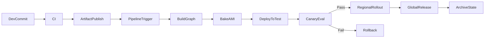

This illustrates the full flow from commit to release. Notice failure is not a terminal dead end — rollback is a _branch node_. Pipelines are built like fail-safe distributed graphs.

The system **always converges**: success or rollback, never stuck mid-way.

---

### Internal Components with Responsibilities

|Component|Responsibility|
|---|---|
|Orca|State machine executor|
|Rosco|AMI baking|
|Kayenta|Canary judgement|
|Clouddriver|Cloud interface driver|
|Front50|Pipeline config + versioning|
|Fiat|RBAC + compliance|
|Echo|Notifications, Slack/PagerDuty|
|Spinnaker UI / API|Operator console|

These are **loosely coupled microservices**, horizontally scalable.

---

---

## **Diagram 6.2 — Microservices & Message Bus Interaction**

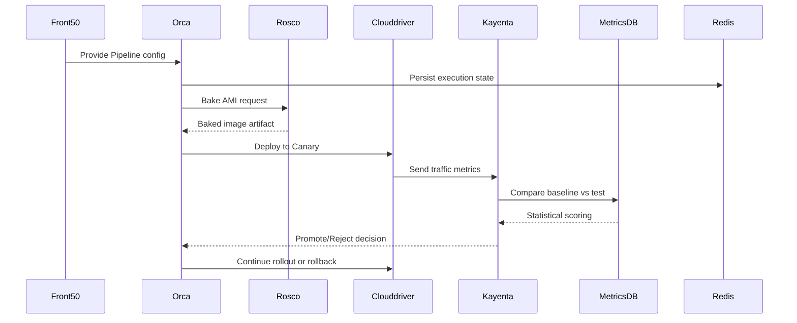

This diagram captures microservice conversation. Notice **Redis is journal** — enabling resume-from-failure. No stage is lost.

The structure resembles orchestration in **distributed build systems** like Bazel.

---

---

## **Diagram 6.3 — Deployment DAG Visual Structure**

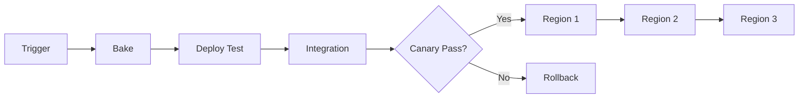

DAG gives branching, convergence, fault-tolerant topology.

No linear pipeline could safely operate like this at global scale.

---

---

## **Diagram 6.4 — Runtime Execution State Machine**

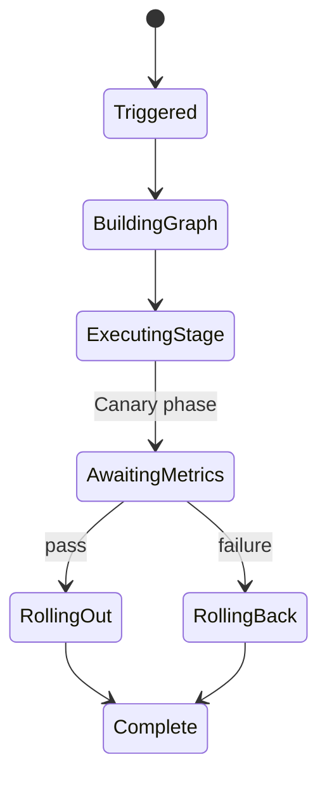

Each pipeline is a state machine. Every failure is a **managed state transition** — never undefined.

Enterprise stability comes from deterministic state behavior.

---

---

## **Diagram 6.5 — Lifecycle Management & Cleanup Process**

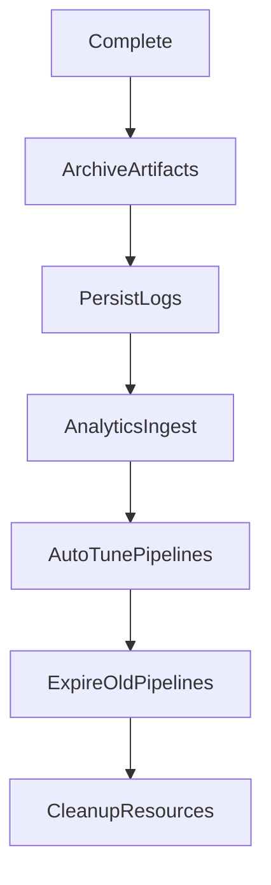

Netflix doesn’t stop at deployment. After pipeline execution:

1. Results archived

2. Data fed into ML risk modeling

3. Canary thresholds auto-retuned

4. Old artifacts cleaned

5. Infrastructure garbage-collected


This is **continuous delivery + continuous improvements**.

---

---

## Implementation Blueprint For Building Netflix-like Deployment Pipelines

Breakdown into independent subsystems:

### (A) Pipeline Configuration Platform

- Store pipeline definitions as JSON/YAML

- Version control everything

- Template library = reusable plugins


### (B) Execution Engine + DAG Scheduler

- Build stage graphs dynamically

- Retry logic per node

- Checkpoint state in Redis

- Never block global state on local failure


### (C) Artifact Orchestration Layer

- Artifact metadata indexing

- Bake immutable deployables

- Multi-artifact dependency contracts


### (D) Multi-cloud Deployment Core

- Kubernetes/EC2/GCP/Azure

- Region-aware rollout orchestration

- Traffic routing automation


### (E) Automated Verification & Rollback

- Real-time metrics ingestion

- Statistical regression scoring

- Rollback is default safety branch


### (F) Observability + Lifecycle Management

- Audit logs

- Canary history

- Telemetry ingestion

- ML-based threshold tuning


Together these create a **self-sustaining autonomous deployment organism**.

---

## Alignment with SD, LLD, OOP & HLD Design Principles

Netflix Deployment Pipelines are not a monolithic delivery tool — they are a **system of well-architected abstractions**, designed carefully to meet long-term scale, failure-resilience, organizational autonomy, and evolutionary maintainability. As engineers we evaluate systems from four angles: **System Design (SD), Low-Level Design (LLD), Object-Oriented Principles (OOP), and High-Level Design (HLD)**. Netflix pipelines align naturally with all four because they are constructed as composable, pluggable, distributed modules — exactly like composite build systems.

### How Netflix Pipelines Align with System Design (SD)

System design emphasizes scalability, distributed separation of concerns, resilience, throughput optimization, and operability. Netflix pipelines demonstrate SD maturity through:

- **Horizontal scalability of micro-services** — Orca, Clouddriver, Kayenta, Rosco scale independently

- **Loosely coupled event-driven architecture**

- **Polyglot cloud support (AWS, Kubernetes, Azure, GCP)**

- **Failure-isolated pipeline stages**

- **Canary-first safety gates as SD guardrails**

- **Immutable artifact promotion for reproducibility**


The pipeline behaves like a **distributed state machine** — each node (stage) is independently retriable, revertible, and promotable, ensuring the system never collapses into undefined behavior.

### How Netflix Pipelines Align with High-Level Design (HLD)

HLD focuses on macro-architecture, deployment topology, major service boundaries. Netflix achieves HLD excellence via:

- **Clear service roles**

    - Orca = Orchestration Engine

    - Front50 = Definition + Version Store

    - Clouddriver = Cloud Executor

    - Kayenta = Canary Scoring

    - Rosco = Bake Layer

- **Stateless microservice execution w/state externalized in Redis**

- **Multi-region topology with progressive rollout**

- **Pipeline-as-composite root, stages as leaf services**


Each subsystem is independently replaceable. HLD maturity ensures the platform evolves _without global redesign_.

---

**Diagram 7.1 — HLD Component Interaction Layer**

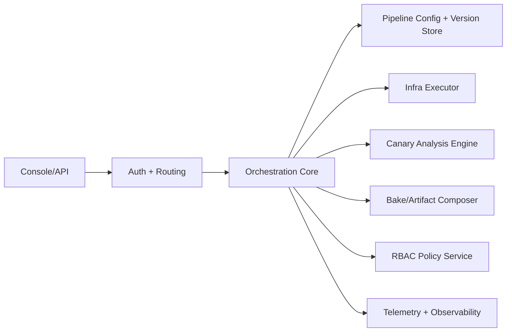

This diagram demonstrates macro separation: UI is isolated from orchestrator, orchestrator from cloud executor, executor from artifact source. HLD clarity reduces cognitive load — a hallmark of well-designed architecture.

---

### How Netflix Pipelines Align with Low-Level Design (LLD)

LLD concerns class structures, interfaces, method contracts. Netflix pipelines achieve this using:

- **Strategy Pattern for deployment approaches (Blue/Green, Canary, Rolling)**

- **Factory + Builder patterns in pipe instantiation**

- **Interfaces for cloud providers = decoupling from vendor**

- **Template method pattern in stage execution**

- **Retry/Timeout encapsulated as behaviors, not control flow if-else chains**


The LLD is _plug-and-play_. A new stage (security scan, DB migration) can be plugged into pipelines like a new module in Maven/Gradle without rewrite.

---

**Diagram 7.2 — LLD Internal Class Structure (Conceptual)**

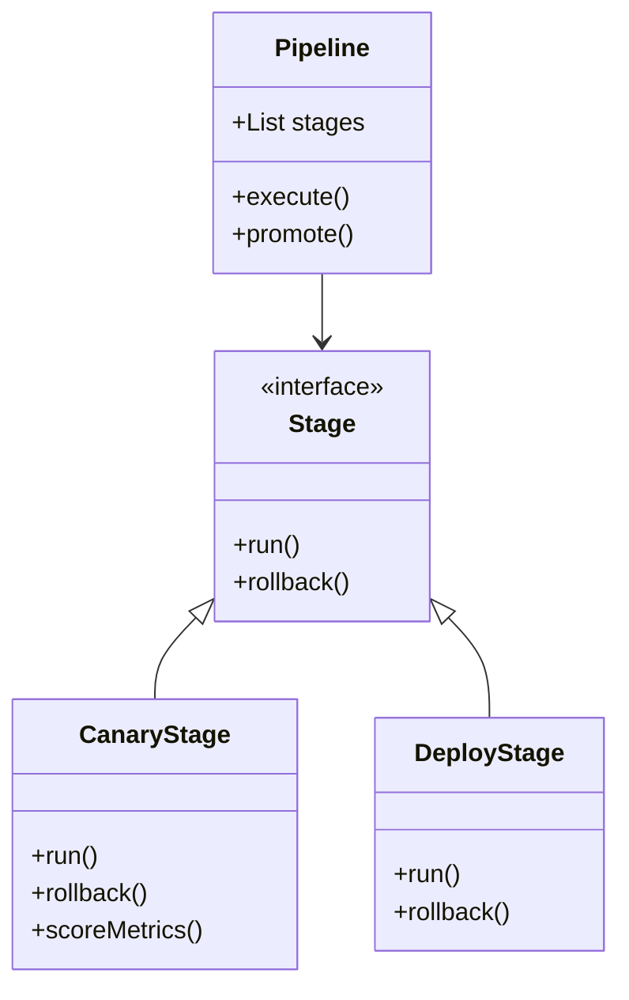

Pipeline is a **root composite**, stages are leaf components. This maps 1:1 with multi-module builds — root orchestrates modules (stages).

---

### How Netflix Pipelines Align with OOP Principles

|OOP Principle|Implementation in Netflix Pipelines|
|---|---|
|Encapsulation|Each microservice hides internal logic; exposed via API|
|Abstraction|Stage types abstract deployment complexity|
|Inheritance|Stage templates subclass Stage interface|
|Polymorphism|CanaryStage.run() vs DeployStage.run() — same interface, diff behavior|
|Composition|Pipelines = composition of stages (not inheritance-based)|

Netflix avoids inheritance-heavy systems. Instead, composition is preferred — crucial in large systems.

---

**Diagram 7.3 — OOP Polymorphism in Deployment Stages**

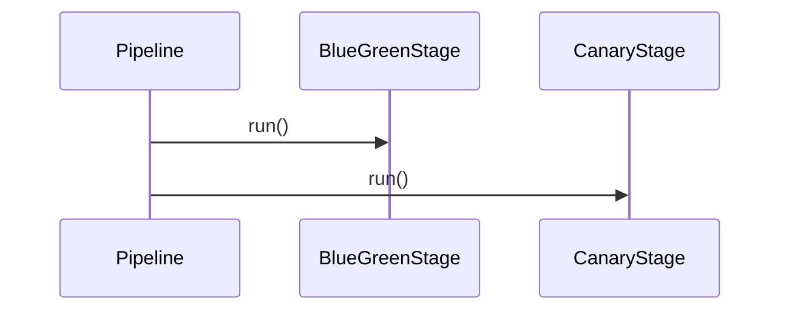

Pipeline doesn’t care what stage type it executes — polymorphism ensures extensibility without rewrite.

---

## 8. Scalability, Maintainability, Operability for Massive Global Load

Netflix serves 260+ million users. Deployment pipelines run thousands of updates monthly across regions. This scale demands three characteristics:

1. **Scalable architecture**

2. **Maintainable code and pipelines**

3. **Operational self-healing and observability**


---

### 8.1 Scalability

Horizontal scaling is foundational:

- Orca, Clouddriver, Kayenta, Rosco scale independently

- Redis enables resumable execution state → enables parallelism

- Pipelines run concurrently per service

- Canary analysis distributed across metrics nodes


Regional rollout parallelism = _cluster-level multi-threading_.

---

**Diagram 8.1 — Horizontal Scaling Topology**

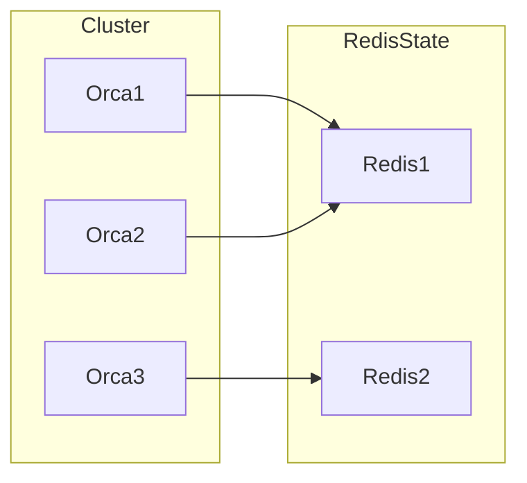

Execution state is externalized, so orchestrator nodes are stateless and disposable — perfect for massive concurrency.

---

### 8.2 Maintainability

Maintainability comes from composability & isolation:

|Mechanism|Scaling Benefit|
|---|---|
|Stage templates|Update once → apply everywhere|
|Config-as-code|Pipelines version-controlled, reproducible|
|API-driven architecture|Replace Clouddriver without touching Orca|
|Canary automation|Reduces manual triage load|

Netflix invests in _template libraries_ — like shared Gradle modules.

---

**Diagram 8.2 — Template Propagation Model**

```mermaid
flowchart LR
    TemplateUpdate --> AllPipelines
    AllPipelines --> Deployments
```

One template improvement = thousands of pipelines upgraded.

Single source of truth → maintainability solved.

---

### 8.3 Operability

Operability = how safely, observably, controllably a system behaves in real world.

Netflix ensures this by:

- Telemetry (Atlas, Prometheus, logs)

- Real-time alerts & anomaly prediction

- Canary rollback as default safe path

- Deployment freeze controls under outages

- Chaos testing for resilience validation


The pipeline is treated as critical infrastructure — it is chaos-tested like microservices.

---

**Diagram 8.3 — Operational Control Loop**

```mermaid
flowchart TD
    Metrics --> Alerting
    Alerting --> CanaryRollback
    CanaryRollback --> Stabilize
    Stabilize --> ReDeploy
    ReDeploy --> Metrics
```

Closed loop = deploy → observe → react → stabilize → redeploy.
Not reactive — **auto-self-correcting**.

---

### 8.4 Fault Isolation

No global crash possible because:

- Region rollouts independent

- Microservices independent

- Redis replay safety

- Canary prevents bad global deploys


This is **fault-containment engineering**.

---

**Diagram 8.4 — Blast Radius Containment**

```mermaid
flowchart LR
    CanaryCluster -->|Fail| Stop
    Regional1 --> Regional2 --> Regional3
```

Failure isolated before full rollout — like test-failure halting composite build.

---


# Final Summary

Netflix Deployment Pipelines are a **Composite Build System for Production Deployment**.

They embody:

- **SD** → Scalable, distributed, low-blast-radius

- **HLD** → Clear role-partitioned architecture

- **LLD** → Stage abstraction, strategy polymorphism

- **OOP** → Composition over inheritance, template extensibility

- **Maintainability** → Update one template → global improvement

- **Scalability** → Region-level parallel orchestration

- **Operability** → Canary rollback, observability, automated defense systems


This is architecture at world-class maturity — built like composite build graphs, executed like distributed state machines, scaled like planetary microservices.

---

