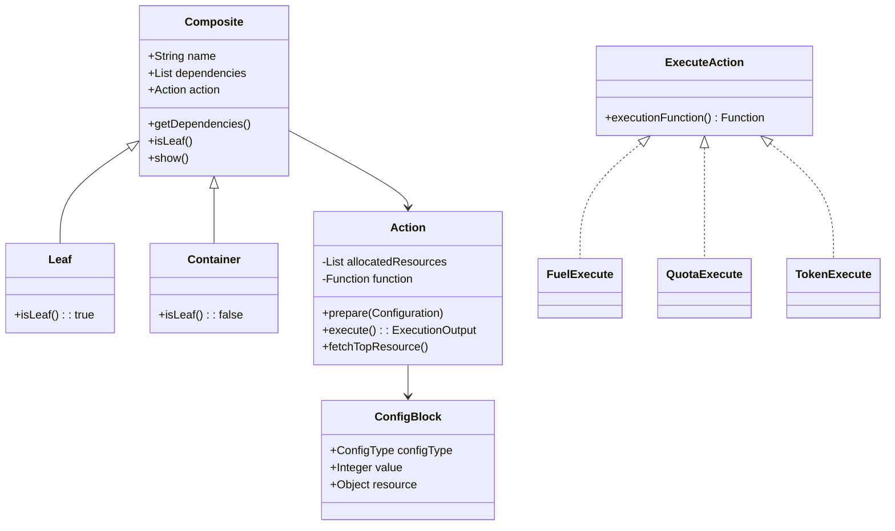
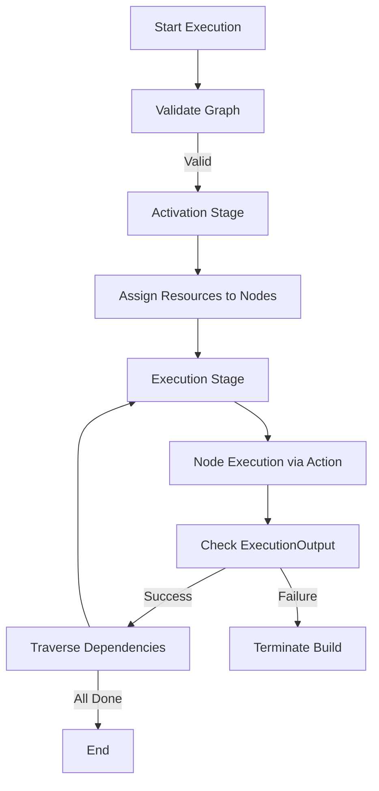
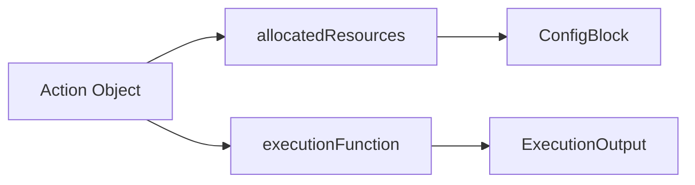
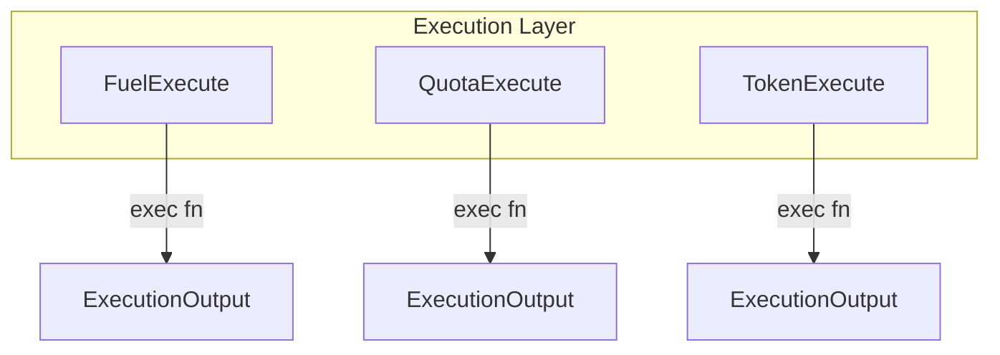
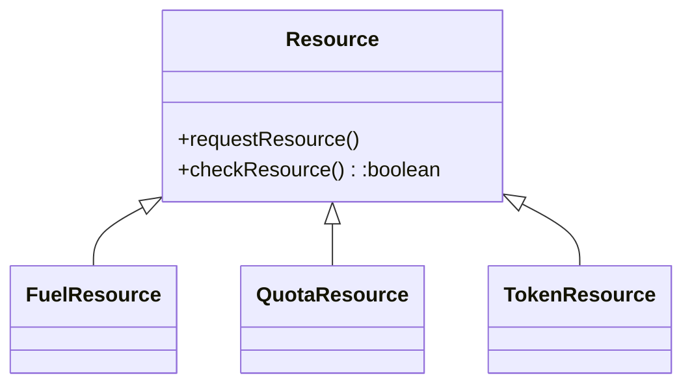
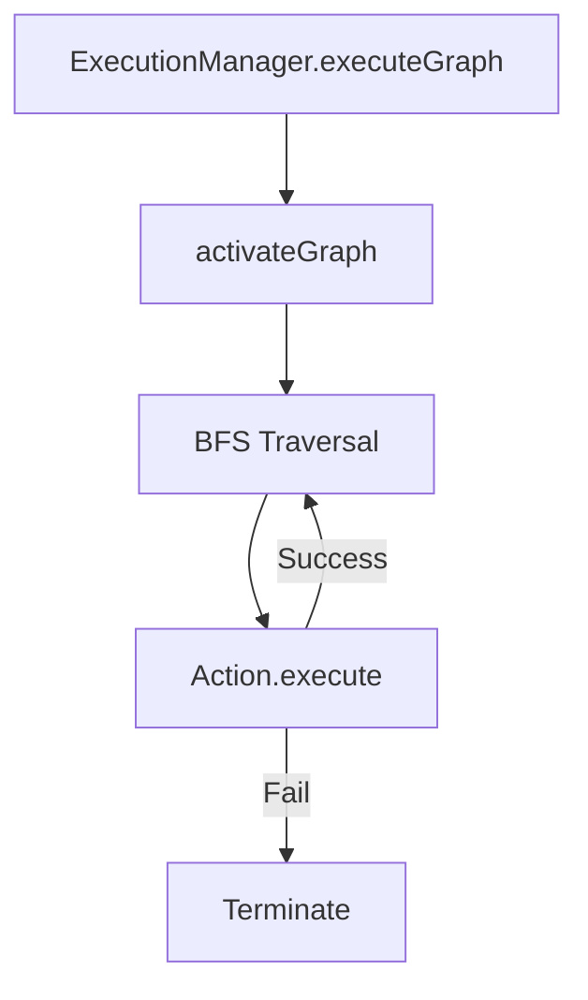
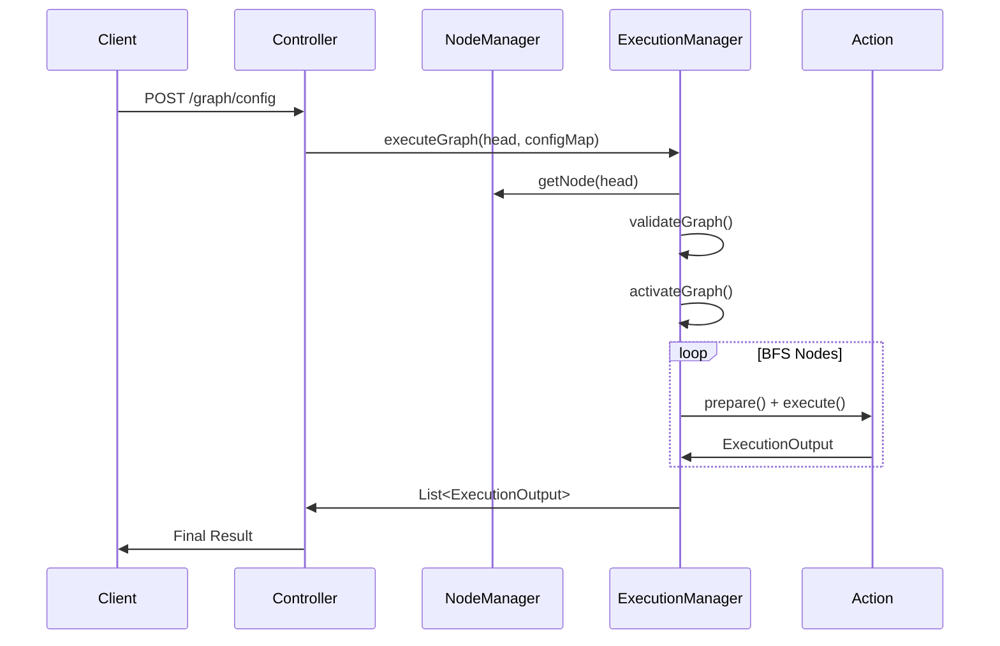

# **Composite Build System**

This document provides an enterprise-level, production-oriented architectural overview of a Composite Build System implemented using a graph-based execution model under the Composite design pattern. It outlines the internal execution orchestration strategy, resource–execution semantics, node activation, dependency traversal pipelines, and pluggable action units. It is structured for engineering teams, senior architects, and technical stakeholders requiring a high-fidelity understanding of the system’s runtime mechanics, extensibility model, and operational guarantees.

---

# **1. Executive Overview**

This Composite Build System models build operations as a hierarchical graph of composable units—each representing a build task, a resource-driven execution action, or a higher-level orchestrated operation. The system treats each node as a deterministic execution element, where resources are allocated, validated, and consumed before any action is triggered. Every node may represent a leaf execution unit or a composite container aggregating sub-nodes. This enables the system to execute predictable, reproducible, and structured workflows similar to modern build engines such as Gradle, Bazel, Buck, or Pants.

The core differentiators of this system lie in:

- **Resource + Execution semantics baked into node execution**
    Each node acquires and validates resource bundles (Fuel, Quota, Token), enabling capacity-aware execution.

- **Activation stage preceding execution**
    Nodes pre-load resources through an activation phase similar to Gradle’s configuration phase.

- **Graph-driven execution**
    Nodes are linked through composite dependencies forming a hierarchical DAG-like structure for deterministic traversal.

- **Execution units mapped from a registry**
    Execution functions are injected dynamically via a Spring Boot registry, enabling seamless extensibility.


This model provides reliable build-like orchestration, fault isolation, and deterministic ordering—ideal for scenarios involving staged resource consumption, controlled workflow pipelines, hierarchical task orchestration, or multi-step build procedures.

---

# **2. Folder Structure**

Each class has a one-line purpose descriptor.

```
graph.composite/
│
├── api/                           # REST API layer for graph and execution operations
│   └── Controller.java            # External interface: node creation, validation, execution endpoints
│
├── api/data/
│   └── Request.java               # Request object for passing configurations via API
│
├── composite/config/
│   ├── ComponentRegistry.java     # Maps ConfigType → Execution function (factory)
│   └── ResourceRegistry.java      # Maps ConfigType → Resource provider instance
│
├── composite/core/
│   ├── Action.java                # Core execution wrapper holding resources & function binding
│   ├── components/                # Pluggable execution units
│   │   ├── FuelExecute.java       # Execution logic for Fuel-type tasks
│   │   ├── QuotaExecute.java      # Execution logic for Quota-type tasks
│   │   └── TokenExecute.java      # Execution logic for Token-type tasks
│   ├── node/
│   │   ├── Container.java         # Composite build node with children
│   │   └── Leaf.java              # Leaf build node without dependencies
│   ├── resource/
│   │   ├── FuelResource.java      # Resource provider for Fuel
│   │   ├── QuotaResource.java     # Resource provider for Quota
│   │   └── TokenResource.java     # Resource provider for Token
│
├── composite/dto/
│   ├── ExecutionOutput.java       # Result of a single node execution
│   └── ManagerOutput.java         # Result of validation or orchestration
│
├── composite/enums/
│   ├── ConfigType.java            # Defines the resource/execution type
│   ├── ExecutionStatus.java       # Status of execution
│   └── OutputStatus.java          # Status of graph validation or errors
│
├── composite/generator/
│   └── CompositeFactory.java      # Creates nodes with auto-wired Action instances
│
├── composite/middleware/
│   └── NodeRegistry.java          # Stores and retrieves nodes globally
│
├── composite/model/
│   ├── Composite.java             # Base class representing a build system node
│   ├── ExecuteAction.java         # Interface: defines execution function provider
│   └── Resource.java              # Interface: defines resource availability contract
│
├── composite/service/
│   ├── ExecutionManager.java      # Validates and executes the graph
│   └── NodeManager.java           # Graph creation, node attachment, BFS traversal
│
├── composite/utils/
│   ├── ConfigBlock.java           # Represents allocated resource + metadata
│   └── Configuration.java         # Stores configuration values per node
│
├── CompositeApplication.java       # Spring Boot entrypoint
└── testing/
    └── GraphTest.java             # JUnit tests for graph and execution
```

---

# **3. Enterprise Architecture Diagrams**

## **3.1 Class Diagram**



---

## **3.2 Execution Flow (High Level)**



---

# **4. Architectural Principles**

---

## **4.1 Composite Pattern for Build Graph Modeling**

The entire system is structured around the Composite pattern:

- **Leaf nodes** represent atomic executable tasks.

- **Container nodes** encapsulate sub-tasks forming composite build artifacts.

- **Composite nodes** form the Directed Acyclic Graph (DAG) necessary for deterministic execution.


This enables:

- Hierarchical modeling of tasks

- Recursive dependency traversal

- Uniform API (each node knows how to execute itself)


This mirrors real-world build orchestrators:

- Gradle tasks

- Maven build modules

- Bazel rules

- Buck targets


---

## **4.2 Resource + Execution Semantics Baked into Node Execution**

Each execution node has a strictly defined sequence:

### **Step 1 – Resource Acquisition**

For every configuration provided:

- FUEL → acquire fuel units

- QUOTA → acquire quota units

- TOKEN → acquire token string


Each provider checks availability and may replenish itself.

### **Step 2 – Execution Function Selection**

`ComponentRegistry` maps configuration type to execution logic:

```java
factoryMap.put(ConfigType.FUEL, fe.executionFunction());
factoryMap.put(ConfigType.QUOTA, qe.executionFunction());
factoryMap.put(ConfigType.TOKEN, te.executionFunction());
```

### **Step 3 – Execution with the Assigned Resource**

Execution logic validates input and resource constraints, then performs a deterministic operation.

This is comparable to _capacity-aware schedulers_ (e.g., Kubernetes), _task queues_ (Celery, Temporal.io), or _resource-bound execution environments_.

---

## **4.3 Activation Stage Before Execution**

The system mirrors real-world build platforms where:

- Bazel performs graph analysis

- Gradle performs configuration phase

- Jenkins pipelines resolve dependencies before execution


Here:

```
activateGraph() → prepares nodes for execution by loading resource configuration.
```

This ensures:

- All resource allocations happen up front

- Any misconfiguration fails before execution

- Execution stage becomes deterministic


Activation separates _what the build will do_ from _how it will be executed_.

---

## **4.4 Dependency Traversal and Execution**

The traversal uses a BFS-like strategy:

1. Start from head node

2. Execute all its actions

3. Traverse dependency list

4. Execute each child node

5. Propagate success or terminate on failure


This ensures predictable ordering across composite tasks.

In enterprise build tools:

- Gradle uses DAG traversal

- Bazel uses topological sorting

- Jenkins multibranch pipelines use graph-driven stage execution


Your BFS approach works for Phase-I and reflects predictable, easy-to-debug semantics.

---

# **5. In-Depth Component Documentation**

---

## **5.1 Composite Nodes**

### **Leaf Node**

Represents atomic build operations.

```java
public class Leaf extends Composite {
    @Override public boolean isLeaf() {return true;}
}
```

Used for simple nodes that do not aggregate other tasks.

### **Container Node**

A composite unit containing dependencies.

```java
public class Container extends Composite {
    @Override public boolean isLeaf() {return false;}
}
```

Represents multi-step or multi-module build structures.

---

## **5.2 Action Engine**

The **Action** class is the runtime execution manager for each node.

Capabilities:

- Resource allocation through `prepare()`

- Fetch next resource using `fetchTopResource()`

- Execute resource via registry-mapped function


Mermaid diagram:



---

## **5.3 Execution Components**

These classes implement execution logic:

- `FuelExecute`

- `QuotaExecute`

- `TokenExecute`


They transform resource input into structured `ExecutionOutput`.



---

## **5.4 Resource Providers**

Resources behave as “runtime capacity providers”:

- `FuelResource` – integer counter

- `QuotaResource` – integer quota

- `TokenResource` – pool of tokens


Each resource supports:

- `requestResource()` – replenishment

- `checkResource()` – capacity check


Mermaid:



---

## **5.5 Execution Manager**

Central orchestrator responsible for:

- Graph validation

- Activation phase

- Execution phase

- Propagating failure termination


Key flow:



---

# **6. Control Flow Diagrams**

---

## **6.1 End-to-End Pipeline**



---

## **6.2 Unique Technique: Resource + Execution Integration**

```mermaid
flowchart LR
    A[Node Configuration] --> B[ResourceRegistry]
    B --> C[Assigned Resource]
    C --> D[Action.fetchTopResource()]
    D --> E[Execution Function]
    E --> F[ExecutionOutput]
```

This shows that resource constraints are not external—they are a first-class part of execution logic.

---

## **6.3 Unique Technique: Activation Stage**

```mermaid
flowchart TD
    A[activateGraph()] --> B[Traverse All Nodes]
    B --> C[Load Configuration]
    C --> D[Assign Resources]
    D --> E[Prepared Nodes Ready for Execution]
```

---

# **7. Enterprise-Level Use Cases**

This architecture fits into:

- Multi-step build pipelines

- Orchestrated execution engines

- CI/CD orchestrators requiring deterministic execution

- Rule-based build tasks

- Resource-constrained workflows

- Modular execution engines inside distributed systems


---

# **8. Summary**

This Composite Build System represents an enterprise-ready foundational architecture for hierarchical execution orchestration. The system blends the Composite pattern with dependency-driven traversal, resource-capacity modeling, and dynamically injected execution semantics. It reflects several principles found in modern high-end build tools like Gradle, Bazel, or Pants.

Key takeaways:

- Execution is deterministic and well-encapsulated.

- Resource consumption is tightly woven into node execution.

- Graph validation ensures safety and predictability.

- Activation + execution sequencing mirrors real-world production build engines.

- Registry-based execution enables extensibility without refactoring.


This system is a robust foundation for evolving into a distributed, cache-aware, parallelized build orchestrator.
