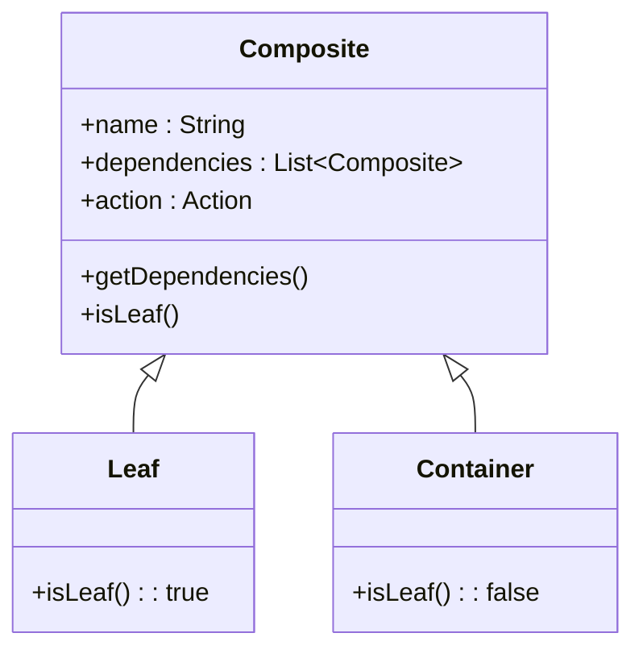
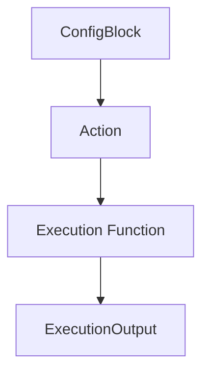
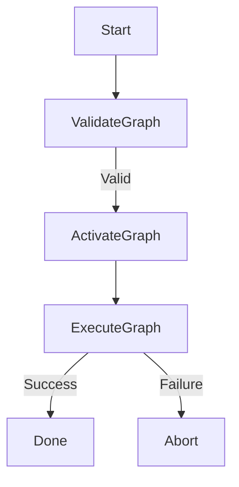
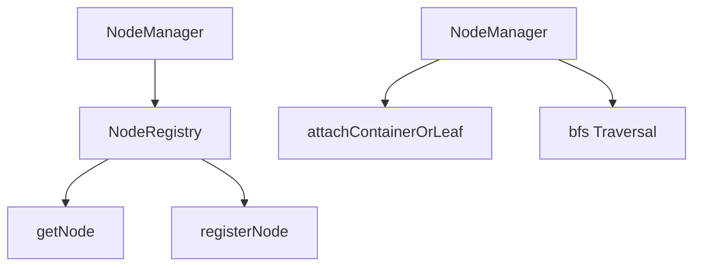
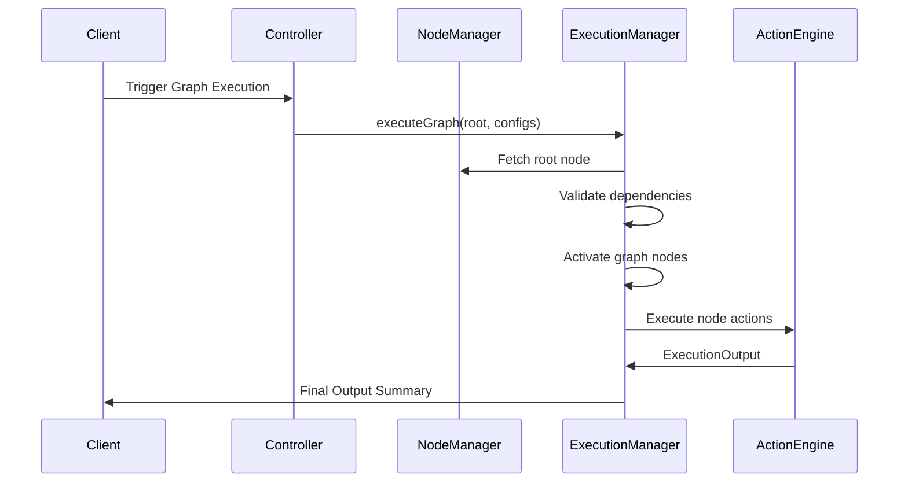

# **Composite Build System**

*A modular, graph-driven execution engine built using the Composite design pattern*

---

## **Overview**

The Composite Build System is a structured orchestration engine that models complex execution tasks as hierarchical composites. Instead of executing tasks in an ad-hoc, linear sequence, this system expresses all operations—builds, validations, resource consumption steps, or workflow logic—as a graph of composable units. Each node in the graph is either:

* A **Leaf** (single atomic executable step), or
* A **Container** (a composite that aggregates multiple children nodes).

This model enables deterministic execution, dependency-driven orchestration, resource-aware operations, and predictable failure propagation—core expectations of a modern build or workflow engine.

The component is engineered with three architectural pillars:

1. **Composite Pattern Application**
   Tasks are modeled as hierarchical nodes with uniform APIs.
2. **Resource-Execution Coupling**
   Each node receives resource bundles before running its execution function.
3. **Graph-based Dependency Traversal**
   Builds execute in structured, BFS/DAG traversal order, validating cycles and dependencies.

The engine resembles lightweight versions of build systems such as Maven, Gradle, Buck, and Bazel, while remaining domain-neutral enough to orchestrate any execution pipeline. Below is the table for quick architectural breakdown.

| S. No. | Topic | Link |
|--------|------------------------------------------------------------|----------------------|
|   1.   | Case Study - GitHub Actions                                | [Documentation](https://github.com/VishuKalier2003/System-Design-Components/blob/main/Composite/S02-CompositeBuildGraph/case-studies/GitHub-Actions.md) |
|   2.   | Case Study - Apache Maven and Gradle                       | [Documentation](https://github.com/VishuKalier2003/System-Design-Components/blob/main/Composite/S02-CompositeBuildGraph/case-studies/Maven-Gradle.md) |
|   3.   | Case Study - Netflix Deployment Pipelines                  | [Documentation](https://github.com/VishuKalier2003/System-Design-Components/blob/main/Composite/S02-CompositeBuildGraph/case-studies/Netflix-Pipeline.md) |
|   p1.  | First phase implementation of Composite Build System       | [Implementation](https://github.com/VishuKalier2003/System-Design-Components/tree/main/Composite/S02-CompositeBuildGraph/phaseA) |
|   p2.  | Second phase implementation of Composite Build System      | [Implementation](https://github.com/VishuKalier2003/System-Design-Components/tree/main/Composite/S02-CompositeBuildGraph/phaseB) |

---

## **System Architecture**

### **1. Node Model (Composite Pattern)**

Each execution element is represented as a `Composite`:

* `Leaf` → atomic execution.
* `Container` → holds dependent child nodes.

This hierarchical representation enables the system to treat simple and complex tasks uniformly.

---

### **2. Resource Management + Execution Semantics**

Every node receives resources before executing its action. Resource types (Fuel, Quota, Token) implement the `Resource` interface:

* `checkResource()`—ensure minimum thresholds
* `requestResource()`—auto-replenish if below threshold

When a configuration is applied to a node, it resolves into a list of `ConfigBlock` objects—each associating:

* The resource type,
* The desired quantity/request,
* The actual allocated resource object.

Execution functions are mapped dynamically from a registry:

This creates a clean separation:

* **Resource acquisition** (activation phase)
* **Execution logic** (runtime phase)

---

### **3. Activation Flow**

Before a graph executes, each node undergoes a **pre-execution activation phase**:

This ensures:

* All resource constraints validated early
* No mid-execution replenishment surprises
* Action functions receive deterministic inputs

This model follows the same pattern as CI/CD engines (GitHub Actions, GitLab CI, Jenkins), which load configurations before running tasks.

---

### **4. Dependency Validation and Execution**

Execution is coordinated by the `ExecutionManager`, which performs:

1. **Graph validation**

   * Ensures referenced nodes exist
   * Detects cycles
2. **Activation stage**

   * Prepares all nodes reachable from the root
3. **Execution stage**

   * BFS traversal
   * Executes node actions in sequence
   * Terminates early on failure

The traversal model ensures deterministic execution order and predictable failure propagation.

---

## **Component Breakdown**

### **1. Action Engine**

`Action` acts as the execution controller:

* Stores allocated resources
* Binds correct execution function
* Iteratively executes until no resources remain

Key methods:

| Method               | Responsibility                        |
| -------------------- | ------------------------------------- |
| `prepare(config)`    | Converts config → allocated resources |
| `setExecution(fn)`   | Binds execution function              |
| `execute()`          | Calls execution logic on top resource |
| `fetchTopResource()` | Pops next resource in order           |

The Action engine is the glue between the node abstraction and execution semantics.

---

### **2. Execution Function Providers**

Each resource type has a dedicated executor:

* `FuelExecute`
* `QuotaExecute`
* `TokenExecute`

Executors implement `ExecuteAction` and return a `Function<ConfigBlock, ExecutionOutput>`.

This registry-driven, strategy-based execution design enables:

* Adding new resource types without modifying existing logic
* Creating domain-specific execution behaviors
* Reusing executor components across nodes

---

### **3. Node Manager + Registry**

Responsible for:

* Maintaining global registry of nodes
* Attaching dependencies
* Validating graph structure
* Performing BFS traversal

The registry isolates all node lifecycle operations.

---

### **4. Execution Manager**

This is the orchestration layer:

* **Validates graph** using cycle detection
* **Activates** nodes by propagating configuration resources
* **Executes** nodes in BFS cascade
* **Collects ExecutionOutput** results

If any node fails, execution halts immediately, similar to standard build engines’ fail-fast behavior.

---

## **End-to-End System Flow**

This architecture supports clear control flow and predictable behavior.

---

## **Key Architectural Strengths**

### **1. Composable + Extensible**

New resource types, executors, and node composites can be added without modifying core logic.

### **2. Deterministic Execution Order**

Graph-based traversal ensures consistent behavior across repeated runs.

### **3. Enterprise-Ready Separation of Concerns**

Each subsystem—registry, execution, action engine, resources—is independently testable and replaceable.

### **4. Fail-Fast and Safe**

Execution halts early on failure, preventing cascading issues.

### **5. Clean Abstraction Boundaries**

Configuration → Activation → Execution → Output
Each stage is isolated and predictable.

---

## **Conclusion**

The Composite Build System component provides a robust, extensible, and enterprise-aligned execution engine designed with modern architectural principles. By combining the Composite design pattern, resource-aware action execution, clean activation and traversal phases, and dynamic function registries, this component delivers a scalable build-orchestration foundation suitable for workflow engines, CI/CD systems, or modular application execution pipelines.

This architecture can be extended in future phases to include:

* Parallel execution
* Caching and incremental builds
* Remote execution
* Analytics and reporting
* Distributed runner architecture

The foundation aligns strongly with real-world orchestration platforms and can evolve into a highly capable build or automation system.

