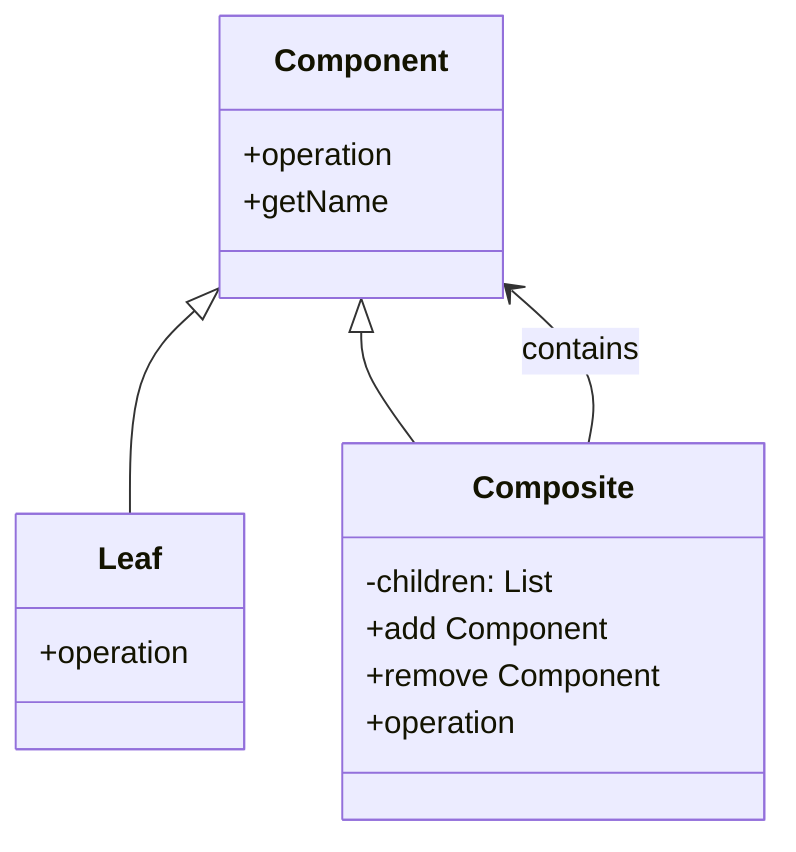
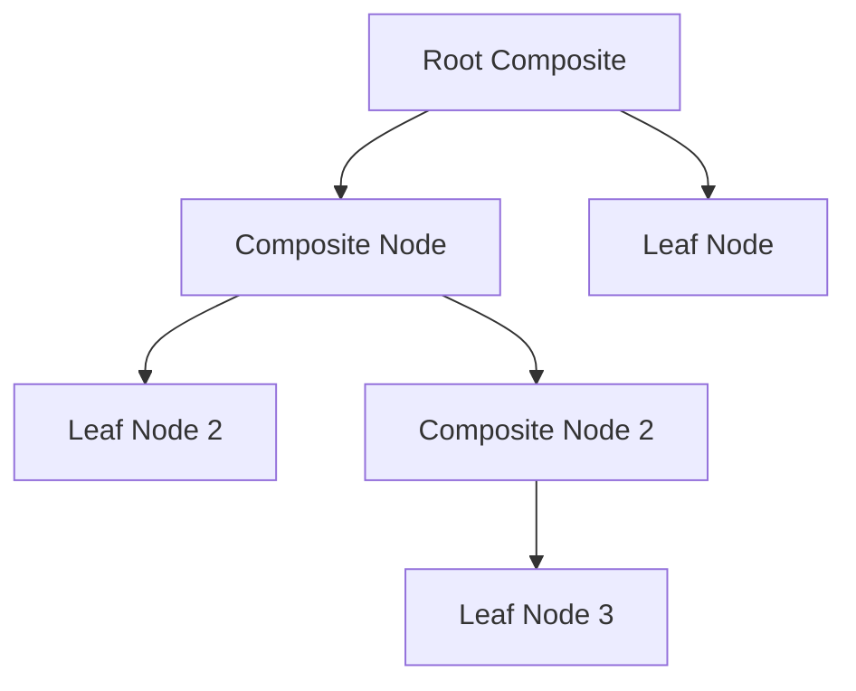
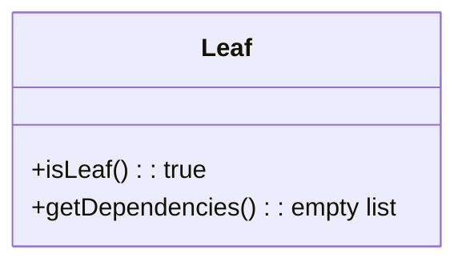
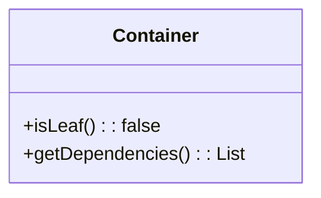
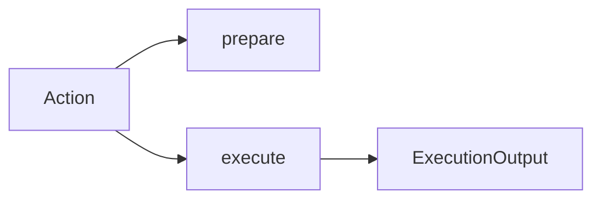
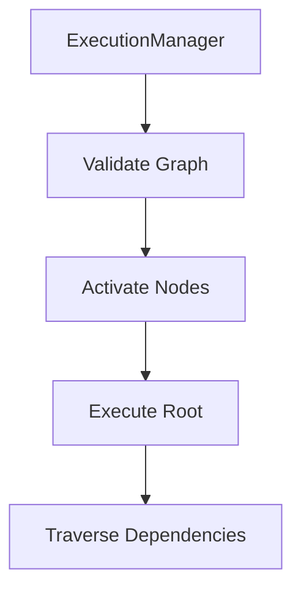
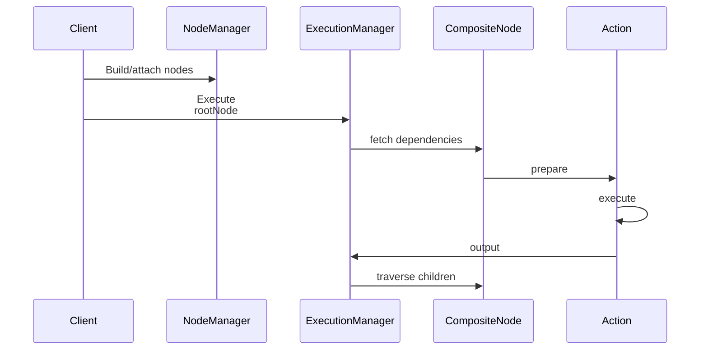

# **Composite Design Pattern – README Documentation**

This README provides a production-grade, enterprise-ready explanation of the **Composite Design Pattern**, complete with a component index table, conceptual breakdowns, architecture explanations, and mermaid diagrams. It is suitable for engineering teams, architectural reviews, and repository visitors who require clarity, structural depth, and industry-aligned context.

---

## **Component Index**

| Component Name              | Folder Link                                     |
| --------------------------- | ----------------------------------------------- |
| Composite Base Abstraction  | `/src/main/java/.../model/Composite`            |


---

# **Composite Design Pattern – Detailed Technical Overview**

The **Composite Design Pattern** is a structural design pattern used to represent hierarchical, tree-like structures where individual objects (leaves) and container objects (composites) are treated uniformly through a shared abstraction. It is widely used in build systems, GUI frameworks, game engines, workflow orchestrators, and complex hierarchical execution systems.

At its core, the Composite pattern enables you to:

* Represent part–whole hierarchies
* Treat individual and grouped objects identically
* Encapsulate recursive behavior
* Enable deterministic execution through hierarchical traversal
* Provide a uniform API for manipulating structures

In modern enterprise systems, Composite becomes extremely valuable when designing **execution engines**, **build pipelines**, **filesystem abstractions**, **configuration management pipelines**, and **node-based orchestration frameworks**.

---

# **1. Conceptual Model**

The Composite pattern consists of three primary parts:

* **Component (Base Class / Interface)**
  Defines the uniform API for both leaf and composite objects.

* **Leaf**
  Represents an indivisible node in the structure. Cannot have children.

* **Composite (Container)**
  Holds children, delegates actions to them, and exposes composite behavior.

Below is a conceptual Composite diagram:



The `Component` class acts as the root abstraction. Both `Leaf` and `Composite` extend or implement this abstraction, ensuring they can be used interchangeably.

---

# **2. Why Use the Composite Pattern?**

Modern systems increasingly rely on **hierarchical workflows, build graphs, and resource-bound execution trees**. The Composite pattern enables such systems to become:

### **Scalable**

By recursively modeling tasks or resources, the system can grow without redesign.

### **Maintainable**

All nodes share common capabilities and interfaces, minimizing conditional logic.

### **Extensible**

New node types can be added without breaking the contract.

### **Uniform**

Clients treat all nodes the same—whether single or composite—simplifying orchestration logic.

### **Deterministic**

Hierarchical traversal makes execution predictable and testable.

---

# **3. Practical Architecture Example**

Below is a typical Composite architecture used in hierarchical execution systems:



Each node executes its own action, and composites propagate execution to their children. This resembles the structure of:

* Build graphs
* GitHub Actions workflows
* Kubernetes reconciliation trees
* Complex ETL pipelines

---

# **4. Internal Component Roles (Mapped to a Real Implementation)**

Below are the core components typically found in a Composite-pattern-powered execution system, mapped to real class implementations.

---

## **4.1 Composite Base: `Composite` Class**

The base abstraction includes:

* Node name
* Recursive dependency list
* Execution action container

It defines methods such as:

```java
public abstract class Composite {
    protected String name;
    protected List<Composite> dependencies;
    protected Action action;

    public abstract List<Composite> getDependencies();
    public abstract boolean isLeaf();
}
```

This forms the foundation of the hierarchical execution tree.

---

## **4.2 Leaf Node**

A **leaf** does not contain child nodes:



Used for:

* Atomic operations
* Unit-level execution steps
* Resource-bound tasks

---

## **4.3 Composite Node (Container)**

A **container** stores child nodes and delegates execution:



Used when tasks must be grouped logically.

---

## **4.4 Action Engine**

The **Action** class binds execution logic with resources, implementing:

* Resource allocation
* Execution function binding
* Sequential execution

It acts as the runtime engine for each node.



---

## **4.5 Execution Components**

These represent concrete task behavior:

* FuelExecute
* TokenExecute
* QuotaExecute

They implement a common interface:

```java
public interface ExecuteAction {
    Function<ConfigBlock, ExecutionOutput> executionFunction();
}
```

This aligns with the **Command pattern inside Composite**.

---

## **4.6 Resource Providers**

Resources enforce operational constraints:

* FuelResource
* QuotaResource
* TokenResource

They implement:

```java
public interface Resource {
    requestResource();
    checkResource();
}
```

This provides **resource-aware execution semantics**.

---

## **4.7 Execution Manager**

The orchestrator performs:

* Graph validation
* Activation (resource assignment)
* Execution traversal (BFS/DFS)



This approximates behavior of full build engineers (Gradle/Bazel).

---

# **5. Execution Flow**

A typical Composite execution follows this directed flow:



This execution mirrors real-world orchestrators like:

* GitHub Actions
* Jenkins multibranch pipelines
* Gradle task execution
* Kubernetes controllers

---

# **6. Advantages of Composite Design Pattern in Enterprise Systems**

### **6.1 Modular Orchestration**

Large workflows can be built from smaller blocks.

### **6.2 Hierarchical Resource Governance**

Resource assignment and constraints propagate consistently.

### **6.3 Fault Isolation**

Failures can stop the propagation at the node level.

### **6.4 Extensibility Without Refactoring**

Adding new components does not break clients.

### **6.5 Clean Separation of Concerns**

Execution logic, resources, and structure stay decoupled.

---

# **7. When to Use Composite Pattern**

Use it when:

* You have a tree-like execution hierarchy
* Tasks can be atomic or composed
* Uniform API is desired
* You require deterministic traversal
* Resource-awareness is important
* Reusability and modularity are key goals

---

# **8. Conclusion**

The Composite Design Pattern provides a scalable, maintainable, and extensible framework for modeling hierarchical operations. Whether you are building workflow engines, execution orchestrators, UI trees, or complex build systems, Composite ensures that atomic and grouped operations behave uniformly under a shared abstraction.

Its natural synergy with real-world enterprise systems—CI/CD engines, deployment systems, distributed orchestrators—makes it one of the most impactful structural patterns in modern architecture.

For large-scale execution systems, combining Composite with resource-aware execution, activation stages, and pluggable behaviors results in a powerful, production-ready platform capable of supporting high throughput, reproducible automation, and deterministic execution pipelines.

---

