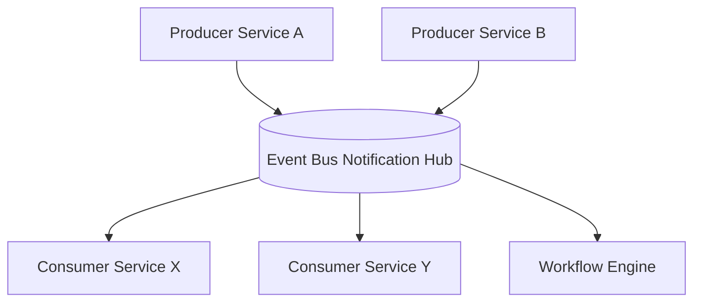
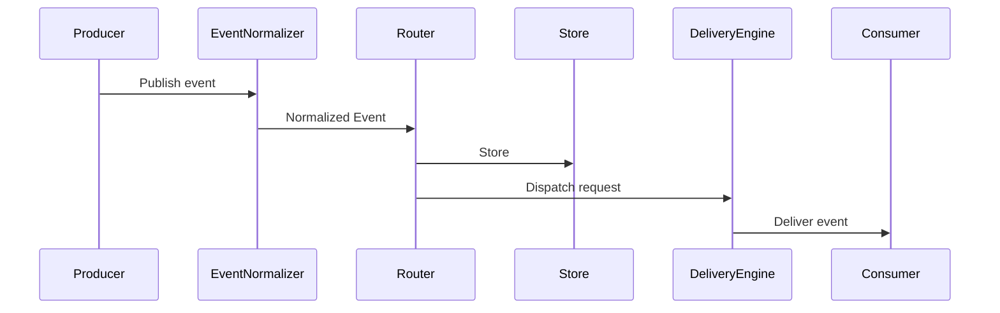
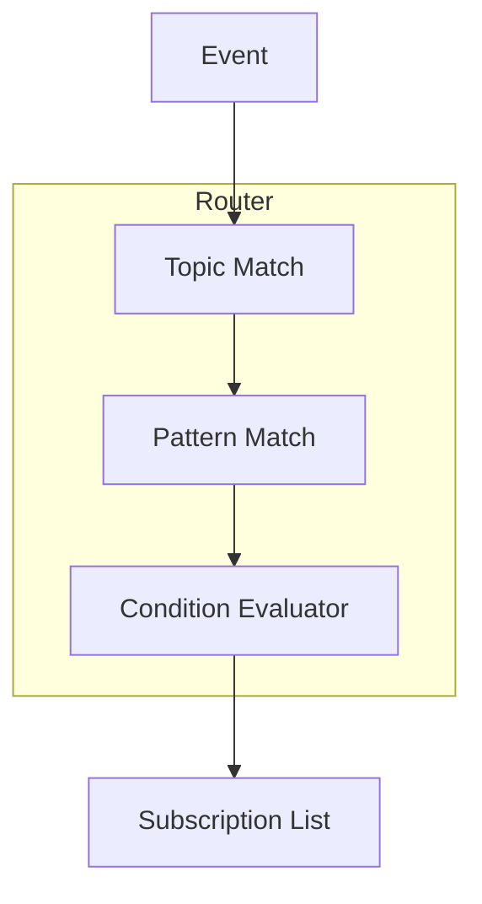
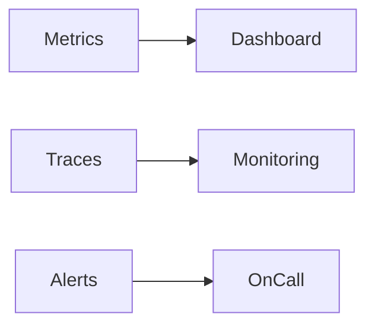

# **Event Bus Notification Hub — README (Enterprise Architecture Guide)**

The **Event Bus Notification Hub** is a centralized, high-availability middleware layer that enables event-driven communication across distributed services, microservices, background workers, and integration pipelines.
It acts as the **core routing backbone** for emitting, propagating, transforming, and delivering events across the system in a decoupled, scalable, and fault-tolerant way.

This README provides an architectural deep dive suitable for enterprise-grade systems, explaining core concepts, internal structure, operational workflow, and extensibility patterns.

---

# **1. Overview**

The Event Bus Notification Hub enables **asynchronous, decoupled, and broadcast-capable communication** between services.
Instead of point-to-point integrations, producers emit events to the bus and consumers subscribe to these events through topic-based, queue-based, or pattern-based routing.

### Core capabilities:

* **Decoupling:** Producers and consumers never directly communicate.
* **Scalable distribution:** Events can be fan-out broadcast, partitioned, or targeted.
* **Guaranteed delivery:** Configurable at-least-once or exactly-once semantics.
* **Integration hub:** Bridges microservices, external APIs, workflows, pipelines.
* **Observability:** Centralized logging, metrics, and tracing of event flows.
* **Replay & persistence:** Optional event retention for reprocessing.

The hub aligns with architecture patterns used by Kafka, AWS SNS/SQS, Azure Event Grid, GCP Pub/Sub, and enterprise integration backbones.

---

# **2. High-Level Architecture**

This illustrates how producers publish events into the notification hub.
Consumers subscribe to event types, streams, or partitions.
The hub ensures reliable propagation, backpressure handling, and delivery retries.
Producers and consumers do not need awareness of each other; all interaction happens through the event bus.

---

# **3. Core Components**

The major building blocks of the Event Bus Notification Hub:

1. **Event Producers**

   * Emit domain events (OrderCreated, PaymentProcessed, InventoryUpdated).
   * Communicate using a REST, gRPC, or in-memory connector.

2. **Event Router / Dispatcher**

   * Classifies events based on routing rules (topics, partitions, filters).
   * Enforces QoS and prioritization policies.

3. **Event Store (optional)**

   * Persistent storage for audit, replay, and temporal workflows.

4. **Subscription Registry**

   * Maps subscribers to topics or routing patterns.
   * Supports dynamic subscription changes without downtime.

5. **Delivery Engine**

   * Push or pull-based consumption.
   * Handles backpressure, batching, retry policies, and dead-letter queues.

6. **Monitoring Layer**

   * Real-time metrics: throughput, latency, dropped events.
   * Trace integration for root-cause analysis.

---

# **4. Internal Architecture and Data Flow**

This sequence demonstrates the end-to-end lifecycle:

* The producer publishes events.
* The hub normalizes the event into a uniform format (JSON/Avro/etc.).
* The routing layer evaluates routing rules & fan-out requirements.
* Events may be persisted in an event store for audit/replay.
* Delivery engine ensures delivery to subscribers with retry and QoS controls.

---

# **5. Event Topics, Routing & Subscriptions**

The hub supports multi-level routing mechanics:

### **Topic-Based Routing:**

* Events published to topics: `"order.created"`, `"payment.failed"`
* Consumers subscribe to specific topics.

### **Pattern-Based Routing:**

* `"order.*"` → consumed by fulfillment service
* `"*.failed"` → consumed by alerting system

### **Conditional Routing:**

Rules triggered by attributes:

* Event.priority > 5
* Event.source = "billing"

This diagram highlights how events are evaluated through topic matching, pattern evaluation, and conditional routing before producing a final subscriber list.

---

# **6. Delivery Mechanisms**

### **Push Delivery**

The hub pushes events to subscribers via HTTP/gRPC/webhooks.
Good for reactive services with low latency requirements.

### **Pull Delivery**

Consumers poll or stream events from queues.
Ideal for long-running jobs or backpressure-sensitive services.

### **Dead-Letter Queue (DLQ)**

Failed deliveries after max retries get redirected to DLQ.

### **Replay**

Stored events can be replayed for rebuilding materialized views or debugging.

---

# **7. Advantages in Enterprise Environments**

### **1. Decoupling**

Services can evolve independently without integration rewrites.

### **2. Scalability**

Horizontal scaling of consumers and sharded event streams.

### **3. Reliability**

* Guaranteed delivery modes
* Heartbeat tracking
* Consumer isolation

### **4. Governance**

* Structured event contracts
* Access controls
* Domain event registries

### **5. Observability**

Built-in metrics and distributed tracing.

This visualization shows how monitoring data feeds enterprise observability dashboards, alerting systems, and SRE pipelines.

---

# **8. Deployment Model**

Two typical deployments:

### **Centralized Managed Hub**

* Single hub for all microservices
* Managed by Infra/DevOps teams
* Provides consistent governance
* Ideal for large enterprises

### **Distributed Hub**

* Multiple domain-scoped hubs
* Tenant-level governance
* Higher isolation and boundary control
* Preferred in domain-driven architectures

---

# **9. Use Cases**

### **1. Microservice Choreography**

Instead of synchronous APIs, services emit domain events and react asynchronously.

### **2. Real-time Notifications**

Push alerts, system events, audit triggers, etc.

### **3. Data Pipelines**

Events flow into ETL pipelines, analytics, or ML workflows.

### **4. Integration with External Systems**

Event bus becomes the integration point for CRM, ERP, Messaging, etc.

### **5. Orchestration of Background Jobs**

Task queues for async processing.

---

# **10. Limitations / Things to Consider**

* Event storms can cause backpressure.
* Consumers must be idempotent for safe replays.
* Versioning of event contracts is essential.
* Requires governance for topic naming conventions.

---

# **11. Summary**

The Event Bus Notification Hub is a mission-critical backbone for distributed enterprise ecosystems. By separating producers and consumers, it enables scalable, secure, and maintainable event-driven architectures. Through routing layers, delivery engines, subscription registries, and optional event stores, the hub supports both simple notifications and complex multi-system workflows.

When integrated with monitoring, governance, and strong schema management, it becomes the foundation for microservices, real-time automation, and cross-domain orchestration—ensuring agility, resilience, and long-term operational stability.
