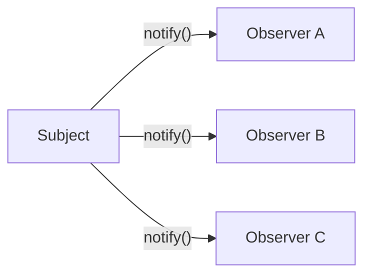
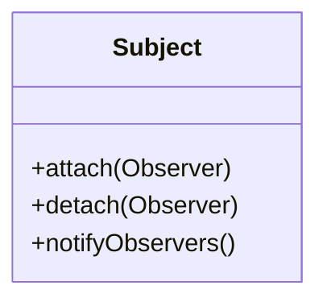
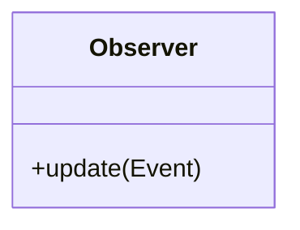
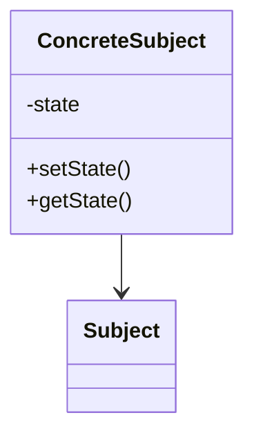
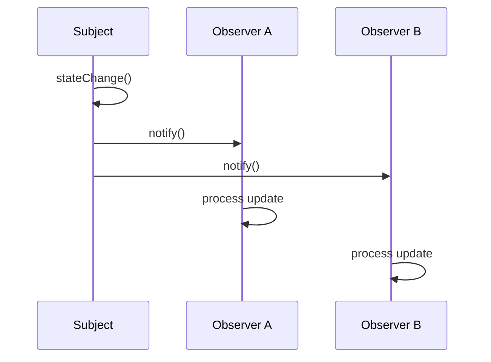

# **Observer Design Pattern — README Documentation**

This README provides a structured, enterprise-grade explanation of the **Observer Design Pattern**, including key abstractions, architecture diagrams, control flow, and implementation guidance. A component index table is included at the start to reference the folder structure of a typical Observer Pattern project.

---

## **Component Index**

| Component Name             | Folder Link                                 |
| -------------------------- | ------------------------------------------- |
| Event Sourced Notification Bus | [EventBus](https://github.com/VishuKalier2003/System-Design-Components/tree/main/Observer/S-01EventSourcedNotificationHub) |

---

# **Observer Design Pattern**

The **Observer Pattern** is a behavioral design pattern used to create a **one-to-many dependency** between objects so that when one object (the *Subject*) changes its state, all dependent objects (*Observers*) are automatically notified. This pattern supports **loose coupling**, **event-driven architecture**, and **reactive flows** in software systems.

It is widely used in GUI frameworks, messaging systems, streaming architectures, domain event handling, microservices pub/sub, and UI state synchronization. The subject doesn't need to know the concrete types of observers—only that they adhere to a common observer contract. This makes the system extensible and maintainable in large-scale enterprise environments.

---

# **High-Level Architecture**



This diagram shows a typical Subject broadcasting state changes to multiple observers. All observers decide how they want to process the notification, enabling flexible and extensible behavior.

---

# **Core Components**

## **1. Subject (Observable)**

The **Subject** defines mechanisms to:

* Register observers
* Remove observers
* Notify observers of state changes

The Subject manages the observer list and ensures consistent update notifications. It exposes the attach/detach interfaces but shields its internal state from direct outsider modification.

### Mermaid Class Diagram



---

## **2. Observer**

The **Observer** defines an update interface that subjects call when changes occur. Each observer implements custom handling logic based on the event or data provided.



Observers pull or receive the updated state from the Subject.

---

## **3. Concrete Subject**

A **Concrete Subject** maintains internal state and triggers notifications when the state changes. This class determines the conditions under which observers should be informed, ensuring deterministic and event-driven flows.



---

## **4. Concrete Observers**

Concrete Observers process updates depending on their role. Examples:

* Logging services
* UI components
* Alerting/email services
* Cache invalidation listeners

Each observer reacts differently to the same event, showcasing decoupled polymorphism.

---

# **Observer Pattern Workflow**



This sequence diagram illustrates the notification pipeline. All observers receive notifications but handle them independently.

---

# **Why Use the Observer Pattern?**

### **1. Loose Coupling**

Subjects know nothing about concrete observers, reducing the impact of adding or removing observers.

### **2. Extensibility**

New observers can be added without modifying the subject.

### **3. Push/Pull-Based Flexibility**

Subjects can notify observers with data (push) or allow observers to query state (pull).

### **4. Event-Driven Design**

Ideal for applications requiring state synchronization, notifications, or reactive updates.

---

# **Real-World Usage**

### **1. Event Listeners in GUI Frameworks**

Buttons notify listeners when clicked.

### **2. Microservices Pub/Sub**

Services subscribe to events and react without hard dependencies.

### **3. Messaging Systems**

Kafka, RabbitMQ, and SNS/SQS operate on similar subscription models.

### **4. Distributed Caches**

Cache nodes observe invalidation events.

### **5. Monitoring and Alerts**

Observing state thresholds to trigger alerts.

---

# **Example Folder Structure**

```
observer-pattern/
│
├── subject/
│   ├── Subject.java
│   └── ConcreteSubject.java
│
├── observer/
│   ├── Observer.java
│   └── concrete/
│       ├── LoggingObserver.java
│       ├── EmailObserver.java
│       └── MetricsObserver.java
│
├── event/
│   └── Event.java
│
└── app/
    └── DemoApp.java
```

This structure isolates contract definitions, implementations, and demonstration logic.

---

# **Observer Pattern Control Flow**

```mermaid
flowchart TD
    A[State Changes in Subject] --> B[Subject Calls notify()]
    B --> C1[Observer 1 update()]
    B --> C2[Observer 2 update()]
    B --> C3[Observer 3 update()]
    C1 --> D[Observer Processes Data]
    C2 --> D
    C3 --> D
```

The flow ensures predictable propagation of updates without direct coupling.

---

# **Advantages and Trade-offs**

### **Advantages**

* Decoupled architecture
* High extensibility
* Natural fit for real-time systems
* Modular, testable components

### **Trade-offs**

* Notification storms if too many observers
* Ordering is not guaranteed
* Memory leaks if observers aren’t removed
* Harder debugging due to distributed flow

---

# **Extended Variants of Observer Pattern**

### **1. Push vs Pull Model**

* *Push*: subject sends full data
* *Pull*: observer queries subject

### **2. Event Bus / Mediator Hybrid**

Sometimes combined with an event bus for global distribution.

### **3. Reactive Extensions (Rx)**

Modern reactive systems build upon Observer semantics.

---

# **Observer Pattern Best Practices**

1. Ensure **clear lifecycle** for observers (attach/detach).
2. Avoid heavy logic inside observers; consider async handling.
3. Use weak references in languages with GC to avoid leaks.
4. Apply batching or event throttling if notifications are frequent.
5. Document observer responsibilities to avoid unpredictable side effects.

---

# **Summary**

The Observer Pattern provides a clean, scalable, and decoupled mechanism for state-driven notifications between components. It embodies core principles of modular software design and is deeply embedded in real-world systems ranging from GUIs to distributed architectures. By structuring logic around subjects and observers, applications achieve event-driven behavior, extensibility, and maintainability with minimal coupling. This README outlines the conceptual, structural, and practical facets of the pattern supported with diagrams and structured documentation suitable for enterprise engineering environments.
