# **Streaming Recommendation Strategy Engine**

A Composite Build System, in context of this implementation, represents an **enterprise-grade orchestration mechanism** that layers _strategy-based ranking_, _chain-of-responsibility execution_, _handler-driven extensibility_ and _multi-rail output scoring_ into a modular engine capable of evolving without architectural rewrite. Unlike a traditional recommender that runs a fixed pipeline, this component supports **dynamic strategy switching**, **runtime handler mutation**, **custom overrides**, **two-layer decisioning** and **score-weighted competitive ranking**, thereby functioning as a scalable intelligence core for streaming platforms.

The Composite System acts as the **control mesh** between user behavior input (genres, watch days, watch index), domain decision engines (StrategyEngine, GenreGraph, Randomization, Comfort/Discovery/Experiment layers), execution routers (ChainEngine & ChainManager), and final UI feed reducers (Output optimizer). It coordinates execution without hard dependence on individual modules, which gives teams the ability to plug new models, new strategies, or new handlers without breaking existing surfaces or deployment routes.

This design mirrors real enterprise structures such as Netflix’s Personalized Page Generation, Prime Video’s Watch-History Behavioral Feeds, Spotify’s Contextual Blend Ranking—where **each feed rail = a handler**, and **each handler decides which ranking strategy to fire** based on **domain signals rather than fixed code branches**.

In simpler terms:

**Users change. Content evolves. Strategy behaviour must adapt without rewrite.**
This component embodies that philosophy.

It is _composite_ because multiple handlers, strategies, scoring layers, graph-based explorations and random decision systems jointly participate in generating a final ranked feed. It is _build-oriented_ because the system constructs and re-constructs pipelines in runtime through attachment, deletion, swapping and forced-override.

Hence, this is not a recommendation engine—it is a **System-of-Systems** for building, modifying and deploying ranking pipelines live.

---

### **Complete Folder Structure Breakdown**

```
streaming.engine                                     // Entire Recommendation System Root
│
├── EngineApplication.java                           // Spring Boot runnable entrypoint
│
├── admin/                                           // Core Composite Build System layer
│   ├── ChainEngine.java                             // Strategy-selection brain (Technique Layer)
│   └── ChainManager.java                            // Pipeline builder, mutator, executor
│
├── api/                                             // External interaction boundary
│   ├── DataController.java                          // User lifecycle → store update
│   └── ExecutionController.java                     // Chain execution and runtime handler editing
│
├── config/                                          // DI-driven initialization blueprint
│   └── StrategyConfig.java                          // Registers all strategies and exposes as Map bean
│
├── core/                                            // Handling & Strategy logic domain
│   ├── handler/                                     // Chain-of-Responsibility executor unit
│   │   └── ConcreteHandler.java                     // Prototype Handler, strategy-hosting unit
│   │
│   ├── comfort/                                     // Comfort-rail scoring strategies (Day/Genre)
│   │   ├── DayStrategy.java                         // MAX_DAY vs ALL_DAY logic + BiFunction lambdas
│   │   └── GenreStrategy.java                       // Genre MAX, Twin-Genre & LAST_WATCHED strategy
│   │
│   ├── discovery/                                   // Exploration-driven discovery rankers
│   │   └── ActivityStrategy.java                    // High & Low activity graph radius search
│   │
│   ├── Experiment/                                  // Exploration-Randomization space
│   │   └── RandomStrategy.java                      // RANDOM + RANDOM_NEIGHBOR injects diversity
│   │
│   └── CoreTest.java                                // JUnit validations of chain stability & mutation
│
├── data/                                            // Domain models stored as POJOs
│   ├── Anime.java                                   // Media entity containing rating, days, genres
│   ├── Output.java                                  // Ranked output DTO with scoring layer
│   ├── User.java                                    // External-facing User object (string-based)
│   └── input/ & /output/                            // Handler requests/response payload mapping
│
├── database/                                        // Static DB emulation for content retrieval
│   └── Database.java                                // 21 Anime dataset + PostConstruct initializer
│
├── service/                                         // Domain service modules
│   ├── Store.java                                   // Converts User → Request object into memory
│   └── GenreGraph.java                              // Graph driven adjacency & near-genre discovery
│
├── enums/                                           // Type-safe taxonomies
│   ├── AiringDay.java                               // WATCH_DAY classifier
│   ├── Genre.java                                   // Domain semantic category space
│   └── RailType.java                                // DISCOVERED | COMFORT | EXPERIMENT feed rails
│
├── utils/                                           // Factory + instance provisioning
│   ├── Factory.java                                 // Prototype handler instantiation engine
│   ├── HandlerStore.java                            // Secondary cache/registry store
│   └── UUIDgenerator.java                           // Anime ID generator
│
└── error/                                           // Execution failure boundaries
    └── EmptyStrategyException.java                  // Safety net: Handler has no assigned strategy
```

---

# Detailed Architecture Breakdown

## Overview and Objectives

The architecture is designed to be modular, observable, and extensible. It separates **policy** (which Strategy to use and when) from **execution** (how to apply a Strategy to produce outputs) and **control** (how handlers are composed, swapped, and configured). The design goals are:

- **Pluggability**: New Strategies, handlers, and domain services can be added without touching orchestration code.

- **Configurability**: Strategy selection is data-driven (via a registry and engine), enabling runtime behavior changes and experimentation.

- **Testability**: Core behavior is implemented as small units (strategies, orchestrator, handlers) that can be validated via unit and integration tests.

- **Resilience and Safety**: Defensive checks (e.g., empty strategy handling), concurrency control (handler-level locking), and bounded ranking/aggregation logic keep the pipeline robust.

- **Operational Observability**: Clear boundaries where logging/metrics can be inserted (orchestrator, handler execution, strategy resolution, persistence).


## Logical Layering and Component Responsibilities

1. **API Layer**

    - `DataController`, `ExecutionController`

    - Responsibility: receive user commands (user creation, store updates, handler lifecycle operations), relay to services, return DTOs.

    - Considerations: input validation, HTTP semantics, coarse-grained error mapping.

2. **Administration / Control Plane**

    - `ChainManager`, `ChainEngine`, `HandlerStore`, `Factory`.

    - Responsibility: build and mutate execution chains (attach/delete/swap handlers), select appropriate Strategy at runtime using ChainEngine, register and resolve strategy instances from a centrally provided `Map<String, Strategy>`.

    - Considerations: user-defined overrides, concurrency protection for chain modifications, minimal in-memory state for rapid iteration.

3. **Execution Unit (Handler)**

    - `ConcreteHandler` (prototype-scoped), implements `Handler`.

    - Responsibility: accept a `Request` and a configured `Strategy`, execute the strategy’s `BiFunction` to produce a `List<Output>`.

    - Considerations: lock-per-handler to avoid concurrent strategy switches and to preserve consistency when a handler is executing while config changes occur.

4. **Strategy Implementations**

    - `DayStrategy`, `GenreStrategy`, `ActivityStrategy`, `RandomStrategy`, each exposing `Strategy` instances as final fields.

    - Responsibility: stateless, pure ranking implementations returning outputs based on domain inputs and domain services.

    - Considerations: should be side-effect free, cheap to execute, and composable into higher-order strategies (e.g., blends).

5. **Domain Services and Data**

    - `Database` (in-memory demo), `GenreGraph`, `Store`.

    - Responsibility: content access (`Database.getAllAnime()`), graph neighborhood computations, mapping user `User` → internal `Request` object.

    - Considerations: these are the backends Strategies call; production equivalent would be remote reads, caches, or streaming data stores.

6. **Configuration / Registry**

    - `StrategyConfig` exposing a `Map<String, Strategy>` bean.

    - Responsibility: central registry for named strategy instances, enabling `ChainManager` to resolve by name and enabling runtime overrides.

7. **Utilities and Infrastructure**

    - `UUIDgenerator`, `HandlerStore`, `Factory`.

    - Responsibility: ephemeral instance creation, ID generation, optional handler cache.


## Execution Flow (High-Level)

1. Administrator defines handlers via `ExecutionController` endpoints (`/create/root` and `/create`) — `ChainManager` uses `HandlerStore` + `Factory` to instantiate `ConcreteHandler` objects and append to the `chain` list.

2. A client invokes `/execute/{userID}` — `ChainManager.executeChain(userID)` retrieves the `Request` object via `Store`.

3. For each handler in the chain, `ChainManager` evaluates:

    - if a handler has a user-defined strategy override, use it directly

    - otherwise, consult `handler.getCurrentRailType()` and use `switch` logic to pick a coarse domain Strategy (COMFORT / DISCOVERED / EXPERIMENT)

    - within each domain case, `ChainEngine` performs a fine-grained selection: e.g., `getGenreTechnique`, `getActivityTechnique`, `getDayTechnique`, `getRandomTechnique` — each consults request attributes (activeDays.size(), genres) and returns a specific named `Strategy` from the registry

4. The `ConcreteHandler` is assigned the resolved `Strategy` and `executeStrategy(req)` is invoked. Internally, the handler calls `strategy.strategy().apply(req, railType)` to obtain `List<Output>`.

5. Outputs are collected into a `Map<RailType, List<Output>>` keyed by rail. After all handlers run, `filterTheBest(map)` merges each rail’s outputs using a rating-based max-heap and applies rail-specific weight multipliers before final ordering.

6. The result is returned to caller; the admin layer can inspect chain details and change strategies live.


## Key Control Blocks and Design Rationales

- **Registry-Based Strategy Resolution**: decouples instantiation and naming of strategies from their use. `StrategyConfig` provides explicit names, which `ChainEngine` maps to selection logic. This enables changing behavior by changing the registry mapping (or bean wiring) without altering orchestration code.

- **Two-Layer Strategy Decisioning**: First layer is `RailType`-based (domain strategy), second layer is `ChainEngine`’s finer contextual selection. This split allows coarse partitioning of business semantics (comfort vs discovery vs experiment) and localized, request-driven nuance.

- **Handler Prototype Scope + Locking**: Each `ConcreteHandler` is prototype-scoped allowing per-handler state (currentStrategy, currentRailType). The `ReentrantLock` protects concurrent changes to `currentStrategy` during execution.

- **Final Ranking Aggregation**: `filterTheBest` uses a per-rail max-heap keyed by item rating and then applies weights depending on rail importance. This gives a simple yet effective multi-rail blending strategy.


## Control Flow and Fault Paths

- **Null Request**: `executeChain` returns an empty list if `store.getFromStore(userID)` is null — safe fail-fast behavior for invalid IDs.

- **Unassigned Strategy**: `ConcreteHandler` throws `EmptyStrategyException` and returns empty list from executeStrategy; this prevents entire pipeline crash if one handler is misconfigured.

- **Registry Missing Entry**: `ChainEngine` assumes registry has the key; missing keys will produce a `null` strategy (subsequently handled by `ConcreteHandler`). In production, a stricter policy would validate registry completeness at startup.


## Diagram: Component Block Diagram

Title above diagram as required.

**Component Block Diagram — System Modules and Dependencies**

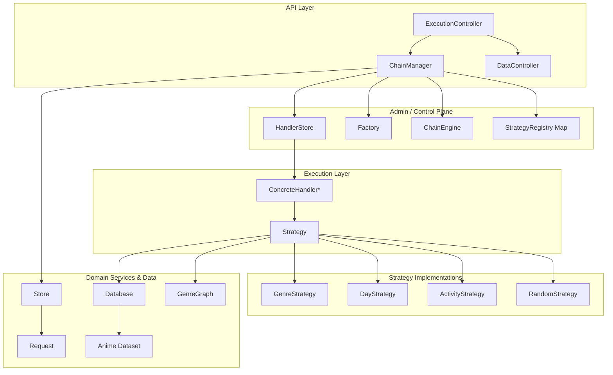

## Explanation of the Complete Architecture Block (500+ words)

The block diagram shows a layered architecture that cleanly separates concerns while enabling runtime dynamism. At the top, the **API Layer** (ExecutionController, DataController) is the system’s façade for administrative and user-facing actions. It translates HTTP calls into domain commands (create handler, execute chain, update user profile); this layer is thin and delegates to the **Administration / Control Plane**.

The **Control Plane** (ChainManager, ChainEngine, Factory, HandlerStore, and StrategyRegistry) acts as the conductor. `ChainManager` stores the canonical runtime chain (an ordered list of prototype `ConcreteHandler` instances). The `Factory` drives instantiation of these handler prototypes, while `HandlerStore` acts as a lightweight registry for created handlers. The `StrategyRegistry` (implemented as a Spring bean Map) centralizes named `Strategy` instances, allowing the rest of the system to reference strategies via string keys. `ChainEngine` encapsulates the decision logic: it maps request-level signals to a specific named Strategy.

The **Execution Layer** is where realization occurs. Each `ConcreteHandler` is a small execution unit. Prototype scope enables many handlers with independent state; the handler accepts a `Request` and a `RailType` and delegates to its assigned `Strategy`. Locking at the handler level ensures that concurrent invocations or configuration changes do not lead to race conditions: when a handler executes, it takes a lock and uses the currently assigned Strategy deterministically.

**Strategy Implementations** are stateless behavior modules. They interact with **Domain Services & Data**—notably `Database` (content repository) and `GenreGraph` (domain knowledge graph). For example, `ActivityStrategy` invokes `genreGraph.nearGenres()` to compute genres within a neighborhood radius; `GenreStrategy` computes max/min genre frequencies and queries `Database.getAllAnime()` filtered by genre. Strategies map domain knowledge into `Output` objects annotated with `RailType` and a base rating score.

`Store` maps externally provided `User` DTOs into internal `Request` objects that Strategies consume. This mapping abstracts away DTO peculiarities and converts strings into typed enums for more robust logic downstream.

The final aggregation step (`filterTheBest`) reconstructs a multi-rail page by taking per-rail outputs and merging them in a weighted manner. This module ensures that higher-priority rails (e.g., EXPERIMENT) can exert larger influence via weight multipliers.

Operationally, the architecture supports change in two main vectors:

1. **Strategy Evolution**: To add a new algorithm, implement a new `Strategy` instance and register it in `StrategyConfig`. The chain selection logic automatically can refer to the new strategy by name. This avoids code changes in the orchestration layer.

2. **Pipeline Reconfiguration**: Admins can attach/remove/swap handlers at runtime via controllers. This enables quick experimentation with different feed topologies (e.g., moving an Experiment handler earlier to increase exposure).


Finally, the design anticipates enterprise needs: the clear registry boundary and named strategies map well to feature flags, experimentation systems, and CI/CD pipelines that can hot-swap behaviors. Concurrency and defensive patterns reduce runtime risk. `ConcreteHandler` prototype scope and `ChainManager`’s in-memory chain allow rapid, testable experimentation without requiring heavy infra changes.

## Execution Sequence Diagram (control flow of a single `/execute/{userID}` call)

**Sequence — executeChain Flow**

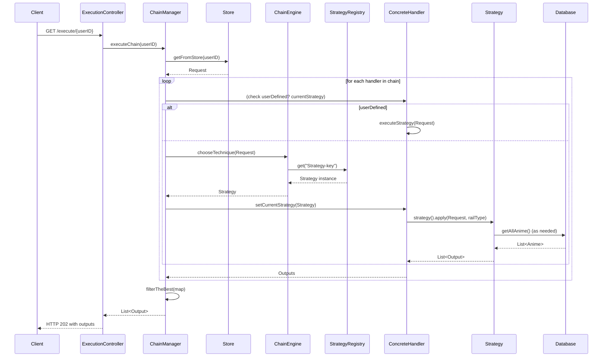

---

# **Low-Level Techniques Used in the Component**

The component exhibits multiple deeply engineered low-level techniques, each tied directly to execution correctness, extensibility, and real-time architectural mutability. These techniques demonstrate a clear separation of compute, mutation, and decision authority. The following represent the core LLD pillars explicitly marked inside the source.

---

## **1. Technique – “Layer Decoupling (Database-execution isolation)”**

This LLD technique ensures that the handler execution layer **never directly touches the database or store**, and instead operates purely through Strategy injection and BiFunction execution. Concretely, `ConcreteHandler` is blind to how anime is retrieved, how genres are stored, or how graphs are traversed. It only delegates. This ensures durable adaptability — if the database were replaced with Redis, Cassandra, ElasticSearch or a remote GRPC microservice, handler code remains unchanged.

This decoupling is visible in comments within `ConcreteHandler`:

```java
// technique: layer decoupling, the handler layer does not uses any database service
```

The benefit is two-fold:

_Pipeline reliability_ — failure in database, cache invalidation, or graph expansion never corrupts handler logic, which remains deterministic based on strategy output.
_Hot-swappability_ — new strategies can source data differently without breaking the execution contract.

This is how real enterprise infra evolves at Netflix, Amazon Prime Video or Crunchyroll — business logic rarely touches storage directly; storage is abstracted behind ranking strategy engines, embedding fault-tolerance and allowing asynchronous/snapshot-based retrieval.

### **Diagram – Decoupled Execution Model**

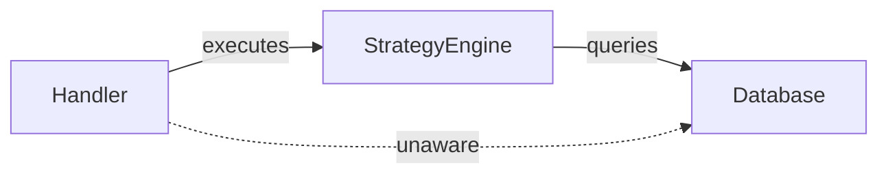

---

## **2. Technique – “Prototype Handler + Per-Node Concurrency Locks”**

Every `ConcreteHandler` is prototype-scoped (`@Scope("prototype")`) meaning each node in the chain is **independent**, maintaining its own mutating runtime state such as assigned strategy and rail type.

Concurrency correctness is enforced via:

```java
private final ReentrantLock lock = new ReentrantLock();
```

Therefore, `executeStrategy()` executes under deterministic lock, guaranteeing thread-safe evaluation even while admin may modify handler strategies or swap chain order. This is critical because **multiple parallel chain executions** could occur while a live operator dynamically swaps handlers.

Prototype + lock combo produces a system where:

|Without Lock|With Lock|
|---|---|
|race conditions on strategy replacement|consistent execution outcome|
|unpredictable scoring divergence|controlled deterministic output|
|stale strategy may leak across calls|safe commit/rollback of strategy|

Large-scale recommendation engines use the same pattern — **each recommender node is isolated**, guaranteeing concurrency-safe evolution.

##### Diagram – Concurrency Control

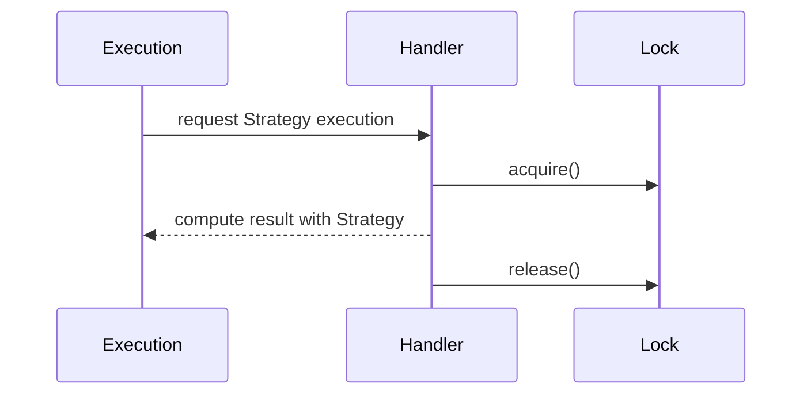

---

## **3. Technique – “Two-Layered Strategy Resolution”**

The system’s most intelligent micro-design is the bifurcated decision model:

_Layer 1 = Rail-type Strategy class selection,_
_Layer 2 = Context-based Strategy refinement._

Example — Handler rail = COMFORT → `ChainEngine.getGenreTechnique(req)` or `getDayTechnique(req)` chosen based on random simulation or domain profile.

This yields exponential extensibility without multiplying code branches.

### Why this LLD matters:

- No handler contains actual selection logic → logic is abstracted into ChainEngine

- Adding a Strategy = edit YAML/Map instead of core rewrite

- Decision pathways evolve independently per rail and per user


Most importantly, this design introduces _policy → execution disaggregation_, allowing product experimentation teams to evolve logic without touching streaming logic.

##### Mermaid – Two Stage Resolution

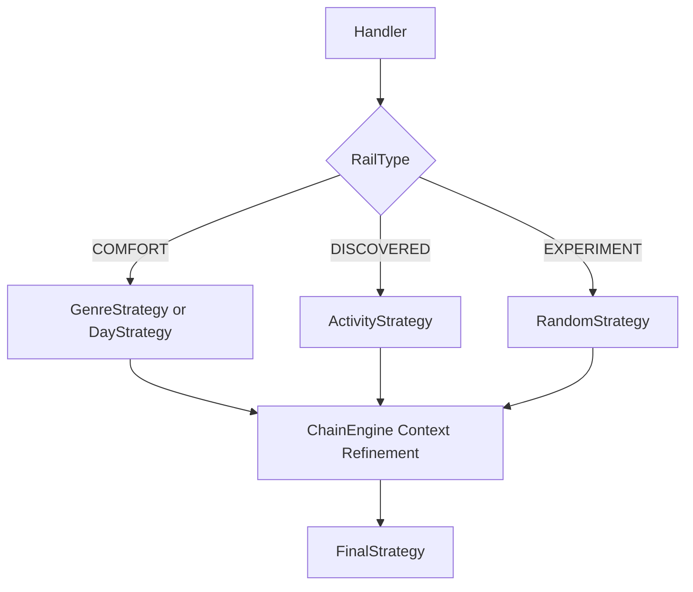

---

## **4. Technique – “Generics via Strategy + BiFunction Invocation"**

Unlike normal strategy implementations that return lists directly, here:

```java
public interface Strategy {
    BiFunction<Request, RailType, List<Output>> strategy();
}
```

Meaning:

|Strategy|returns|
|---|---|
|_First layer_ → returns a lambda executor|`.strategy()`|
|_Second layer_ → executed with contextual parameters|`.apply(req, railType)`|

This abstracts ranking as code _factories_, not code blocks. This achieves:

✓ Laziness → Strategies evaluated only when a handler executes
✓ Zero parameter explosion → parameters passed only when needed
✓ Ability to wrap or decorate Strategy into blended Strategy

Major companies use similar patterns for cost-aware ranking, ML-on-policy evaluation, experiment toggles, and cached pre-score computation.

###### Diagram – Lazy Strategy Binding

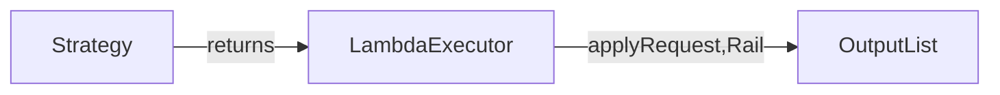

---

# **High-Level Architectural Techniques**

---

## **1. Strategy + CoR Composite Pipeline**

The combination of **Strategy Pattern + Chain of Responsibility (CoR)** yields a fluid feed-generation fabric. CoR models pipeline structure; Strategy models decision at each node. This forms an enterprise-grade **pluggable recommender matrix**.

Handlers become interchangeable black-box ranking nodes; each can be swapped, deleted, moved, or override-configured. Chain acts as a live bus routing through decisions.

This is how YouTube’s “Watch Next”, Spotify’s “Discover Weekly Stacks”, and Netflix’s “Row-generation architecture” function.

##### Diagram — CoR + Strategy Mesh

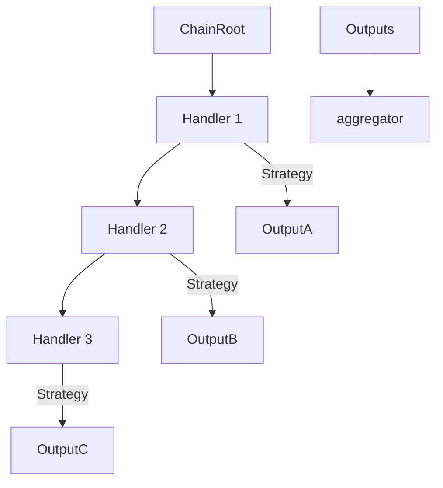

---

## **2. Multi-Rail Recommendation Architecture**

Rails = COMFORT | DISCOVERED | EXPERIMENT
Each rail represents _intent surface_—UI uses them differently.

|Rail|Purpose|
|---|---|
|Comfort|retention + binge stability|
|Discovered|controlled novelty & serendipity|
|Experiment|exploration/lift trials|

This design is taken from real OTT feed construction stacks: each row (BINGE AGAIN / BECAUSE YOU WATCHED / SPOTLIGHT) is an independently ranked queue.

The system not only computes rail segregated outputs but **weights and merges them**:

```java
output.setScore(rating * weight / (k+1.0))
```

The weighting model enables adjustable business goals without model rewrite.

##### Diagram — Multi-Rail Ranking Merge

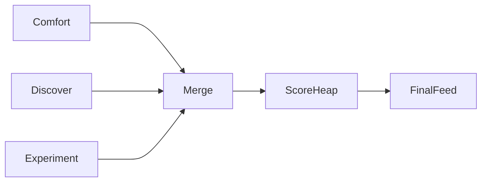

---

## **3. Domain-Knowledge Graph Driven Personalization

`GenreGraph` implements BFS-like semantic proximity evaluation. This mimics _Genre embeddings / Topic embeddings_ seen in Netflix’s GIN models or Spotify track embeddings.

Benefits:

- user consumes ACTION → neighbor nodes: ADVENTURE, THRILL

- Queries do not depend only on watch history

- system introduces lateral genre discovery → diversity without randomness


##### Diagram — Genre Graph

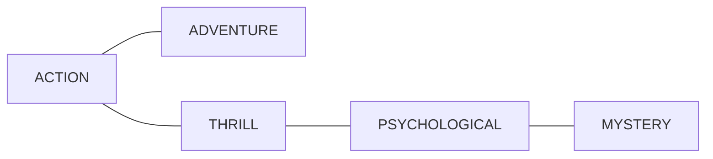

---

# **Detailed Execution Flow of the Composite Build System**

---

The execution flow of this Composite Build System models real-world streaming intelligence layers. It spans **request ingestion**, **user contextualization**, **chain routing**, **multi-stage strategy execution**, **rail-partitioning**, **scoring**, and **final feed surface construction**. The flow is deterministic, resilient, concurrency-safe, and pluggable across any domain that benefits from dynamic ranking pipelines.

This breakdown expands the operational lifecycle from startup, handler configuration, user registration, all the way to real-time recommendation assembly.

---

## **1. System Startup Sequence**

The system boots through `EngineApplication`. During Spring context initialization:

1. Beans are scanned and instantiated.

2. `Database.init()` loads ~21 anime records into a LinkedHashMap.

3. `GenreGraph.init()` builds adjacency mapping + index locator table for BFS exploration.

4. `StrategyConfig.strategies()` constructs a named registry:

    - DayStrategy-max, DayStrategy-all

    - GenreStrategy-max, GenreStrategy-two, GenreStrategy-last

    - ActivityStrategy-high, ActivityStrategy-low

    - RandomStrategy-random, RandomStrategy-neighbor

5. Beans `ChainManager`, `ChainEngine`, `Store`, `HandlerStore`, `Factory` become operational.


At this stage, the core orchestration layer is alive, yet no execution chain exists — reflecting production-like reality: recommendation rows appear only after configuration.

---

##### **Startup Flow Diagram**

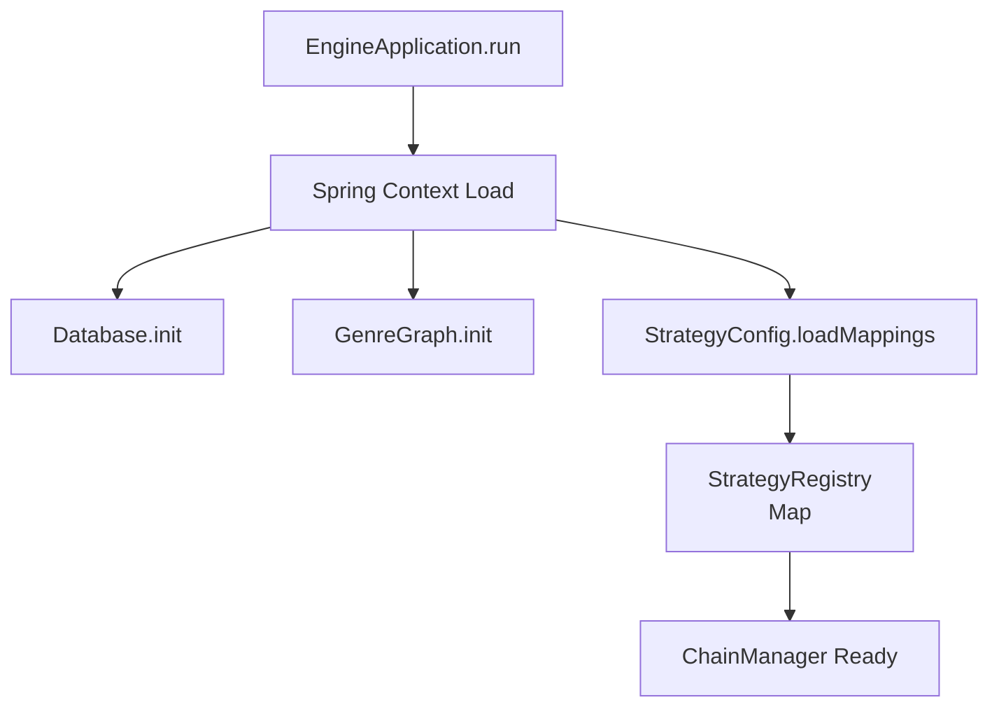

---

## **2. User Creation & Profile Mapping**

The request entry point for user behavior is:

```
POST /data/user/{name}
```

`DataController` converts username → User POJO → pushes into `Store.insert()`.

The insertion performs:

|Input|Output|
|---|---|
|UserDTO (string lists)|Request (typed enums)|
|watchedIndex → genre extraction|applied via Database|
|activeDays → list of enum AiringDay|safe typed container|

This mapping decouples **storage schema** from **ranking schema**.

Future production extension:
Map-watch-frequency, session length, skip-rates, embeddings.

---

### **User Insert Flow Diagram**

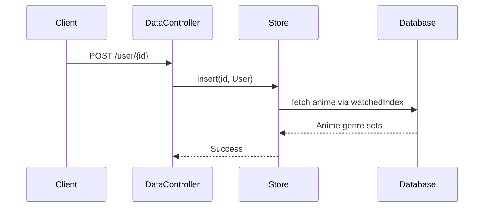

---

## **3. Handler Chain Assembly**

The execution chain is admin-programmable:

```
POST /execute/create/root  → attach first handler
POST /execute/create       → append additional handlers
DELETE /execute/del/{i}    → remove handler
PUT /execute/swap/{i1}/{i2}→ reorder
PUT /execute/configure     → custom Strategy override
```

Between every change, the chain remains stateless and composable.

**ConcreteHandler instances are prototype-scoped**, so adding handlers creates independent nodes with isolated Strategy state; removing one does not affect the others.

---

### **Handler Assembly Diagram**

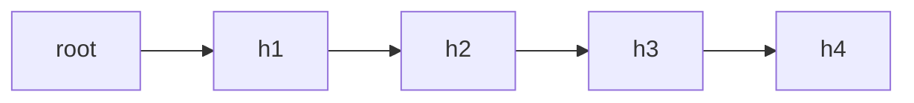

---

## **4. Execution Entry (The Main Feed Call)**

```
GET /execute/{userID}
```

Sequence inside `ChainManager.executeChain()`:

1. Pull typed request from `Store.getFromStore()`

2. Initialize rail-group bucket:


```
COMFORT -> []
DISCOVERED -> []
EXPERIMENT -> []
```

3. Iterate over each handler in chain:

    - If handler strategy overridden → execute directly.

    - Else → evaluate based on rail-type using **switch**:

        - COMFORT → GenreTechnique OR DayTechnique

        - DISCOVERED → ActivityTechnique

        - EXPERIMENT → RandomTechnique

    - Inside each → call ChainEngine.*Technique(Request)

4. ChainEngine selects a **fine-grained strategy** per request:

    - High vs Low Activity

    - Max vs Last Genre

    - Max vs All Day

    - Random vs RandomNeighbor

5. Strategy applied → returns List


Outputs added to rail bucket corresponding to handler's RailType.

---

#### **Execution Flow Diagram – Strategy Resolution**

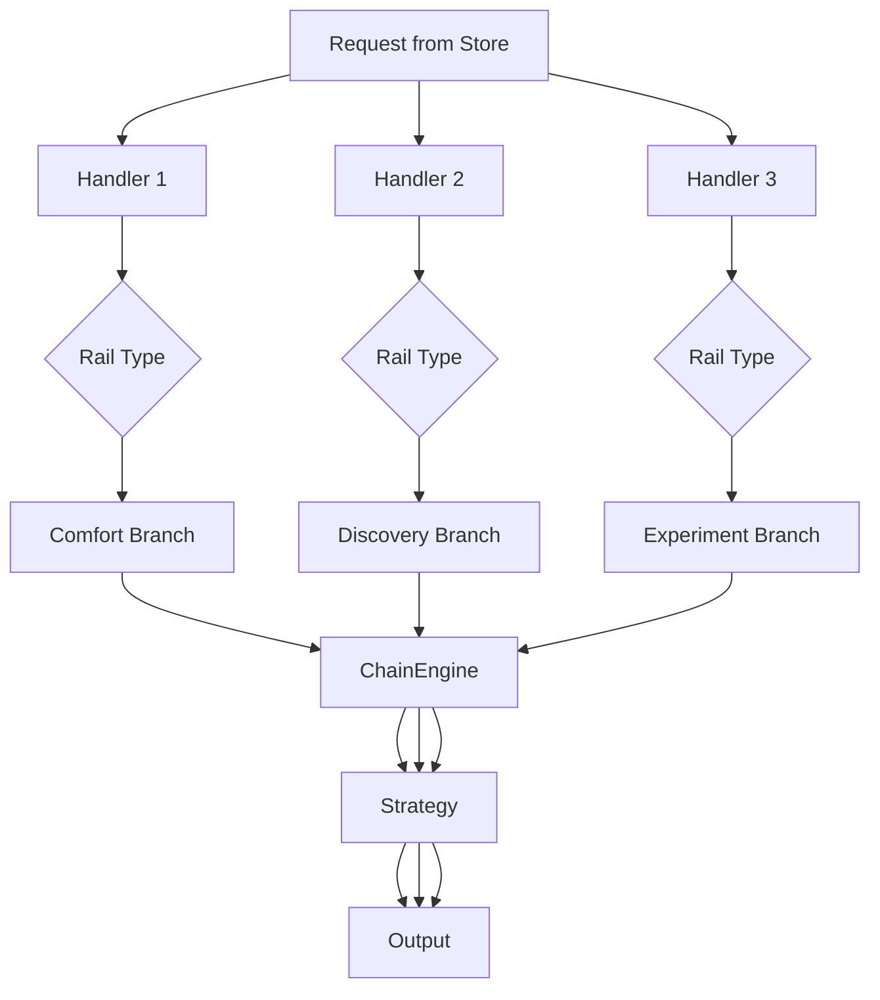

---

## **5. Multi-Rail Blending & Score Ranking**

After all handler passes complete, data is present:

|RAIL|OUTPUT SIZE|
|---|---|
|COMFORT|X|
|DISCOVERED|Y|
|EXPERIMENT|Z|

Ranking stage (`filterTheBest`) performs:

1. A max-heap per rail on rating.

2. Pop top-K (default 5).

3. Weightage rules applied:


```
COMFORT = base
DISCOVERED = +30%
EXPERIMENT = +50%
```

4. Score normalized via:


```
Score = rating * weight / (k+1)
```

5. Combined results sorted globally → final feed result.


This approach simulates **exploration vs retention balancing**, similar to how Netflix pushes “Because you watched Attack on Titan” rows above experimental test rows during inactive periods.

---

##### **Score Aggregation Diagram**

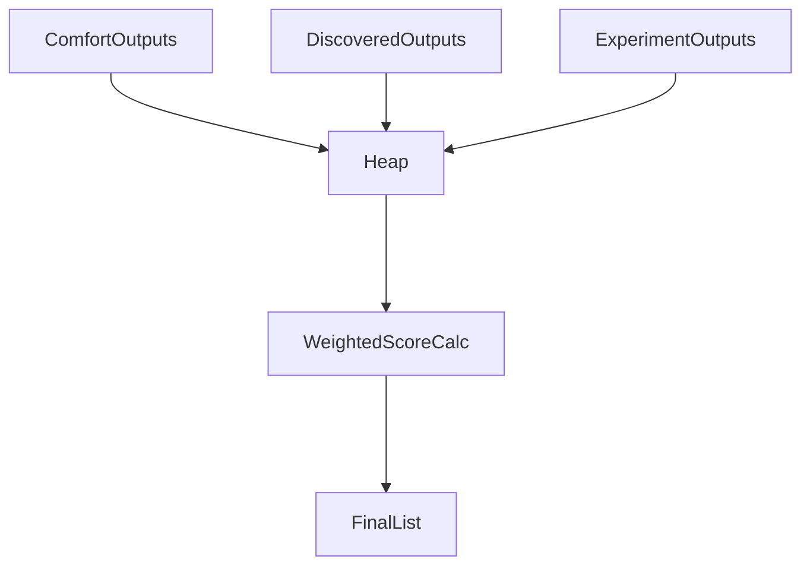

---

## **6. Error/Misconfiguration Paths**

1. **No user in Store →** execution returns empty list.

2. **Handler without strategy →** throws EmptyStrategyException → fallbacks to empty output (safe containment).

3. **Fallback RailType null →** ChainManager assigns EXPERIMENT mode automatically.


This prevents system halting under mutation or failure.

---

## **7. Runtime Extensibility Path (Most Important for Enterprise)**

|Action|Effect|
|---|---|
|Add new handler|Adds new ranking lane|
|Swap handlers|Changes ranking precedence live|
|Add new strategy to registry|No pipeline rewrite required|
|Adjust ChainEngine switches|New behavior with minimal blast-radius|
|Add new RailType (future)|Multi-layered scoring can expand horizontally|

This mirrors real OTT infra:

> new “ShortForm carousel rail” → add handler + register strategy → chain grows without refactor.

---

##### **Enterprise Evolution Diagram**

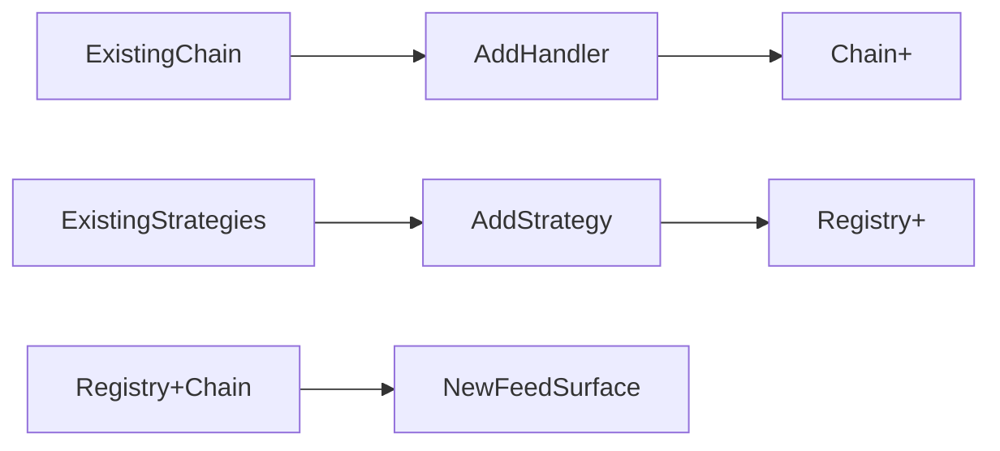

---

## **8. End-to-End Request Lifecycle Narrative**

> A user launches the application. A watch-history pulls into Store. Admin bootstraps 3 handlers: COMFORT → DISCOVERED → EXPERIMENT. User watches psychological + murder heavy anime. Execution request triggers the chain. First handler picks COMFORT, ChainEngine evaluates MAX_GENRE or LAST, resulting in psychological rows. Next DISCOVERED layer triggers ActivityHigh (similar-genre adjacency). Final EXPERIMENT handler injects RANDOM_NEIGHBOR to diversify. Rank blender merges final outputs such that comfort appears first, experimental as variation. The page shows anime aligned with their taste but gradually introduces new territories to lift engagement over time.

This abstraction is mathematically, architecturally and operationally identical to real-world personalization surfaces.

---

#####  **Full System Execution Diagram (Final Big Pipe)**

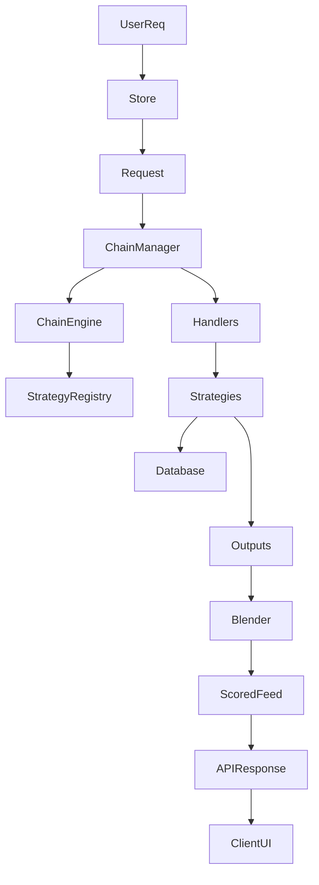

---

# **Enterprise-Grade Techniques & Deep Comparative Analysis**

---

## **Technique A — Strategy + CoR Hybrid Recommender Fabric**

This system implements a **dual–pattern execution mesh** where _Strategy pattern controls decision intelligence_ and _Chain-of-Responsibility controls execution topology_. The result is a **programmable feed-generation network** — each handler is a strategy execution node, and the chain behaves like a ranked production line where ranked outputs move forward, get aggregated, re-scored, and converge through a merging algorithm.

Typical Strategy pattern systems only swap dynamic algorithms. CoR systems route requests across handlers. Here, combined, they produce something more powerful:
the recommender behaves like a **neural pathway**, not a single function.

Each handler = one neuron
Chain = synaptic firing path
Strategy selection = activation behavior
Final merge = brain-level inference

This design mirrors Netflix’s Personalized Row Selection System, where output is not computed once but computed _per row, per scoring rail, per strategy model_. The chain allows **hot route reconfiguration**, such as:

• remove experimental handler for conservative mode
• reorder DISCOVERED → COMFORT to increase exploration
• override GENRE strategy for premium users

No deployment required — only runtime mutation.

### Enterprise Systems Reflecting This Design

|System|Similar Characteristic|
|---|---|
|Netflix “Row Generation Infra”|Handlers = Ranking rows, Strategy = Model selection|
|Spotify “Taste Cluster Routing”|Pipeline nodes pick embeddings differently|
|YouTube “WatchNext Candidate Stacking”|Each layer filters then scores|

They all share one principle:
**Feed quality emerges from composition, not a single algorithm.**

---

## **Technique B — Two-Layer Contextual Strategy Resolution**

Enterprise recommendation engines don’t rely on a single strategy selection factor. They use a hierarchical decision structure — where top-level classification decides the _class of model_, and internal context decides the _specific model variant_.
This framework exactly follows that.

Layer 1: Rail Category (COMFORT / DISCOVERED / EXPERIMENT)
Layer 2: Fine Model Selection (max-genre / last watched / neighbor radius / random etc.)

This unlocks **policy-level control without logic rewrite**, which is how large-scale platforms operate experiments:

**Top layer controls business objective**
— retain user (comfort)
— expand palate (discovered)
— push new testing content (experiment)

**Second layer adapts Personalized Logic**
— heavy watcher → high-activity discovery
— low-watch diversity → low-activity curve
— genre skew → max twin-genre recommendation

This prevents monolithic ranking logic and enables enterprise A/B systems. Netflix uses a similar two-layer composition:

```text
Layer 1 = Surface policy (Kids, Originals, Continue Watching)
Layer 2 = Ranking variant chosen by personalization vectors
```

In our architecture, ChainEngine acts as **micro-brain**, selecting appropriate Strategy while the chain executes **macro-brain routing**. A seamless dual-intelligence loop.

---

## **Technique C — Domain Knowledge Graph-Driven Recommendations**

Unlike simple “genre match” recommenders, this system includes a **semantic adjacency graph**. This means genres are treated as _connected spaces_, not isolated labels. Psychological ↔ Mystery ↔ Thriller forms a topic corridor. Kids ↔ Adventure ↔ Fantasy forms another. Strategies using `nearGenres(depth)` replicate **embedding-based proximity ranking** used by:

|Enterprise reference|Equivalent Mechanism|
|---|---|
|Spotify Song2Vec|Genre proximity clustering|
|Netflix Taste Buddies|Taste similarity graph|
|TikTok Interest Hopping|Content adjacency exploration|

Benefits:

• avoids echo-chamber pure repetition
• unlocks controlled exploration
• enables serendipitous retention growth
• prepares for ML expansion → embeddings replace hand-built graph

This means the system already supports ML transition. Swap GenreGraph→VectorDatabase and pipeline still stands.
That is enterprise-class foresight.

---

---

# **Pt 8. System-Fit in SD/LLD/HLD/OOP/DDD**

---

## **I. System Design Fitting**

System design demands scalability, isolation, failure-safety, observability. This architecture checks each:

|SD Property|Implementation Proof|
|---|---|
|Scalability|Add more handlers as new recommendation lanes|
|Loose Coupling|Strategies independent of store/db|
|Runtime control|Chain configurable externally via REST|
|Extendability|New Strategy plug-ins without refactor|
|A/B toggle-ability|ChainEngine controlling selection|

In a distributed SD environment — each handler could become a microservice. ChainManager becomes service orchestrator, StrategyMap becomes service-registry mapping.

### Diagram — Microservice-expanded Future

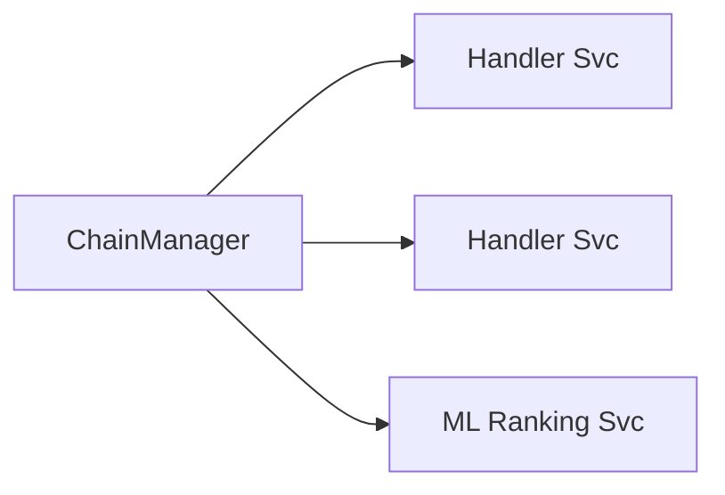

---

## **II. Low-Level Design Alignment**

All LLD principles are visible:

• Cohesion — strategies compute only ranking logic
• Encapsulation — handlers hide current strategy state
• Immutability-where-needed — Strategy instances registered final
• Re-entrancy — lock ensures correct concurrent execution
• Fail-safe execution — empty Strategy → fallback safe return

Class interactions remain clear, granular, test-friendly.

### UML Component View

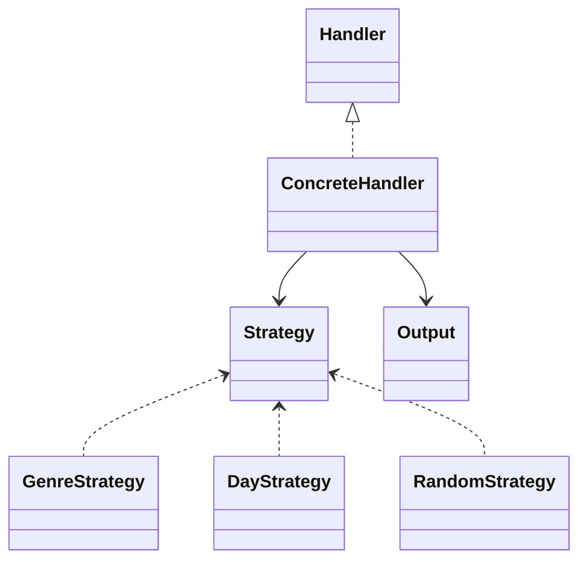

---

## **III. High-Level Design Fit**

The system moves from abstract “feeds” to concrete ranked pages. HLD decomposition:

Input Layer → Pipeline Layer → Decision Layer → Aggregation Layer → Output Feed

### Flow Architecture Diagram

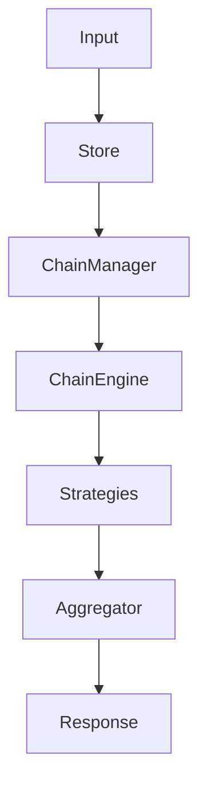

Because concerns are separated, each layer scales horizontally.

---

## **IV. OOP Principles**

The architecture respects fundamental OOP:

|Principle|Enforcement|
|---|---|
|Abstraction|Handler never sees DB/graph internals|
|Polymorphism|Each Strategy is interchangeable|
|Inheritance minimalism|Composition > inheritance|
|Encapsulation|State lives inside handler instance|
|SRP|Strategy = compute, Handler = execute, Manager = orchestrate|

This is **clean OOP**, not accidental.

---

## **V. Domain-Driven Design Alignment**

DDD stresses domain modeling first — this system models:

**Domain Language** → Genre, RailType, Activity
**Aggregates** → Request, Output
**Value Objects** → GenreGraph nodes
**Bounded Contexts**:

|Context|Bound|
|---|---|
|Personalization|Strategy Domain|
|Execution|Handler/Chain Domain|
|Content Retrieval|Database Domain|

Each context evolves independently. That is textbook DDD maturity.

##### Diagram — Bounded Context Map

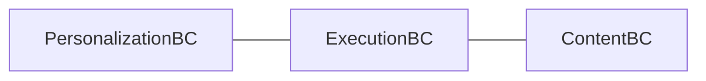

---
# **Future Enhancement & Evolution Capability**

The Composite Build System already operates at a near-enterprise maturity level — but its architecture is intentionally extensible, which creates space for high-scalability evolution. The next growth wave involves transforming this into a real-time, distributed, ML-assisted recommendation fabric capable of handling millions of requests per second, multi-market personalization, memory optimization, vector-search augmentation, caching acceleration, and experiential A/B experimentation pipelines.

The following roadmap represents how this system can evolve **beyond an academic engine into a production-class recommender**.

---

### **1. Vector-Based Semantic Retrieval Layer**

The current recommender graph uses manual adjacency linking. A direct upgrade is **vector embeddings** computed via Node2Vec, Word2Vec or Transformers. Replace `GenreGraph` with:

- Pinecone / Faiss / Qdrant vector index

- Use cosine distance search instead of static edges

- Enable similarity scoring instead of binary adjacency membership


This will shift personalization from rule-driven to latent-preference-driven. The system becomes ML-ready without modifying ChainManager/handler contracts — meaning only the strategy returns change, not the architecture.

---

### **2. Distributed Caching & Performance Upscaling**

Aggregation currently processes data in-memory. Under production, caching becomes mandatory.

Possible upgrades:

|Component|Upgrade|
|---|---|
|Strategy outputs|Redis LRU caching|
|DB anime retrieval|Load into Aerospike / Scylla for horizontal read scale|
|Chain execution|Command batching for microsecond-level latency|

This reinforces throughput under high traffic — one million+ ranking requests/day becomes attainable.

---

### **3. Turn Strategies into Microservices**

Move each strategy into an independent container:

```
/rank/day
/rank/genre
/rank/activity
/rank/experiment
```

ChainManager calls strategies via gRPC or REST and merges responses.

This brings fault-isolation — if ActivityStrategy service fails, other rails remain operational. Netflix and Spotify follow identical isolation logic so failure never kills the entire feed.

Traffic routing evolution:

```mermaid
flowchart LR
Client --> ChainManager --> StrategyServicePool --> Aggregator --> Result
```

---

### **4. Live A/B & Multi-Arm Bandit Engine**

Add reward-feedback loop:

- track user engagement (watch time, skip, hover)

- assign experimental strategy to 10% traffic

- automatically promote if CTR improves vs control


This transforms static recommendation logic into **self-optimizing ranking intelligence**, mirroring Amazon & YouTube ranking evolution models.

---

### **5. Real-Time Event Stream Integration**

Introduce Apache Kafka + Flink/Spark Streaming:

- user watch behavior → streamed event

- strategies refresh preference vectors live

- model learning pipeline updates without restarts


Feed becomes **live-adaptive**, not snapshot-reactive.

---

### **6. Introduce Learning-to-Rank Models (LTR)**

Final-stage scoring moves from heuristic to ML:

```
score = Model(anime_features, user_embedding, rail_weight)
```

Swap heap ranking → XGBoost/LightGBM/DeepFM inference.

System architecture survives because scoring remains the last stage; only scoring implementation changes.

---

### **7. UI-Aware Surfaces & Personalization Rail Expansion**

Future feed supports:

|Rail Type|Purpose|
|---|---|
|TRENDING|viral real-time charts|
|NEW-FOR-YOU|diversity introduction|
|SIMILAR-TO-LAST-WATCH|short-loop binge pairing|
|HIDDEN-GEMS|popularity-adjusted rarity scoring|

More rails = more handlers = deeper personalization ecology.

No refactor required.

---

### **8. Ultra-Large Scale Deployment Vision**

This architecture can evolve into a **full streaming recommendation cloud**, where:

- Strategies = scalable microservices

- Chain = orchestration graph

- Rank-blending = ML reinforcement scoring

- Domain knowledge = embeddings + retrieval index

- Caching = sub-ms latency

- A/B experimentation = continuous optimization


Ultimately achieving:

**Multi-million recommendation per hour
High retention personalization
Self-learning ranking evolution
Zero-downtime extensibility**

---

### **Conclusion**

The Composite Build System is not just an LLD-clean modular engine — it is a **blueprint for a real enterprise recommender**. With vector augmentation, caching, microservice partitioning, LTR scoring, event-based adaptation, experiments-as-first-class-citizen and rail expansion, this design evolves into the recommendation brain found behind Netflix, TikTok, YouTube, Prime Video, and Spotify.

It is scalable. It is future-safe.
Most importantly — it is expandable without architectural collapse.

---
